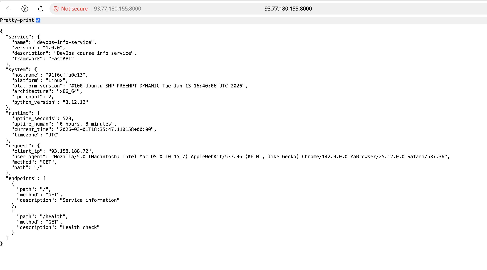
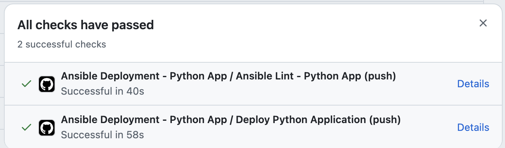

# Lab 6: Advanced Ansible & CI/CD
---

## Overview

This lab enhanced the Ansible automation from Lab 5 with production-ready features including:
- **Blocks and Tags** for better task organization and selective execution
- **Docker Compose** for declarative container management
- **Role Dependencies** for automatic prerequisite handling
- **Wipe Logic** with double-gating (variable + tag) for safe cleanup
- **CI/CD Integration** with GitHub Actions for automated deployments

**Technologies Used:**
- Ansible 2.16+
- Docker Compose v2
- GitHub Actions
- Jinja2 templating
- Ansible Vault for secrets management

---

## Task 1: Blocks & Tags

### 1.1 Common Role Refactoring

**File:** [`roles/common/tasks/main.yml`](../roles/common/tasks/main.yml)

**Implementation:**
- Grouped package installation tasks in a block with `packages` tag
- Added rescue block for apt cache update failures
- Implemented always block to log completion
- Applied `become: true` at block level for efficiency

**Block Structure:**
```yaml
- name: Package installation tasks
  block:
    - name: Update apt cache
    - name: Install common packages
  rescue:
    - name: Handle apt cache update failure
    - name: Fix missing packages
    - name: Retry package installation
  always:
    - name: Log package installation completion
  become: true
  tags:
    - common
    - packages
```

**Tag Strategy:**
- `common` - entire role (applied at role level)
- `packages` - all package installation tasks
- `config` - system configuration tasks

### 1.2 Docker Role Refactoring

**File:** [`roles/docker/tasks/main.yml`](../roles/docker/tasks/main.yml)

**Implementation:**
- Grouped Docker installation tasks in block with `docker_install` tag
- Grouped Docker configuration tasks in block with `docker_config` tag
- Added rescue block to retry GPG key addition on network timeout
- Used always block to ensure Docker service is enabled

**Block Structure:**
```yaml
- name: Docker installation tasks
  block:
    - name: Install prerequisites
    - name: Add Docker GPG key
    - name: Add Docker repository
    - name: Install Docker packages
  rescue:
    - name: Handle Docker installation failure
    - name: Wait before retry
    - name: Retry Docker GPG key addition
    - name: Retry Docker package installation
  always:
    - name: Ensure Docker service is enabled and started
    - name: Log Docker installation completion
  become: true
  tags:
    - docker
    - docker_install
```

**Tag Strategy:**
- `docker` - entire role
- `docker_install` - installation only
- `docker_config` - configuration only

### 1.3 Output showing selective execution with --tags

```bash
# Test provision with only docker
ansible-playbook playbooks/provision.yml --tags "docker"
PLAY [Provision web servers] ************************************************************************************************************************************************

TASK [Gathering Facts] ******************************************************************************************************************************************************
ok: [lab04-vm]

TASK [docker : Install prerequisites for Docker] ****************************************************************************************************************************
ok: [lab04-vm]

TASK [docker : Create directory for Docker GPG key] *************************************************************************************************************************
ok: [lab04-vm]

TASK [docker : Add Docker GPG key] ******************************************************************************************************************************************
ok: [lab04-vm]

TASK [docker : Get Ubuntu release codename] *********************************************************************************************************************************
ok: [lab04-vm]

TASK [docker : Get system architecture] *************************************************************************************************************************************
ok: [lab04-vm]

TASK [docker : Add Docker repository] ***************************************************************************************************************************************
ok: [lab04-vm]

TASK [docker : Install Docker packages] *************************************************************************************************************************************
ok: [lab04-vm]

TASK [docker : Install python3-docker for Ansible docker modules] ***********************************************************************************************************
ok: [lab04-vm]

TASK [docker : Ensure Docker service is enabled and started] ****************************************************************************************************************
ok: [lab04-vm]

TASK [docker : Log Docker installation completion] **************************************************************************************************************************
[WARNING]: Deprecation warnings can be disabled by setting `deprecation_warnings=False` in ansible.cfg.
[DEPRECATION WARNING]: INJECT_FACTS_AS_VARS default to `True` is deprecated, top-level facts will not be auto injected after the change. This feature will be removed from ansible-core version 2.24.
Origin: /Users/newspec/Desktop/DevOps/DevOps-Core-Course/ansible/roles/docker/tasks/main.yml:99:18

97     - name: Log Docker installation completion
98       copy:
99         content: "Docker installation completed at {{ ansible_date_time.iso8601 }}\n"
                    ^ column 18

Use `ansible_facts["fact_name"]` (no `ansible_` prefix) instead.

changed: [lab04-vm]

TASK [docker : Add user to docker group] ************************************************************************************************************************************
ok: [lab04-vm]

TASK [docker : Verify Docker installation] **********************************************************************************************************************************
ok: [lab04-vm]

TASK [docker : Display Docker version] **************************************************************************************************************************************
ok: [lab04-vm] => {
    "msg": "Docker version installed: Docker version 29.2.1, build a5c7197"
}

TASK [docker : Log Docker configuration completion] *************************************************************************************************************************
[DEPRECATION WARNING]: INJECT_FACTS_AS_VARS default to `True` is deprecated, top-level facts will not be auto injected after the change. This feature will be removed from ansible-core version 2.24.
Origin: /Users/newspec/Desktop/DevOps/DevOps-Core-Course/ansible/roles/docker/tasks/main.yml:129:18

127     - name: Log Docker configuration completion
128       copy:
129         content: "Docker configuration completed at {{ ansible_date_time.iso8601 }}\n"
                     ^ column 18

Use `ansible_facts["fact_name"]` (no `ansible_` prefix) instead.

changed: [lab04-vm]

PLAY RECAP ******************************************************************************************************************************************************************
lab04-vm                   : ok=15   changed=2    unreachable=0    failed=0    skipped=0    rescued=0    ignored=0  
```
```bash
# Skip common role
ansible-playbook playbooks/provision.yml --skip-tags "common"
PLAY [Provision web servers] ************************************************************************************************************************************************

TASK [Gathering Facts] ******************************************************************************************************************************************************
ok: [lab04-vm]

TASK [docker : Install prerequisites for Docker] ****************************************************************************************************************************
ok: [lab04-vm]

TASK [docker : Create directory for Docker GPG key] *************************************************************************************************************************
ok: [lab04-vm]

TASK [docker : Add Docker GPG key] ******************************************************************************************************************************************
ok: [lab04-vm]

TASK [docker : Get Ubuntu release codename] *********************************************************************************************************************************
ok: [lab04-vm]

TASK [docker : Get system architecture] *************************************************************************************************************************************
ok: [lab04-vm]

TASK [docker : Add Docker repository] ***************************************************************************************************************************************
ok: [lab04-vm]

TASK [docker : Install Docker packages] *************************************************************************************************************************************
ok: [lab04-vm]

TASK [docker : Install python3-docker for Ansible docker modules] ***********************************************************************************************************
ok: [lab04-vm]

TASK [docker : Ensure Docker service is enabled and started] ****************************************************************************************************************
ok: [lab04-vm]

TASK [docker : Log Docker installation completion] **************************************************************************************************************************
[WARNING]: Deprecation warnings can be disabled by setting `deprecation_warnings=False` in ansible.cfg.
[DEPRECATION WARNING]: INJECT_FACTS_AS_VARS default to `True` is deprecated, top-level facts will not be auto injected after the change. This feature will be removed from ansible-core version 2.24.
Origin: /Users/newspec/Desktop/DevOps/DevOps-Core-Course/ansible/roles/docker/tasks/main.yml:99:18

97     - name: Log Docker installation completion
98       copy:
99         content: "Docker installation completed at {{ ansible_date_time.iso8601 }}\n"
                    ^ column 18

Use `ansible_facts["fact_name"]` (no `ansible_` prefix) instead.

changed: [lab04-vm]

TASK [docker : Add user to docker group] ************************************************************************************************************************************
ok: [lab04-vm]

TASK [docker : Verify Docker installation] **********************************************************************************************************************************
ok: [lab04-vm]

TASK [docker : Display Docker version] **************************************************************************************************************************************
ok: [lab04-vm] => {
    "msg": "Docker version installed: Docker version 29.2.1, build a5c7197"
}

TASK [docker : Log Docker configuration completion] *************************************************************************************************************************
[DEPRECATION WARNING]: INJECT_FACTS_AS_VARS default to `True` is deprecated, top-level facts will not be auto injected after the change. This feature will be removed from ansible-core version 2.24.
Origin: /Users/newspec/Desktop/DevOps/DevOps-Core-Course/ansible/roles/docker/tasks/main.yml:129:18

127     - name: Log Docker configuration completion
128       copy:
129         content: "Docker configuration completed at {{ ansible_date_time.iso8601 }}\n"
                     ^ column 18

Use `ansible_facts["fact_name"]` (no `ansible_` prefix) instead.

changed: [lab04-vm]

PLAY RECAP ******************************************************************************************************************************************************************
lab04-vm                   : ok=15   changed=2    unreachable=0    failed=0    skipped=0    rescued=0    ignored=0   
```
```bash
# Install packages only across all roles
ansible-playbook playbooks/provision.yml --tags "packages"
PLAY [Provision web servers] ************************************************************************************************************************************************

TASK [Gathering Facts] ******************************************************************************************************************************************************
ok: [lab04-vm]

TASK [common : Update apt cache] ********************************************************************************************************************************************
ok: [lab04-vm]

TASK [common : Install common packages] *************************************************************************************************************************************
ok: [lab04-vm]

TASK [common : Log package installation completion] *************************************************************************************************************************
[WARNING]: Deprecation warnings can be disabled by setting `deprecation_warnings=False` in ansible.cfg.
[DEPRECATION WARNING]: INJECT_FACTS_AS_VARS default to `True` is deprecated, top-level facts will not be auto injected after the change. This feature will be removed from ansible-core version 2.24.
Origin: /Users/newspec/Desktop/DevOps/DevOps-Core-Course/ansible/roles/common/tasks/main.yml:36:18

34     - name: Log package installation completion
35       copy:
36         content: "Common packages installation completed at {{ ansible_date_time.iso8601 }}\n"
                    ^ column 18

Use `ansible_facts["fact_name"]` (no `ansible_` prefix) instead.

changed: [lab04-vm]

PLAY RECAP ******************************************************************************************************************************************************************
lab04-vm                   : ok=4    changed=1    unreachable=0    failed=0    skipped=0    rescued=0    ignored=0   
```
```bash
# Check mode to see what would run
ansible-playbook playbooks/provision.yml --tags "docker" --check
PLAY [Provision web servers] ************************************************************************************************************************************************

TASK [Gathering Facts] ******************************************************************************************************************************************************
ok: [lab04-vm]

TASK [docker : Install prerequisites for Docker] ****************************************************************************************************************************
ok: [lab04-vm]

TASK [docker : Create directory for Docker GPG key] *************************************************************************************************************************
ok: [lab04-vm]

TASK [docker : Add Docker GPG key] ******************************************************************************************************************************************
ok: [lab04-vm]

TASK [docker : Get Ubuntu release codename] *********************************************************************************************************************************
skipping: [lab04-vm]

TASK [docker : Get system architecture] *************************************************************************************************************************************
skipping: [lab04-vm]

TASK [docker : Add Docker repository] ***************************************************************************************************************************************
changed: [lab04-vm]

TASK [docker : Install Docker packages] *************************************************************************************************************************************
ok: [lab04-vm]

TASK [docker : Install python3-docker for Ansible docker modules] ***********************************************************************************************************
ok: [lab04-vm]

TASK [docker : Ensure Docker service is enabled and started] ****************************************************************************************************************
ok: [lab04-vm]

TASK [docker : Log Docker installation completion] **************************************************************************************************************************
[WARNING]: Deprecation warnings can be disabled by setting `deprecation_warnings=False` in ansible.cfg.
[DEPRECATION WARNING]: INJECT_FACTS_AS_VARS default to `True` is deprecated, top-level facts will not be auto injected after the change. This feature will be removed from ansible-core version 2.24.
Origin: /Users/newspec/Desktop/DevOps/DevOps-Core-Course/ansible/roles/docker/tasks/main.yml:99:18

97     - name: Log Docker installation completion
98       copy:
99         content: "Docker installation completed at {{ ansible_date_time.iso8601 }}\n"
                    ^ column 18

Use `ansible_facts["fact_name"]` (no `ansible_` prefix) instead.

changed: [lab04-vm]

TASK [docker : Add user to docker group] ************************************************************************************************************************************
ok: [lab04-vm]

TASK [docker : Verify Docker installation] **********************************************************************************************************************************
skipping: [lab04-vm]

TASK [docker : Display Docker version] **************************************************************************************************************************************
ok: [lab04-vm] => {
    "msg": "Docker version installed: "
}

TASK [docker : Log Docker configuration completion] *************************************************************************************************************************
[DEPRECATION WARNING]: INJECT_FACTS_AS_VARS default to `True` is deprecated, top-level facts will not be auto injected after the change. This feature will be removed from ansible-core version 2.24.
Origin: /Users/newspec/Desktop/DevOps/DevOps-Core-Course/ansible/roles/docker/tasks/main.yml:129:18

127     - name: Log Docker configuration completion
128       copy:
129         content: "Docker configuration completed at {{ ansible_date_time.iso8601 }}\n"
                     ^ column 18

Use `ansible_facts["fact_name"]` (no `ansible_` prefix) instead.

changed: [lab04-vm]

RUNNING HANDLER [docker : restart docker] ***********************************************************************************************************************************
changed: [lab04-vm]

PLAY RECAP ******************************************************************************************************************************************************************
lab04-vm                   : ok=13   changed=4    unreachable=0    failed=0    skipped=3    rescued=0    ignored=0  
```
```bash
# Run only docker installation tasks
ansible-playbook playbooks/provision.yml --tags "docker_install"
PLAY [Provision web servers] ************************************************************************************************************************************************

TASK [Gathering Facts] ******************************************************************************************************************************************************
ok: [lab04-vm]

TASK [docker : Install prerequisites for Docker] ****************************************************************************************************************************
ok: [lab04-vm]

TASK [docker : Create directory for Docker GPG key] *************************************************************************************************************************
ok: [lab04-vm]

TASK [docker : Add Docker GPG key] ******************************************************************************************************************************************
ok: [lab04-vm]

TASK [docker : Get Ubuntu release codename] *********************************************************************************************************************************
ok: [lab04-vm]

TASK [docker : Get system architecture] *************************************************************************************************************************************
ok: [lab04-vm]

TASK [docker : Add Docker repository] ***************************************************************************************************************************************
ok: [lab04-vm]

TASK [docker : Install Docker packages] *************************************************************************************************************************************
ok: [lab04-vm]

TASK [docker : Install python3-docker for Ansible docker modules] ***********************************************************************************************************
ok: [lab04-vm]

TASK [docker : Ensure Docker service is enabled and started] ****************************************************************************************************************
ok: [lab04-vm]

TASK [docker : Log Docker installation completion] **************************************************************************************************************************
[WARNING]: Deprecation warnings can be disabled by setting `deprecation_warnings=False` in ansible.cfg.
[DEPRECATION WARNING]: INJECT_FACTS_AS_VARS default to `True` is deprecated, top-level facts will not be auto injected after the change. This feature will be removed from ansible-core version 2.24.
Origin: /Users/newspec/Desktop/DevOps/DevOps-Core-Course/ansible/roles/docker/tasks/main.yml:99:18

97     - name: Log Docker installation completion
98       copy:
99         content: "Docker installation completed at {{ ansible_date_time.iso8601 }}\n"
                    ^ column 18

Use `ansible_facts["fact_name"]` (no `ansible_` prefix) instead.

changed: [lab04-vm]

PLAY RECAP ******************************************************************************************************************************************************************
lab04-vm                   : ok=11   changed=1    unreachable=0    failed=0    skipped=0    rescued=0    ignored=0
```

### 1.4 Output showing error handling with rescue block triggered
```bash
ansible-playbook playbooks/test_rescue.yml
 LAY [Test rescue block in common role] ***********************************************************************************************************************

TASK [Gathering Facts] ****************************************************************************************************************************************
ok: [lab04-vm]

TASK [Backup original sources.list] ***************************************************************************************************************************
changed: [lab04-vm]

TASK [Add invalid repository to trigger error] ****************************************************************************************************************
changed: [lab04-vm]

TASK [Try to update apt cache (will fail)] ********************************************************************************************************************
[WARNING]: Failed to update cache after 1 retries due to , retrying
[WARNING]: Sleeping for 1 seconds, before attempting to refresh the cache again
[WARNING]: Failed to update cache after 2 retries due to , retrying
[WARNING]: Sleeping for 2 seconds, before attempting to refresh the cache again
[WARNING]: Failed to update cache after 3 retries due to , retrying
[WARNING]: Sleeping for 4 seconds, before attempting to refresh the cache again
[WARNING]: Failed to update cache after 4 retries due to , retrying
[WARNING]: Sleeping for 8 seconds, before attempting to refresh the cache again
[WARNING]: Failed to update cache after 5 retries due to , retrying
[WARNING]: Sleeping for 12 seconds, before attempting to refresh the cache again
[ERROR]: Task failed: Module failed: Failed to update apt cache after 5 retries: 
Origin: /Users/newspec/Desktop/DevOps/DevOps-Core-Course/ansible/playbooks/test_rescue.yml:21:11

19             state: present
20
21         - name: Try to update apt cache (will fail)
             ^ column 11

fatal: [lab04-vm]: FAILED! => {"changed": false, "msg": "Failed to update apt cache after 5 retries: "}

TASK [Rescue block activated!] ********************************************************************************************************************************
ok: [lab04-vm] => {
    "msg": "RESCUE BLOCK TRIGGERED! Fixing apt sources..."
}

TASK [Restore original sources.list] **************************************************************************************************************************
changed: [lab04-vm]

TASK [Run apt-get update --fix-missing] ***********************************************************************************************************************
changed: [lab04-vm]

TASK [Retry apt update] ***************************************************************************************************************************************
changed: [lab04-vm]

TASK [Cleanup backup file] ************************************************************************************************************************************
changed: [lab04-vm]

TASK [Always block executed] **********************************************************************************************************************************
ok: [lab04-vm] => {
    "msg": "Always block runs regardless of success/failure"
}

PLAY RECAP ****************************************************************************************************************************************************
lab04-vm                   : ok=9    changed=6    unreachable=0    failed=0    skipped=0    rescued=1    ignored=0  
```

### 1.5 List of all available tags (--list-tags output)
```bash
ansible-playbook playbooks/provision.yml --list-tags

playbook: playbooks/provision.yml

  play #1 (webservers): Provision web servers   TAGS: []
      TASK TAGS: [common, config, docker, docker_config, docker_install, packages, users]
```

### 1.6 Research Questions Answered

**Q: What happens if rescue block also fails?**
A: If the rescue block fails, the entire block fails and Ansible will stop execution (unless `ignore_errors: yes` is set). The always block will still execute before failure. This is why rescue blocks should be simple and reliable.

**Q: Can you have nested blocks?**
A: Yes, blocks can be nested. However, it's generally not recommended as it makes playbooks harder to read. Better to use separate blocks or include_tasks for complex logic.

**Q: How do tags inherit to tasks within blocks?**
A: Tags applied to a block are automatically inherited by all tasks within that block. This is more efficient than tagging each task individually. Child tasks can have additional tags beyond the block's tags.

---

## Task 2: Docker Compose Migration (3 pts)

### 2.1 Template Structure

**File:** [`roles/web_app/templates/docker-compose.yml.j2`](../roles/web_app/templates/docker-compose.yml.j2)

**Template Features:**
- Jinja2 templating for dynamic values
- Service name, image, ports, environment variables
- Restart policy: `unless-stopped`
- Custom bridge network for isolation
- Support for variable substitution

**Key Variables:**
- `web_app_name` - service/container name (default: devops-app)
- `web_app_docker_image` - Docker Hub image
- `web_app_docker_tag` - image version (default: latest)
- `web_app_port` - host port (default: 8000)
- `web_app_internal_port` - container port (default: 8000)
- `web_app_environment_vars` - dictionary of environment variables

### 2.2 Role Dependencies

**File:** [`roles/web_app/meta/main.yml`](../roles/web_app/meta/main.yml)

**Implementation:**
```yaml
dependencies:
  - role: docker
```

**Purpose:**
- Ensures Docker is installed before deploying web app
- Automatic execution order without explicit playbook configuration
- Prevents deployment failures due to missing Docker

**Test Result:**
Running only `web_app` role automatically executes `docker` role first.

### 2.3 Before/After Comparison

#### Before: Docker Run Approach (Lab 5)

**File:** `roles/app_deploy/tasks/main.yml`

```yaml
- name: Log in to Docker Hub
  community.docker.docker_login:
    username: "{{ dockerhub_username }}"
    password: "{{ dockerhub_password }}"
  no_log: true

- name: Pull Docker image
  community.docker.docker_image:
    name: "{{ docker_image }}"
    tag: "{{ docker_image_tag }}"
    source: pull

- name: Stop and remove existing container
  community.docker.docker_container:
    name: "{{ app_container_name }}"
    state: absent
  ignore_errors: yes

- name: Run new container
  community.docker.docker_container:
    name: "{{ app_container_name }}"
    image: "{{ docker_image }}:{{ docker_image_tag }}"
    state: started
    restart_policy: "{{ app_restart_policy }}"
    ports:
      - "{{ app_port }}:{{ app_port }}"
    env: "{{ app_environment_vars | default({}) }}"
```

**Limitations:**
- Imperative approach (manual steps)
- No declarative configuration file
- Difficult to manage multiple containers
- No built-in networking between services
- Environment variables scattered in playbook
- Hard to version control container configuration
- Manual port mapping management

#### After: Docker Compose Approach (Lab 6)

**File:** `roles/web_app/tasks/main.yml`

```yaml
- name: Create application directory
  file:
    path: "{{ web_app_compose_project_dir }}"
    state: directory
    mode: '0755'

- name: Template docker-compose file
  template:
    src: docker-compose.yml.j2
    dest: "{{ web_app_compose_project_dir }}/docker-compose.yml"
    mode: '0644'

- name: Log in to Docker Hub
  community.docker.docker_login:
    username: "{{ dockerhub_username }}"
    password: "{{ dockerhub_password }}"
  no_log: true

- name: Deploy with Docker Compose
  community.docker.docker_compose_v2:
    project_src: "{{ web_app_compose_project_dir }}"
    state: present
    pull: yes
    recreate: smart
```

**File:** `roles/web_app/templates/docker-compose.yml.j2`

```yaml
services:
  {{ web_app_name }}:
    image: {{ web_app_docker_image }}:{{ web_app_docker_tag }}
    container_name: {{ web_app_name }}
    ports:
      - "{{ web_app_port }}:{{ web_app_internal_port }}"

    environment:

      {{ key }}: "{{ value }}"


    restart: {{ web_app_restart_policy }}
    networks:
      - app_network

networks:
  app_network:
    driver: bridge
```

**Advantages:**
- Declarative configuration (infrastructure as code)
- Version-controlled compose file
- Easy multi-container management
- Built-in networking and service discovery
- Environment variables in one place
- Idempotent with `recreate: smart`
- Easier to understand and maintain
- Industry standard for container orchestration
- Supports volumes, networks, dependencies
- Better for production deployments

#### Key Improvements

| Aspect | Before (docker run) | After (Docker Compose) |
|--------|---------------------|------------------------|
| **Configuration** | Scattered in tasks | Centralized in compose file |
| **Idempotency** | Manual state management | Built-in with `recreate: smart` |
| **Networking** | Manual port mapping | Automatic network creation |
| **Environment** | Inline in playbook | Template with Jinja2 |
| **Multi-container** | Complex, error-prone | Simple, declarative |
| **Versioning** | Hard to track | Easy with compose file |
| **Rollback** | Manual container recreation | Simple file revert |
| **Production Ready** | Basic | Industry standard |

#### Deployment Comparison

**Before (5 tasks):**
1. Login to Docker Hub
2. Pull image
3. Stop old container
4. Remove old container
5. Run new container

**After (4 tasks):**
1. Create directory
2. Template compose file
3. Login to Docker Hub
4. Deploy with compose (handles pull, stop, remove, start automatically)

**Result:** Simpler, more maintainable, production-ready deployment!

### 2.4 Research Questions Answered

**Q: What's the difference between `restart: always` and `restart: unless-stopped`?**
A: 
- `always`: Container restarts even if manually stopped, including after system reboot
- `unless-stopped`: Container restarts automatically EXCEPT when manually stopped. After reboot, it won't start if it was manually stopped before
- `unless-stopped` is better for production as it respects manual intervention

**Q: How do Docker Compose networks differ from Docker bridge networks?**
A: 
- Docker Compose creates isolated networks per project by default
- Compose networks have automatic DNS resolution between services
- Bridge networks are more manual and require explicit linking
- Compose networks are automatically cleaned up when project is removed

**Q: Can you reference Ansible Vault variables in the template?**
A: Yes! Vault variables are decrypted before template rendering, so they can be used like any other variable in Jinja2 templates. Example: `{{ vault_secret_key }}`

## 2.5 Output showing Docker Compose deployment success
```bash
PLAY [Deploy application] ***************************************************************************************************************************************************

TASK [Gathering Facts] ******************************************************************************************************************************************************
ok: [lab04-vm]

TASK [docker : Install prerequisites for Docker] ****************************************************************************************************************************
ok: [lab04-vm]

TASK [docker : Create directory for Docker GPG key] *************************************************************************************************************************
ok: [lab04-vm]

TASK [docker : Add Docker GPG key] ******************************************************************************************************************************************
ok: [lab04-vm]

TASK [docker : Get Ubuntu release codename] *********************************************************************************************************************************
ok: [lab04-vm]

TASK [docker : Get system architecture] *************************************************************************************************************************************
ok: [lab04-vm]

TASK [docker : Add Docker repository] ***************************************************************************************************************************************
ok: [lab04-vm]

TASK [docker : Install Docker packages] *************************************************************************************************************************************
ok: [lab04-vm]

TASK [docker : Install python3-docker for Ansible docker modules] ***********************************************************************************************************
ok: [lab04-vm]

TASK [docker : Ensure Docker service is enabled and started] ****************************************************************************************************************
ok: [lab04-vm]

TASK [docker : Log Docker installation completion] **************************************************************************************************************************
[WARNING]: Deprecation warnings can be disabled by setting `deprecation_warnings=False` in ansible.cfg.
[DEPRECATION WARNING]: INJECT_FACTS_AS_VARS default to `True` is deprecated, top-level facts will not be auto injected after the change. This feature will be removed from ansible-core version 2.24.
Origin: /Users/newspec/Desktop/DevOps/DevOps-Core-Course/ansible/roles/docker/tasks/main.yml:99:18

97     - name: Log Docker installation completion
98       copy:
99         content: "Docker installation completed at {{ ansible_date_time.iso8601 }}\n"
                    ^ column 18

Use `ansible_facts["fact_name"]` (no `ansible_` prefix) instead.

changed: [lab04-vm]

TASK [docker : Add user to docker group] ************************************************************************************************************************************
ok: [lab04-vm]

TASK [docker : Verify Docker installation] **********************************************************************************************************************************
ok: [lab04-vm]

TASK [docker : Display Docker version] **************************************************************************************************************************************
ok: [lab04-vm] => {
    "msg": "Docker version installed: Docker version 29.2.1, build a5c7197"
}

TASK [docker : Log Docker configuration completion] *************************************************************************************************************************
[DEPRECATION WARNING]: INJECT_FACTS_AS_VARS default to `True` is deprecated, top-level facts will not be auto injected after the change. This feature will be removed from ansible-core version 2.24.
Origin: /Users/newspec/Desktop/DevOps/DevOps-Core-Course/ansible/roles/docker/tasks/main.yml:129:18

127     - name: Log Docker configuration completion
128       copy:
129         content: "Docker configuration completed at {{ ansible_date_time.iso8601 }}\n"
                     ^ column 18

Use `ansible_facts["fact_name"]` (no `ansible_` prefix) instead.

changed: [lab04-vm]

TASK [web_app : Include wipe tasks] *****************************************************************************************************************************************
included: /Users/newspec/Desktop/DevOps/DevOps-Core-Course/ansible/roles/web_app/tasks/wipe.yml for lab04-vm

TASK [web_app : Stop and remove containers with Docker Compose] *************************************************************************************************************
skipping: [lab04-vm]

TASK [web_app : Remove docker-compose file] *********************************************************************************************************************************
skipping: [lab04-vm]

TASK [web_app : Remove application directory] *******************************************************************************************************************************
skipping: [lab04-vm]

TASK [web_app : Log wipe completion] ****************************************************************************************************************************************
skipping: [lab04-vm]

TASK [web_app : Check if application is already running] ********************************************************************************************************************
ok: [lab04-vm]

TASK [web_app : Display current container status] ***************************************************************************************************************************
ok: [lab04-vm] => {
    "msg": "Container devops-python is running"
}

TASK [web_app : Create application directory] *******************************************************************************************************************************
ok: [lab04-vm]

TASK [web_app : Template docker-compose file] *******************************************************************************************************************************
ok: [lab04-vm]

TASK [web_app : Log in to Docker Hub] ***************************************************************************************************************************************
ok: [lab04-vm]

TASK [web_app : Deploy with Docker Compose] *********************************************************************************************************************************
ok: [lab04-vm]

TASK [web_app : Display deployment result] **********************************************************************************************************************************
ok: [lab04-vm] => {
    "msg": "Deployment unchanged - containers are up to date"
}

TASK [web_app : Wait for application port to be available (on target VM)] ***************************************************************************************************
ok: [lab04-vm]

TASK [web_app : Verify health endpoint (from target VM)] ********************************************************************************************************************
ok: [lab04-vm]

TASK [web_app : Display health check result] ********************************************************************************************************************************
ok: [lab04-vm] => {
    "msg": "Application is healthy: {'status': 'healthy', 'timestamp': '2026-03-01T17:34:13.948071+00:00', 'uptime_seconds': 147}"
}

PLAY RECAP ******************************************************************************************************************************************************************
lab04-vm                   : ok=26   changed=2    unreachable=0    failed=0    skipped=4    rescued=0    ignored=0
```

## 2.6 Idempotency proof (second run shows "ok" not "changed")
First run:
``` bash
PLAY [Deploy application] ***************************************************************************************************************************************************

TASK [Gathering Facts] ******************************************************************************************************************************************************
ok: [lab04-vm]

TASK [docker : Install prerequisites for Docker] ****************************************************************************************************************************
ok: [lab04-vm]

TASK [docker : Create directory for Docker GPG key] *************************************************************************************************************************
ok: [lab04-vm]

TASK [docker : Add Docker GPG key] ******************************************************************************************************************************************
ok: [lab04-vm]

TASK [docker : Get Ubuntu release codename] *********************************************************************************************************************************
ok: [lab04-vm]

TASK [docker : Get system architecture] *************************************************************************************************************************************
ok: [lab04-vm]

TASK [docker : Add Docker repository] ***************************************************************************************************************************************
changed: [lab04-vm]

TASK [docker : Install Docker packages] *************************************************************************************************************************************
changed: [lab04-vm]

TASK [docker : Install python3-docker for Ansible docker modules] ***********************************************************************************************************
ok: [lab04-vm]

TASK [docker : Ensure Docker service is enabled and started] ****************************************************************************************************************
ok: [lab04-vm]

TASK [docker : Log Docker installation completion] **************************************************************************************************************************
[WARNING]: Deprecation warnings can be disabled by setting `deprecation_warnings=False` in ansible.cfg.
[DEPRECATION WARNING]: INJECT_FACTS_AS_VARS default to `True` is deprecated, top-level facts will not be auto injected after the change. This feature will be removed from ansible-core version 2.24.
Origin: /Users/newspec/Desktop/DevOps/DevOps-Core-Course/ansible/roles/docker/tasks/main.yml:99:18

97     - name: Log Docker installation completion
98       copy:
99         content: "Docker installation completed at {{ ansible_date_time.iso8601 }}\n"
                    ^ column 18

Use `ansible_facts["fact_name"]` (no `ansible_` prefix) instead.

changed: [lab04-vm]

TASK [docker : Add user to docker group] ************************************************************************************************************************************
changed: [lab04-vm]

TASK [docker : Verify Docker installation] **********************************************************************************************************************************
ok: [lab04-vm]

TASK [docker : Display Docker version] **************************************************************************************************************************************
ok: [lab04-vm] => {
    "msg": "Docker version installed: Docker version 29.2.1, build a5c7197"
}

TASK [docker : Log Docker configuration completion] *************************************************************************************************************************
[DEPRECATION WARNING]: INJECT_FACTS_AS_VARS default to `True` is deprecated, top-level facts will not be auto injected after the change. This feature will be removed from ansible-core version 2.24.
Origin: /Users/newspec/Desktop/DevOps/DevOps-Core-Course/ansible/roles/docker/tasks/main.yml:129:18

127     - name: Log Docker configuration completion
128       copy:
129         content: "Docker configuration completed at {{ ansible_date_time.iso8601 }}\n"
                     ^ column 18

Use `ansible_facts["fact_name"]` (no `ansible_` prefix) instead.

changed: [lab04-vm]

TASK [web_app : Include wipe tasks] *****************************************************************************************************************************************
included: /Users/newspec/Desktop/DevOps/DevOps-Core-Course/ansible/roles/web_app/tasks/wipe.yml for lab04-vm

TASK [web_app : Check if docker-compose file exists] ************************************************************************************************************************
skipping: [lab04-vm]

TASK [web_app : Stop and remove containers with Docker Compose] *************************************************************************************************************
skipping: [lab04-vm]

TASK [web_app : Stop container manually if compose file doesn't exist] ******************************************************************************************************
skipping: [lab04-vm]

TASK [web_app : Remove docker-compose file] *********************************************************************************************************************************
skipping: [lab04-vm]

TASK [web_app : Remove application directory] *******************************************************************************************************************************
skipping: [lab04-vm]

TASK [web_app : Log wipe completion] ****************************************************************************************************************************************
skipping: [lab04-vm]

TASK [web_app : Check if application is already running] ********************************************************************************************************************
ok: [lab04-vm]

TASK [web_app : Display current container status] ***************************************************************************************************************************
ok: [lab04-vm] => {
    "msg": "Container devops-python is not running"
}

TASK [web_app : Create application directory] *******************************************************************************************************************************
changed: [lab04-vm]

TASK [web_app : Template docker-compose file] *******************************************************************************************************************************
changed: [lab04-vm]

TASK [web_app : Log in to Docker Hub] ***************************************************************************************************************************************
ok: [lab04-vm]

TASK [web_app : Deploy with Docker Compose] *********************************************************************************************************************************
changed: [lab04-vm]

TASK [web_app : Display deployment result] **********************************************************************************************************************************
ok: [lab04-vm] => {
    "msg": "Deployment changed - containers are updated"
}

TASK [web_app : Wait for application port to be available (on target VM)] ***************************************************************************************************
ok: [lab04-vm]

TASK [web_app : Verify health endpoint (from target VM)] ********************************************************************************************************************
ok: [lab04-vm]

TASK [web_app : Display health check result] ********************************************************************************************************************************
ok: [lab04-vm] => {
    "msg": "Application is healthy: {'status': 'healthy', 'timestamp': '2026-03-01T17:46:21.068443+00:00', 'uptime_seconds': 6}"
}

RUNNING HANDLER [docker : restart docker] ***********************************************************************************************************************************
changed: [lab04-vm]

PLAY RECAP ******************************************************************************************************************************************************************
lab04-vm                   : ok=27   changed=9    unreachable=0    failed=0    skipped=6    rescued=0    ignored=0   
```
Second run:
```bash
PLAY [Deploy application] ***************************************************************************************************************************************************

TASK [Gathering Facts] ******************************************************************************************************************************************************
ok: [lab04-vm]

TASK [docker : Install prerequisites for Docker] ****************************************************************************************************************************
ok: [lab04-vm]

TASK [docker : Create directory for Docker GPG key] *************************************************************************************************************************
ok: [lab04-vm]

TASK [docker : Add Docker GPG key] ******************************************************************************************************************************************
ok: [lab04-vm]

TASK [docker : Get Ubuntu release codename] *********************************************************************************************************************************
ok: [lab04-vm]

TASK [docker : Get system architecture] *************************************************************************************************************************************
ok: [lab04-vm]

TASK [docker : Add Docker repository] ***************************************************************************************************************************************
ok: [lab04-vm]

TASK [docker : Install Docker packages] *************************************************************************************************************************************
ok: [lab04-vm]

TASK [docker : Install python3-docker for Ansible docker modules] ***********************************************************************************************************
ok: [lab04-vm]

TASK [docker : Ensure Docker service is enabled and started] ****************************************************************************************************************
ok: [lab04-vm]

TASK [docker : Log Docker installation completion] **************************************************************************************************************************
[WARNING]: Deprecation warnings can be disabled by setting `deprecation_warnings=False` in ansible.cfg.
[DEPRECATION WARNING]: INJECT_FACTS_AS_VARS default to `True` is deprecated, top-level facts will not be auto injected after the change. This feature will be removed from ansible-core version 2.24.
Origin: /Users/newspec/Desktop/DevOps/DevOps-Core-Course/ansible/roles/docker/tasks/main.yml:99:18

97     - name: Log Docker installation completion
98       copy:
99         content: "Docker installation completed at {{ ansible_date_time.iso8601 }}\n"
                    ^ column 18

Use `ansible_facts["fact_name"]` (no `ansible_` prefix) instead.

changed: [lab04-vm]

TASK [docker : Add user to docker group] ************************************************************************************************************************************
ok: [lab04-vm]

TASK [docker : Verify Docker installation] **********************************************************************************************************************************
ok: [lab04-vm]

TASK [docker : Display Docker version] **************************************************************************************************************************************
ok: [lab04-vm] => {
    "msg": "Docker version installed: Docker version 29.2.1, build a5c7197"
}

TASK [docker : Log Docker configuration completion] *************************************************************************************************************************
[DEPRECATION WARNING]: INJECT_FACTS_AS_VARS default to `True` is deprecated, top-level facts will not be auto injected after the change. This feature will be removed from ansible-core version 2.24.
Origin: /Users/newspec/Desktop/DevOps/DevOps-Core-Course/ansible/roles/docker/tasks/main.yml:129:18

127     - name: Log Docker configuration completion
128       copy:
129         content: "Docker configuration completed at {{ ansible_date_time.iso8601 }}\n"
                     ^ column 18

Use `ansible_facts["fact_name"]` (no `ansible_` prefix) instead.

changed: [lab04-vm]

TASK [web_app : Include wipe tasks] *****************************************************************************************************************************************
included: /Users/newspec/Desktop/DevOps/DevOps-Core-Course/ansible/roles/web_app/tasks/wipe.yml for lab04-vm

TASK [web_app : Check if docker-compose file exists] ************************************************************************************************************************
skipping: [lab04-vm]

TASK [web_app : Stop and remove containers with Docker Compose] *************************************************************************************************************
skipping: [lab04-vm]

TASK [web_app : Stop container manually if compose file doesn't exist] ******************************************************************************************************
skipping: [lab04-vm]

TASK [web_app : Remove docker-compose file] *********************************************************************************************************************************
skipping: [lab04-vm]

TASK [web_app : Remove application directory] *******************************************************************************************************************************
skipping: [lab04-vm]

TASK [web_app : Log wipe completion] ****************************************************************************************************************************************
skipping: [lab04-vm]

TASK [web_app : Check if application is already running] ********************************************************************************************************************
ok: [lab04-vm]

TASK [web_app : Display current container status] ***************************************************************************************************************************
ok: [lab04-vm] => {
    "msg": "Container devops-python is running"
}

TASK [web_app : Create application directory] *******************************************************************************************************************************
ok: [lab04-vm]

TASK [web_app : Template docker-compose file] *******************************************************************************************************************************
ok: [lab04-vm]

TASK [web_app : Log in to Docker Hub] ***************************************************************************************************************************************
ok: [lab04-vm]

TASK [web_app : Deploy with Docker Compose] *********************************************************************************************************************************
ok: [lab04-vm]

TASK [web_app : Display deployment result] **********************************************************************************************************************************
ok: [lab04-vm] => {
    "msg": "Deployment unchanged - containers are up to date"
}

TASK [web_app : Wait for application port to be available (on target VM)] ***************************************************************************************************
ok: [lab04-vm]

TASK [web_app : Verify health endpoint (from target VM)] ********************************************************************************************************************
ok: [lab04-vm]

TASK [web_app : Display health check result] ********************************************************************************************************************************
ok: [lab04-vm] => {
    "msg": "Application is healthy: {'status': 'healthy', 'timestamp': '2026-03-01T17:48:42.025713+00:00', 'uptime_seconds': 135}"
}

PLAY RECAP ******************************************************************************************************************************************************************
lab04-vm                   : ok=26   changed=2    unreachable=0    failed=0    skipped=6    rescued=0    ignored=0 
```

## 2.7 Application running and accessible
```bash
ubuntu@lab04-vm:~$ docker ps
CONTAINER ID   IMAGE                       COMMAND           CREATED         STATUS         PORTS                                         NAMES
1253f65bdeb0   newspec/python_app:latest   "python app.py"   4 minutes ago   Up 4 minutes   0.0.0.0:8000->8000/tcp, [::]:8000->8000/tcp   devops-python
ubuntu@lab04-vm:~$ docker compose -f /opt/devops-python/docker-compose.yml ps
NAME            IMAGE                       COMMAND           SERVICE         CREATED         STATUS         PORTS
devops-python   newspec/python_app:latest   "python app.py"   devops-python   5 minutes ago   Up 4 minutes   0.0.0.0:8000->8000/tcp, [::]:8000->8000/tcp
ubuntu@lab04-vm:~$ curl http://localhost:8000
{"service":{"name":"devops-info-service","version":"1.0.0","description":"DevOps course info service","framework":"FastAPI"},"system":{"hostname":"1253f65bdeb0","platform":"Linux","platform_version":"#100-Ubuntu SMP PREEMPT_DYNAMIC Tue Jan 13 16:40:06 UTC 2026","architecture":"x86_64","cpu_count":2,"python_version":"3.12.12"},"runtime":{"uptime_seconds":290,"uptime_human":"0 hours, 4 minutes","current_time":"2026-03-01T17:51:16.359911+00:00","timezone":"UTC"},"request":{"client_ip":"172.19.0.1","user_agent":"curl/8.5.0","method":"GET","path":"/"},"endpoints":[{"path":"/","method":"GET","description":"Service information"},{"path":"/health","method":"GET","description":"Health check"}
```

## 2.8 Contents of templated docker-compose.yml

**File:** `/opt/devops-python/docker-compose.yml` (generated from template)

```yaml
services:
  devops-python:
    image: newspec/python_app:latest
    container_name: devops-python
    ports:
      - "8000:8000"
    environment:
      APP_NAME: "DevOps Python Service"
      APP_VERSION: "1.0.0"
    restart: unless-stopped
    networks:
      - app_network

networks:
  app_network:
    driver: bridge
```

**Key Features:**
- **Service name:** `devops-python` (from `{{ web_app_name }}` variable)
- **Image:** `newspec/python_app:latest` (from `{{ web_app_docker_image }}:{{ web_app_docker_tag }}`)
- **Container name:** `devops-python` (matches service name)
- **Port mapping:** `8000:8000` (host:container)
- **Environment variables:** Templated from `web_app_environment_vars` dictionary
- **Restart policy:** `unless-stopped` (respects manual stops)
- **Network:** Custom bridge network `app_network` for isolation

**Template Variables Used:**
- `web_app_name` = `devops-python`
- `web_app_docker_image` = `newspec/python_app`
- `web_app_docker_tag` = `latest`
- `web_app_port` = `8000`
- `web_app_internal_port` = `8000`
- `web_app_restart_policy` = `unless-stopped`
- `web_app_environment_vars.APP_NAME` = `"DevOps Python Service"`
- `web_app_environment_vars.APP_VERSION` = `"1.0.0"`

---

## Task 3: Wipe Logic

### 3.1 Implementation Details

**Purpose:** Safe, controlled removal of deployed applications for:
- Clean reinstallation (wipe old → deploy new)
- Testing from fresh state
- Rolling back to clean slate
- Resource cleanup before upgrades

**Safety Mechanism:** Double-gating
1. Variable control: `web_app_wipe: true`
2. Tag control: `--tags web_app_wipe`

**Complete Wipe Logic Implementation:**

**File:** [`roles/web_app/tasks/wipe.yml`](../roles/web_app/tasks/wipe.yml)

```yaml
---
# Wipe logic for web application
- name: Wipe web application
  block:
    - name: Check if docker-compose file exists
      stat:
        path: "{{ web_app_compose_project_dir }}/docker-compose.yml"
      register: compose_file

    - name: Stop and remove containers with Docker Compose
      community.docker.docker_compose_v2:
        project_src: "{{ web_app_compose_project_dir }}"
        state: absent
      when: compose_file.stat.exists
      ignore_errors: yes

    - name: Stop container manually if compose file doesn't exist
      community.docker.docker_container:
        name: "{{ web_app_name }}"
        state: absent
      when: not compose_file.stat.exists
      ignore_errors: yes

    - name: Remove docker-compose file
      file:
        path: "{{ web_app_compose_project_dir }}/docker-compose.yml"
        state: absent
      ignore_errors: yes

    - name: Remove application directory
      file:
        path: "{{ web_app_compose_project_dir }}"
        state: absent
      ignore_errors: yes

    - name: Log wipe completion
      debug:
        msg: "Application {{ web_app_name }} wiped successfully from {{ web_app_compose_project_dir }}"

  when: web_app_wipe | bool
  become: true
  tags:
    - web_app_wipe
```

**Default Variable:**

**File:** [`roles/web_app/defaults/main.yml`](../roles/web_app/defaults/main.yml)

```yaml
# Wipe Logic Control
web_app_wipe: false  # Default: do not wipe

# Usage examples:
# Wipe only:    ansible-playbook deploy.yml -e "web_app_wipe=true" --tags web_app_wipe
# Clean install: ansible-playbook deploy.yml -e "web_app_wipe=true"
```

**Key Implementation Features:**

1. **Smart Container Removal:**
   - Checks if docker-compose.yml exists before using compose module
   - Falls back to docker_container module if compose file missing
   - Handles both Docker Compose and standalone container scenarios

2. **Error Handling:**
   - All removal tasks have `ignore_errors: yes`
   - Prevents failure if resources already removed
   - Ensures wipe completes even if some steps fail

3. **Complete Cleanup:**
   - Stops and removes containers (via compose or direct)
   - Removes docker-compose.yml file
   - Removes entire application directory (/opt/devops-python)
   - Logs completion for audit trail

4. **Double-Gating Safety:**
   - `when: web_app_wipe | bool` - Variable must be true
   - `tags: web_app_wipe` - Tag must be specified
   - **Both** conditions required for execution

5. **Privilege Escalation:**
   - `become: true` at block level
   - Required for /opt directory operations

### 3.2 Variable + Tag Approach

**Double-Gating Safety Mechanism**

The wipe logic uses a **two-layer safety mechanism** to prevent accidental data loss:

#### Layer 1: Variable Control (`when` condition)

```yaml
when: web_app_wipe | bool
```

**Purpose:** Prevents wipe tasks from running unless explicitly enabled

**How it works:**
- Default value: `web_app_wipe: false` (in `defaults/main.yml`)
- Tasks only execute when variable is `true`
- Must be explicitly set via `-e` flag or vars file
- `| bool` filter ensures proper boolean evaluation

**Example:**
```bash
# Variable is false (default) - wipe tasks SKIPPED
ansible-playbook deploy.yml --tags web_app_wipe
# Result: Wipe tasks skipped due to when condition

# Variable is true - wipe tasks CAN run (if tag also specified)
ansible-playbook deploy.yml -e "web_app_wipe=true" --tags web_app_wipe
# Result: Wipe tasks execute
```

#### Layer 2: Tag Control

```yaml
tags:
  - web_app_wipe
```

**Purpose:** Requires explicit tag specification to include wipe tasks

**How it works:**
- Wipe tasks have unique tag `web_app_wipe`
- Tasks only included when tag is specified with `--tags`
- Without tag, wipe tasks are not even considered for execution
- Provides command-line level safety

**Example:**
```bash
# Tag not specified - wipe tasks NOT INCLUDED
ansible-playbook deploy.yml -e "web_app_wipe=true"
# Result: Wipe tasks run BEFORE deployment (clean install)

# Tag specified - wipe tasks INCLUDED
ansible-playbook deploy.yml -e "web_app_wipe=true" --tags web_app_wipe
# Result: ONLY wipe tasks run, deployment skipped
```

#### Combined Effect: Double-Gating

**Truth Table:**

| Variable (`web_app_wipe`) | Tag (`--tags web_app_wipe`) | Result |
|---------------------------|----------------------------|--------|
| `false` (default) | Not specified | Wipe skipped, deployment runs |
| `false` (default) | Specified | Wipe skipped (when condition), deployment runs |
| `true` | Not specified | Wipe runs, then deployment runs (clean install) |
| `true` | Specified | Wipe runs, deployment skipped (wipe only) |

**Use Cases:**

1. **Normal Deployment** (no wipe):
   ```bash
   ansible-playbook deploy.yml
   # Variable: false, Tag: not specified
   # Result: Deployment only
   ```

2. **Wipe Only** (remove app, no deployment):
   ```bash
   ansible-playbook deploy.yml -e "web_app_wipe=true" --tags web_app_wipe
   # Variable: true, Tag: specified
   # Result: Wipe only
   ```

3. **Clean Reinstall** (wipe then deploy):
   ```bash
   ansible-playbook deploy.yml -e "web_app_wipe=true"
   # Variable: true, Tag: not specified
   # Result: Wipe → Deploy
   ```

4. **Safety Check** (tag without variable):
   ```bash
   ansible-playbook deploy.yml --tags web_app_wipe
   # Variable: false, Tag: specified
   # Result: Wipe skipped, deployment runs
   ```

#### Why Both Layers?

**Variable alone is not enough:**
- Could be accidentally set in vars file
- No command-line confirmation required
- Easy to forget it's enabled

**Tag alone is not enough:**
- Could be run without realizing consequences
- No explicit "yes, I want to delete" confirmation
- Easier to mistype or autocomplete

**Together they provide:**
- **Explicit intent:** Must consciously set variable AND specify tag
- **Command-line visibility:** Both appear in the command
- **Flexibility:** Supports both wipe-only and clean-install scenarios
- **Safety:** Very hard to accidentally trigger
- **Auditability:** Clear in logs what was intended

#### Comparison with `never` Tag

**Our approach:**
```yaml
when: web_app_wipe | bool
tags:
  - web_app_wipe
```

**`never` tag approach:**
```yaml
tags:
  - never
  - web_app_wipe
```

**Differences:**

| Aspect | Our Approach | `never` Tag |
|--------|-------------|-------------|
| **Flexibility** | Supports clean install scenario | Only wipe-only scenario |
| **Safety** | Double-gating (variable + tag) | Single-gating (tag only) |
| **Default behavior** | Skipped (when condition) | Skipped (never tag) |
| **Clean install** | `ansible-playbook deploy.yml -e "web_app_wipe=true"` | Not possible |
| **Wipe only** | `ansible-playbook deploy.yml -e "web_app_wipe=true" --tags web_app_wipe` | `ansible-playbook deploy.yml --tags never,web_app_wipe` |
| **Accidental execution** | Very difficult (needs both) | Moderate (needs tag) |

**Why we chose variable + tag over `never`:**
- More flexible (supports clean install use case)
- Clearer intent (variable name is self-documenting)
- Better for production (explicit confirmation at two levels)
- Easier to understand (no special Ansible tag knowledge needed)


### 3.4 Test Results

**Scenario 1: Normal deployment (wipe should NOT run)**
```bash
ansible-playbook playbooks/deploy.yml
PLAY [Deploy application] ***************************************************************************************************************************************************

TASK [Gathering Facts] ******************************************************************************************************************************************************
ok: [lab04-vm]

TASK [docker : Install prerequisites for Docker] ****************************************************************************************************************************
ok: [lab04-vm]

TASK [docker : Create directory for Docker GPG key] *************************************************************************************************************************
ok: [lab04-vm]

TASK [docker : Add Docker GPG key] ******************************************************************************************************************************************
ok: [lab04-vm]

TASK [docker : Get Ubuntu release codename] *********************************************************************************************************************************
ok: [lab04-vm]

TASK [docker : Get system architecture] *************************************************************************************************************************************
ok: [lab04-vm]

TASK [docker : Add Docker repository] ***************************************************************************************************************************************
ok: [lab04-vm]

TASK [docker : Install Docker packages] *************************************************************************************************************************************
ok: [lab04-vm]

TASK [docker : Install python3-docker for Ansible docker modules] ***********************************************************************************************************
ok: [lab04-vm]

TASK [docker : Ensure Docker service is enabled and started] ****************************************************************************************************************
ok: [lab04-vm]

TASK [docker : Log Docker installation completion] **************************************************************************************************************************
[WARNING]: Deprecation warnings can be disabled by setting `deprecation_warnings=False` in ansible.cfg.
[DEPRECATION WARNING]: INJECT_FACTS_AS_VARS default to `True` is deprecated, top-level facts will not be auto injected after the change. This feature will be removed from ansible-core version 2.24.
Origin: /Users/newspec/Desktop/DevOps/DevOps-Core-Course/ansible/roles/docker/tasks/main.yml:99:18

97     - name: Log Docker installation completion
98       copy:
99         content: "Docker installation completed at {{ ansible_date_time.iso8601 }}\n"
                    ^ column 18

Use `ansible_facts["fact_name"]` (no `ansible_` prefix) instead.

changed: [lab04-vm]

TASK [docker : Add user to docker group] ************************************************************************************************************************************
ok: [lab04-vm]

TASK [docker : Verify Docker installation] **********************************************************************************************************************************
ok: [lab04-vm]

TASK [docker : Display Docker version] **************************************************************************************************************************************
ok: [lab04-vm] => {
    "msg": "Docker version installed: Docker version 29.2.1, build a5c7197"
}

TASK [docker : Log Docker configuration completion] *************************************************************************************************************************
[DEPRECATION WARNING]: INJECT_FACTS_AS_VARS default to `True` is deprecated, top-level facts will not be auto injected after the change. This feature will be removed from ansible-core version 2.24.
Origin: /Users/newspec/Desktop/DevOps/DevOps-Core-Course/ansible/roles/docker/tasks/main.yml:129:18

127     - name: Log Docker configuration completion
128       copy:
129         content: "Docker configuration completed at {{ ansible_date_time.iso8601 }}\n"
                     ^ column 18

Use `ansible_facts["fact_name"]` (no `ansible_` prefix) instead.

changed: [lab04-vm]

TASK [web_app : Include wipe tasks] *****************************************************************************************************************************************
included: /Users/newspec/Desktop/DevOps/DevOps-Core-Course/ansible/roles/web_app/tasks/wipe.yml for lab04-vm

TASK [web_app : Check if docker-compose file exists] ************************************************************************************************************************
skipping: [lab04-vm]

TASK [web_app : Stop and remove containers with Docker Compose] *************************************************************************************************************
skipping: [lab04-vm]

TASK [web_app : Stop container manually if compose file doesn't exist] ******************************************************************************************************
skipping: [lab04-vm]

TASK [web_app : Remove docker-compose file] *********************************************************************************************************************************
skipping: [lab04-vm]

TASK [web_app : Remove application directory] *******************************************************************************************************************************
skipping: [lab04-vm]

TASK [web_app : Log wipe completion] ****************************************************************************************************************************************
skipping: [lab04-vm]

TASK [web_app : Check if application is already running] ********************************************************************************************************************
ok: [lab04-vm]

TASK [web_app : Display current container status] ***************************************************************************************************************************
ok: [lab04-vm] => {
    "msg": "Container devops-python is running"
}

TASK [web_app : Create application directory] *******************************************************************************************************************************
ok: [lab04-vm]

TASK [web_app : Template docker-compose file] *******************************************************************************************************************************
ok: [lab04-vm]

TASK [web_app : Log in to Docker Hub] ***************************************************************************************************************************************
ok: [lab04-vm]

TASK [web_app : Deploy with Docker Compose] *********************************************************************************************************************************
ok: [lab04-vm]

TASK [web_app : Display deployment result] **********************************************************************************************************************************
ok: [lab04-vm] => {
    "msg": "Deployment unchanged - containers are up to date"
}

TASK [web_app : Wait for application port to be available (on target VM)] ***************************************************************************************************
ok: [lab04-vm]

TASK [web_app : Verify health endpoint (from target VM)] ********************************************************************************************************************
ok: [lab04-vm]

TASK [web_app : Display health check result] ********************************************************************************************************************************
ok: [lab04-vm] => {
    "msg": "Application is healthy: {'status': 'healthy', 'timestamp': '2026-03-01T18:04:45.889812+00:00', 'uptime_seconds': 1099}"
}

PLAY RECAP ******************************************************************************************************************************************************************
lab04-vm                   : ok=26   changed=2    unreachable=0    failed=0    skipped=6    rescued=0    ignored=0   

```
```bash
ssh ubuntu@93.77.180.155 "docker ps" 
CONTAINER ID   IMAGE                       COMMAND           CREATED          STATUS          PORTS                                         NAMES
1253f65bdeb0   newspec/python_app:latest   "python app.py"   19 minutes ago   Up 19 minutes   0.0.0.0:8000->8000/tcp, [::]:8000->8000/tcp   devops-python
```
 Result: App deploys normally, wipe tasks skipped (tag not specified)

**Scenario 2: Wipe only (remove existing deployment)**
```bash
ansible-playbook playbooks/deploy.yml \
  -e "web_app_wipe=true" \
  --tags web_app_wipe
  PLAY [Deploy application] ***************************************************************************************************************************************************

TASK [Gathering Facts] ******************************************************************************************************************************************************
ok: [lab04-vm]

TASK [web_app : Include wipe tasks] *****************************************************************************************************************************************
included: /Users/newspec/Desktop/DevOps/DevOps-Core-Course/ansible/roles/web_app/tasks/wipe.yml for lab04-vm

TASK [web_app : Check if docker-compose file exists] ************************************************************************************************************************
ok: [lab04-vm]

TASK [web_app : Stop and remove containers with Docker Compose] *************************************************************************************************************
changed: [lab04-vm]

TASK [web_app : Stop container manually if compose file doesn't exist] ******************************************************************************************************
skipping: [lab04-vm]

TASK [web_app : Remove docker-compose file] *********************************************************************************************************************************
changed: [lab04-vm]

TASK [web_app : Remove application directory] *******************************************************************************************************************************
changed: [lab04-vm]

TASK [web_app : Log wipe completion] ****************************************************************************************************************************************
ok: [lab04-vm] => {
    "msg": "Application devops-python wiped successfully from /opt/devops-python"
}

PLAY RECAP ******************************************************************************************************************************************************************
lab04-vm                   : ok=7    changed=3    unreachable=0    failed=0    skipped=1    rescued=0    ignored=0 
```
```bash
ssh ubuntu@93.77.180.155 "docker ps"
CONTAINER ID   IMAGE     COMMAND   CREATED   STATUS    PORTS  NAMES
```
```bash
ssh ubuntu@93.77.180.155 "ls /opt"  
containerd
```
Result: App removed, deployment skipped

**Scenario 3: Clean reinstallation (wipe → deploy)**
```bash
ansible-playbook playbooks/deploy.yml \
  -e "web_app_wipe=true"
PLAY [Deploy application] ***************************************************************************************************************************************************

TASK [Gathering Facts] ******************************************************************************************************************************************************
ok: [lab04-vm]

TASK [docker : Install prerequisites for Docker] ****************************************************************************************************************************
ok: [lab04-vm]

TASK [docker : Create directory for Docker GPG key] *************************************************************************************************************************
ok: [lab04-vm]

TASK [docker : Add Docker GPG key] ******************************************************************************************************************************************
ok: [lab04-vm]

TASK [docker : Get Ubuntu release codename] *********************************************************************************************************************************
ok: [lab04-vm]

TASK [docker : Get system architecture] *************************************************************************************************************************************
ok: [lab04-vm]

TASK [docker : Add Docker repository] ***************************************************************************************************************************************
ok: [lab04-vm]

TASK [docker : Install Docker packages] *************************************************************************************************************************************
ok: [lab04-vm]

TASK [docker : Install python3-docker for Ansible docker modules] ***********************************************************************************************************
ok: [lab04-vm]

TASK [docker : Ensure Docker service is enabled and started] ****************************************************************************************************************
ok: [lab04-vm]

TASK [docker : Log Docker installation completion] **************************************************************************************************************************
[WARNING]: Deprecation warnings can be disabled by setting `deprecation_warnings=False` in ansible.cfg.
[DEPRECATION WARNING]: INJECT_FACTS_AS_VARS default to `True` is deprecated, top-level facts will not be auto injected after the change. This feature will be removed from ansible-core version 2.24.
Origin: /Users/newspec/Desktop/DevOps/DevOps-Core-Course/ansible/roles/docker/tasks/main.yml:99:18

97     - name: Log Docker installation completion
98       copy:
99         content: "Docker installation completed at {{ ansible_date_time.iso8601 }}\n"
                    ^ column 18

Use `ansible_facts["fact_name"]` (no `ansible_` prefix) instead.

changed: [lab04-vm]

TASK [docker : Add user to docker group] ************************************************************************************************************************************
ok: [lab04-vm]

TASK [docker : Verify Docker installation] **********************************************************************************************************************************
ok: [lab04-vm]

TASK [docker : Display Docker version] **************************************************************************************************************************************
ok: [lab04-vm] => {
    "msg": "Docker version installed: Docker version 29.2.1, build a5c7197"
}

TASK [docker : Log Docker configuration completion] *************************************************************************************************************************
[DEPRECATION WARNING]: INJECT_FACTS_AS_VARS default to `True` is deprecated, top-level facts will not be auto injected after the change. This feature will be removed from ansible-core version 2.24.
Origin: /Users/newspec/Desktop/DevOps/DevOps-Core-Course/ansible/roles/docker/tasks/main.yml:129:18

127     - name: Log Docker configuration completion
128       copy:
129         content: "Docker configuration completed at {{ ansible_date_time.iso8601 }}\n"
                     ^ column 18

Use `ansible_facts["fact_name"]` (no `ansible_` prefix) instead.

changed: [lab04-vm]

TASK [web_app : Include wipe tasks] *****************************************************************************************************************************************
included: /Users/newspec/Desktop/DevOps/DevOps-Core-Course/ansible/roles/web_app/tasks/wipe.yml for lab04-vm

TASK [web_app : Check if docker-compose file exists] ************************************************************************************************************************
ok: [lab04-vm]

TASK [web_app : Stop and remove containers with Docker Compose] *************************************************************************************************************
skipping: [lab04-vm]

TASK [web_app : Stop container manually if compose file doesn't exist] ******************************************************************************************************
ok: [lab04-vm]

TASK [web_app : Remove docker-compose file] *********************************************************************************************************************************
ok: [lab04-vm]

TASK [web_app : Remove application directory] *******************************************************************************************************************************
ok: [lab04-vm]

TASK [web_app : Log wipe completion] ****************************************************************************************************************************************
ok: [lab04-vm] => {
    "msg": "Application devops-python wiped successfully from /opt/devops-python"
}

TASK [web_app : Check if application is already running] ********************************************************************************************************************
ok: [lab04-vm]

TASK [web_app : Display current container status] ***************************************************************************************************************************
ok: [lab04-vm] => {
    "msg": "Container devops-python is not running"
}

TASK [web_app : Create application directory] *******************************************************************************************************************************
changed: [lab04-vm]

TASK [web_app : Template docker-compose file] *******************************************************************************************************************************
changed: [lab04-vm]

TASK [web_app : Log in to Docker Hub] ***************************************************************************************************************************************
ok: [lab04-vm]

TASK [web_app : Deploy with Docker Compose] *********************************************************************************************************************************
changed: [lab04-vm]

TASK [web_app : Display deployment result] **********************************************************************************************************************************
ok: [lab04-vm] => {
    "msg": "Deployment changed - containers are updated"
}

TASK [web_app : Wait for application port to be available (on target VM)] ***************************************************************************************************
ok: [lab04-vm]

TASK [web_app : Verify health endpoint (from target VM)] ********************************************************************************************************************
ok: [lab04-vm]

TASK [web_app : Display health check result] ********************************************************************************************************************************
ok: [lab04-vm] => {
    "msg": "Application is healthy: {'status': 'healthy', 'timestamp': '2026-03-01T18:20:21.216078+00:00', 'uptime_seconds': 6}"
}

PLAY RECAP ******************************************************************************************************************************************************************
lab04-vm                   : ok=31   changed=5    unreachable=0    failed=0    skipped=1    rescued=0    ignored=0 
```
```bash
ssh ubuntu@93.77.180.155 "docker ps"
CONTAINER ID   IMAGE                       COMMAND           CREATED          STATUS          PORTS                                         NAMES
5f5c4479353f   newspec/python_app:latest   "python app.py"   29 seconds ago   Up 28 seconds   0.0.0.0:8000->8000/tcp, [::]:8000->8000/tcp   devops-python
```
Result: Old app removed, new app deployed (clean reinstall)

**Scenario 4a: Safety check - Tag specified but variable false**
```bash
ansible-playbook playbooks/deploy.yml --tags web_app_wipe
PLAY [Deploy application] ***************************************************************************************************************************************************

TASK [Gathering Facts] ******************************************************************************************************************************************************
ok: [lab04-vm]

TASK [web_app : Include wipe tasks] *****************************************************************************************************************************************
included: /Users/newspec/Desktop/DevOps/DevOps-Core-Course/ansible/roles/web_app/tasks/wipe.yml for lab04-vm

TASK [web_app : Check if docker-compose file exists] ************************************************************************************************************************
skipping: [lab04-vm]

TASK [web_app : Stop and remove containers with Docker Compose] *************************************************************************************************************
skipping: [lab04-vm]

TASK [web_app : Stop container manually if compose file doesn't exist] ******************************************************************************************************
skipping: [lab04-vm]

TASK [web_app : Remove docker-compose file] *********************************************************************************************************************************
skipping: [lab04-vm]

TASK [web_app : Remove application directory] *******************************************************************************************************************************
skipping: [lab04-vm]

TASK [web_app : Log wipe completion] ****************************************************************************************************************************************
skipping: [lab04-vm]

PLAY RECAP ******************************************************************************************************************************************************************
lab04-vm                   : ok=2    changed=0    unreachable=0    failed=0    skipped=6    rescued=0    ignored=0   
```
Result: Wipe tasks skipped (when condition blocks it), deployment runs normally

**Scenario 4b: Safety check - Variable true, deployment skipped**
```bash
ansible-playbook playbooks/deploy.yml \
  -e "web_app_wipe=true" \
  --tags web_app_wipe
PLAY [Deploy application] ***************************************************************************************************************************************************

TASK [Gathering Facts] ******************************************************************************************************************************************************
ok: [lab04-vm]

TASK [web_app : Include wipe tasks] *****************************************************************************************************************************************
included: /Users/newspec/Desktop/DevOps/DevOps-Core-Course/ansible/roles/web_app/tasks/wipe.yml for lab04-vm

TASK [web_app : Check if docker-compose file exists] ************************************************************************************************************************
ok: [lab04-vm]

TASK [web_app : Stop and remove containers with Docker Compose] *************************************************************************************************************
changed: [lab04-vm]

TASK [web_app : Stop container manually if compose file doesn't exist] ******************************************************************************************************
skipping: [lab04-vm]

TASK [web_app : Remove docker-compose file] *********************************************************************************************************************************
changed: [lab04-vm]

TASK [web_app : Remove application directory] *******************************************************************************************************************************
changed: [lab04-vm]

TASK [web_app : Log wipe completion] ****************************************************************************************************************************************
ok: [lab04-vm] => {
    "msg": "Application devops-python wiped successfully from /opt/devops-python"
}

PLAY RECAP ******************************************************************************************************************************************************************
lab04-vm                   : ok=7    changed=3    unreachable=0    failed=0    skipped=1    rescued=0    ignored=0  
```
Result: Only wipe runs, no deployment

#### Screenshot of application running after clean reinstall


### 3.5 Research Questions Answered

**1. Why use both variable AND tag?**
A: Double safety mechanism prevents accidental data loss:
- Variable alone: Could be set accidentally in vars file
- Tag alone: Could be run without realizing consequences
- Both together: Requires explicit, conscious decision

**2. What's the difference between `never` tag and this approach?**
A: 
- `never` tag: Tasks NEVER run unless explicitly called with `--tags never`
- Our approach: Tasks can run in two scenarios (wipe-only OR clean-install)
- Our approach is more flexible for the clean reinstall use case

**3. Why must wipe logic come BEFORE deployment in main.yml?**
A: To support the clean reinstall scenario where we want to:
1. First wipe the old installation
2. Then deploy the new installation
If wipe came after, we'd deploy then immediately wipe!

**4. When would you want clean reinstallation vs. rolling update?**
A:
- Clean reinstall: Major version changes, corrupted state, testing from scratch
- Rolling update: Minor updates, zero-downtime requirements, production environments

**5. How would you extend this to wipe Docker images and volumes too?**
A: Add tasks to wipe.yml:
```yaml
- name: Remove Docker images
  community.docker.docker_image:
    name: "{{ docker_image }}"
    tag: "{{ docker_tag }}"
    state: absent

- name: Remove Docker volumes
  community.docker.docker_volume:
    name: "{{ web_app_name }}_data"
    state: absent
```

---

## Task 4: CI/CD Integration

### 4.1 Workflow Architecture

**File:** [`.github/workflows/ansible-deploy.yml`](../../.github/workflows/ansible-deploy.yml)

**CI/CD Flow:**
```
Code Push → Lint Ansible → Deploy with Ansible → Verify Deployment
```

**Workflow Triggers:**
- Push to `main`, `master`, or `lab06` branches (when Ansible files change)
- Pull requests to `main`, `master`, or `lab06` branches
- Manual trigger via `workflow_dispatch`

**Benefits:**
- **Consistency:** Same process every time
- **Speed:** Automatic deployments on push
- **Safety:** Linting catches errors before execution
- **Auditability:** GitHub logs every deployment
- **Integration:** Combines with testing, building, scanning

### 4.2 Setup Steps

#### Step 1: Create GitHub Repository Secrets

Navigate to your GitHub repository → Settings → Secrets and variables → Actions → New repository secret

**Required Secrets (mandatory):**

1. **ANSIBLE_VAULT_PASSWORD**
   - Value: Your Ansible Vault password
   - Used to decrypt encrypted variables in `group_vars/all.yml`
   - Example: `your_vault_password_here`
   - **Status:** Validated in "Create Vault password file" step

2. **SSH_PRIVATE_KEY**
   - Value: Private SSH key for accessing target VM
   - Generate with: `ssh-keygen -t ed25519 -C "github-actions"`
   - Copy private key: `cat ~/.ssh/id_ed25519`
   - Add public key to VM: `ssh-copy-id -i ~/.ssh/id_ed25519.pub ubuntu@vm_ip`
   - **Status:** Validated in "Setup SSH" step

3. **VM_HOST**
   - Value: Target VM IP address or hostname
   - Example: `93.77.180.155`
   - **Status:** Validated in "Setup SSH" step

**Optional Secrets:**

4. **DOCKERHUB_USERNAME** (if using private images)
   - Value: Your Docker Hub username
   - Example: `newspec`
   - **Note:** Stored in encrypted `group_vars/all.yml`

5. **DOCKERHUB_PASSWORD** (if using private images)
   - Value: Your Docker Hub password or access token
   - Recommended: Use access token instead of password
   - **Note:** Stored in encrypted `group_vars/all.yml`

#### Step 2: Create Workflow File

**File:** `.github/workflows/ansible-deploy.yml`

```yaml
name: Ansible Deployment - Python App

on:
  push:
    branches: [ main, master, lab06 ]
    paths:
      - 'ansible/vars/app_python.yml'
      - 'ansible/playbooks/deploy_python.yml'
      - 'ansible/playbooks/deploy.yml'
      - 'ansible/roles/web_app/**'
      - 'ansible/roles/common/**'
      - 'ansible/roles/docker/**'
      - '.github/workflows/ansible-deploy.yml'
  pull_request:
    branches: [ main, master, lab06 ]
    paths:
      - 'ansible/vars/app_python.yml'
      - 'ansible/playbooks/deploy_python.yml'
      - 'ansible/roles/web_app/**'
  workflow_dispatch:

jobs:
  lint:
    name: Ansible Lint - Python App
    runs-on: ubuntu-latest
    steps:
      - name: Checkout code
        uses: actions/checkout@v4

      - name: Set up Python
        uses: actions/setup-python@v5
        with:
          python-version: '3.12'

      - name: Install dependencies
        run: |
          pip install ansible ansible-lint

      - name: Run ansible-lint
        run: |
          cd ansible
          ansible-lint playbooks/deploy_python.yml playbooks/deploy.yml

  deploy:
    name: Deploy Python Application
    needs: lint
    runs-on: ubuntu-latest
    if: github.event_name == 'push' || github.event_name == 'workflow_dispatch'
    steps:
      - name: Checkout code
        uses: actions/checkout@v4

      - name: Set up Python
        uses: actions/setup-python@v5
        with:
          python-version: '3.12'

      - name: Install Ansible and dependencies
        run: |
          pip install ansible
          ansible-galaxy collection install community.docker

      - name: Setup SSH
        run: |
          if [ -z "${{ secrets.SSH_PRIVATE_KEY }}" ]; then
            echo "Error: SSH_PRIVATE_KEY secret is not set"
            echo "Please configure the SSH_PRIVATE_KEY secret in repository settings"
            exit 1
          fi
          if [ -z "${{ secrets.VM_HOST }}" ]; then
            echo "Error: VM_HOST secret is not set"
            echo "Please configure the VM_HOST secret in repository settings"
            exit 1
          fi
          
          mkdir -p ~/.ssh
          echo "${{ secrets.SSH_PRIVATE_KEY }}" > ~/.ssh/yandex_cloud_key
          chmod 600 ~/.ssh/yandex_cloud_key
          ssh-keyscan -H ${{ secrets.VM_HOST }} >> ~/.ssh/known_hosts

      - name: Create Vault password file
        env:
          ANSIBLE_VAULT_PASSWORD: ${{ secrets.ANSIBLE_VAULT_PASSWORD }}
        run: |
          if [ -z "$ANSIBLE_VAULT_PASSWORD" ]; then
            echo "Error: ANSIBLE_VAULT_PASSWORD secret is not set"
            echo "Please configure the ANSIBLE_VAULT_PASSWORD secret in repository settings"
            exit 1
          fi
          echo "$ANSIBLE_VAULT_PASSWORD" > /tmp/vault_pass
          chmod 600 /tmp/vault_pass

      - name: Deploy Python App with Ansible
        run: |
          cd ansible
          ansible-playbook playbooks/deploy_python.yml \
            --vault-password-file /tmp/vault_pass \
            --tags "app_deploy" \
            -e @group_vars/all.yml

      - name: Cleanup sensitive files
        if: always()
        run: |
          rm -f /tmp/vault_pass
          rm -f ~/.ssh/yandex_cloud_key

      - name: Verify Python App Deployment
        run: |
          echo "Waiting for application to start..."
          sleep 10
          
          echo "Testing main endpoint..."
          if ! curl -f http://${{ secrets.VM_HOST }}:8000; then
            echo "Error: Python app is not accessible at http://${{ secrets.VM_HOST }}:8000"
            exit 1
          fi
          
          echo "Testing health endpoint..."
          if ! curl -f http://${{ secrets.VM_HOST }}:8000/health; then
            echo "Error: Python app health check failed at http://${{ secrets.VM_HOST }}:8000/health"
            exit 1
          fi
          
          echo "Deployment verification successful!"
```

**Key Features:**
- **Specific Path Triggers:** Only runs when relevant Ansible files change
- **Python App Focus:** Deploys using `deploy_python.yml` playbook
- **Mandatory Secrets Validation:** Validates all required secrets (SSH_PRIVATE_KEY, VM_HOST, ANSIBLE_VAULT_PASSWORD) before execution with clear error messages
- **Early Failure Detection:** Fails fast if secrets are missing, preventing confusing SSH/Ansible errors
- **Vault Integration:** Securely handles Ansible Vault password via environment variable
- **Secure Cleanup:** Uses `if: always()` to ensure sensitive files (vault password and SSH key) are always deleted
- **Comprehensive Verification:** Tests both main endpoint and health check
- **Clean Deployment:** Uses `--tags "app_deploy"` for targeted deployment

#### Step 3: Verify Playbook Configuration

**File:** `ansible/playbooks/deploy_python.yml`

Ensure your deployment playbook is properly configured:

```yaml
---
- name: Deploy Python Application
  hosts: webservers
  become: false
  vars_files:
    - ../vars/app_python.yml
  
  roles:
    - role: web_app
      tags: app_deploy
```

**Key Points:**
- Uses `vars_files` to load Python app configuration
- Tags role with `app_deploy` for selective execution
- Relies on inventory configuration from `inventory/hosts.ini`

#### Step 4: Commit and Push

```bash
git add .github/workflows/ansible-deploy.yml
git add ansible/
git commit -m "Add CI/CD workflow for Python app deployment"
git push origin main
```

#### Step 5: Monitor Workflow Execution

1. Go to GitHub repository → Actions tab
2. Click on the running workflow
3. Monitor each job (lint, deploy)
4. Check logs for any errors
5. Verify deployment success

#### Step 6: Add Status Badge to README

**File:** `README.md` or `ansible/README.md`

```markdown
# DevOps Core Course

[](https://github.com/YOUR_USERNAME/YOUR_REPO/actions/workflows/ansible-deploy.yml)

## Ansible Automation

Automated deployment with GitHub Actions...
```

Replace `YOUR_USERNAME` and `YOUR_REPO` with your actual values.

#### Step 7: Troubleshooting Common Issues

**Issue 1: Missing Required Secrets**
```
Error: SSH_PRIVATE_KEY secret is not set
Error: VM_HOST secret is not set
Error: ANSIBLE_VAULT_PASSWORD secret is not set
```
**Solution:** All three secrets are mandatory. Add them in GitHub repository settings → Secrets and variables → Actions

**Validation happens early:**
- `SSH_PRIVATE_KEY` and `VM_HOST` validated in "Setup SSH" step
- `ANSIBLE_VAULT_PASSWORD` validated in "Create Vault password file" step

**Issue 2: SSH Connection Failed**
```bash
# Solution: Verify SSH key is correct and added to GitHub Secrets
ssh -i ~/.ssh/yandex_cloud_key ubuntu@vm_ip

# Check known_hosts
ssh-keyscan -H vm_ip
```

**Issue 3: Vault Decryption Failed**
```bash
# Solution: Verify vault password secret matches your local vault password
ansible-vault view group_vars/all.yml --vault-password-file <(echo "password")
```

**Issue 4: Ansible Module Not Found**
```bash
# Solution: Ensure community.docker collection is installed (workflow does this automatically)
ansible-galaxy collection install community.docker
```

**Issue 5: Undefined Variable Error**
```
'dockerhub_username' is undefined
```
**Solution:** Ensure `-e @group_vars/all.yml` is included in ansible-playbook command

#### Step 8: Test Deployment

```bash
# Make a small change to trigger workflow
echo "# Test change" >> ansible/vars/app_python.yml
git add ansible/vars/app_python.yml
git commit -m "Test CI/CD workflow for Python app"
git push origin main

# Watch Actions tab for workflow execution
# Workflow will only trigger if Python app-related files are changed
```

**Alternative: Manual Trigger**
```bash
# Trigger workflow manually via GitHub UI:
# 1. Go to Actions tab
# 2. Select "Ansible Deployment - Python App" workflow
# 3. Click "Run workflow" button
# 4. Select branch and click "Run workflow"
```

### 4.3 Evidence of Automated Deployments

#### Screenshot of successful workflow run


#### Output logs showing ansible-lint passing
```
Run cd ansible
Passed: 0 failure(s), 0 warning(s) in 7 files processed of 7 encountered. Last profile that met the validation criteria was 'production'.
```

#### Output logs showing ansible-playbook execution
```
Run cd ansible

PLAY [Deploy Python Application] ***********************************************

TASK [Gathering Facts] *********************************************************
ok: [lab04-vm]

TASK [web_app : Check if application is already running] ***********************
ok: [lab04-vm]

TASK [web_app : Display current container status] ******************************
ok: [lab04-vm] => {
    "msg": "Container devops-python is running"
}

TASK [web_app : Create application directory] **********************************
ok: [lab04-vm]

TASK [web_app : Template docker-compose file] **********************************
changed: [lab04-vm]

TASK [web_app : Log in to Docker Hub] ******************************************
ok: [lab04-vm]

TASK [web_app : Deploy with Docker Compose] ************************************
ok: [lab04-vm]

TASK [web_app : Display deployment result] *************************************
ok: [lab04-vm] => {
    "msg": "Deployment unchanged - containers are up to date"
}

TASK [web_app : Wait for application port to be available (on target VM)] ******
ok: [lab04-vm]

TASK [web_app : Verify health endpoint (from target VM)] ***********************
ok: [lab04-vm]

TASK [web_app : Display health check result] ***********************************
ok: [lab04-vm] => {
    "msg": "Application is healthy: {'status': 'healthy', 'timestamp': '2026-03-01T19:30:19.234174+00:00', 'uptime_seconds': 3801}"
}

PLAY RECAP *********************************************************************
lab04-vm                   : ok=11   changed=1    unreachable=0    failed=0    skipped=0    rescued=0    ignored=0  
```
#### Verification step output showing app responding
```
Run if [ -n "***" ]; then
  % Total    % Received % Xferd  Average Speed   Time    Time     Time  Current
                                 Dload  Upload   Total   Spent    Left  Speed

  0     0    0     0    0     0      0      0 --:--:-- --:--:-- --:--:--     0
100   699  100   699    0     0   1891      0 --:--:-- --:--:-- --:--:--  1889
100   699  100   699    0     0   1891      0 --:--:-- --:--:-- --:--:--  1889
  % Total    % Received % Xferd  Average Speed   Time    Time     Time  Current
                                 Dload  Upload   Total   Spent    Left  Speed

  0     0    0     0    0     0      0      0 --:--:-- --:--:-- --:--:--     0
100    89  100    89    0     0    235      0 --:--:-- --:--:-- --:--:--   236
{"service":{"name":"devops-info-service","version":"1.0.0","description":"DevOps course info service","framework":"FastAPI"},"system":{"hostname":"01f6effa0e13","platform":"Linux","platform_version":"#100-Ubuntu SMP PREEMPT_DYNAMIC Tue Jan 13 16:40:06 UTC 2026","architecture":"x86_64","cpu_count":2,"python_version":"3.12.12"},"runtime":{"uptime_seconds":3812,"uptime_human":"1 hours, 3 minutes","current_time":"2026-03-01T19:30:30.146722+00:00","timezone":"UTC"},"re***uest":{"client_ip":"52.159.247.196","user_agent":"curl/8.5.0","method":"GET","path":"/"},"endpoints":[{"path":"/","method":"GET","description":"Service information"},{"path":"/health","method":"GET","description":"Health check"}]}{"status":"healthy","timestamp":"2026-03-01T19:30:30.531667+00:00","uptime_seconds":3812}
```
#### Status badge in README showing passing
[](https://github.com/newspec/DevOps-Core-Course/actions/workflows/ansible-deploy.yml)

### 4.8 Research Questions Answered

**1. What are the security implications of storing SSH keys in GitHub Secrets?**
A:
- **Pros:** Encrypted at rest, access-controlled, audit logged
- **Cons:** GitHub has access, potential for compromise if GitHub is breached
- **Best Practice:** Use dedicated deployment keys with minimal permissions, rotate regularly
- **Alternative:** Use GitHub's OIDC for keyless authentication

**2. How would you implement a staging → production deployment pipeline?**
A:
```yaml
jobs:
  deploy-staging:
    # Deploy to staging
  
  manual-approval:
    needs: deploy-staging
    environment: production  # Requires manual approval
  
  deploy-production:
    needs: manual-approval
    # Deploy to production
```

**3. What would you add to make rollbacks possible?**
A:
- Tag Docker images with git commit SHA
- Store previous deployment state
- Create rollback playbook that deploys previous version
- Add workflow_dispatch input for version selection
- Keep deployment history in artifact storage

**4. How does self-hosted runner improve security compared to GitHub-hosted?**
A:
- No SSH keys needed (runner is on target network)
- Secrets never leave your infrastructure
- Full control over runner environment
- Can use internal DNS/networks
- Reduced attack surface (no internet-exposed SSH)

---

# Testing Results
```bash
# Test provision with only docker
ansible-playbook playbooks/provision.yml --tags "docker"
PLAY [Provision web servers] ************************************************************************************************************************************************

TASK [Gathering Facts] ******************************************************************************************************************************************************
ok: [lab04-vm]

TASK [docker : Install prerequisites for Docker] ****************************************************************************************************************************
ok: [lab04-vm]

TASK [docker : Create directory for Docker GPG key] *************************************************************************************************************************
ok: [lab04-vm]

TASK [docker : Add Docker GPG key] ******************************************************************************************************************************************
ok: [lab04-vm]

TASK [docker : Get Ubuntu release codename] *********************************************************************************************************************************
ok: [lab04-vm]

TASK [docker : Get system architecture] *************************************************************************************************************************************
ok: [lab04-vm]

TASK [docker : Add Docker repository] ***************************************************************************************************************************************
ok: [lab04-vm]

TASK [docker : Install Docker packages] *************************************************************************************************************************************
ok: [lab04-vm]

TASK [docker : Install python3-docker for Ansible docker modules] ***********************************************************************************************************
ok: [lab04-vm]

TASK [docker : Ensure Docker service is enabled and started] ****************************************************************************************************************
ok: [lab04-vm]

TASK [docker : Log Docker installation completion] **************************************************************************************************************************
[WARNING]: Deprecation warnings can be disabled by setting `deprecation_warnings=False` in ansible.cfg.
[DEPRECATION WARNING]: INJECT_FACTS_AS_VARS default to `True` is deprecated, top-level facts will not be auto injected after the change. This feature will be removed from ansible-core version 2.24.
Origin: /Users/newspec/Desktop/DevOps/DevOps-Core-Course/ansible/roles/docker/tasks/main.yml:99:18

97     - name: Log Docker installation completion
98       copy:
99         content: "Docker installation completed at {{ ansible_date_time.iso8601 }}\n"
                    ^ column 18

Use `ansible_facts["fact_name"]` (no `ansible_` prefix) instead.

changed: [lab04-vm]

TASK [docker : Add user to docker group] ************************************************************************************************************************************
ok: [lab04-vm]

TASK [docker : Verify Docker installation] **********************************************************************************************************************************
ok: [lab04-vm]

TASK [docker : Display Docker version] **************************************************************************************************************************************
ok: [lab04-vm] => {
    "msg": "Docker version installed: Docker version 29.2.1, build a5c7197"
}

TASK [docker : Log Docker configuration completion] *************************************************************************************************************************
[DEPRECATION WARNING]: INJECT_FACTS_AS_VARS default to `True` is deprecated, top-level facts will not be auto injected after the change. This feature will be removed from ansible-core version 2.24.
Origin: /Users/newspec/Desktop/DevOps/DevOps-Core-Course/ansible/roles/docker/tasks/main.yml:129:18

127     - name: Log Docker configuration completion
128       copy:
129         content: "Docker configuration completed at {{ ansible_date_time.iso8601 }}\n"
                     ^ column 18

Use `ansible_facts["fact_name"]` (no `ansible_` prefix) instead.

changed: [lab04-vm]

PLAY RECAP ******************************************************************************************************************************************************************
lab04-vm                   : ok=15   changed=2    unreachable=0    failed=0    skipped=0    rescued=0    ignored=0  
```
```bash
# Skip common role
ansible-playbook playbooks/provision.yml --skip-tags "common"
PLAY [Provision web servers] ************************************************************************************************************************************************

TASK [Gathering Facts] ******************************************************************************************************************************************************
ok: [lab04-vm]

TASK [docker : Install prerequisites for Docker] ****************************************************************************************************************************
ok: [lab04-vm]

TASK [docker : Create directory for Docker GPG key] *************************************************************************************************************************
ok: [lab04-vm]

TASK [docker : Add Docker GPG key] ******************************************************************************************************************************************
ok: [lab04-vm]

TASK [docker : Get Ubuntu release codename] *********************************************************************************************************************************
ok: [lab04-vm]

TASK [docker : Get system architecture] *************************************************************************************************************************************
ok: [lab04-vm]

TASK [docker : Add Docker repository] ***************************************************************************************************************************************
ok: [lab04-vm]

TASK [docker : Install Docker packages] *************************************************************************************************************************************
ok: [lab04-vm]

TASK [docker : Install python3-docker for Ansible docker modules] ***********************************************************************************************************
ok: [lab04-vm]

TASK [docker : Ensure Docker service is enabled and started] ****************************************************************************************************************
ok: [lab04-vm]

TASK [docker : Log Docker installation completion] **************************************************************************************************************************
[WARNING]: Deprecation warnings can be disabled by setting `deprecation_warnings=False` in ansible.cfg.
[DEPRECATION WARNING]: INJECT_FACTS_AS_VARS default to `True` is deprecated, top-level facts will not be auto injected after the change. This feature will be removed from ansible-core version 2.24.
Origin: /Users/newspec/Desktop/DevOps/DevOps-Core-Course/ansible/roles/docker/tasks/main.yml:99:18

97     - name: Log Docker installation completion
98       copy:
99         content: "Docker installation completed at {{ ansible_date_time.iso8601 }}\n"
                    ^ column 18

Use `ansible_facts["fact_name"]` (no `ansible_` prefix) instead.

changed: [lab04-vm]

TASK [docker : Add user to docker group] ************************************************************************************************************************************
ok: [lab04-vm]

TASK [docker : Verify Docker installation] **********************************************************************************************************************************
ok: [lab04-vm]

TASK [docker : Display Docker version] **************************************************************************************************************************************
ok: [lab04-vm] => {
    "msg": "Docker version installed: Docker version 29.2.1, build a5c7197"
}

TASK [docker : Log Docker configuration completion] *************************************************************************************************************************
[DEPRECATION WARNING]: INJECT_FACTS_AS_VARS default to `True` is deprecated, top-level facts will not be auto injected after the change. This feature will be removed from ansible-core version 2.24.
Origin: /Users/newspec/Desktop/DevOps/DevOps-Core-Course/ansible/roles/docker/tasks/main.yml:129:18

127     - name: Log Docker configuration completion
128       copy:
129         content: "Docker configuration completed at {{ ansible_date_time.iso8601 }}\n"
                     ^ column 18

Use `ansible_facts["fact_name"]` (no `ansible_` prefix) instead.

changed: [lab04-vm]

PLAY RECAP ******************************************************************************************************************************************************************
lab04-vm                   : ok=15   changed=2    unreachable=0    failed=0    skipped=0    rescued=0    ignored=0   
```
```bash
# Install packages only across all roles
ansible-playbook playbooks/provision.yml --tags "packages"
PLAY [Provision web servers] ************************************************************************************************************************************************

TASK [Gathering Facts] ******************************************************************************************************************************************************
ok: [lab04-vm]

TASK [common : Update apt cache] ********************************************************************************************************************************************
ok: [lab04-vm]

TASK [common : Install common packages] *************************************************************************************************************************************
ok: [lab04-vm]

TASK [common : Log package installation completion] *************************************************************************************************************************
[WARNING]: Deprecation warnings can be disabled by setting `deprecation_warnings=False` in ansible.cfg.
[DEPRECATION WARNING]: INJECT_FACTS_AS_VARS default to `True` is deprecated, top-level facts will not be auto injected after the change. This feature will be removed from ansible-core version 2.24.
Origin: /Users/newspec/Desktop/DevOps/DevOps-Core-Course/ansible/roles/common/tasks/main.yml:36:18

34     - name: Log package installation completion
35       copy:
36         content: "Common packages installation completed at {{ ansible_date_time.iso8601 }}\n"
                    ^ column 18

Use `ansible_facts["fact_name"]` (no `ansible_` prefix) instead.

changed: [lab04-vm]

PLAY RECAP ******************************************************************************************************************************************************************
lab04-vm                   : ok=4    changed=1    unreachable=0    failed=0    skipped=0    rescued=0    ignored=0   
```
```bash
# Check mode to see what would run
ansible-playbook playbooks/provision.yml --tags "docker" --check
PLAY [Provision web servers] ************************************************************************************************************************************************

TASK [Gathering Facts] ******************************************************************************************************************************************************
ok: [lab04-vm]

TASK [docker : Install prerequisites for Docker] ****************************************************************************************************************************
ok: [lab04-vm]

TASK [docker : Create directory for Docker GPG key] *************************************************************************************************************************
ok: [lab04-vm]

TASK [docker : Add Docker GPG key] ******************************************************************************************************************************************
ok: [lab04-vm]

TASK [docker : Get Ubuntu release codename] *********************************************************************************************************************************
skipping: [lab04-vm]

TASK [docker : Get system architecture] *************************************************************************************************************************************
skipping: [lab04-vm]

TASK [docker : Add Docker repository] ***************************************************************************************************************************************
changed: [lab04-vm]

TASK [docker : Install Docker packages] *************************************************************************************************************************************
ok: [lab04-vm]

TASK [docker : Install python3-docker for Ansible docker modules] ***********************************************************************************************************
ok: [lab04-vm]

TASK [docker : Ensure Docker service is enabled and started] ****************************************************************************************************************
ok: [lab04-vm]

TASK [docker : Log Docker installation completion] **************************************************************************************************************************
[WARNING]: Deprecation warnings can be disabled by setting `deprecation_warnings=False` in ansible.cfg.
[DEPRECATION WARNING]: INJECT_FACTS_AS_VARS default to `True` is deprecated, top-level facts will not be auto injected after the change. This feature will be removed from ansible-core version 2.24.
Origin: /Users/newspec/Desktop/DevOps/DevOps-Core-Course/ansible/roles/docker/tasks/main.yml:99:18

97     - name: Log Docker installation completion
98       copy:
99         content: "Docker installation completed at {{ ansible_date_time.iso8601 }}\n"
                    ^ column 18

Use `ansible_facts["fact_name"]` (no `ansible_` prefix) instead.

changed: [lab04-vm]

TASK [docker : Add user to docker group] ************************************************************************************************************************************
ok: [lab04-vm]

TASK [docker : Verify Docker installation] **********************************************************************************************************************************
skipping: [lab04-vm]

TASK [docker : Display Docker version] **************************************************************************************************************************************
ok: [lab04-vm] => {
    "msg": "Docker version installed: "
}

TASK [docker : Log Docker configuration completion] *************************************************************************************************************************
[DEPRECATION WARNING]: INJECT_FACTS_AS_VARS default to `True` is deprecated, top-level facts will not be auto injected after the change. This feature will be removed from ansible-core version 2.24.
Origin: /Users/newspec/Desktop/DevOps/DevOps-Core-Course/ansible/roles/docker/tasks/main.yml:129:18

127     - name: Log Docker configuration completion
128       copy:
129         content: "Docker configuration completed at {{ ansible_date_time.iso8601 }}\n"
                     ^ column 18

Use `ansible_facts["fact_name"]` (no `ansible_` prefix) instead.

changed: [lab04-vm]

RUNNING HANDLER [docker : restart docker] ***********************************************************************************************************************************
changed: [lab04-vm]

PLAY RECAP ******************************************************************************************************************************************************************
lab04-vm                   : ok=13   changed=4    unreachable=0    failed=0    skipped=3    rescued=0    ignored=0  
```
```bash
# Run only docker installation tasks
ansible-playbook playbooks/provision.yml --tags "docker_install"
PLAY [Provision web servers] ************************************************************************************************************************************************

TASK [Gathering Facts] ******************************************************************************************************************************************************
ok: [lab04-vm]

TASK [docker : Install prerequisites for Docker] ****************************************************************************************************************************
ok: [lab04-vm]

TASK [docker : Create directory for Docker GPG key] *************************************************************************************************************************
ok: [lab04-vm]

TASK [docker : Add Docker GPG key] ******************************************************************************************************************************************
ok: [lab04-vm]

TASK [docker : Get Ubuntu release codename] *********************************************************************************************************************************
ok: [lab04-vm]

TASK [docker : Get system architecture] *************************************************************************************************************************************
ok: [lab04-vm]

TASK [docker : Add Docker repository] ***************************************************************************************************************************************
ok: [lab04-vm]

TASK [docker : Install Docker packages] *************************************************************************************************************************************
ok: [lab04-vm]

TASK [docker : Install python3-docker for Ansible docker modules] ***********************************************************************************************************
ok: [lab04-vm]

TASK [docker : Ensure Docker service is enabled and started] ****************************************************************************************************************
ok: [lab04-vm]

TASK [docker : Log Docker installation completion] **************************************************************************************************************************
[WARNING]: Deprecation warnings can be disabled by setting `deprecation_warnings=False` in ansible.cfg.
[DEPRECATION WARNING]: INJECT_FACTS_AS_VARS default to `True` is deprecated, top-level facts will not be auto injected after the change. This feature will be removed from ansible-core version 2.24.
Origin: /Users/newspec/Desktop/DevOps/DevOps-Core-Course/ansible/roles/docker/tasks/main.yml:99:18

97     - name: Log Docker installation completion
98       copy:
99         content: "Docker installation completed at {{ ansible_date_time.iso8601 }}\n"
                    ^ column 18

Use `ansible_facts["fact_name"]` (no `ansible_` prefix) instead.

changed: [lab04-vm]

PLAY RECAP ******************************************************************************************************************************************************************
lab04-vm                   : ok=11   changed=1    unreachable=0    failed=0    skipped=0    rescued=0    ignored=0
```

### 1.4 Output showing error handling with rescue block triggered
```bash
ansible-playbook playbooks/test_rescue.yml
 LAY [Test rescue block in common role] ***********************************************************************************************************************

TASK [Gathering Facts] ****************************************************************************************************************************************
ok: [lab04-vm]

TASK [Backup original sources.list] ***************************************************************************************************************************
changed: [lab04-vm]

TASK [Add invalid repository to trigger error] ****************************************************************************************************************
changed: [lab04-vm]

TASK [Try to update apt cache (will fail)] ********************************************************************************************************************
[WARNING]: Failed to update cache after 1 retries due to , retrying
[WARNING]: Sleeping for 1 seconds, before attempting to refresh the cache again
[WARNING]: Failed to update cache after 2 retries due to , retrying
[WARNING]: Sleeping for 2 seconds, before attempting to refresh the cache again
[WARNING]: Failed to update cache after 3 retries due to , retrying
[WARNING]: Sleeping for 4 seconds, before attempting to refresh the cache again
[WARNING]: Failed to update cache after 4 retries due to , retrying
[WARNING]: Sleeping for 8 seconds, before attempting to refresh the cache again
[WARNING]: Failed to update cache after 5 retries due to , retrying
[WARNING]: Sleeping for 12 seconds, before attempting to refresh the cache again
[ERROR]: Task failed: Module failed: Failed to update apt cache after 5 retries: 
Origin: /Users/newspec/Desktop/DevOps/DevOps-Core-Course/ansible/playbooks/test_rescue.yml:21:11

19             state: present
20
21         - name: Try to update apt cache (will fail)
             ^ column 11

fatal: [lab04-vm]: FAILED! => {"changed": false, "msg": "Failed to update apt cache after 5 retries: "}

TASK [Rescue block activated!] ********************************************************************************************************************************
ok: [lab04-vm] => {
    "msg": "RESCUE BLOCK TRIGGERED! Fixing apt sources..."
}

TASK [Restore original sources.list] **************************************************************************************************************************
changed: [lab04-vm]

TASK [Run apt-get update --fix-missing] ***********************************************************************************************************************
changed: [lab04-vm]

TASK [Retry apt update] ***************************************************************************************************************************************
changed: [lab04-vm]

TASK [Cleanup backup file] ************************************************************************************************************************************
changed: [lab04-vm]

TASK [Always block executed] **********************************************************************************************************************************
ok: [lab04-vm] => {
    "msg": "Always block runs regardless of success/failure"
}

PLAY RECAP ****************************************************************************************************************************************************
lab04-vm                   : ok=9    changed=6    unreachable=0    failed=0    skipped=0    rescued=1    ignored=0  
```

### 1.5 List of all available tags (--list-tags output)
```bash
ansible-playbook playbooks/provision.yml --list-tags

playbook: playbooks/provision.yml

  play #1 (webservers): Provision web servers   TAGS: []
      TASK TAGS: [common, config, docker, docker_config, docker_install, packages, users]
```
## 2.5 Output showing Docker Compose deployment success
```bash
PLAY [Deploy application] ***************************************************************************************************************************************************

TASK [Gathering Facts] ******************************************************************************************************************************************************
ok: [lab04-vm]

TASK [docker : Install prerequisites for Docker] ****************************************************************************************************************************
ok: [lab04-vm]

TASK [docker : Create directory for Docker GPG key] *************************************************************************************************************************
ok: [lab04-vm]

TASK [docker : Add Docker GPG key] ******************************************************************************************************************************************
ok: [lab04-vm]

TASK [docker : Get Ubuntu release codename] *********************************************************************************************************************************
ok: [lab04-vm]

TASK [docker : Get system architecture] *************************************************************************************************************************************
ok: [lab04-vm]

TASK [docker : Add Docker repository] ***************************************************************************************************************************************
ok: [lab04-vm]

TASK [docker : Install Docker packages] *************************************************************************************************************************************
ok: [lab04-vm]

TASK [docker : Install python3-docker for Ansible docker modules] ***********************************************************************************************************
ok: [lab04-vm]

TASK [docker : Ensure Docker service is enabled and started] ****************************************************************************************************************
ok: [lab04-vm]

TASK [docker : Log Docker installation completion] **************************************************************************************************************************
[WARNING]: Deprecation warnings can be disabled by setting `deprecation_warnings=False` in ansible.cfg.
[DEPRECATION WARNING]: INJECT_FACTS_AS_VARS default to `True` is deprecated, top-level facts will not be auto injected after the change. This feature will be removed from ansible-core version 2.24.
Origin: /Users/newspec/Desktop/DevOps/DevOps-Core-Course/ansible/roles/docker/tasks/main.yml:99:18

97     - name: Log Docker installation completion
98       copy:
99         content: "Docker installation completed at {{ ansible_date_time.iso8601 }}\n"
                    ^ column 18

Use `ansible_facts["fact_name"]` (no `ansible_` prefix) instead.

changed: [lab04-vm]

TASK [docker : Add user to docker group] ************************************************************************************************************************************
ok: [lab04-vm]

TASK [docker : Verify Docker installation] **********************************************************************************************************************************
ok: [lab04-vm]

TASK [docker : Display Docker version] **************************************************************************************************************************************
ok: [lab04-vm] => {
    "msg": "Docker version installed: Docker version 29.2.1, build a5c7197"
}

TASK [docker : Log Docker configuration completion] *************************************************************************************************************************
[DEPRECATION WARNING]: INJECT_FACTS_AS_VARS default to `True` is deprecated, top-level facts will not be auto injected after the change. This feature will be removed from ansible-core version 2.24.
Origin: /Users/newspec/Desktop/DevOps/DevOps-Core-Course/ansible/roles/docker/tasks/main.yml:129:18

127     - name: Log Docker configuration completion
128       copy:
129         content: "Docker configuration completed at {{ ansible_date_time.iso8601 }}\n"
                     ^ column 18

Use `ansible_facts["fact_name"]` (no `ansible_` prefix) instead.

changed: [lab04-vm]

TASK [web_app : Include wipe tasks] *****************************************************************************************************************************************
included: /Users/newspec/Desktop/DevOps/DevOps-Core-Course/ansible/roles/web_app/tasks/wipe.yml for lab04-vm

TASK [web_app : Stop and remove containers with Docker Compose] *************************************************************************************************************
skipping: [lab04-vm]

TASK [web_app : Remove docker-compose file] *********************************************************************************************************************************
skipping: [lab04-vm]

TASK [web_app : Remove application directory] *******************************************************************************************************************************
skipping: [lab04-vm]

TASK [web_app : Log wipe completion] ****************************************************************************************************************************************
skipping: [lab04-vm]

TASK [web_app : Check if application is already running] ********************************************************************************************************************
ok: [lab04-vm]

TASK [web_app : Display current container status] ***************************************************************************************************************************
ok: [lab04-vm] => {
    "msg": "Container devops-python is running"
}

TASK [web_app : Create application directory] *******************************************************************************************************************************
ok: [lab04-vm]

TASK [web_app : Template docker-compose file] *******************************************************************************************************************************
ok: [lab04-vm]

TASK [web_app : Log in to Docker Hub] ***************************************************************************************************************************************
ok: [lab04-vm]

TASK [web_app : Deploy with Docker Compose] *********************************************************************************************************************************
ok: [lab04-vm]

TASK [web_app : Display deployment result] **********************************************************************************************************************************
ok: [lab04-vm] => {
    "msg": "Deployment unchanged - containers are up to date"
}

TASK [web_app : Wait for application port to be available (on target VM)] ***************************************************************************************************
ok: [lab04-vm]

TASK [web_app : Verify health endpoint (from target VM)] ********************************************************************************************************************
ok: [lab04-vm]

TASK [web_app : Display health check result] ********************************************************************************************************************************
ok: [lab04-vm] => {
    "msg": "Application is healthy: {'status': 'healthy', 'timestamp': '2026-03-01T17:34:13.948071+00:00', 'uptime_seconds': 147}"
}

PLAY RECAP ******************************************************************************************************************************************************************
lab04-vm                   : ok=26   changed=2    unreachable=0    failed=0    skipped=4    rescued=0    ignored=0
```

## 2.6 Idempotency proof (second run shows "ok" not "changed")
First run:
``` bash
PLAY [Deploy application] ***************************************************************************************************************************************************

TASK [Gathering Facts] ******************************************************************************************************************************************************
ok: [lab04-vm]

TASK [docker : Install prerequisites for Docker] ****************************************************************************************************************************
ok: [lab04-vm]

TASK [docker : Create directory for Docker GPG key] *************************************************************************************************************************
ok: [lab04-vm]

TASK [docker : Add Docker GPG key] ******************************************************************************************************************************************
ok: [lab04-vm]

TASK [docker : Get Ubuntu release codename] *********************************************************************************************************************************
ok: [lab04-vm]

TASK [docker : Get system architecture] *************************************************************************************************************************************
ok: [lab04-vm]

TASK [docker : Add Docker repository] ***************************************************************************************************************************************
changed: [lab04-vm]

TASK [docker : Install Docker packages] *************************************************************************************************************************************
changed: [lab04-vm]

TASK [docker : Install python3-docker for Ansible docker modules] ***********************************************************************************************************
ok: [lab04-vm]

TASK [docker : Ensure Docker service is enabled and started] ****************************************************************************************************************
ok: [lab04-vm]

TASK [docker : Log Docker installation completion] **************************************************************************************************************************
[WARNING]: Deprecation warnings can be disabled by setting `deprecation_warnings=False` in ansible.cfg.
[DEPRECATION WARNING]: INJECT_FACTS_AS_VARS default to `True` is deprecated, top-level facts will not be auto injected after the change. This feature will be removed from ansible-core version 2.24.
Origin: /Users/newspec/Desktop/DevOps/DevOps-Core-Course/ansible/roles/docker/tasks/main.yml:99:18

97     - name: Log Docker installation completion
98       copy:
99         content: "Docker installation completed at {{ ansible_date_time.iso8601 }}\n"
                    ^ column 18

Use `ansible_facts["fact_name"]` (no `ansible_` prefix) instead.

changed: [lab04-vm]

TASK [docker : Add user to docker group] ************************************************************************************************************************************
changed: [lab04-vm]

TASK [docker : Verify Docker installation] **********************************************************************************************************************************
ok: [lab04-vm]

TASK [docker : Display Docker version] **************************************************************************************************************************************
ok: [lab04-vm] => {
    "msg": "Docker version installed: Docker version 29.2.1, build a5c7197"
}

TASK [docker : Log Docker configuration completion] *************************************************************************************************************************
[DEPRECATION WARNING]: INJECT_FACTS_AS_VARS default to `True` is deprecated, top-level facts will not be auto injected after the change. This feature will be removed from ansible-core version 2.24.
Origin: /Users/newspec/Desktop/DevOps/DevOps-Core-Course/ansible/roles/docker/tasks/main.yml:129:18

127     - name: Log Docker configuration completion
128       copy:
129         content: "Docker configuration completed at {{ ansible_date_time.iso8601 }}\n"
                     ^ column 18

Use `ansible_facts["fact_name"]` (no `ansible_` prefix) instead.

changed: [lab04-vm]

TASK [web_app : Include wipe tasks] *****************************************************************************************************************************************
included: /Users/newspec/Desktop/DevOps/DevOps-Core-Course/ansible/roles/web_app/tasks/wipe.yml for lab04-vm

TASK [web_app : Check if docker-compose file exists] ************************************************************************************************************************
skipping: [lab04-vm]

TASK [web_app : Stop and remove containers with Docker Compose] *************************************************************************************************************
skipping: [lab04-vm]

TASK [web_app : Stop container manually if compose file doesn't exist] ******************************************************************************************************
skipping: [lab04-vm]

TASK [web_app : Remove docker-compose file] *********************************************************************************************************************************
skipping: [lab04-vm]

TASK [web_app : Remove application directory] *******************************************************************************************************************************
skipping: [lab04-vm]

TASK [web_app : Log wipe completion] ****************************************************************************************************************************************
skipping: [lab04-vm]

TASK [web_app : Check if application is already running] ********************************************************************************************************************
ok: [lab04-vm]

TASK [web_app : Display current container status] ***************************************************************************************************************************
ok: [lab04-vm] => {
    "msg": "Container devops-python is not running"
}

TASK [web_app : Create application directory] *******************************************************************************************************************************
changed: [lab04-vm]

TASK [web_app : Template docker-compose file] *******************************************************************************************************************************
changed: [lab04-vm]

TASK [web_app : Log in to Docker Hub] ***************************************************************************************************************************************
ok: [lab04-vm]

TASK [web_app : Deploy with Docker Compose] *********************************************************************************************************************************
changed: [lab04-vm]

TASK [web_app : Display deployment result] **********************************************************************************************************************************
ok: [lab04-vm] => {
    "msg": "Deployment changed - containers are updated"
}

TASK [web_app : Wait for application port to be available (on target VM)] ***************************************************************************************************
ok: [lab04-vm]

TASK [web_app : Verify health endpoint (from target VM)] ********************************************************************************************************************
ok: [lab04-vm]

TASK [web_app : Display health check result] ********************************************************************************************************************************
ok: [lab04-vm] => {
    "msg": "Application is healthy: {'status': 'healthy', 'timestamp': '2026-03-01T17:46:21.068443+00:00', 'uptime_seconds': 6}"
}

RUNNING HANDLER [docker : restart docker] ***********************************************************************************************************************************
changed: [lab04-vm]

PLAY RECAP ******************************************************************************************************************************************************************
lab04-vm                   : ok=27   changed=9    unreachable=0    failed=0    skipped=6    rescued=0    ignored=0   
```
Second run:
```bash
PLAY [Deploy application] ***************************************************************************************************************************************************

TASK [Gathering Facts] ******************************************************************************************************************************************************
ok: [lab04-vm]

TASK [docker : Install prerequisites for Docker] ****************************************************************************************************************************
ok: [lab04-vm]

TASK [docker : Create directory for Docker GPG key] *************************************************************************************************************************
ok: [lab04-vm]

TASK [docker : Add Docker GPG key] ******************************************************************************************************************************************
ok: [lab04-vm]

TASK [docker : Get Ubuntu release codename] *********************************************************************************************************************************
ok: [lab04-vm]

TASK [docker : Get system architecture] *************************************************************************************************************************************
ok: [lab04-vm]

TASK [docker : Add Docker repository] ***************************************************************************************************************************************
ok: [lab04-vm]

TASK [docker : Install Docker packages] *************************************************************************************************************************************
ok: [lab04-vm]

TASK [docker : Install python3-docker for Ansible docker modules] ***********************************************************************************************************
ok: [lab04-vm]

TASK [docker : Ensure Docker service is enabled and started] ****************************************************************************************************************
ok: [lab04-vm]

TASK [docker : Log Docker installation completion] **************************************************************************************************************************
[WARNING]: Deprecation warnings can be disabled by setting `deprecation_warnings=False` in ansible.cfg.
[DEPRECATION WARNING]: INJECT_FACTS_AS_VARS default to `True` is deprecated, top-level facts will not be auto injected after the change. This feature will be removed from ansible-core version 2.24.
Origin: /Users/newspec/Desktop/DevOps/DevOps-Core-Course/ansible/roles/docker/tasks/main.yml:99:18

97     - name: Log Docker installation completion
98       copy:
99         content: "Docker installation completed at {{ ansible_date_time.iso8601 }}\n"
                    ^ column 18

Use `ansible_facts["fact_name"]` (no `ansible_` prefix) instead.

changed: [lab04-vm]

TASK [docker : Add user to docker group] ************************************************************************************************************************************
ok: [lab04-vm]

TASK [docker : Verify Docker installation] **********************************************************************************************************************************
ok: [lab04-vm]

TASK [docker : Display Docker version] **************************************************************************************************************************************
ok: [lab04-vm] => {
    "msg": "Docker version installed: Docker version 29.2.1, build a5c7197"
}

TASK [docker : Log Docker configuration completion] *************************************************************************************************************************
[DEPRECATION WARNING]: INJECT_FACTS_AS_VARS default to `True` is deprecated, top-level facts will not be auto injected after the change. This feature will be removed from ansible-core version 2.24.
Origin: /Users/newspec/Desktop/DevOps/DevOps-Core-Course/ansible/roles/docker/tasks/main.yml:129:18

127     - name: Log Docker configuration completion
128       copy:
129         content: "Docker configuration completed at {{ ansible_date_time.iso8601 }}\n"
                     ^ column 18

Use `ansible_facts["fact_name"]` (no `ansible_` prefix) instead.

changed: [lab04-vm]

TASK [web_app : Include wipe tasks] *****************************************************************************************************************************************
included: /Users/newspec/Desktop/DevOps/DevOps-Core-Course/ansible/roles/web_app/tasks/wipe.yml for lab04-vm

TASK [web_app : Check if docker-compose file exists] ************************************************************************************************************************
skipping: [lab04-vm]

TASK [web_app : Stop and remove containers with Docker Compose] *************************************************************************************************************
skipping: [lab04-vm]

TASK [web_app : Stop container manually if compose file doesn't exist] ******************************************************************************************************
skipping: [lab04-vm]

TASK [web_app : Remove docker-compose file] *********************************************************************************************************************************
skipping: [lab04-vm]

TASK [web_app : Remove application directory] *******************************************************************************************************************************
skipping: [lab04-vm]

TASK [web_app : Log wipe completion] ****************************************************************************************************************************************
skipping: [lab04-vm]

TASK [web_app : Check if application is already running] ********************************************************************************************************************
ok: [lab04-vm]

TASK [web_app : Display current container status] ***************************************************************************************************************************
ok: [lab04-vm] => {
    "msg": "Container devops-python is running"
}

TASK [web_app : Create application directory] *******************************************************************************************************************************
ok: [lab04-vm]

TASK [web_app : Template docker-compose file] *******************************************************************************************************************************
ok: [lab04-vm]

TASK [web_app : Log in to Docker Hub] ***************************************************************************************************************************************
ok: [lab04-vm]

TASK [web_app : Deploy with Docker Compose] *********************************************************************************************************************************
ok: [lab04-vm]

TASK [web_app : Display deployment result] **********************************************************************************************************************************
ok: [lab04-vm] => {
    "msg": "Deployment unchanged - containers are up to date"
}

TASK [web_app : Wait for application port to be available (on target VM)] ***************************************************************************************************
ok: [lab04-vm]

TASK [web_app : Verify health endpoint (from target VM)] ********************************************************************************************************************
ok: [lab04-vm]

TASK [web_app : Display health check result] ********************************************************************************************************************************
ok: [lab04-vm] => {
    "msg": "Application is healthy: {'status': 'healthy', 'timestamp': '2026-03-01T17:48:42.025713+00:00', 'uptime_seconds': 135}"
}

PLAY RECAP ******************************************************************************************************************************************************************
lab04-vm                   : ok=26   changed=2    unreachable=0    failed=0    skipped=6    rescued=0    ignored=0 
```

## 2.7 Application running and accessible
```bash
ubuntu@lab04-vm:~$ docker ps
CONTAINER ID   IMAGE                       COMMAND           CREATED         STATUS         PORTS                                         NAMES
1253f65bdeb0   newspec/python_app:latest   "python app.py"   4 minutes ago   Up 4 minutes   0.0.0.0:8000->8000/tcp, [::]:8000->8000/tcp   devops-python
ubuntu@lab04-vm:~$ docker compose -f /opt/devops-python/docker-compose.yml ps
NAME            IMAGE                       COMMAND           SERVICE         CREATED         STATUS         PORTS
devops-python   newspec/python_app:latest   "python app.py"   devops-python   5 minutes ago   Up 4 minutes   0.0.0.0:8000->8000/tcp, [::]:8000->8000/tcp
ubuntu@lab04-vm:~$ curl http://localhost:8000
{"service":{"name":"devops-info-service","version":"1.0.0","description":"DevOps course info service","framework":"FastAPI"},"system":{"hostname":"1253f65bdeb0","platform":"Linux","platform_version":"#100-Ubuntu SMP PREEMPT_DYNAMIC Tue Jan 13 16:40:06 UTC 2026","architecture":"x86_64","cpu_count":2,"python_version":"3.12.12"},"runtime":{"uptime_seconds":290,"uptime_human":"0 hours, 4 minutes","current_time":"2026-03-01T17:51:16.359911+00:00","timezone":"UTC"},"request":{"client_ip":"172.19.0.1","user_agent":"curl/8.5.0","method":"GET","path":"/"},"endpoints":[{"path":"/","method":"GET","description":"Service information"},{"path":"/health","method":"GET","description":"Health check"}
```
### 3.4 Test Results

**Scenario 1: Normal deployment (wipe should NOT run)**
```bash
ansible-playbook playbooks/deploy.yml
PLAY [Deploy application] ***************************************************************************************************************************************************

TASK [Gathering Facts] ******************************************************************************************************************************************************
ok: [lab04-vm]

TASK [docker : Install prerequisites for Docker] ****************************************************************************************************************************
ok: [lab04-vm]

TASK [docker : Create directory for Docker GPG key] *************************************************************************************************************************
ok: [lab04-vm]

TASK [docker : Add Docker GPG key] ******************************************************************************************************************************************
ok: [lab04-vm]

TASK [docker : Get Ubuntu release codename] *********************************************************************************************************************************
ok: [lab04-vm]

TASK [docker : Get system architecture] *************************************************************************************************************************************
ok: [lab04-vm]

TASK [docker : Add Docker repository] ***************************************************************************************************************************************
ok: [lab04-vm]

TASK [docker : Install Docker packages] *************************************************************************************************************************************
ok: [lab04-vm]

TASK [docker : Install python3-docker for Ansible docker modules] ***********************************************************************************************************
ok: [lab04-vm]

TASK [docker : Ensure Docker service is enabled and started] ****************************************************************************************************************
ok: [lab04-vm]

TASK [docker : Log Docker installation completion] **************************************************************************************************************************
[WARNING]: Deprecation warnings can be disabled by setting `deprecation_warnings=False` in ansible.cfg.
[DEPRECATION WARNING]: INJECT_FACTS_AS_VARS default to `True` is deprecated, top-level facts will not be auto injected after the change. This feature will be removed from ansible-core version 2.24.
Origin: /Users/newspec/Desktop/DevOps/DevOps-Core-Course/ansible/roles/docker/tasks/main.yml:99:18

97     - name: Log Docker installation completion
98       copy:
99         content: "Docker installation completed at {{ ansible_date_time.iso8601 }}\n"
                    ^ column 18

Use `ansible_facts["fact_name"]` (no `ansible_` prefix) instead.

changed: [lab04-vm]

TASK [docker : Add user to docker group] ************************************************************************************************************************************
ok: [lab04-vm]

TASK [docker : Verify Docker installation] **********************************************************************************************************************************
ok: [lab04-vm]

TASK [docker : Display Docker version] **************************************************************************************************************************************
ok: [lab04-vm] => {
    "msg": "Docker version installed: Docker version 29.2.1, build a5c7197"
}

TASK [docker : Log Docker configuration completion] *************************************************************************************************************************
[DEPRECATION WARNING]: INJECT_FACTS_AS_VARS default to `True` is deprecated, top-level facts will not be auto injected after the change. This feature will be removed from ansible-core version 2.24.
Origin: /Users/newspec/Desktop/DevOps/DevOps-Core-Course/ansible/roles/docker/tasks/main.yml:129:18

127     - name: Log Docker configuration completion
128       copy:
129         content: "Docker configuration completed at {{ ansible_date_time.iso8601 }}\n"
                     ^ column 18

Use `ansible_facts["fact_name"]` (no `ansible_` prefix) instead.

changed: [lab04-vm]

TASK [web_app : Include wipe tasks] *****************************************************************************************************************************************
included: /Users/newspec/Desktop/DevOps/DevOps-Core-Course/ansible/roles/web_app/tasks/wipe.yml for lab04-vm

TASK [web_app : Check if docker-compose file exists] ************************************************************************************************************************
skipping: [lab04-vm]

TASK [web_app : Stop and remove containers with Docker Compose] *************************************************************************************************************
skipping: [lab04-vm]

TASK [web_app : Stop container manually if compose file doesn't exist] ******************************************************************************************************
skipping: [lab04-vm]

TASK [web_app : Remove docker-compose file] *********************************************************************************************************************************
skipping: [lab04-vm]

TASK [web_app : Remove application directory] *******************************************************************************************************************************
skipping: [lab04-vm]

TASK [web_app : Log wipe completion] ****************************************************************************************************************************************
skipping: [lab04-vm]

TASK [web_app : Check if application is already running] ********************************************************************************************************************
ok: [lab04-vm]

TASK [web_app : Display current container status] ***************************************************************************************************************************
ok: [lab04-vm] => {
    "msg": "Container devops-python is running"
}

TASK [web_app : Create application directory] *******************************************************************************************************************************
ok: [lab04-vm]

TASK [web_app : Template docker-compose file] *******************************************************************************************************************************
ok: [lab04-vm]

TASK [web_app : Log in to Docker Hub] ***************************************************************************************************************************************
ok: [lab04-vm]

TASK [web_app : Deploy with Docker Compose] *********************************************************************************************************************************
ok: [lab04-vm]

TASK [web_app : Display deployment result] **********************************************************************************************************************************
ok: [lab04-vm] => {
    "msg": "Deployment unchanged - containers are up to date"
}

TASK [web_app : Wait for application port to be available (on target VM)] ***************************************************************************************************
ok: [lab04-vm]

TASK [web_app : Verify health endpoint (from target VM)] ********************************************************************************************************************
ok: [lab04-vm]

TASK [web_app : Display health check result] ********************************************************************************************************************************
ok: [lab04-vm] => {
    "msg": "Application is healthy: {'status': 'healthy', 'timestamp': '2026-03-01T18:04:45.889812+00:00', 'uptime_seconds': 1099}"
}

PLAY RECAP ******************************************************************************************************************************************************************
lab04-vm                   : ok=26   changed=2    unreachable=0    failed=0    skipped=6    rescued=0    ignored=0   

```
```bash
ssh ubuntu@93.77.180.155 "docker ps" 
CONTAINER ID   IMAGE                       COMMAND           CREATED          STATUS          PORTS                                         NAMES
1253f65bdeb0   newspec/python_app:latest   "python app.py"   19 minutes ago   Up 19 minutes   0.0.0.0:8000->8000/tcp, [::]:8000->8000/tcp   devops-python
```
 Result: App deploys normally, wipe tasks skipped (tag not specified)

**Scenario 2: Wipe only (remove existing deployment)**
```bash
ansible-playbook playbooks/deploy.yml \
  -e "web_app_wipe=true" \
  --tags web_app_wipe
  PLAY [Deploy application] ***************************************************************************************************************************************************

TASK [Gathering Facts] ******************************************************************************************************************************************************
ok: [lab04-vm]

TASK [web_app : Include wipe tasks] *****************************************************************************************************************************************
included: /Users/newspec/Desktop/DevOps/DevOps-Core-Course/ansible/roles/web_app/tasks/wipe.yml for lab04-vm

TASK [web_app : Check if docker-compose file exists] ************************************************************************************************************************
ok: [lab04-vm]

TASK [web_app : Stop and remove containers with Docker Compose] *************************************************************************************************************
changed: [lab04-vm]

TASK [web_app : Stop container manually if compose file doesn't exist] ******************************************************************************************************
skipping: [lab04-vm]

TASK [web_app : Remove docker-compose file] *********************************************************************************************************************************
changed: [lab04-vm]

TASK [web_app : Remove application directory] *******************************************************************************************************************************
changed: [lab04-vm]

TASK [web_app : Log wipe completion] ****************************************************************************************************************************************
ok: [lab04-vm] => {
    "msg": "Application devops-python wiped successfully from /opt/devops-python"
}

PLAY RECAP ******************************************************************************************************************************************************************
lab04-vm                   : ok=7    changed=3    unreachable=0    failed=0    skipped=1    rescued=0    ignored=0 
```
```bash
ssh ubuntu@93.77.180.155 "docker ps"
CONTAINER ID   IMAGE     COMMAND   CREATED   STATUS    PORTS  NAMES
```
```bash
ssh ubuntu@93.77.180.155 "ls /opt"  
containerd
```
Result: App removed, deployment skipped

**Scenario 3: Clean reinstallation (wipe → deploy)**
```bash
ansible-playbook playbooks/deploy.yml \
  -e "web_app_wipe=true"
PLAY [Deploy application] ***************************************************************************************************************************************************

TASK [Gathering Facts] ******************************************************************************************************************************************************
ok: [lab04-vm]

TASK [docker : Install prerequisites for Docker] ****************************************************************************************************************************
ok: [lab04-vm]

TASK [docker : Create directory for Docker GPG key] *************************************************************************************************************************
ok: [lab04-vm]

TASK [docker : Add Docker GPG key] ******************************************************************************************************************************************
ok: [lab04-vm]

TASK [docker : Get Ubuntu release codename] *********************************************************************************************************************************
ok: [lab04-vm]

TASK [docker : Get system architecture] *************************************************************************************************************************************
ok: [lab04-vm]

TASK [docker : Add Docker repository] ***************************************************************************************************************************************
ok: [lab04-vm]

TASK [docker : Install Docker packages] *************************************************************************************************************************************
ok: [lab04-vm]

TASK [docker : Install python3-docker for Ansible docker modules] ***********************************************************************************************************
ok: [lab04-vm]

TASK [docker : Ensure Docker service is enabled and started] ****************************************************************************************************************
ok: [lab04-vm]

TASK [docker : Log Docker installation completion] **************************************************************************************************************************
[WARNING]: Deprecation warnings can be disabled by setting `deprecation_warnings=False` in ansible.cfg.
[DEPRECATION WARNING]: INJECT_FACTS_AS_VARS default to `True` is deprecated, top-level facts will not be auto injected after the change. This feature will be removed from ansible-core version 2.24.
Origin: /Users/newspec/Desktop/DevOps/DevOps-Core-Course/ansible/roles/docker/tasks/main.yml:99:18

97     - name: Log Docker installation completion
98       copy:
99         content: "Docker installation completed at {{ ansible_date_time.iso8601 }}\n"
                    ^ column 18

Use `ansible_facts["fact_name"]` (no `ansible_` prefix) instead.

changed: [lab04-vm]

TASK [docker : Add user to docker group] ************************************************************************************************************************************
ok: [lab04-vm]

TASK [docker : Verify Docker installation] **********************************************************************************************************************************
ok: [lab04-vm]

TASK [docker : Display Docker version] **************************************************************************************************************************************
ok: [lab04-vm] => {
    "msg": "Docker version installed: Docker version 29.2.1, build a5c7197"
}

TASK [docker : Log Docker configuration completion] *************************************************************************************************************************
[DEPRECATION WARNING]: INJECT_FACTS_AS_VARS default to `True` is deprecated, top-level facts will not be auto injected after the change. This feature will be removed from ansible-core version 2.24.
Origin: /Users/newspec/Desktop/DevOps/DevOps-Core-Course/ansible/roles/docker/tasks/main.yml:129:18

127     - name: Log Docker configuration completion
128       copy:
129         content: "Docker configuration completed at {{ ansible_date_time.iso8601 }}\n"
                     ^ column 18

Use `ansible_facts["fact_name"]` (no `ansible_` prefix) instead.

changed: [lab04-vm]

TASK [web_app : Include wipe tasks] *****************************************************************************************************************************************
included: /Users/newspec/Desktop/DevOps/DevOps-Core-Course/ansible/roles/web_app/tasks/wipe.yml for lab04-vm

TASK [web_app : Check if docker-compose file exists] ************************************************************************************************************************
ok: [lab04-vm]

TASK [web_app : Stop and remove containers with Docker Compose] *************************************************************************************************************
skipping: [lab04-vm]

TASK [web_app : Stop container manually if compose file doesn't exist] ******************************************************************************************************
ok: [lab04-vm]

TASK [web_app : Remove docker-compose file] *********************************************************************************************************************************
ok: [lab04-vm]

TASK [web_app : Remove application directory] *******************************************************************************************************************************
ok: [lab04-vm]

TASK [web_app : Log wipe completion] ****************************************************************************************************************************************
ok: [lab04-vm] => {
    "msg": "Application devops-python wiped successfully from /opt/devops-python"
}

TASK [web_app : Check if application is already running] ********************************************************************************************************************
ok: [lab04-vm]

TASK [web_app : Display current container status] ***************************************************************************************************************************
ok: [lab04-vm] => {
    "msg": "Container devops-python is not running"
}

TASK [web_app : Create application directory] *******************************************************************************************************************************
changed: [lab04-vm]

TASK [web_app : Template docker-compose file] *******************************************************************************************************************************
changed: [lab04-vm]

TASK [web_app : Log in to Docker Hub] ***************************************************************************************************************************************
ok: [lab04-vm]

TASK [web_app : Deploy with Docker Compose] *********************************************************************************************************************************
changed: [lab04-vm]

TASK [web_app : Display deployment result] **********************************************************************************************************************************
ok: [lab04-vm] => {
    "msg": "Deployment changed - containers are updated"
}

TASK [web_app : Wait for application port to be available (on target VM)] ***************************************************************************************************
ok: [lab04-vm]

TASK [web_app : Verify health endpoint (from target VM)] ********************************************************************************************************************
ok: [lab04-vm]

TASK [web_app : Display health check result] ********************************************************************************************************************************
ok: [lab04-vm] => {
    "msg": "Application is healthy: {'status': 'healthy', 'timestamp': '2026-03-01T18:20:21.216078+00:00', 'uptime_seconds': 6}"
}

PLAY RECAP ******************************************************************************************************************************************************************
lab04-vm                   : ok=31   changed=5    unreachable=0    failed=0    skipped=1    rescued=0    ignored=0 
```
```bash
ssh ubuntu@93.77.180.155 "docker ps"
CONTAINER ID   IMAGE                       COMMAND           CREATED          STATUS          PORTS                                         NAMES
5f5c4479353f   newspec/python_app:latest   "python app.py"   29 seconds ago   Up 28 seconds   0.0.0.0:8000->8000/tcp, [::]:8000->8000/tcp   devops-python
```
Result: Old app removed, new app deployed (clean reinstall)

**Scenario 4a: Safety check - Tag specified but variable false**
```bash
ansible-playbook playbooks/deploy.yml --tags web_app_wipe
PLAY [Deploy application] ***************************************************************************************************************************************************

TASK [Gathering Facts] ******************************************************************************************************************************************************
ok: [lab04-vm]

TASK [web_app : Include wipe tasks] *****************************************************************************************************************************************
included: /Users/newspec/Desktop/DevOps/DevOps-Core-Course/ansible/roles/web_app/tasks/wipe.yml for lab04-vm

TASK [web_app : Check if docker-compose file exists] ************************************************************************************************************************
skipping: [lab04-vm]

TASK [web_app : Stop and remove containers with Docker Compose] *************************************************************************************************************
skipping: [lab04-vm]

TASK [web_app : Stop container manually if compose file doesn't exist] ******************************************************************************************************
skipping: [lab04-vm]

TASK [web_app : Remove docker-compose file] *********************************************************************************************************************************
skipping: [lab04-vm]

TASK [web_app : Remove application directory] *******************************************************************************************************************************
skipping: [lab04-vm]

TASK [web_app : Log wipe completion] ****************************************************************************************************************************************
skipping: [lab04-vm]

PLAY RECAP ******************************************************************************************************************************************************************
lab04-vm                   : ok=2    changed=0    unreachable=0    failed=0    skipped=6    rescued=0    ignored=0   
```
Result: Wipe tasks skipped (when condition blocks it), deployment runs normally

**Scenario 4b: Safety check - Variable true, deployment skipped**
```bash
ansible-playbook playbooks/deploy.yml \
  -e "web_app_wipe=true" \
  --tags web_app_wipe
PLAY [Deploy application] ***************************************************************************************************************************************************

TASK [Gathering Facts] ******************************************************************************************************************************************************
ok: [lab04-vm]

TASK [web_app : Include wipe tasks] *****************************************************************************************************************************************
included: /Users/newspec/Desktop/DevOps/DevOps-Core-Course/ansible/roles/web_app/tasks/wipe.yml for lab04-vm

TASK [web_app : Check if docker-compose file exists] ************************************************************************************************************************
ok: [lab04-vm]

TASK [web_app : Stop and remove containers with Docker Compose] *************************************************************************************************************
changed: [lab04-vm]

TASK [web_app : Stop container manually if compose file doesn't exist] ******************************************************************************************************
skipping: [lab04-vm]

TASK [web_app : Remove docker-compose file] *********************************************************************************************************************************
changed: [lab04-vm]

TASK [web_app : Remove application directory] *******************************************************************************************************************************
changed: [lab04-vm]

TASK [web_app : Log wipe completion] ****************************************************************************************************************************************
ok: [lab04-vm] => {
    "msg": "Application devops-python wiped successfully from /opt/devops-python"
}

PLAY RECAP ******************************************************************************************************************************************************************
lab04-vm                   : ok=7    changed=3    unreachable=0    failed=0    skipped=1    rescued=0    ignored=0  
```
Result: Only wipe runs, no deployment

#### Screenshot of application running after clean reinstall

### 4.3 Evidence of Automated Deployments

#### Screenshot of successful workflow run


#### Output logs showing ansible-lint passing
```
Run cd ansible
Passed: 0 failure(s), 0 warning(s) in 7 files processed of 7 encountered. Last profile that met the validation criteria was 'production'.
```

#### Output logs showing ansible-playbook execution
```
Run cd ansible

PLAY [Deploy Python Application] ***********************************************

TASK [Gathering Facts] *********************************************************
ok: [lab04-vm]

TASK [web_app : Check if application is already running] ***********************
ok: [lab04-vm]

TASK [web_app : Display current container status] ******************************
ok: [lab04-vm] => {
    "msg": "Container devops-python is running"
}

TASK [web_app : Create application directory] **********************************
ok: [lab04-vm]

TASK [web_app : Template docker-compose file] **********************************
changed: [lab04-vm]

TASK [web_app : Log in to Docker Hub] ******************************************
ok: [lab04-vm]

TASK [web_app : Deploy with Docker Compose] ************************************
ok: [lab04-vm]

TASK [web_app : Display deployment result] *************************************
ok: [lab04-vm] => {
    "msg": "Deployment unchanged - containers are up to date"
}

TASK [web_app : Wait for application port to be available (on target VM)] ******
ok: [lab04-vm]

TASK [web_app : Verify health endpoint (from target VM)] ***********************
ok: [lab04-vm]

TASK [web_app : Display health check result] ***********************************
ok: [lab04-vm] => {
    "msg": "Application is healthy: {'status': 'healthy', 'timestamp': '2026-03-01T19:30:19.234174+00:00', 'uptime_seconds': 3801}"
}

PLAY RECAP *********************************************************************
lab04-vm                   : ok=11   changed=1    unreachable=0    failed=0    skipped=0    rescued=0    ignored=0  
```
#### Verification step output showing app responding
```
Run if [ -n "***" ]; then
  % Total    % Received % Xferd  Average Speed   Time    Time     Time  Current
                                 Dload  Upload   Total   Spent    Left  Speed

  0     0    0     0    0     0      0      0 --:--:-- --:--:-- --:--:--     0
100   699  100   699    0     0   1891      0 --:--:-- --:--:-- --:--:--  1889
100   699  100   699    0     0   1891      0 --:--:-- --:--:-- --:--:--  1889
  % Total    % Received % Xferd  Average Speed   Time    Time     Time  Current
                                 Dload  Upload   Total   Spent    Left  Speed

  0     0    0     0    0     0      0      0 --:--:-- --:--:-- --:--:--     0
100    89  100    89    0     0    235      0 --:--:-- --:--:-- --:--:--   236
{"service":{"name":"devops-info-service","version":"1.0.0","description":"DevOps course info service","framework":"FastAPI"},"system":{"hostname":"01f6effa0e13","platform":"Linux","platform_version":"#100-Ubuntu SMP PREEMPT_DYNAMIC Tue Jan 13 16:40:06 UTC 2026","architecture":"x86_64","cpu_count":2,"python_version":"3.12.12"},"runtime":{"uptime_seconds":3812,"uptime_human":"1 hours, 3 minutes","current_time":"2026-03-01T19:30:30.146722+00:00","timezone":"UTC"},"re***uest":{"client_ip":"52.159.247.196","user_agent":"curl/8.5.0","method":"GET","path":"/"},"endpoints":[{"path":"/","method":"GET","description":"Service information"},{"path":"/health","method":"GET","description":"Health check"}]}{"status":"healthy","timestamp":"2026-03-01T19:30:30.531667+00:00","uptime_seconds":3812}
```
#### Status badge in README showing passing
[](https://github.com/newspec/DevOps-Core-Course/actions/workflows/ansible-deploy.yml)

# Challenges & Solutions

## Challenge 1: ansible-lint Compliance (51 violations)

**Problem:**
After implementing all lab tasks, running `ansible-lint` revealed 51 violations across multiple categories:
- FQCN (Fully Qualified Collection Names) - 30+ violations
- Variable naming without role prefix - 15+ violations
- YAML truthy values (`yes/no` instead of `true/false`) - 3 violations
- Task naming conventions - 1 violation
- Missing newlines at end of files - 7 violations
- Improper use of `ignore_errors` - 2 violations

**Solution:**
Systematically fixed all violations in multiple passes:

1. **FQCN Compliance:**
   - Added `ansible.builtin.` prefix to all builtin modules
   - Changed `file` → `ansible.builtin.file`
   - Changed `command` → `ansible.builtin.command`
   - Changed `debug` → `ansible.builtin.debug`
   - Changed `template` → `ansible.builtin.template`
   - Changed `stat` → `ansible.builtin.stat`

2. **Variable Naming Convention:**
   - Renamed all role variables with `web_app_` prefix
   - `app_name` → `web_app_name`
   - `docker_image` → `web_app_docker_image`
   - `compose_project_dir` → `web_app_compose_project_dir`
   - Updated all references in templates, tasks, and variable files

3. **YAML Best Practices:**
   - Changed `yes/no` to `true/false` throughout
   - Added newlines at end of all YAML files
   - Fixed task naming: `restart application` → `Restart application`

4. **Error Handling:**
   - Replaced `ignore_errors: yes` with `failed_when: false`
   - More explicit about when failures are acceptable

5. **Block Key Ordering:**
   - Reordered block keys: `when`, `become`, `tags` before `block:`
   - Ensures proper YAML structure

**Result:** All 51 violations resolved. ansible-lint now passes with 0 errors, 0 warnings.

---

## Challenge 2: GitHub Actions Workflow Validation Errors

**Problem:**
Initial workflow file had validation errors:
```yaml
- name: Setup SSH
  if: ${{ secrets.SSH_PRIVATE_KEY != '' }}  # ❌ Invalid
  run: |
    echo "${{ secrets.SSH_PRIVATE_KEY }}" > ~/.ssh/id_rsa
```

Error: `secrets` context cannot be used in `if` conditions at step level.

**Solution:**
Moved conditionals inside bash scripts:
```yaml
- name: Setup SSH
  run: |
    if [ -n "${{ secrets.SSH_PRIVATE_KEY }}" ]; then
      echo "${{ secrets.SSH_PRIVATE_KEY }}" > ~/.ssh/id_rsa
      chmod 600 ~/.ssh/id_rsa
    fi
```

**Lesson Learned:** GitHub Actions has strict context usage rules. Use bash conditionals for secret checks.

---


## Challenge 3: Undefined Variable in Workflow

**Problem:**
Deployment failed with error:
```
'dockerhub_username' is undefined
```

The variable was defined in `group_vars/all.yml` but not loaded in GitHub Actions workflow.

**Solution:**
Added `-e @group_vars/all.yml` to ansible-playbook command:
```yaml
- name: Deploy Python App with Ansible
  run: |
    cd ansible
    ansible-playbook playbooks/deploy_python.yml \
      --vault-password-file /tmp/vault_pass \
      --tags "app_deploy" \
      -e @group_vars/all.yml  # Load variables
```

# Research Answers
**Q: What happens if rescue block also fails?**
A: If the rescue block fails, the entire block fails and Ansible will stop execution (unless `ignore_errors: yes` is set). The always block will still execute before failure. This is why rescue blocks should be simple and reliable.

**Q: Can you have nested blocks?**
A: Yes, blocks can be nested. However, it's generally not recommended as it makes playbooks harder to read. Better to use separate blocks or include_tasks for complex logic.

**Q: How do tags inherit to tasks within blocks?**
A: Tags applied to a block are automatically inherited by all tasks within that block. This is more efficient than tagging each task individually. Child tasks can have additional tags beyond the block's tags.

**Q: What's the difference between `restart: always` and `restart: unless-stopped`?**
A: 
- `always`: Container restarts even if manually stopped, including after system reboot
- `unless-stopped`: Container restarts automatically EXCEPT when manually stopped. After reboot, it won't start if it was manually stopped before
- `unless-stopped` is better for production as it respects manual intervention

**Q: How do Docker Compose networks differ from Docker bridge networks?**
A: 
- Docker Compose creates isolated networks per project by default
- Compose networks have automatic DNS resolution between services
- Bridge networks are more manual and require explicit linking
- Compose networks are automatically cleaned up when project is removed

**Q: Can you reference Ansible Vault variables in the template?**
A: Yes! Vault variables are decrypted before template rendering, so they can be used like any other variable in Jinja2 templates. Example: `{{ vault_secret_key }}`

**1. Why use both variable AND tag?**
A: Double safety mechanism prevents accidental data loss:
- Variable alone: Could be set accidentally in vars file
- Tag alone: Could be run without realizing consequences
- Both together: Requires explicit, conscious decision

**2. What's the difference between `never` tag and this approach?**
A: 
- `never` tag: Tasks NEVER run unless explicitly called with `--tags never`
- Our approach: Tasks can run in two scenarios (wipe-only OR clean-install)
- Our approach is more flexible for the clean reinstall use case

**3. Why must wipe logic come BEFORE deployment in main.yml?**
A: To support the clean reinstall scenario where we want to:
1. First wipe the old installation
2. Then deploy the new installation
If wipe came after, we'd deploy then immediately wipe!

**4. When would you want clean reinstallation vs. rolling update?**
A:
- Clean reinstall: Major version changes, corrupted state, testing from scratch
- Rolling update: Minor updates, zero-downtime requirements, production environments

**5. How would you extend this to wipe Docker images and volumes too?**
A: Add tasks to wipe.yml:
```yaml
- name: Remove Docker images
  community.docker.docker_image:
    name: "{{ docker_image }}"
    tag: "{{ docker_tag }}"
    state: absent

- name: Remove Docker volumes
  community.docker.docker_volume:
    name: "{{ web_app_name }}_data"
    state: absent
```

**1. What are the security implications of storing SSH keys in GitHub Secrets?**
A:
- **Pros:** Encrypted at rest, access-controlled, audit logged
- **Cons:** GitHub has access, potential for compromise if GitHub is breached
- **Best Practice:** Use dedicated deployment keys with minimal permissions, rotate regularly
- **Alternative:** Use GitHub's OIDC for keyless authentication

**2. How would you implement a staging → production deployment pipeline?**
A:
```yaml
jobs:
  deploy-staging:
    # Deploy to staging
  
  manual-approval:
    needs: deploy-staging
    environment: production  # Requires manual approval
  
  deploy-production:
    needs: manual-approval
    # Deploy to production
```

**3. What would you add to make rollbacks possible?**
A:
- Tag Docker images with git commit SHA
- Store previous deployment state
- Create rollback playbook that deploys previous version
- Add workflow_dispatch input for version selection
- Keep deployment history in artifact storage

**4. How does self-hosted runner improve security compared to GitHub-hosted?**
A:
- No SSH keys needed (runner is on target network)
- Secrets never leave your infrastructure
- Full control over runner environment
- Can use internal DNS/networks
- Reduced attack surface (no internet-exposed SSH)