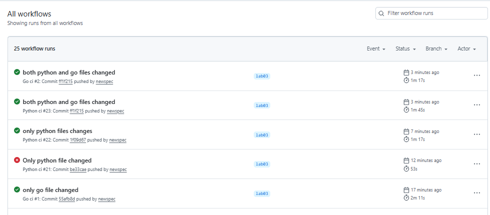
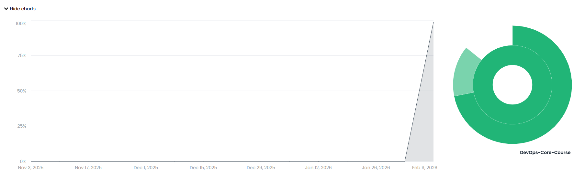

# LAB03 (Go) — Bonus: Multi-App CI + Path Filters + Coverage

## 1) Second workflow implementation (Go CI) + language-specific best practices

A separate workflow file is added for the Go application:

- `.github/workflows/go-ci.yml`

It implements Go-specific CI best practices:

- **Setup Go toolchain** via `actions/setup-go` (Go 1.22+)
- **Formatting check**: `gofmt -l .` must return empty output
- **Linting**: `golangci-lint` (industry-standard Go linter aggregator)
- **Unit tests**: `go test ./...`
- **Coverage generation**: `go test -coverprofile=coverage.out ./...`
- **Docker build/push**: multi-stage Docker build using the existing `app_go/Dockerfile` (builder stage + distroless runtime)

Docker image tagging follows the same CalVer strategy as Python:

- `YYYY.MM.DD` (CalVer)
- `${GITHUB_SHA}` (commit SHA)
- `latest`

## 2) Path filter configuration + testing proof

The Go workflow is triggered only when Go-related files change:

- `app_go/**`
- `.github/workflows/go-ci.yml`

This prevents unnecessary CI runs for unrelated parts of the monorepo.

### Proof (selective triggering)

Provide evidence with 2 small commits:

1) **Change only Go files**
   - https://github.com/newspec/DevOps-Core-Course/actions/runs/21837847722

2) **Change only Python files**
   - https://github.com/newspec/DevOps-Core-Course/actions/runs/21838134121

## 3) Benefits analysis — why path filters matter in monorepos

Path filters are important in monorepos because they:

- **Save CI time and compute**: no need to run Go CI when only Python changes (and vice versa)
- **Reduce noise in PR checks**: fewer irrelevant checks, faster feedback for reviewers
- **Improve developer experience**: faster iteration and fewer “unrelated failures”
- **Scale better** as more apps/labs are added to the same repository

## 4) Example showing workflows running independently

Example scenario:

- Commit A modifies only `app_go/**` → only Go CI runs
- Commit B modifies only `app_python/**` → only Python CI runs
- Commit C modifies both `app_go/**` and `app_python/**` → both workflows run in parallel

## 5) Terminal output / Actions evidence (selective triggering)

See links and screenshot above.

## 6) Coverage integration (dashboard link / screenshot)

## 7) Coverage analysis (current percentage, covered/not covered, threshold)

### Current coverage

Current Go coverage: 44%
Current Python coverage 99%

### What is covered (Go)
- `GET /` handler (`mainHandler`) returns status `200` and contains required top-level JSON keys:
  `service`, `system`, `runtime`, `request`, `endpoints`
- `GET /health` handler (`healthHandler`) returns status `200` and contains required keys:
  `status`, `timestamp`, `uptime_seconds`

### What is not covered (Go)
- Middleware behavior (`withRecover`, `withLogging`, `withNotFound`)
- Negative/error scenarios (e.g., unknown path via middleware, panic recovery)
- Strict validation of dynamic fields (timestamps formatting beyond basic checks)

