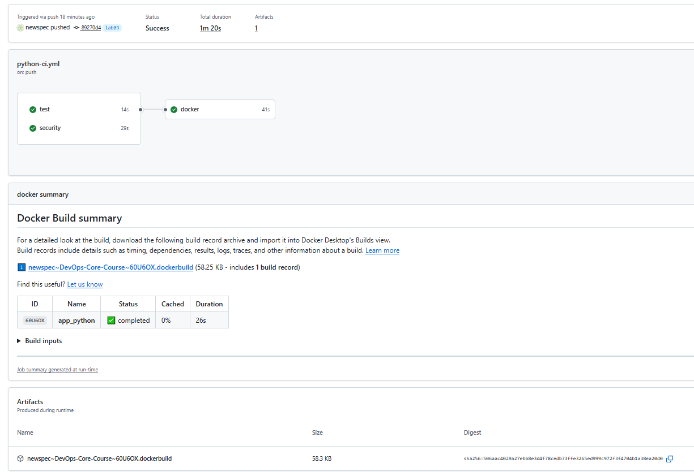
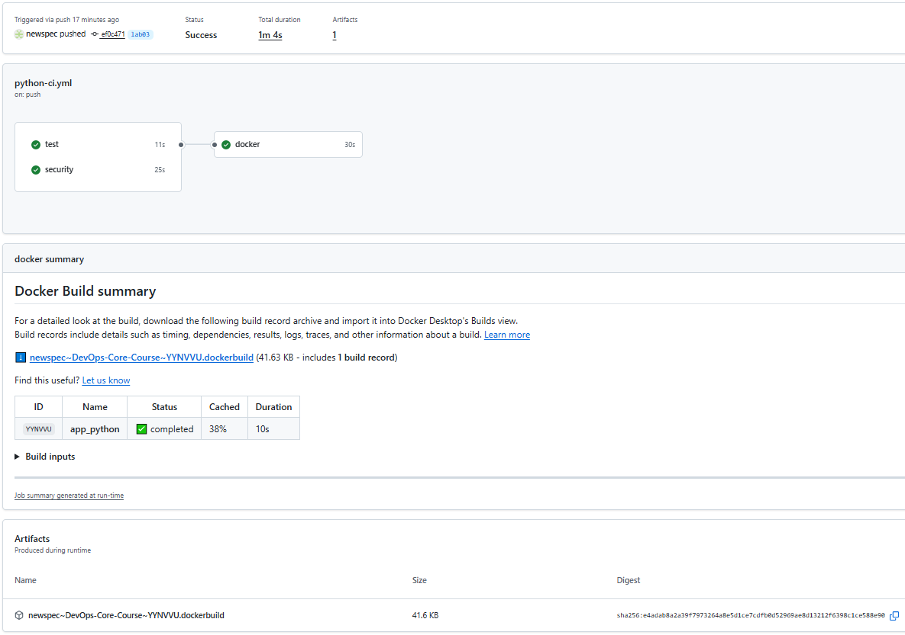

# LAB03 — Unit Testing + CI/CD + Security

## 1. Overview

### Testing framework used and why you chose it

I chose **pytest** after comparing common Python testing frameworks (`unittest`, `pytest`, etc.).
Pytest requires less boilerplate, has powerful fixtures and parametrization, produces clear failure
output, and scales well with plugins and CI workflows.

### What endpoints/functionality your tests cover

All tests are located in `app_python/tests/` and use FastAPI’s `TestClient`. The test suite covers:

- **GET /**  
  Verifies status code `200`, JSON structure, required top-level
  sections (`service`, `system`, `runtime`, `request`, `endpoints`), and important nested
  fields/types.
- **GET /health**  
  Verifies status code `200`, required fields (`status`, `timestamp`, `uptime_seconds`), and basic
  format checks.
- **Error cases**
    - **404 Not Found** returns the custom
      JSON `{ "error": "Not Found", "message": "Endpoint does not exist" }`
    - **Non-404 HTTPException** returns `{ "error": "HTTP Error", "message": "<detail>" }`
    - **500 Internal Server Error**
      returns `{ "error": "Internal Server Error", "message": "An unexpected error occurred" }`

### CI workflow trigger configuration (when does it run?)

The GitHub Actions workflow runs on **push** and **pull requests** to `lab03` and `master`, but only
when changes affect:

- `app_python/**`
- `.github/workflows/python-ci.yml`

This avoids unnecessary CI runs for unrelated edits. Docker images are built and pushed only on *
*push** events (not on pull requests).

### Versioning strategy chosen and rationale

I use **CalVer (Calendar Versioning)** with format `YYYY.MM.DD` because this project is updated
frequently and doesn’t require manual git release tags. Date-based versions are simple,
human-readable, and work well for continuous delivery.

---

## 2. Workflow Evidence

### ✅ Successful workflow run (GitHub Actions link)

- https://github.com/newspec/DevOps-Core-Course/actions/runs/21822195126

### ✅ Tests passing locally (terminal output)

```bash
pytest
========================================== test session starts ===========================================
platform win32 -- Python 3.12.4, pytest-8.4.2, pluggy-1.6.0
rootdir: C:\Users\malov\PycharmProjects\DevOps-Core-Course
plugins: anyio-4.11.0, asyncio-1.3.0, cov-7.0.0
asyncio: mode=Mode.STRICT, debug=False, asyncio_default_fixture_loop_scope=None, asyncio_default_test_loop_scope=function
collected 7 items

app_python\tests\test_errors.py ...                                                                 [ 42%]
app_python\tests\test_health.py ..                                                                  [ 71%]
app_python\tests\test_root.py ..                                                                    [100%]

=========================================== 7 passed in 0.48s ============================================
```

### ✅ Docker image on Docker Hub (link to your image)

- https://hub.docker.com/repository/docker/newspec/python_app/general

### ✅ Status badge working in README

Check the top page of README.md

## 3. Best Practices Implemented

- **Fail Fast**: If a step fails, the job stops immediately, saving CI time and making failures
  obvious.

- **Job Dependencies** : Docker push depends on successful `test` and `security` jobs, preventing
  publishing broken/insecure builds.

- **Dependency Caching (pip)**: `setup-python` caches pip downloads so installs are faster on
  repeated runs.

- **Docker Layer Caching**: Buildx + GHA cache reuses Docker layers across runs, reducing Docker
  build time significantly.

- **Secrets Management**: Tokens (Docker Hub + Snyk) are stored in GitHub Secrets and never
  committed.

### Caching: time saved (before vs after)

Measured by comparing two workflow runs:

- **Cold run (cache miss)**: 80s total
    - tests: 14s
    - security: 29s
    - docker build: 41s

- **Warm run (cache hit)**: 64s total
    - tests: 11s
    - security: 22s
    - docker build: 30s

**Improvement**:

- Total time saved: **16s**
- Docker build time saved: **11s**
- Percent improvement: **~20%**

Evidence (screenshots):

- First run (no cache): 
- Second run (cache hit): 

### Snyk: vulnerabilities found? action taken

Snyk is executed in a separate `security` job using:

```bash
snyk test --severity-threshold=high
```

- If `high` (or above) vulnerabilities are found, the security job fails.
- Because Docker depends on `security`, the image will **not be pushed** until vulnerabilities are
  fixed or the threshold is adjusted.

**Snyk result**: 0 high/critical vulnerabilities (build passed)

## Key Decisions

### Versioning Strategy: SemVer or CalVer? Why did you choose it for your app?

I chose **CalVer** (`YYYY.MM.DD`) because the application is built frequently and does not follow
formal release cycles. Date-based versioning is easy to automate in CI and provides clear
information about when an image was built.

### Docker Tags: What tags does your CI create? (e.g., latest, version number, etc.)

The CI publishes the Docker image with these tags:

- `YYYY.MM.DD` (CalVer date tag) — e.g., `2026.02.09`
- `${{ github.sha }}` (commit SHA tag) — uniquely identifies the build source commit
- `latest` — points to the most recent image build from the `lab03` or `master` branch

### Workflow Triggers: Why did you choose those triggers?

The workflow runs on push and pull request to `lab03` and `master` and only when relevant files
change. This avoids running CI for unrelated edits. Docker images are built and pushed only on push
events (not on pull requests) for `lab03` and `master`.

### Test Coverage: What's tested vs not tested?

**Tested**:

- Successful responses for `GET /` and `GET /health`
- Response JSON structure and required fields
- Custom error handling for 404, non-404 `HTTPException`, and 500 errors

**Not tested**:

- Performance/load behavior
- External integrations (none in this app)
- Detailed validation of dynamic fields beyond basic format/type checks (e.g., exact timestamps)