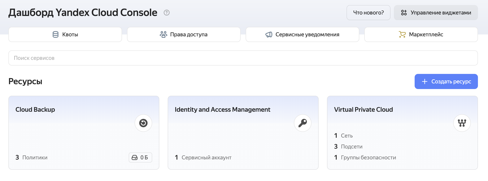

# Lab 04 - Infrastructure as Code (Terraform & Pulumi)

## 1. Cloud Provider & Infrastructure

### Cloud Provider Choice: Yandex Cloud

**Rationale:**
-  **Accessibility in Russia**: No restrictions or sanctions affecting access
-  **Free Tier**: 1 VM with 20% vCPU, 1 GB RAM, 10 GB storage
-  **No Credit Card Required**: Can start without payment method
-  **Good Documentation**: Available in Russian and English
-  **Terraform & Pulumi Support**: Official providers available
-  **Local Data Centers**: Lower latency for Russian users

**Alternative Considered:**
- AWS: More popular globally but requires credit card and may have access issues
- GCP: Good free tier but complex setup
- VK Cloud: Russian alternative but less mature tooling support

### Instance Configuration

**VM Specifications:**
- **Platform**: standard-v2
- **CPU**: 2 cores @ 20% (free tier)
- **Memory**: 1 GB RAM
- **Disk**: 10 GB HDD (network-hdd)
- **OS**: Ubuntu 24.04 LTS
- **Region/Zone**: ru-central1-a

**Network Configuration:**
- **VPC Network**: Custom network (10.128.0.0/24)
- **Public IP**: Yes (NAT enabled)
- **Security Group Rules**:
  - SSH (port 22): Allow from anywhere (0.0.0.0/0)
  - HTTP (port 80): Allow from anywhere
  - Custom (port 5000): Allow from anywhere (for app deployment)
  - Egress: Allow all outbound traffic

### Cost Analysis

**Total Cost: $0.00/month** 

Using Yandex Cloud free tier:
- VM: Free (20% vCPU, 1 GB RAM within limits)
- Storage: Free (10 GB HDD within limits)
- Network: Free (within egress limits)
- Public IP: Free (1 static IP included)

### Resources Created

**Terraform Resources:**
1. `yandex_vpc_network.lab04_network` - VPC network
2. `yandex_vpc_subnet.lab04_subnet` - Subnet (10.128.0.0/24)
3. `yandex_vpc_security_group.lab04_sg` - Security group with firewall rules
4. `yandex_compute_instance.lab04_vm` - VM instance

**Pulumi Resources:**
1. `lab04-network` - VPC network
2. `lab04-subnet` - Subnet (10.128.0.0/24)
3. `lab04-sg` - Security group with firewall rules
4. `lab04-vm` - VM instance

---

## 2. Terraform Implementation

### Terraform Version

```bash
Terraform v1.9.0
on darwin_arm64
+ provider registry.terraform.io/integrations/github v5.45.0
+ provider registry.terraform.io/yandex-cloud/yandex v0.187.0
```

### Project Structure

```
terraform/
├── .terraform.lock.hcl          # Provider version lock file
├── .terraformrc                 # Terraform CLI configuration (Yandex mirror)
├── .tflint.hcl                  # TFLint configuration
├── main.tf                      # Main resources (VM, network, security)
├── variables.tf                 # Input variable declarations
├── outputs.tf                   # Output value definitions
├── github.tf                    # GitHub provider (bonus task)
├── terraform.tfvars             # Actual configuration (gitignored)
├── terraform.tfstate            # State file (gitignored)
└── terraform.tfstate.backup     # State backup (gitignored)
```

**Note:** `terraform.tfstate` files are present locally but excluded from Git via `.gitignore`.

### Key Configuration Decisions

**1. Provider Configuration**
- Used Yandex Cloud provider version ~> 0.187
- Authentication via Service Account key (authorized key JSON file)
- Configured default zone (ru-central1-a) and folder_id
- GitHub provider version ~> 5.45 for repository management

**2. Resource Organization**
- Separated resources logically in main.tf
- Used data source for Ubuntu image (latest 24.04 LTS)
- Created dedicated VPC network instead of using default

**3. Security Approach**
- Security group with explicit ingress/egress rules
- SSH key injection via metadata
- All sensitive values in gitignored terraform.tfvars
- Used variables for all configurable parameters

**4. Free Tier Optimization**
- Set `core_fraction = 20` for free tier CPU
- Used `network-hdd` disk type (cheaper than SSD)
- Minimal 10 GB disk size
- Single VM instance

### Challenges Encountered

**1. Authentication Setup**
- **Issue**: Initial confusion about OAuth token vs service account
- **Solution**: Created Service Account with appropriate roles, generated authorized key (JSON)
- **Learning**: Service accounts provide better security and are recommended for automation

**3. Image Selection**
- **Issue**: Needed to find correct Ubuntu 24.04 image family name
- **Solution**: Used data source with `family = "ubuntu-2404-lts"`
- **Learning**: Data sources are powerful for dynamic resource lookup

**4. Free Tier Configuration**
- **Issue**: Ensuring configuration stays within free tier limits
- **Solution**: Set `core_fraction = 20`, used network-hdd, 10 GB disk
- **Learning**: Important to understand cloud provider pricing models

### Terraform Commands Output

#### terraform init

```bash
$ cd terraform/
terraform init

Initializing the backend...

Initializing provider plugins...
- Finding yandex-cloud/yandex versions matching "~> 0.100"...
- Finding integrations/github versions matching "~> 5.0"...
- Installing yandex-cloud/yandex v0.187.0...
- Installed yandex-cloud/yandex v0.187.0 (unauthenticated)
- Installing integrations/github v5.45.0...
- Installed integrations/github v5.45.0 (unauthenticated)

Terraform has created a lock file .terraform.lock.hcl to record the provider
selections it made above. Include this file in your version control repository
so that Terraform can guarantee to make the same selections by default when
you run "terraform init" in the future.

╷
│ Warning: Incomplete lock file information for providers
│ 
│ Due to your customized provider installation methods, Terraform was forced to calculate lock file checksums
│ locally for the following providers:
│   - integrations/github
│   - yandex-cloud/yandex
│ 
│ The current .terraform.lock.hcl file only includes checksums for darwin_arm64, so Terraform running on another
│ platform will fail to install these providers.
│ 
│ To calculate additional checksums for another platform, run:
│   terraform providers lock -platform=linux_amd64
│ (where linux_amd64 is the platform to generate)
╵

Terraform has been successfully initialized!

You may now begin working with Terraform. Try running "terraform plan" to see
any changes that are required for your infrastructure. All Terraform commands
should now work.

If you ever set or change modules or backend configuration for Terraform,
rerun this command to reinitialize your working directory. If you forget, other
commands will detect it and remind you to do so if necessary.
```

#### terraform plan

```bash
terraform plan
var.cloud_id
  Yandex Cloud ID

  Enter a value: ********

data.yandex_compute_image.ubuntu: Reading...
data.yandex_compute_image.ubuntu: Read complete after 0s [id=********]

Terraform used the selected providers to generate the following execution plan. Resource actions are indicated with the following symbols:
  + create

Terraform will perform the following actions:

  # github_branch_protection.master_protection will be created
  + resource "github_branch_protection" "master_protection" {
      + allows_deletions                = false
      + allows_force_pushes             = false
      + blocks_creations                = false
      + enforce_admins                  = false
      + id                              = (known after apply)
      + lock_branch                     = false
      + pattern                         = "master"
      + repository_id                   = (known after apply)
      + require_conversation_resolution = false
      + require_signed_commits          = false
      + required_linear_history         = false

      + required_pull_request_reviews {
          + dismiss_stale_reviews           = true
          + require_code_owner_reviews      = false
          + require_last_push_approval      = false
          + required_approving_review_count = 0
        }
    }

  # github_repository.devops_course will be created
  + resource "github_repository" "devops_course" {
      + allow_auto_merge            = false
      + allow_merge_commit          = true
      + allow_rebase_merge          = true
      + allow_squash_merge          = true
      + archived                    = false
      + default_branch              = (known after apply)
      + delete_branch_on_merge      = true
      + description                 = "DevOps Engineering: Core Practices - Lab assignments and projects"
      + etag                        = (known after apply)
      + full_name                   = (known after apply)
      + git_clone_url               = (known after apply)
      + has_downloads               = true
      + has_issues                  = true
      + has_projects                = false
      + has_wiki                    = false
      + html_url                    = (known after apply)
      + http_clone_url              = (known after apply)
      + id                          = (known after apply)
      + merge_commit_message        = "PR_TITLE"
      + merge_commit_title          = "MERGE_MESSAGE"
      + name                        = "DevOps-Core-Course"
      + node_id                     = (known after apply)
      + primary_language            = (known after apply)
      + private                     = (known after apply)
      + repo_id                     = (known after apply)
      + squash_merge_commit_message = "COMMIT_MESSAGES"
      + squash_merge_commit_title   = "COMMIT_OR_PR_TITLE"
      + ssh_clone_url               = (known after apply)
      + svn_url                     = (known after apply)
      + topics                      = [
          + "ansible",
          + "ci-cd",
          + "devops",
          + "docker",
          + "infrastructure-as-code",
          + "kubernetes",
          + "pulumi",
          + "terraform",
        ]
      + visibility                  = "public"
      + web_commit_signoff_required = false
    }

  # yandex_compute_instance.lab04_vm will be created
  + resource "yandex_compute_instance" "lab04_vm" {
      + created_at                = (known after apply)
      + folder_id                 = (known after apply)
      + fqdn                      = (known after apply)
      + gpu_cluster_id            = (known after apply)
      + hardware_generation       = (known after apply)
      + hostname                  = "lab04-vm"
      + id                        = (known after apply)
      + labels                    = {
          + "environment" = "lab04"
          + "managed_by"  = "terraform"
          + "purpose"     = "devops-course"
        }
      + maintenance_grace_period  = (known after apply)
      + maintenance_policy        = (known after apply)
      + metadata                  = {
          + "ssh-keys" = <<-EOT
                ************************
            EOT
        }
      + name                      = "lab04-vm"
      + network_acceleration_type = "standard"
      + platform_id               = "standard-v2"
      + status                    = (known after apply)
      + zone                      = "ru-central1-a"

      + boot_disk {
          + auto_delete = true
          + device_name = (known after apply)
          + disk_id     = (known after apply)
          + mode        = (known after apply)

          + initialize_params {
              + block_size  = (known after apply)
              + description = (known after apply)
              + image_id    = "fd8lt661chfo5i13a40d"
              + name        = (known after apply)
              + size        = 10
              + snapshot_id = (known after apply)
              + type        = "network-hdd"
            }
        }

      + network_interface {
          + index          = (known after apply)
          + ip_address     = (known after apply)
          + ipv4           = true
          + ipv6           = (known after apply)
          + ipv6_address   = (known after apply)
          + mac_address    = (known after apply)
          + nat            = true
          + nat_ip_address = (known after apply)
          + nat_ip_version = (known after apply)
          + subnet_id      = (known after apply)
        }

      + resources {
          + core_fraction = 20
          + cores         = 2
          + memory        = 1
        }

      + scheduling_policy {
          + preemptible = false
        }
    }

  # yandex_vpc_network.lab04_network will be created
  + resource "yandex_vpc_network" "lab04_network" {
      + created_at                = (known after apply)
      + default_security_group_id = (known after apply)
      + description               = "Network for Lab 04 VM"
      + folder_id                 = (known after apply)
      + id                        = (known after apply)
      + labels                    = (known after apply)
      + name                      = "lab04-network"
      + subnet_ids                = (known after apply)
    }

  # yandex_vpc_subnet.lab04_subnet will be created
  + resource "yandex_vpc_subnet" "lab04_subnet" {
      + created_at     = (known after apply)
      + description    = "Subnet for Lab 04 VM"
      + folder_id      = (known after apply)
      + id             = (known after apply)
      + labels         = (known after apply)
      + name           = "lab04-subnet"
      + network_id     = (known after apply)
      + v4_cidr_blocks = [
          + "10.128.0.0/24",
        ]
      + v6_cidr_blocks = (known after apply)
      + zone           = "ru-central1-a"
    }

Plan: 5 to add, 0 to change, 0 to destroy.

Changes to Outputs:
  + connection_info = {
      + private_ip  = (known after apply)
      + public_ip   = (known after apply)
      + ssh_command = (known after apply)
      + ssh_user    = "ubuntu"
    }
  + network_id      = (known after apply)
  + ssh_command     = (known after apply)
  + subnet_id       = (known after apply)
  + vm_id           = (known after apply)
  + vm_name         = "lab04-vm"
  + vm_private_ip   = (known after apply)
  + vm_public_ip    = (known after apply)

──────────────────────────────────────────────────────────────────────────────────────────────────────────────────────────────────────────────────────────────────────────────

Note: You didn't use the -out option to save this plan, so Terraform can't guarantee to take exactly these actions if you run "terraform apply" now.
```

#### terraform apply

```bash
terraform apply
var.cloud_id
  Yandex Cloud ID

  Enter a value: ******

github_repository.devops_course: Refreshing state... [id=DevOps-Core-Course]
data.yandex_compute_image.ubuntu: Reading...
yandex_vpc_network.lab04_network: Refreshing state... [id=******]
data.yandex_compute_image.ubuntu: Read complete after 0s [id=******]
yandex_vpc_subnet.lab04_subnet: Refreshing state... [id=******]
yandex_compute_instance.lab04_vm: Refreshing state... [id=******]
github_branch_protection.master_protection: Refreshing state... [id=B******]

Terraform used the selected providers to generate the following execution plan. Resource actions are indicated with
the following symbols:
-/+ destroy and then create replacement

Terraform will perform the following actions:

  # github_branch_protection.master_protection is tainted, so must be replaced
-/+ resource "github_branch_protection" "master_protection" {
      - force_push_bypassers            = [] -> null
      ~ id                              = "******" -> (known after apply)
      - push_restrictions               = [] -> null
        # (10 unchanged attributes hidden)

      ~ required_pull_request_reviews {
          - dismissal_restrictions          = [] -> null
          - pull_request_bypassers          = [] -> null
          - restrict_dismissals             = false -> null
            # (4 unchanged attributes hidden)
        }
    }

Plan: 1 to add, 0 to change, 1 to destroy.

Do you want to perform these actions?
  Terraform will perform the actions described above.
  Only 'yes' will be accepted to approve.

  Enter a value: yes

github_branch_protection.master_protection: Destroying... [id=******]
github_branch_protection.master_protection: Destruction complete after 0s
github_branch_protection.master_protection: Creating...
github_branch_protection.master_protection: Creation complete after 4s [id=******]

Apply complete! Resources: 1 added, 0 changed, 1 destroyed.

Outputs:

connection_info = {
  "private_ip" = "10.128.0.11"
  "public_ip" = "84.201.128.171"
  "ssh_command" = "ssh ubuntu@84.201.128.171"
  "ssh_user" = "ubuntu"
}
network_id = "enp5kqg9rma6c31bjsen"
ssh_command = "ssh ubuntu@84.201.128.171"
subnet_id = "e9bl6fnifjfbe7ufp7tl"
vm_id = "fhmbajpub1spksjhkvct"
vm_name = "lab04-vm"
vm_private_ip = "10.128.0.11"
vm_public_ip = "84.201.128.171"
```

### SSH Connection Verification

```bash
ssh -i ~/.ssh/yandex_cloud_key  ubuntu@84.201.128.171
Welcome to Ubuntu 24.04.4 LTS (GNU/Linux 6.8.0-100-generic x86_64)

 * Documentation:  https://help.ubuntu.com
 * Management:     https://landscape.canonical.com
 * Support:        https://ubuntu.com/pro

 System information as of Mon Feb 16 23:12:16 UTC 2026

  System load:  0.0               Processes:             96
  Usage of /:   23.1% of 9.04GB   Users logged in:       0
  Memory usage: 17%               IPv4 address for eth0: 10.128.0.11
  Swap usage:   0%


Expanded Security Maintenance for Applications is not enabled.

0 updates can be applied immediately.

Enable ESM Apps to receive additional future security updates.
See https://ubuntu.com/esm or run: sudo pro status


The programs included with the Ubuntu system are free software;
the exact distribution terms for each program are described in the
individual files in /usr/share/doc/*/copyright.

Ubuntu comes with ABSOLUTELY NO WARRANTY, to the extent permitted by
applicable law.

To run a command as administrator (user "root"), use "sudo <command>".
See "man sudo_root" for details.

ubuntu@lab04-vm:~$ 
```

---

## 3. Pulumi Implementation

### Pulumi Version and Language

```bash
Pulumi v3.220.0
Python 3.9.6 
pulumi-yandex v0.13.0
```

**Language Choice: Python**

### Code Differences from Terraform

**1. Language Paradigm**

**Terraform (Declarative HCL):**
```hcl
resource "yandex_vpc_network" "lab04_network" {
  name        = "lab04-network"
  description = "Network for Lab 04 VM"
}
```

**Pulumi (Imperative Python):**
```python
network = yandex.VpcNetwork(
    "lab04-network",
    name="lab04-pulumi-network",
    description="Network for Lab 04 Pulumi VM",
    folder_id=folder_id
)
```

**Key Differences:**
- Terraform: Resource blocks with attributes
- Pulumi: Object instantiation with constructor arguments
- Terraform: Static configuration
- Pulumi: Can use variables, loops, functions naturally

**2. Configuration Management**

**Terraform:**
```hcl
# variables.tf
variable "folder_id" {
  description = "Yandex Cloud folder ID"
  type        = string
}

# terraform.tfvars
folder_id = "b1g..."
```

**Pulumi:**
```python
# __main__.py
config = pulumi.Config()
folder_id = config.require("folder_id")

# Command line
pulumi config set lab04-pulumi:folder_id b1g...
```

**Key Differences:**
- Terraform: Separate variable files
- Pulumi: Config object in code
- Terraform: tfvars files
- Pulumi: Stack-specific YAML files or CLI commands

**3. Outputs**

**Terraform:**
```hcl
output "vm_public_ip" {
  description = "Public IP address of the VM"
  value       = yandex_compute_instance.lab04_vm.network_interface[0].nat_ip_address
}
```

**Pulumi:**
```python
pulumi.export("vm_public_ip", vm.network_interfaces[0].nat_ip_address)

# For computed values
pulumi.export("ssh_command", vm.network_interfaces[0].nat_ip_address.apply(
    lambda ip: f"ssh {ssh_user}@{ip}"
))
```

**Key Differences:**
- Terraform: Output blocks
- Pulumi: Export function calls
- Pulumi: `.apply()` for working with computed values (Promises)

**4. Resource Dependencies**

**Terraform:**
```hcl
# Implicit dependencies through references
resource "yandex_vpc_subnet" "lab04_subnet" {
  network_id = yandex_vpc_network.lab04_network.id  # Implicit dependency
}
```

**Pulumi:**
```python
# Same implicit dependencies through references
subnet = yandex.VpcSubnet(
    "lab04-subnet",
    network_id=network.id  # Implicit dependency
)
```

**Key Differences:**
- Both handle dependencies automatically
- Pulumi can use explicit `depends_on` if needed
- Pulumi's type system helps catch errors earlier

### Advantages Discovered

**1. Programming Language Features**

 **Loops and Conditionals:**
```python
# Easy to create multiple similar resources
for i in range(3):
    subnet = yandex.VpcSubnet(f"subnet-{i}", ...)

# Conditional resource creation
if config.get_bool("enable_monitoring"):
    monitoring = yandex.MonitoringDashboard(...)
```

 **Functions and Reusability:**
```python
def create_security_rule(port, description):
    return yandex.VpcSecurityGroupIngressArgs(
        protocol="TCP",
        description=description,
        v4_cidr_blocks=["0.0.0.0/0"],
        port=port
    )

# Use function to create rules
ingress=[
    create_security_rule(22, "Allow SSH"),
    create_security_rule(80, "Allow HTTP"),
    create_security_rule(5000, "Allow app port 5000"),
]
```

 **Error Handling:**
```python
try:
    with open(ssh_public_key_path, "r") as f:
        ssh_public_key = f.read().strip()
except FileNotFoundError:
    raise Exception(f"SSH public key not found at {ssh_public_key_path}")
```

**2. IDE Support**

 **Autocomplete:**
- IDE suggests available properties
- Type hints show expected types
- Inline documentation

 **Type Checking:**
- Catch errors before deployment
- Better refactoring support
- Clear error messages

**3. Testing Capabilities**

 **Unit Tests:**
```python
# Can write unit tests for infrastructure
import unittest
from pulumi import runtime

class TestInfrastructure(unittest.TestCase):
    @pulumi.runtime.test
    def test_vm_has_correct_size(self):
        # Test infrastructure code
        pass
```

**4. Secrets Management**

 **Encrypted by Default:**
```bash
pulumi config set --secret github_token ghp_...
# Automatically encrypted in Pulumi.*.yaml
```

 **No Plain Text in State:**
- Secrets encrypted in state file
- Safer than Terraform's plain text state

### Challenges Encountered

**1. Learning Curve**
- **Issue**: Understanding Pulumi's async/promise model (`.apply()`)
- **Solution**: Read documentation on Output types and computed values
- **Learning**: Pulumi's Output type handles async resource creation

**2. Provider Documentation**
- **Issue**: Yandex Cloud Pulumi provider has less documentation than Terraform
- **Solution**: Referred to Terraform docs and translated to Pulumi syntax
- **Learning**: Terraform has larger community and more examples

**4. Python Path Issues**
- **Issue**: SSH key path with `~` not expanding correctly
- **Solution**: Added manual path expansion in code
- **Learning**: Need to handle OS-specific path issues in code

### Pulumi Commands Output

#### pulumi preview

```bash
pulumi preview                                                                
Enter your passphrase to unlock config/secrets
    (set PULUMI_CONFIG_PASSPHRASE or PULUMI_CONFIG_PASSPHRASE_FILE to remember):  
Enter your passphrase to unlock config/secrets
Previewing update (dev):
     Type                              Name              Plan       
 +   pulumi:pulumi:Stack               lab04-pulumi-dev  create     
 +   ├─ yandex:index:VpcNetwork        lab04-network     create     
 +   ├─ yandex:index:VpcSubnet         lab04-subnet      create     
 +   ├─ yandex:index:VpcSecurityGroup  lab04-sg          create     
 +   └─ yandex:index:ComputeInstance   lab04-vm          create     

Outputs:
    connection_info: {
        private_ip : [unknown]
        public_ip  : [unknown]
        ssh_command: [unknown]
        ssh_user   : "ubuntu"
    }
    network_id     : [unknown]
    ssh_command    : [unknown]
    subnet_id      : [unknown]
    vm_id          : [unknown]
    vm_name        : "lab04-pulumi-vm"
    vm_private_ip  : [unknown]
    vm_public_ip   : [unknown]

Resources:
    + 5 to create

(venv) newspec@10 pulumi % 
```

#### pulumi up

```bash
pulumi up
Enter your passphrase to unlock config/secrets
    (set PULUMI_CONFIG_PASSPHRASE or PULUMI_CONFIG_PASSPHRASE_FILE to remember):  
Enter your passphrase to unlock config/secrets
Previewing update (dev):
     Type                              Name              Plan       
 +   pulumi:pulumi:Stack               lab04-pulumi-dev  create     
 +   ├─ yandex:index:VpcNetwork        lab04-network     create     
 +   ├─ yandex:index:VpcSubnet         lab04-subnet      create     
 +   ├─ yandex:index:VpcSecurityGroup  lab04-sg          create     
 +   └─ yandex:index:ComputeInstance   lab04-vm          create     

Outputs:
    connection_info: {
        private_ip : [unknown]
        public_ip  : [unknown]
        ssh_command: [unknown]
        ssh_user   : "ubuntu"
    }
    network_id     : [unknown]
    ssh_command    : [unknown]
    subnet_id      : [unknown]
    vm_id          : [unknown]
    vm_name        : "lab04-pulumi-vm"
    vm_private_ip  : [unknown]
    vm_public_ip   : [unknown]

Resources:
    + 5 to create

Do you want to perform this update? yes
Updating (dev):
     Type                              Name              Status              
 +   pulumi:pulumi:Stack               lab04-pulumi-dev  created (41s)       
 +   ├─ yandex:index:VpcNetwork        lab04-network     created (1s)        
 +   ├─ yandex:index:VpcSecurityGroup  lab04-sg          created (1s)        
 +   ├─ yandex:index:VpcSubnet         lab04-subnet      created (0.43s)     
 +   └─ yandex:index:ComputeInstance   lab04-vm          created (38s)       

Outputs:
    connection_info: {
        private_ip : "10.128.0.13"
        public_ip  : "84.201.128.246"
        ssh_command: "ssh ubuntu@84.201.128.246"
        ssh_user   : "ubuntu"
    }
    network_id     : "enpej60jp6arufbqcu7g"
    ssh_command    : "ssh ubuntu@84.201.128.246"
    subnet_id      : "e9bdpptsdf2nafbj1s10"
    vm_id          : "fhmvjrq2012fqg0mloc8"
    vm_name        : "lab04-pulumi-vm"
    vm_private_ip  : "10.128.0.13"
    vm_public_ip   : "84.201.128.246"

Resources:
    + 5 created

Duration: 42s
```

### SSH Connection Verification

```bash
ssh -i ~/.ssh/yandex_cloud_key ubuntu@84.201.128.246 
Welcome to Ubuntu 24.04.4 LTS (GNU/Linux 6.8.0-100-generic x86_64)

 * Documentation:  https://help.ubuntu.com
 * Management:     https://landscape.canonical.com
 * Support:        https://ubuntu.com/pro

 System information as of Mon Feb 16 23:50:44 UTC 2026

  System load:  0.01              Processes:             99
  Usage of /:   23.1% of 9.04GB   Users logged in:       0
  Memory usage: 17%               IPv4 address for eth0: 10.128.0.13
  Swap usage:   0%


Expanded Security Maintenance for Applications is not enabled.

0 updates can be applied immediately.

Enable ESM Apps to receive additional future security updates.
See https://ubuntu.com/esm or run: sudo pro status


The programs included with the Ubuntu system are free software;
the exact distribution terms for each program are described in the
individual files in /usr/share/doc/*/copyright.

Ubuntu comes with ABSOLUTELY NO WARRANTY, to the extent permitted by
applicable law.


To run a command as administrator (user "root"), use "sudo <command>".
See "man sudo_root" for details.

ubuntu@lab04-pulumi-vm:~$ 
```
---

## 4. Terraform vs Pulumi Comparison

### Ease of Learning

**Terraform: (4/5)**

**Pros:**
- Simple, declarative syntax
- Easy to understand resource blocks
- Extensive documentation and examples
- Large community with many tutorials
- Consistent patterns across providers

**Cons:**
- Need to learn HCL syntax
- Limited logic capabilities
- Some concepts (count, for_each) can be confusing

**Pulumi: (3/5)**

**Pros:**
- Use familiar programming language
- No new syntax to learn (if you know Python)
- Natural use of variables and functions

**Cons:**
- Need to understand Output/Promise model
- Async concepts can be confusing
- Less community content and examples
- Requires programming knowledge

**Winner: Terraform** - Lower barrier to entry, especially for those without programming background.

### Code Readability

**Terraform: (5/5)**

**Pros:**
- Very clear and declarative
- Easy to see what infrastructure will be created
- Consistent structure across all resources
- Self-documenting with descriptions

**Pulumi: (4/5)**

**Pros:**
- Familiar Python syntax
- Can add comments and documentation strings
- Type hints improve clarity
- IDE shows inline documentation

**Cons:**
- More verbose than HCL
- Mixing infrastructure and logic can reduce clarity
- Need to understand Python conventions

**Winner: Terraform** - More concise and purpose-built for infrastructure.

### Debugging

**Terraform: (3/5)**

**Pros:**
- Clear error messages
- `terraform plan` shows what will change
- Can use `terraform console` for testing expressions
- State file helps understand current state

**Cons:**
- Limited debugging tools
- Hard to debug complex expressions
- No step-through debugging
- Error messages can be cryptic for complex scenarios

**Pulumi: (4/5)**

**Pros:**
- Can use Python debugger (pdb)
- IDE debugging support
- Better error messages with stack traces
- Can add print statements for debugging
- Unit testing capabilities

**Cons:**
- Async nature can complicate debugging
- Output types require `.apply()` understanding

**Winner: Pulumi** - Full programming language debugging capabilities.

### Documentation

**Terraform: (5/5)**

**Pros:**
- Extensive official documentation
- Large community with many examples
- Provider documentation in Terraform Registry
- Many tutorials and courses
- Stack Overflow has many answers

**Cons:**
- Documentation can be overwhelming
- Some providers have better docs than others

**Pulumi: (3/5)**

**Pros:**
- Good official documentation
- API reference auto-generated
- Examples in multiple languages
- Good getting started guides

**Cons:**
- Smaller community
- Fewer third-party tutorials
- Less Stack Overflow content
- Provider docs sometimes less detailed

**Winner: Terraform** - Much larger ecosystem and community.

### Use Cases

**When to Use Terraform:**

 **Simple to Medium Infrastructure**
- Straightforward resource provisioning
- Standard cloud patterns
- Team prefers declarative approach

 **Multi-Cloud Deployments**
- Largest provider ecosystem
- Consistent syntax across clouds
- Mature and stable

 **Compliance and Governance**
- Clear audit trail
- Policy as code (Sentinel)
- Established best practices

 **Team Without Programming Background**
- DevOps/Ops teams
- Infrastructure-focused roles
- Lower learning curve

**When to Use Pulumi:**

 **Complex Infrastructure Logic**
- Dynamic resource creation
- Complex conditionals
- Advanced transformations

 **Developer-Centric Teams**
- Software engineers managing infrastructure
- Want to use familiar languages
- Need testing capabilities

 **Reusable Components**
- Building infrastructure libraries
- Sharing code via packages
- Higher-level abstractions

 **Better Secrets Management**
- Need encrypted secrets
- Compliance requirements
- Sensitive data handling

## 5. Lab 5 Preparation & Cleanup

### VM for Lab 5

**Are you keeping your VM for Lab 5?** No 

**What will you use for Lab 5?** Will recreate cloud VM

**Terrafrom destroy**:
```bash
terraform destroy
var.cloud_id
  Yandex Cloud ID

  Enter a value: ********

github_repository.devops_course: Refreshing state... [id=DevOps-Core-Course]
data.yandex_compute_image.ubuntu: Reading...
data.yandex_compute_image.ubuntu: Read complete after 0s [id=*******]

Terraform used the selected providers to generate the following execution plan. Resource actions are indicated with the following symbols:
  - destroy

Terraform will perform the following actions:

  # github_repository.devops_course will be destroyed
  - resource "github_repository" "devops_course" {
      - allow_auto_merge            = false -> null
      - allow_merge_commit          = true -> null
      - allow_rebase_merge          = true -> null
      - allow_squash_merge          = true -> null
      - allow_update_branch         = false -> null
      - archived                    = false -> null
      - auto_init                   = false -> null
      - default_branch              = "master" -> null
      - delete_branch_on_merge      = true -> null
      - description                 = "DevOps Engineering: Core Practices - Lab assignments and projects" -> null
      - etag                        = "W/\"8f88878a50eedec268e373e039998430cbf194a2a9e0c3ff93a27116412b1b69\"" -> null
      - full_name                   = "newspec/DevOps-Core-Course" -> null
      - git_clone_url               = "git://github.com/newspec/DevOps-Core-Course.git" -> null
      - has_discussions             = false -> null
      - has_downloads               = true -> null
      - has_issues                  = true -> null
      - has_projects                = false -> null
      - has_wiki                    = false -> null
      - html_url                    = "https://github.com/newspec/DevOps-Core-Course" -> null
      - http_clone_url              = "https://github.com/newspec/DevOps-Core-Course.git" -> null
      - id                          = "DevOps-Core-Course" -> null
      - is_template                 = false -> null
      - merge_commit_message        = "PR_TITLE" -> null
      - merge_commit_title          = "MERGE_MESSAGE" -> null
      - name                        = "DevOps-Core-Course" -> null
      - node_id                     = "R_kgDORA7Qvw" -> null
      - private                     = false -> null
      - repo_id                     = 1141821631 -> null
      - squash_merge_commit_message = "COMMIT_MESSAGES" -> null
      - squash_merge_commit_title   = "COMMIT_OR_PR_TITLE" -> null
      - ssh_clone_url               = "git@github.com:newspec/DevOps-Core-Course.git" -> null
      - svn_url                     = "https://github.com/newspec/DevOps-Core-Course" -> null
      - topics                      = [
          - "ansible",
          - "ci-cd",
          - "devops",
          - "docker",
          - "infrastructure-as-code",
          - "kubernetes",
          - "pulumi",
          - "terraform",
        ] -> null
      - visibility                  = "public" -> null
      - vulnerability_alerts        = false -> null
      - web_commit_signoff_required = false -> null

      - security_and_analysis {
          - secret_scanning {
              - status = "enabled" -> null
            }
          - secret_scanning_push_protection {
              - status = "enabled" -> null
            }
        }
    }

Plan: 0 to add, 0 to change, 1 to destroy.

Changes to Outputs:
  - vm_name = "lab04-vm" -> null

Do you really want to destroy all resources?
  Terraform will destroy all your managed infrastructure, as shown above.
  There is no undo. Only 'yes' will be accepted to confirm.

  Enter a value: yes

github_repository.devops_course: Destroying... [id=DevOps-Core-Course]
╷
│ Error: DELETE https://api.github.com/repos/newspec/DevOps-Core-Course: 403 Must have admin rights to Repository. []
│ 
│ 
╵
```
**pulumi destroy**:
```bash
pulumi destroy
Enter your passphrase to unlock config/secrets
    (set PULUMI_CONFIG_PASSPHRASE or PULUMI_CONFIG_PASSPHRASE_FILE to remember):  
Enter your passphrase to unlock config/secrets
Previewing destroy (dev):
     Type                              Name              Plan       
 -   pulumi:pulumi:Stack               lab04-pulumi-dev  delete     
 -   ├─ yandex:index:VpcNetwork        lab04-network     delete     
 -   ├─ yandex:index:ComputeInstance   lab04-vm          delete     
 -   ├─ yandex:index:VpcSubnet         lab04-subnet      delete     
 -   └─ yandex:index:VpcSecurityGroup  lab04-sg          delete     

Outputs:
  - connection_info: {
      - private_ip : "10.128.0.13"
      - public_ip  : "84.201.128.246"
      - ssh_command: "ssh ubuntu@84.201.128.246"
      - ssh_user   : "ubuntu"
    }
  - network_id     : "enpej60jp6arufbqcu7g"
  - ssh_command    : "ssh ubuntu@84.201.128.246"
  - subnet_id      : "e9bdpptsdf2nafbj1s10"
  - vm_id          : "fhmvjrq2012fqg0mloc8"
  - vm_name        : "lab04-pulumi-vm"
  - vm_private_ip  : "10.128.0.13"
  - vm_public_ip   : "84.201.128.246"

Resources:
    - 5 to delete

Do you want to perform this destroy? yes
Destroying (dev):
     Type                              Name              Status              
 -   pulumi:pulumi:Stack               lab04-pulumi-dev  deleted (0.01s)     
 -   ├─ yandex:index:ComputeInstance   lab04-vm          deleted (33s)       
 -   ├─ yandex:index:VpcSubnet         lab04-subnet      deleted (4s)        
 -   ├─ yandex:index:VpcSecurityGroup  lab04-sg          deleted (0.43s)     
 -   └─ yandex:index:VpcNetwork        lab04-network     deleted (1s)        

Outputs:
  - connection_info: {
      - private_ip : "10.128.0.13"
      - public_ip  : "84.201.128.246"
      - ssh_command: "ssh ubuntu@84.201.128.246"
      - ssh_user   : "ubuntu"
    }
  - network_id     : "enpej60jp6arufbqcu7g"
  - ssh_command    : "ssh ubuntu@84.201.128.246"
  - subnet_id      : "e9bdpptsdf2nafbj1s10"
  - vm_id          : "fhmvjrq2012fqg0mloc8"
  - vm_name        : "lab04-pulumi-vm"
  - vm_private_ip  : "10.128.0.13"
  - vm_public_ip   : "84.201.128.246"

Resources:
    - 5 deleted

Duration: 40s

The resources in the stack have been deleted, but the history and configuration associated with the stack are still maintained. 
If you want to remove the stack completely, run `pulumi stack rm dev`.
```

**screenshot showing resource status:** 
