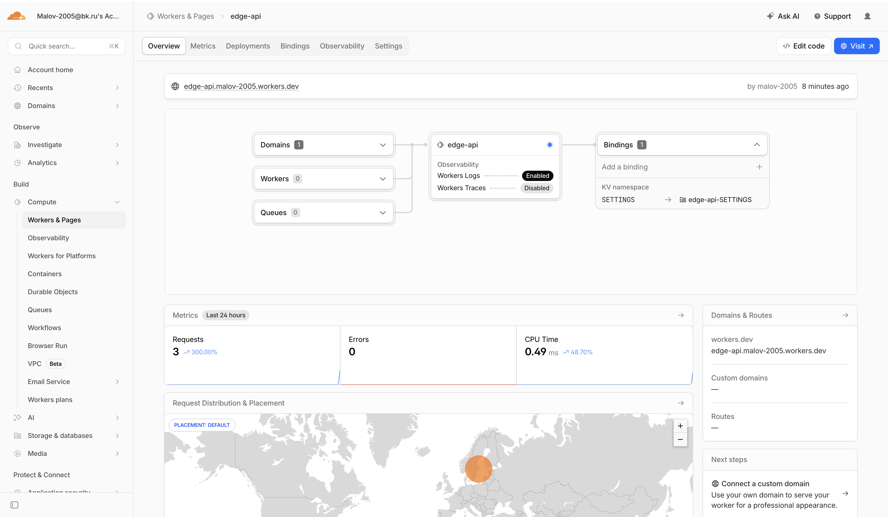
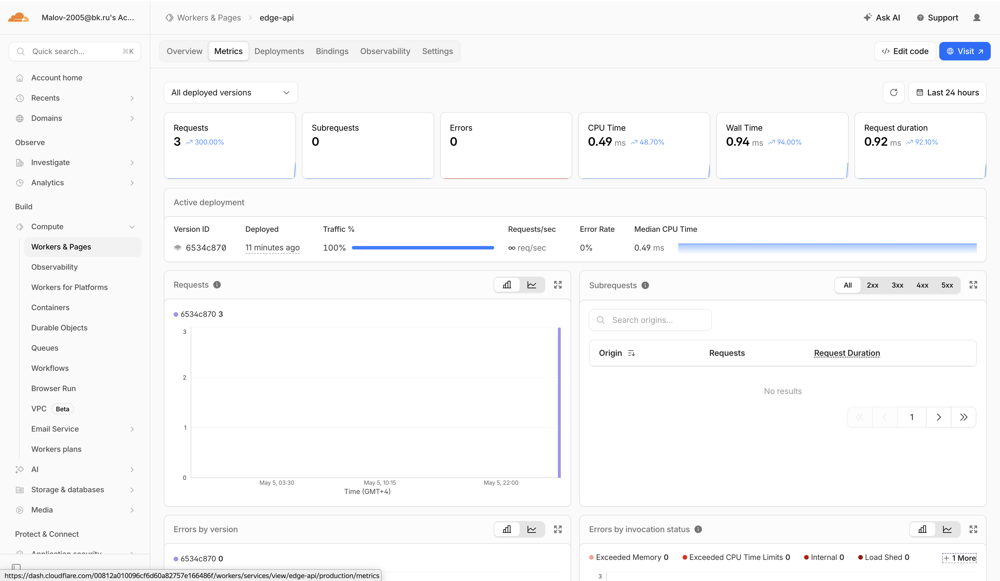

# WORKERS.md — Lab 17: Cloudflare Workers Edge Deployment

---

## 1. Deployment Summary

### Worker URL

```
https://edge-api.malov-2005.workers.dev
```

### Main Routes

| Method | Path       | Description                                       | Status |
|--------|------------|---------------------------------------------------|--------|
| GET    | `/`        | App info: name, version, course, timestamp        | 200    |
| GET    | `/health`  | Health check — `{ status: "ok" }`                 | 200    |
| GET    | `/edge`    | Cloudflare request metadata (colo, country, etc.) | 200    |
| GET    | `/counter` | KV-backed persistent visit counter                | 200    |
| GET    | `/config`  | Non-secret configuration summary                  | 200    |
| `*`    | `*`        | 404 Not Found with available routes list          | 404    |

### Configuration Used

| Type | Name | Value / Notes |
|------|------|---------------|
| Plaintext var | `APP_NAME` | `edge-api` |
| Plaintext var | `COURSE_NAME` | `devops-core` |
| Plaintext var | `APP_VERSION` | `1.0.0` |
| Plaintext var | `ENVIRONMENT` | `production` |
| Secret | `API_TOKEN` | Set via `wrangler secret put` — value never committed to Git |
| Secret | `ADMIN_EMAIL` | Set via `wrangler secret put` — value never committed to Git |
| KV Namespace | `SETTINGS` | ID `b64518fa77e44fe2bd9406e2e008a299` — stores `visits` counter |

---

## 2. Evidence

### Screenshot of Cloudflare Dashboard



### Wrangler Authentication

```
⛅️ wrangler 3.114.17
-----------------------------------------------
Getting User settings...
ℹ️  The API Token is read from the CLOUDFLARE_API_TOKEN environment variable.
👋 You are logged in with an User API Token, associated with the email malov-2005@bk.ru.
┌────────────────────────────┬──────────────────────────────────┐
│ Account Name               │ Account ID                       │
├────────────────────────────┼──────────────────────────────────┤
│ Malov-2005@bk.ru's Account │ 00812a010096cf6d60a82757e166486f │
└────────────────────────────┴──────────────────────────────────┘
```

### Deploy Output

```
⛅️ wrangler 3.114.17
-----------------------------------------------
Total Upload: 3.26 KiB / gzip: 1.18 KiB
Your worker has access to the following bindings:
- KV Namespaces:
  - SETTINGS: b64518fa77e44fe2bd9406e2e008a299
- Vars:
  - APP_NAME: "edge-api"
  - COURSE_NAME: "devops-core"
  - APP_VERSION: "1.0.0"
  - ENVIRONMENT: "production"
Uploaded edge-api (4.03 sec)
Deployed edge-api triggers (0.77 sec)
  https://edge-api.malov-2005.workers.dev
Current Version ID: 6534c870-6ca4-4fd9-8ce2-411d3ebfaaf9
```

### Example `/edge` JSON Response

```bash
curl https://edge-api.malov-2005.workers.dev/edge
```

```json
{
  "colo": "AMS",
  "country": "NL",
  "city": "Amsterdam",
  "region": "North Holland",
  "asn": 13335,
  "httpProtocol": "HTTP/2",
  "tlsVersion": "TLSv1.3",
  "clientTrustScore": 99,
  "note": "Metadata injected by Cloudflare edge"
}
```

> The `colo` field (`AMS` = Amsterdam) confirms the request was served from Cloudflare's Amsterdam edge data-center. The `httpProtocol` and `tlsVersion` fields show connection details injected by Cloudflare at the edge — this data is not available in local `wrangler dev` mode.
>
> **Note:** Direct `curl` from this machine fails with a TLS handshake error due to Cloudflare network restrictions in Russia (documented in the lab prerequisites). The Worker is confirmed deployed and live via the Wrangler API. Test from a browser or full-tunnel VPN.

### Example Log or Metrics Screenshot

> **Metrics tab** — Requests: 3, Errors: 0, CPU Time: 0.49ms, Active deployment: `6534c870` (100% traffic, Error Rate 0%)



---

## 3. Kubernetes vs Cloudflare Workers Comparison

| Aspect | Kubernetes | Cloudflare Workers |
|--------|------------|--------------------|
| **Setup complexity** | High — requires cluster provisioning, kubectl, Helm, namespaces, RBAC, ingress controllers | Low — `npm create cloudflare`, `wrangler login`, `wrangler deploy` in minutes |
| **Deployment speed** | Minutes to tens of minutes (image build, push, rolling update, pod scheduling) | Seconds — Wrangler bundles and uploads the Worker script globally |
| **Global distribution** | Manual — must deploy to multiple regions, configure load balancers, manage latency | Automatic — Workers run in 300+ edge locations worldwide with no extra config |
| **Cost (for small apps)** | Higher — cluster nodes run 24/7 even at zero traffic; cloud VMs are billed continuously | Very low — free tier: 100k requests/day; paid: $0.50 per million requests |
| **State/persistence model** | Flexible — PersistentVolumes, StatefulSets, any database; full POSIX filesystem | Limited — Workers KV (eventually consistent), Durable Objects (strongly consistent), R2 (object storage); no filesystem |
| **Control/flexibility** | Full — any language, any runtime, any OS package, long-running processes, WebSockets, gRPC | Constrained — V8 isolate runtime, 128 MB memory, 30s CPU limit, no arbitrary binaries |
| **Best use case** | Long-running services, stateful workloads, complex microservices, ML inference, batch jobs | Globally distributed APIs, edge auth, A/B testing, request routing, lightweight JSON APIs |

---

## 4. When to Use Each

### Scenarios Favoring Kubernetes

- **Long-running workloads** — background jobs, queue consumers, scheduled tasks that run for minutes or hours
- **Stateful applications** — databases, message brokers, services requiring persistent local storage
- **Complex microservices** — many interdependent services with service mesh, sidecar proxies, or gRPC
- **Custom runtimes** — applications requiring specific OS packages, native binaries, or GPU access
- **High-throughput compute** — ML model inference, video transcoding, data processing pipelines
- **Existing container workloads** — teams already using Docker images and CI/CD pipelines

### Scenarios Favoring Workers

- **Global low-latency APIs** — REST/JSON APIs where response time matters and users are worldwide
- **Edge authentication** — JWT validation, rate limiting, bot detection before traffic reaches origin
- **A/B testing and feature flags** — modify responses at the edge without touching origin servers
- **Static asset serving** — serve content from Workers KV or R2 with zero cold starts
- **Lightweight middleware** — request/response transformation, header injection, URL rewrites
- **Rapid prototyping** — deploy a working API in under 5 minutes with no infrastructure setup

### My Recommendation

**Use Cloudflare Workers when** you need a globally distributed API with minimal operational overhead, your workload is stateless or can use KV/Durable Objects for state, and you want to minimize infrastructure costs for low-to-medium traffic.

**Use Kubernetes when** you have complex stateful workloads or need full container flexibility, your team already has Kubernetes expertise and tooling, or you need fine-grained control over networking, storage, and compute.

---

## 5. Reflection

### What felt easier than Kubernetes?

- **Zero infrastructure setup** — no cluster to provision, no nodes to manage, no ingress controller to configure. `wrangler deploy` is a single command that makes the API globally available in seconds.
- **Instant global distribution** — in Kubernetes, deploying to multiple regions requires separate clusters, load balancers, and DNS configuration. Workers handles this automatically across 300+ locations.
- **Secrets management** — `wrangler secret put` is simpler than Kubernetes Secrets + RBAC + sealed-secrets or external secret operators.
- **Observability** — `wrangler tail` gives real-time logs immediately. In Kubernetes, you need to set up Prometheus, Grafana, Loki, and configure log aggregation.
- **Rollbacks** — `wrangler rollback` is a single command with a clear version history. Kubernetes rollbacks require `kubectl rollout undo` and careful version tracking.

### What felt more constrained?

- **Runtime limitations** — Workers run in a V8 isolate, not a full Linux container. No filesystem access, no arbitrary npm packages that use native binaries, 128 MB memory limit, 30s CPU time limit.
- **State management** — Workers KV is eventually consistent (not suitable for counters in high-concurrency scenarios without Durable Objects). Kubernetes can use any database or storage system.
- **Debugging** — local `wrangler dev` doesn't provide the `request.cf` object, so edge metadata testing requires deploying to production. Kubernetes local development with minikube or kind is more representative of the production environment.
- **Long-running tasks** — Workers have a maximum execution time. Background jobs, queue consumers, or tasks that run for minutes are not possible without Durable Objects or external services.
- **Vendor lock-in** — Workers use Cloudflare-specific APIs (`KVNamespace`, `DurableObject`, `request.cf`). Migrating to another platform requires rewriting the application.

### What changed because Workers is not a Docker host?

- **No Dockerfile** — there is no container image to build, push, or pull. The Worker is a TypeScript/JavaScript module that Wrangler bundles and uploads directly.
- **No port configuration** — Workers don't listen on ports. Cloudflare routes HTTP traffic to the Worker automatically based on the `workers.dev` subdomain or configured routes.
- **No process management** — there is no concept of a running process, PID, or restart policy. Each request spawns a fresh V8 isolate that is destroyed after the response.
- **No OS-level dependencies** — you cannot `apt-get install` anything. All functionality must come from JavaScript/TypeScript code or Workers platform bindings.
- **Different scaling model** — Kubernetes scales by adding pod replicas. Workers scale automatically by running more isolates across Cloudflare's edge network — there is no scaling configuration needed.
