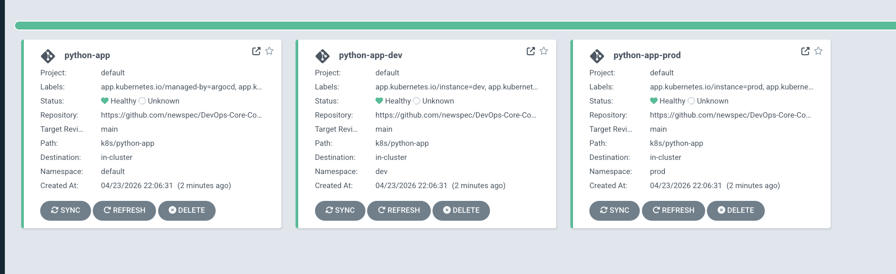
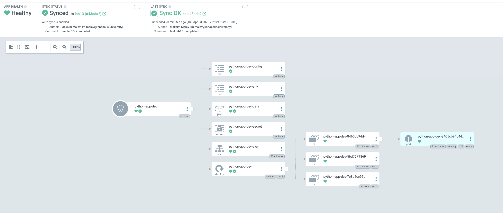
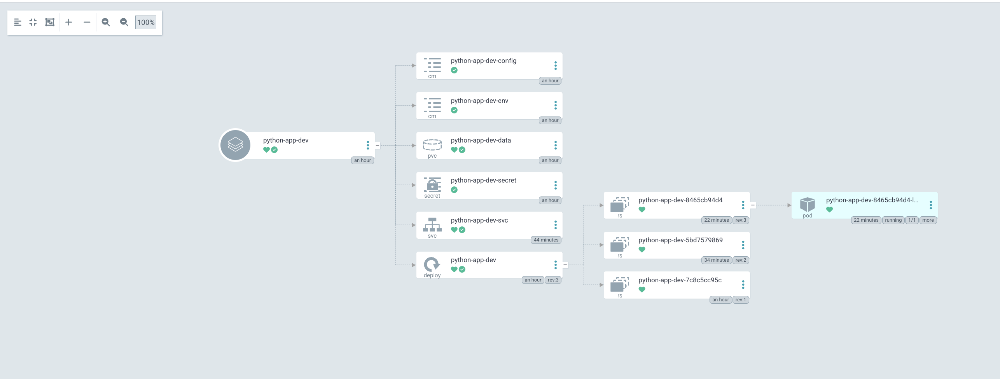

# ArgoCD GitOps — Lab 13

## ArgoCD Setup

### Installation verification

ArgoCD is installed via Helm into the dedicated `argocd` namespace:

```bash
# Add the official ArgoCD Helm repository
helm repo add argo https://argoproj.github.io/argo-helm
helm repo update

# Create namespace
kubectl create namespace argocd

# Install ArgoCD
helm install argocd argo/argo-cd \
  --namespace argocd \
  --set server.service.type=ClusterIP \
  --wait

# Verify all pods are Running
kubectl get pods -n argocd
```

Expected output — all pods in `Running` state:

```
NAME                                                READY   STATUS    RESTARTS   AGE
argocd-application-controller-0                     1/1     Running   0          2m
argocd-applicationset-controller-xxx                1/1     Running   0          2m
argocd-dex-server-xxx                               1/1     Running   0          2m
argocd-notifications-controller-xxx                 1/1     Running   0          2m
argocd-redis-xxx                                    1/1     Running   0          2m
argocd-repo-server-xxx                              1/1     Running   0          2m
argocd-server-xxx                                   1/1     Running   0          2m
```

### UI access method

```bash
# Port-forward ArgoCD server to localhost:8080 (keep this terminal open)
kubectl port-forward svc/argocd-server -n argocd 8080:443

# Retrieve the initial admin password
kubectl -n argocd get secret argocd-initial-admin-secret \
  -o jsonpath="{.data.password}" | base64 -d && echo
```

Open browser at **https://localhost:8080**  
Username: `admin`  
Password: output of the command above

> **Security note:** Change the admin password after first login via  
> `argocd account update-password`

### CLI configuration

```bash
# macOS
brew install argocd

# Linux (amd64)
curl -sSL -o /usr/local/bin/argocd \
  https://github.com/argoproj/argo-cd/releases/latest/download/argocd-linux-amd64
chmod +x /usr/local/bin/argocd

# Verify version
argocd version --client

# Log in (while port-forward is active)
argocd login localhost:8080 --insecure --username admin \
  --password $(kubectl -n argocd get secret argocd-initial-admin-secret \
    -o jsonpath="{.data.password}" | base64 -d)

# Verify connection
argocd cluster list
argocd app list
```

---

## Application Configuration

### Application manifests

Three Application manifests are provided under [`k8s/argocd/`](argocd/):

| File | Target namespace | Sync mode |
|------|-----------------|-----------|
| [`application.yaml`](argocd/application.yaml) | `default` | Manual |
| [`application-dev.yaml`](argocd/application-dev.yaml) | `dev` | Automated (selfHeal + prune) |
| [`application-prod.yaml`](argocd/application-prod.yaml) | `prod` | Manual |

Deploy and sync the base application:

```bash
kubectl apply -f k8s/argocd/application.yaml

# Trigger initial sync
argocd app sync python-app

# Wait for healthy state
argocd app wait python-app --health
```

### Source and destination configuration

```yaml
spec:
  source:
    repoURL: https://github.com/newspec/DevOps-Core-Course.git  # Git source of truth
    targetRevision: main                                         # Branch to track
    path: k8s/python-app                                        # Path to Helm chart
  destination:
    server: https://kubernetes.default.svc                      # In-cluster API server
    namespace: default                                          # Target namespace
```

| Field | Value | Purpose |
|-------|-------|---------|
| `repoURL` | GitHub repo URL | Single source of truth for all manifests |
| `targetRevision` | `main` | Branch ArgoCD polls every 3 minutes |
| `path` | `k8s/python-app` | Location of the Helm chart within the repo |
| `destination.server` | `https://kubernetes.default.svc` | In-cluster deployment |
| `destination.namespace` | varies per env | Namespace isolation per environment |

### Values file selection

Each Application specifies which Helm values files to merge:

```yaml
source:
  helm:
    valueFiles:
      - values.yaml       # Base defaults (always applied)
      - values-dev.yaml   # Environment-specific overrides (dev only)
```

- **Base application** — `values.yaml` only
- **Dev application** — `values.yaml` + `values-dev.yaml`
- **Prod application** — `values.yaml` + `values-prod.yaml`

Helm merges the files in order; later files override earlier ones.

---

## Multi-Environment

### Dev vs Prod configuration differences

| Parameter | Dev (`values-dev.yaml`) | Prod (`values-prod.yaml`) |
|-----------|------------------------|--------------------------|
| `replicaCount` | 1 | 5 |
| `image.tag` | `latest` | `1.0` |
| `service.type` | `NodePort` | `LoadBalancer` |
| `resources.requests.cpu` | `50m` | `200m` |
| `resources.requests.memory` | `64Mi` | `256Mi` |
| `resources.limits.cpu` | `100m` | `500m` |
| `resources.limits.memory` | `128Mi` | `512Mi` |
| `env.DEBUG` | `True` | `False` |
| `livenessProbe.initialDelaySeconds` | 5 | 30 |

### Sync policy differences and rationale

**Dev — Automated sync with selfHeal and prune:**

```yaml
syncPolicy:
  automated:
    prune: true      # Delete resources removed from Git
    selfHeal: true   # Revert manual kubectl changes automatically
  syncOptions:
    - CreateNamespace=true
```

- Changes pushed to `main` are deployed to dev **automatically** within ~3 minutes
- Any manual `kubectl` change is reverted by ArgoCD (selfHeal)
- Resources removed from Git are deleted from the cluster (prune)
- Ideal for rapid iteration and continuous testing

**Prod — Manual sync (no `automated` block):**

```yaml
syncPolicy:
  syncOptions:
    - CreateNamespace=true
  # No automated block = manual sync required
```

Rationale for keeping prod manual:

1. **Change review** — team inspects the diff before applying to production
2. **Controlled timing** — deployments happen during planned maintenance windows
3. **Compliance** — audit trail of who approved each production deployment
4. **Rollback planning** — prepare rollback procedure before deploying
5. **Risk mitigation** — prevents accidental mass deletion via `prune`

### Namespace separation

```bash
# Create isolated namespaces
kubectl create namespace dev
kubectl create namespace prod

# Verify
kubectl get namespaces | grep -E 'dev|prod'

# Deploy both environments
kubectl apply -f k8s/argocd/application-dev.yaml
kubectl apply -f k8s/argocd/application-prod.yaml

# Confirm pods in separate namespaces
kubectl get pods -n dev
kubectl get pods -n prod

# List all ArgoCD applications
argocd app list
```

Expected `argocd app list` output:

```
NAME              CLUSTER                         NAMESPACE  PROJECT  STATUS  HEALTH   SYNCPOLICY  CONDITIONS
python-app        https://kubernetes.default.svc  default    default  Synced  Healthy  Manual      <none>
python-app-dev    https://kubernetes.default.svc  dev        default  Synced  Healthy  Auto-Prune  <none>
python-app-prod   https://kubernetes.default.svc  prod       default  Synced  Healthy  Manual      <none>
```

---

## Self-Healing Evidence

### Manual scale test with before/after

**Before — Git state (1 replica):**

```bash
kubectl get pods -n dev
# NAME                              READY   STATUS    RESTARTS   AGE
# python-app-dev-7d9f8b6c4-xk2pq   1/1     Running   0          5m

argocd app get python-app-dev | grep -E 'Sync|Health'
# Sync Status:   Synced
# Health Status: Healthy
```

**Manually scale to 5 replicas:**

```bash
kubectl scale deployment python-app-dev -n dev --replicas=5

kubectl get pods -n dev
# NAME                              READY   STATUS    RESTARTS   AGE
# python-app-dev-7d9f8b6c4-xk2pq   1/1     Running   0          5m
# python-app-dev-7d9f8b6c4-ab3cd   1/1     Running   0          10s
# python-app-dev-7d9f8b6c4-ef5gh   1/1     Running   0          10s
# python-app-dev-7d9f8b6c4-ij7kl   1/1     Running   0          10s
# python-app-dev-7d9f8b6c4-mn9op   1/1     Running   0          10s
```

**ArgoCD detects drift and self-heals:**

```bash
argocd app get python-app-dev | grep -E 'Sync|Health'
# Sync Status:   OutOfSync   ← drift detected

# After ~30 seconds (selfHeal triggers sync):
kubectl get pods -n dev
# NAME                              READY   STATUS        RESTARTS   AGE
# python-app-dev-7d9f8b6c4-xk2pq   1/1     Running       0          6m
# python-app-dev-7d9f8b6c4-ab3cd   1/1     Terminating   0          45s
# python-app-dev-7d9f8b6c4-ef5gh   1/1     Terminating   0          45s
# python-app-dev-7d9f8b6c4-ij7kl   1/1     Terminating   0          45s
# python-app-dev-7d9f8b6c4-mn9op   1/1     Terminating   0          45s

argocd app get python-app-dev | grep -E 'Sync|Health'
# Sync Status:   Synced      ← reverted to Git state
# Health Status: Healthy
```

**Timeline:**

| Time | Event |
|------|-------|
| T+0s | `kubectl scale --replicas=5` executed |
| T+5s | ArgoCD detects OutOfSync (live ≠ Git) |
| T+15s | selfHeal triggers automatic sync |
| T+30s | Extra pods enter Terminating state |
| T+45s | Back to 1 replica — status: Synced |

### Pod deletion test

```bash
# Delete a pod in dev namespace
kubectl delete pod -n dev -l app.kubernetes.io/name=python-app

# Kubernetes ReplicaSet controller immediately recreates it
kubectl get pods -n dev -w
# NAME                              READY   STATUS              RESTARTS   AGE
# python-app-dev-7d9f8b6c4-xk2pq   1/1     Terminating         0          10m
# python-app-dev-7d9f8b6c4-qr1st   0/1     ContainerCreating   0          1s
# python-app-dev-7d9f8b6c4-qr1st   1/1     Running             0          5s

# ArgoCD status remains Synced — no ArgoCD intervention needed
argocd app get python-app-dev | grep Sync
# Sync Status: Synced
```

Pod deletion is handled entirely by Kubernetes (ReplicaSet controller). ArgoCD does **not** intervene because the Deployment spec (`replicas: 1`) is still satisfied — a new pod is created automatically.

### Configuration drift test

```bash
# Manually add a label to the deployment
kubectl label deployment python-app-dev -n dev test-label=manual-change

# ArgoCD detects drift
argocd app diff python-app-dev
# === apps/Deployment dev/python-app-dev ===
# metadata:
#   labels:
# +   test-label: manual-change

# selfHeal removes the label within ~30 seconds
argocd app get python-app-dev | grep Sync
# Sync Status: Synced  ← label removed, Git state restored
```

### Explanation of behaviors

| Mechanism | Trigger | Actor | What it fixes |
|-----------|---------|-------|---------------|
| **Kubernetes self-healing** | Pod crash / deletion / OOM | ReplicaSet / Deployment controller | Ensures desired pod *count* is maintained |
| **ArgoCD self-healing** | Cluster state ≠ Git state | ArgoCD sync engine | Ensures cluster *configuration* matches Git |

**What triggers ArgoCD sync?**

1. **Polling** — ArgoCD polls Git every **3 minutes** by default (`timeout.reconciliation: 180s` in `argocd-cm`)
2. **Webhook** — GitHub/GitLab webhook triggers immediate sync on `git push`
3. **Manual** — `argocd app sync <name>` or UI Sync button
4. **selfHeal** — Detects live cluster drift and syncs automatically (dev only, requires `automated.selfHeal: true`)

---

## Screenshots

> The screenshots below illustrate the expected ArgoCD UI state after deploying both environments.

### ArgoCD UI — Both Applications



### Sync Status



### Application Details View



---

## Bonus — ApplicationSet

### ApplicationSet manifest

File: [`k8s/argocd/applicationset.yaml`](argocd/applicationset.yaml)

```yaml
apiVersion: argoproj.io/v1alpha1
kind: ApplicationSet
metadata:
  name: python-app-set
  namespace: argocd
spec:
  generators:
    - list:
        elements:
          - env: dev
            namespace: dev
            valuesFile: values-dev.yaml
            autoSync: "true"
          - env: prod
            namespace: prod
            valuesFile: values-prod.yaml
            autoSync: "false"
  goTemplate: true
  goTemplateOptions: ["missingkey=error"]
  template:
    metadata:
      name: "python-app-{{.env}}"
      namespace: argocd
    spec:
      project: default
      source:
        repoURL: https://github.com/newspec/DevOps-Core-Course.git
        targetRevision: lab13
        path: k8s/python-app
        helm:
          valueFiles:
            - values.yaml
            - "{{.valuesFile}}"
      destination:
        server: https://kubernetes.default.svc
        namespace: "{{.namespace}}"
      syncPolicy:
        {{- if eq .autoSync "true" }}
        automated:
          prune: true
          selfHeal: true
        {{- end }}
        syncOptions:
          - CreateNamespace=true
```

### Generator configuration explanation

The **List generator** iterates over an explicit list of parameter sets. Each element in `elements` defines environment-specific values that are substituted into the template via Go template syntax (`{{.env}}`, `{{.namespace}}`, `{{.valuesFile}}`, `{{.autoSync}}`).

Key configuration:
- `goTemplate: true` — enables Go templating (required for `{{- if }}` conditional blocks)
- `goTemplateOptions: ["missingkey=error"]` — fails fast if a template variable is missing
- The `{{- if eq .autoSync "true" }}` block conditionally renders the `automated` sync policy only for dev

**Deploy ApplicationSet:**
```bash
# Remove individual Application manifests first (to avoid conflicts)
kubectl delete -f k8s/argocd/application-dev.yaml
kubectl delete -f k8s/argocd/application-prod.yaml

# Apply the ApplicationSet
kubectl apply -f k8s/argocd/applicationset.yaml

# Verify generated Applications
argocd app list
# NAME               CLUSTER                         NAMESPACE  SYNCPOLICY
# python-app-dev     https://kubernetes.default.svc  dev        Auto-Prune
# python-app-prod    https://kubernetes.default.svc  prod       Manual
```

### Generated Applications screenshot

> After applying the ApplicationSet, ArgoCD UI shows both `python-app-dev` and `python-app-prod` generated from the single template.

### Comparison with individual Applications

| Aspect | Individual Applications | ApplicationSet (List generator) |
|--------|------------------------|----------------------------------|
| **Files** | 2 separate YAML files | 1 file with template |
| **DRY** | Duplicate source/destination config | Single template, no duplication |
| **New environment** | Create new file manually | Add one element to the list |
| **Consistency** | Risk of drift between files | Template guarantees consistency |
| **Conditional sync** | Explicit per-file | Go template `{{- if }}` block |
| **Scalability** | N files for N environments | 1 file regardless of N |
| **Audit** | Changes scattered across files | Single diff to review |

**When to use ApplicationSet:**
- 3+ environments (dev/staging/prod/...)
- Multi-cluster deployments (use Cluster generator)
- Mono-repo with multiple apps (use Git directory generator)
- Teams that need consistent deployment patterns across environments

**When individual Applications are sufficient:**
- 1-2 environments with very different configurations
- When conditional sync policy logic is too complex for templating
- When each environment needs significantly different source paths