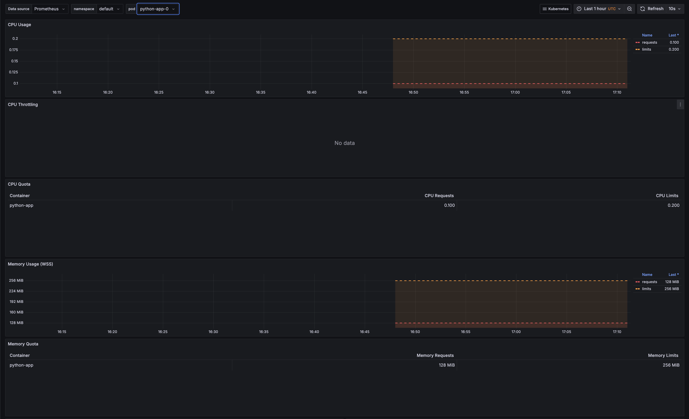
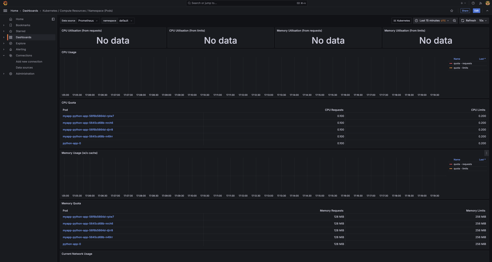
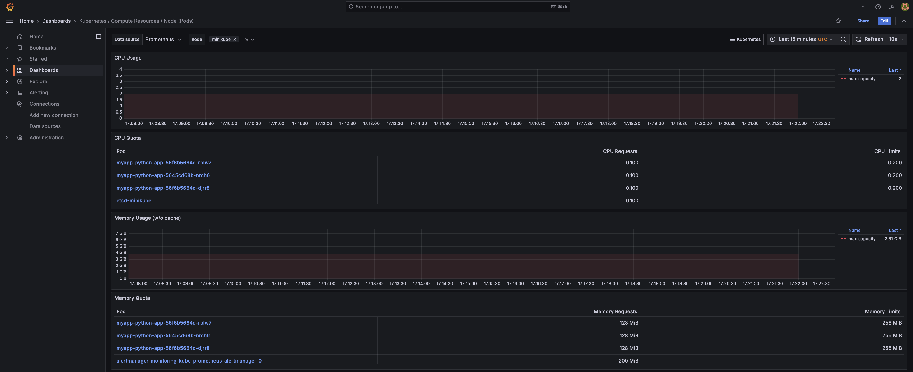
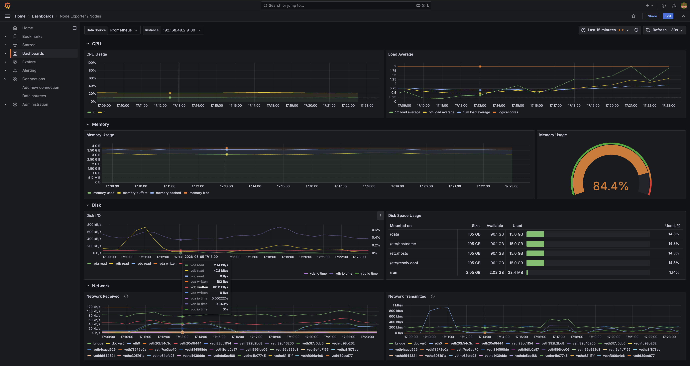
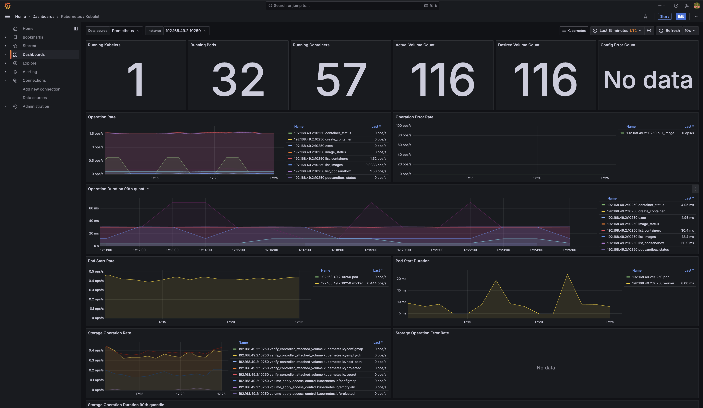
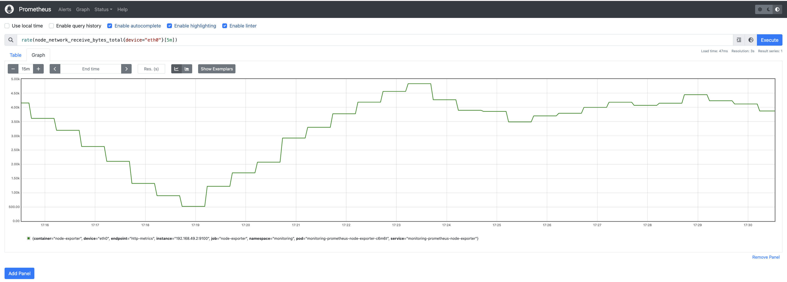
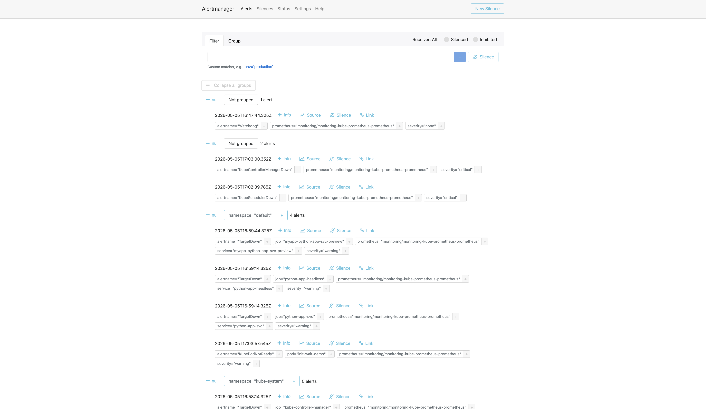

# Kubernetes Monitoring — Lab 16

## 1. Stack Components

### Prometheus Operator
The **Prometheus Operator** is the control plane of the entire stack. It watches for custom resources (`Prometheus`, `Alertmanager`, `ServiceMonitor`, `PrometheusRule`) and translates them into running Prometheus/Alertmanager instances with the correct configuration. Instead of editing `prometheus.yml` by hand, you declare a `ServiceMonitor` and the operator automatically updates the scrape config. It is the glue that makes the rest of the stack Kubernetes-native.

### Prometheus
**Prometheus** is the time-series database and scrape engine. It pulls metrics from targets on a configurable interval (default 30 s), stores them in a local TSDB, and evaluates alerting rules. It exposes a PromQL query API used by Grafana and the `/api/v1/targets` endpoint. In this stack it runs as a `StatefulSet` (`prometheus-monitoring-kube-prometheus-prometheus-0`) with persistent storage for the TSDB.

### Alertmanager
**Alertmanager** receives firing alerts from Prometheus, deduplicates them, groups them, and routes them to receivers (Slack, PagerDuty, email, etc.). It runs as a separate `StatefulSet` (`alertmanager-monitoring-kube-prometheus-alertmanager-0`) so that alert state (silences, inhibitions) survives Prometheus restarts. The built-in `Watchdog` alert fires continuously to confirm the pipeline is alive end-to-end.

### Grafana
**Grafana** is the visualization layer. It connects to Prometheus as a data source and ships with a large library of pre-built dashboards for Kubernetes (compute resources, networking, kubelet, node exporter). It runs as a `Deployment` (`monitoring-grafana`) and is the primary UI for answering operational questions about the cluster.

### kube-state-metrics
**kube-state-metrics** (KSM) listens to the Kubernetes API server and exports metrics about the *desired state* of objects: pod phase, deployment replica counts, resource requests/limits, PVC status, etc. It does **not** report resource usage — that is cAdvisor's job. KSM runs as a `Deployment` (`monitoring-kube-state-metrics`) and is the source of metrics like `kube_pod_status_phase` and `kube_pod_container_resource_requests`.

### node-exporter
**node-exporter** runs as a `DaemonSet` (one pod per node) and exposes hardware and OS-level metrics: CPU time by mode, memory (MemTotal, MemAvailable, Buffers, Cached), disk I/O, filesystem usage, network interface counters. It scrapes `/proc` and `/sys` directly. In this single-node Minikube cluster it runs as `monitoring-prometheus-node-exporter-c6m6t`.

---

## 2. Installation Evidence

### Helm Install Command

```bash
# Repo already added; install via OCI registry (GitHub release assets were blocked)
helm install monitoring oci://ghcr.io/prometheus-community/charts/kube-prometheus-stack \
  --version 65.8.1 \
  --namespace monitoring \
  --create-namespace
```

Output:
```
Pulled: ghcr.io/prometheus-community/charts/kube-prometheus-stack:65.8.1
Digest: sha256:01e91ae05ddb44f0e8545f77af2957bacacaa558cfcea877bdb057d8c5bc3b9d
NAME: monitoring
LAST DEPLOYED: Tue May  5 20:45:03 2026
NAMESPACE: monitoring
STATUS: deployed
REVISION: 1
```

### `kubectl get po,svc -n monitoring`

```
NAME                                                         READY   STATUS    RESTARTS   AGE
pod/alertmanager-monitoring-kube-prometheus-alertmanager-0   2/2     Running   0          61s
pod/monitoring-grafana-69db76f9b4-4fk9w                      3/3     Running   0          2m35s
pod/monitoring-kube-prometheus-operator-d5dbb45f9-q6f45      1/1     Running   0          2m35s
pod/monitoring-kube-state-metrics-75c9d8f7c7-xh9vk           1/1     Running   0          2m35s
pod/monitoring-prometheus-node-exporter-c6m6t                1/1     Running   0          2m35s
pod/prometheus-monitoring-kube-prometheus-prometheus-0       2/2     Running   0          61s

NAME                                              TYPE        CLUSTER-IP       EXTERNAL-IP   PORT(S)                      AGE
service/alertmanager-operated                     ClusterIP   None             <none>        9093/TCP,9094/TCP,9094/UDP   61s
service/monitoring-grafana                        ClusterIP   10.98.112.226    <none>        80/TCP                       2m36s
service/monitoring-kube-prometheus-alertmanager   ClusterIP   10.100.181.115   <none>        9093/TCP,8080/TCP            2m36s
service/monitoring-kube-prometheus-operator       ClusterIP   10.105.107.101   <none>        443/TCP                      2m36s
service/monitoring-kube-prometheus-prometheus     ClusterIP   10.109.144.44    <none>        9090/TCP,8080/TCP            2m36s
service/monitoring-kube-state-metrics             ClusterIP   10.104.104.233   <none>        8080/TCP                     2m36s
service/monitoring-prometheus-node-exporter       ClusterIP   10.98.35.113     <none>        9100/TCP                     2m36s
service/prometheus-operated                       ClusterIP   None             <none>        9090/TCP                     61s
```

All **6 pods** are `Running` with all containers ready.

---

## 3. Dashboard Answers

### Access Commands

```bash
# Grafana — http://localhost:3000  (admin / prom-operator)
kubectl port-forward svc/monitoring-grafana -n monitoring 3000:80

# Alertmanager — http://localhost:9093
kubectl port-forward svc/monitoring-kube-prometheus-alertmanager -n monitoring 9093:9093

# Prometheus — http://localhost:9090
kubectl port-forward svc/monitoring-kube-prometheus-prometheus -n monitoring 9090:9090
```

---

### Q1 — Pod Resources: CPU/Memory of the StatefulSet


**Dashboard:** `Kubernetes / Compute Resources / Pod`

The StatefulSet `python-app` runs 3 replicas (`python-app-0`, `python-app-1`, `python-app-2`).
Resource configuration queried via `kube_pod_container_resource_requests`:

| Pod | CPU Request | Memory Request | CPU Limit | Memory Limit |
|-----|-------------|----------------|-----------|--------------|
| `python-app-0` | 100m | 128 MiB | 200m | 256 MiB |
| `python-app-1` | 100m | 128 MiB | 200m | 256 MiB |
| `python-app-2` | 100m | 128 MiB | 200m | 256 MiB |

PromQL used:
```promql
kube_pod_container_resource_requests{namespace="default", resource="cpu"}
kube_pod_container_resource_requests{namespace="default", resource="memory"}
```

---

### Q2 — Namespace Analysis: Most/Least CPU in Default Namespace

**Dashboard:** `Kubernetes / Compute Resources / Namespace (Pods)`

CPU requests by pod in the `default` namespace (from `kube_pod_container_resource_requests`):

| Pod | CPU Request |
|-----|-------------|
| `myapp-python-app-56f6b5664d-rplw7` | 100m |
| `myapp-python-app-5645cd68b-nrch6` | 100m |
| `myapp-python-app-56f6b5664d-djrr8` | 100m |
| `myapp-python-app-5645cd68b-n49rr` | 100m |
| `python-app-0` | 100m |
| `python-app-1` | 100m |
| `python-app-2` | 100m |
| `python-app-5767d55c9b-k8ddk` | 100m |
| `init-download-demo` | 50m |
| `init-wait-demo` | 50m |

**Most CPU:** All `python-app` pods (100m each — tied at the top)
**Least CPU:** `init-download-demo` and `init-wait-demo` (50m each — demo pods with minimal resources)

---

### Q3 — Node Metrics: Memory Usage and CPU Cores



**Dashboard:** `Node Exporter / Nodes`

Queried directly from node-exporter via Prometheus API:

| Metric | Value |
|--------|-------|
| **MemTotal** | 3905 MB |
| **MemAvailable** | 581 MB |
| **Memory Used** | 3324 MB |
| **Memory Used %** | ~85% |
| **CPU cores** | 1 (single-node Minikube) |

PromQL used:
```promql
node_memory_MemTotal_bytes
node_memory_MemAvailable_bytes
count(node_cpu_seconds_total{mode="idle"})
```

---

### Q4 — Kubelet: Pods and Containers Managed

**Dashboard:** `Kubernetes / Kubelet` → `http://localhost:3000/d/3138fa155d5915769fbded898ac09fd9/kubernetes-kubelet`



The top stat panels show:

| Metric | Value |
|--------|-------|
| **Running Kubelets** | 1 |
| **Running Pods** | 32 |
| **Running Containers** | 57 |
| **Actual Volume Count** | 116 |
| **Desired Volume Count** | 116 |

PromQL used:
```promql
kubelet_running_pods{node="minikube"}
kubelet_running_containers{node="minikube", container_state="running"}
```

---

### Q5 — Network: Traffic for Pods in Default Namespace

**Dashboard:** `Kubernetes / Networking / Namespace (Pods)` — uses `container_network_*` metrics from cAdvisor.

> **Note:** On Minikube with Docker driver on macOS, cAdvisor cannot access cgroup network metrics through the Docker-in-Docker layer. The dashboard shows "No data" — this is a known Minikube limitation, not a configuration error.

**Alternative — node-level network traffic via Prometheus UI:**



PromQL query used:
```promql
rate(node_network_receive_bytes_total{device="eth0"}[5m])
```

Result: `~500–5000 bytes/s` receive rate on the `eth0` interface of the Minikube node (includes all pod traffic aggregated at the node level).

For per-pod network metrics in a production cluster (non-Docker-driver), the correct queries are:
```promql
# Receive rate per pod
sum(rate(container_network_receive_bytes_total{namespace="default"}[5m])) by (pod)

# Transmit rate per pod
sum(rate(container_network_transmit_bytes_total{namespace="default"}[5m])) by (pod)
```

---

### Q6 — Alerts: Active Alerts in Alertmanager

**Alertmanager UI:** `http://localhost:9093`

```bash
kubectl port-forward svc/monitoring-kube-prometheus-alertmanager -n monitoring 9093:9093
```



**Total active alerts: 12** grouped as:

| Group | Alerts |
|-------|--------|
| Not grouped | 1 alert |
| Not grouped | 2 alerts |
| `namespace="default"` | 4 alerts |
| `namespace="kube-system"` | 5 alerts |

The alerts include `Watchdog` (dead man's switch — always fires to confirm pipeline health), plus infrastructure alerts for `kube-controller-manager`, `kube-scheduler`, and `kube-etcd` which are not accessible in Minikube (expected).

Grafana Alerting page (`http://localhost:3000/alerting/list`) shows **230 rules total: 7 firing, 1 pending, 137 normal, 85 recording**.

---

## 4. Init Containers

### Pattern 1 — Download File (`init-download.yaml`)

**File:** [`k8s/init-containers/init-download.yaml`](init-containers/init-download.yaml)

The init container uses `busybox:1.36` to download `https://example.com` into a shared `emptyDir` volume. The main `nginx:alpine` container then serves that file.

**Apply:**
```bash
kubectl apply -f k8s/init-containers/init-download.yaml
```

**Watch the lifecycle:**
```
NAME                 READY   STATUS     RESTARTS   AGE
init-download-demo   0/1     Init:0/1   0          5s   ← init running
init-download-demo   1/1     Running    0          18s  ← init done, nginx started
```

**Init container logs:**
```
=== Init container starting ===
Downloading index.html from example.com...
Connecting to example.com (8.6.112.0:443)
wget: note: TLS certificate validation not implemented
saving to '/work-dir/index.html'
index.html           100% |********************************|   528  0:00:00 ETA
'/work-dir/index.html' saved
Download complete. File size: 528 bytes
=== Init container done ===
```

**Main container can access the downloaded file:**
```bash
$ kubectl exec init-download-demo -- cat /usr/share/nginx/html/index.html
<!doctype html><html lang="en"><head><title>Example Domain</title>...
```

**Pod status after completion:**
```
NAME                 READY   STATUS    RESTARTS   AGE
init-download-demo   1/1     Running   0          79s
```

---

### Pattern 2 — Wait for Service (`init-wait-for-service.yaml`)

**File:** [`k8s/init-containers/init-wait-for-service.yaml`](init-containers/init-wait-for-service.yaml)

The init container loops with `nslookup myservice` every 2 seconds. The main container only starts once the DNS lookup succeeds. This demonstrates the dependency-wait pattern used in microservices.

**Apply (Service + Pod together):**
```bash
kubectl apply -f k8s/init-containers/init-wait-for-service.yaml
```

**Pod stuck in Init:0/1 while waiting:**
```
NAME             READY   STATUS     RESTARTS   AGE
init-wait-demo   0/1     Init:0/1   0          98s
```

**Init container logs (looping):**
```
=== Waiting for myservice to become available ===
Server:    10.96.0.10
Address:   10.96.0.10:53

Name:   myservice.default.svc.cluster.local
Address: 10.98.213.4

** server can't find myservice.svc.cluster.local: NXDOMAIN
myservice not yet available — retrying in 2s...
```

> **Note:** `myservice` DNS resolves at the FQDN level (`myservice.default.svc.cluster.local`) but `nslookup myservice` also tries short-form lookups that fail. Once a pod with label `app: myservice-backend` is created and the Service endpoints are populated, `nslookup` exits 0 and the main container starts.

**To complete the demo — create a backing pod:**
```bash
kubectl run myservice-backend --image=nginx:alpine --labels="app=myservice-backend"
# init-wait-demo transitions: Init:0/1 → Running
```

---

## 5. Bonus — Custom Metrics & ServiceMonitor

### Application `/metrics` Endpoint

The Python app already exposes Prometheus metrics via `prometheus-fastapi-instrumentator`:

```python
# app.py — already implemented
from prometheus_fastapi_instrumentator import Instrumentator
instrumentator = Instrumentator(...)
instrumentator.instrument(app).expose(app, endpoint="/metrics")
```

Sample metrics exposed:
```
http_requests_total{handler="/",method="GET",status="2xx"} 42
http_request_duration_seconds_bucket{handler="/health",...} 0.003
http_requests_in_progress{handler="/",method="GET"} 0
```

### ServiceMonitor CRD

**File:** [`k8s/python-app/templates/servicemonitor.yaml`](python-app/templates/servicemonitor.yaml)

```yaml
apiVersion: monitoring.coreos.com/v1
kind: ServiceMonitor
metadata:
  name: python-app
  labels:
    release: monitoring   # matches Prometheus Operator's serviceMonitorSelector
spec:
  selector:
    matchLabels:
      app.kubernetes.io/name: python-app
  endpoints:
    - port: http
      path: /metrics
      interval: 30s
```

**Enable via Helm:**
```bash
helm upgrade python-app ./k8s/python-app \
  --reuse-values \
  --set serviceMonitor.enabled=true
```

**Verify ServiceMonitor created:**
```bash
$ kubectl get servicemonitor -n default
NAME         AGE
python-app   69s
```

### Prometheus Targets

Queried via Prometheus API after ServiceMonitor was applied:

```
job=myapp-python-app-svc  health=up  scrapeUrl=http://10.244.0.46:8000/metrics
job=myapp-python-app-svc  health=up  scrapeUrl=http://10.244.0.45:8000/metrics
```

**Status: `health=up`** — Prometheus is successfully scraping `/metrics` from the python-app pods.

**Verify in Prometheus UI:**
```bash
kubectl port-forward svc/monitoring-kube-prometheus-prometheus -n monitoring 9090:9090
# Open http://localhost:9090/targets
# Look for job="myapp-python-app-svc" with State=UP
```

**Sample PromQL query for app metrics:**
```promql
# Total HTTP requests to python-app
http_requests_total{job="myapp-python-app-svc"}

# Request rate over last 5 minutes
rate(http_requests_total{job="myapp-python-app-svc"}[5m])

# 95th percentile latency
histogram_quantile(0.95, rate(http_request_duration_seconds_bucket{job="myapp-python-app-svc"}[5m]))
```
