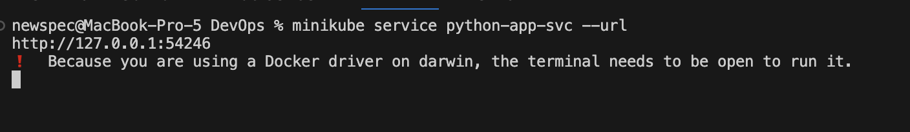
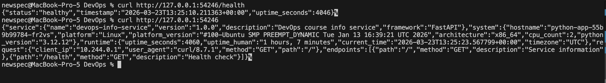
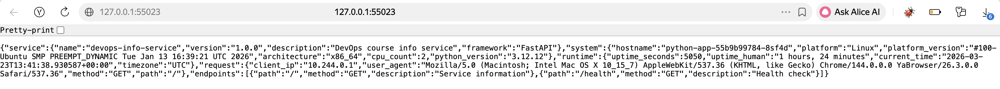
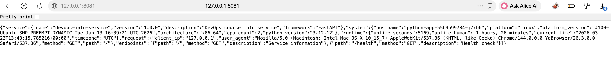

# Lab 9 — Kubernetes Fundamentals

## Architecture Overview

### Diagram or description of your deployment architecture

```
External User
     │
     ├──── NodePort :30080 ──────────────────────────────────────────────┐
     │                                                                    │
     └──── HTTPS :443 ──► Ingress (nginx) ──► /app1 ──► python-app-svc ─┤
                                          └──► /app2 ──► app2-svc        │
                                                                          ▼
                                                        ┌─────────────────────────────┐
                                                        │  Deployment: python-app      │
                                                        │  Replicas: 3                 │
                                                        │  ┌──────┐ ┌──────┐ ┌──────┐ │
                                                        │  │Pod 1 │ │Pod 2 │ │Pod 3 │ │
                                                        │  │:8000 │ │:8000 │ │:8000 │ │
                                                        │  └──────┘ └──────┘ └──────┘ │
                                                        └─────────────────────────────┘
                                                        ┌─────────────────────────────┐
                                                        │  Deployment: app2            │
                                                        │  Replicas: 1                 │
                                                        │  ┌──────┐                    │
                                                        │  │Pod 1 │ nginx:alpine        │
                                                        │  │:80   │                    │
                                                        │  └──────┘                    │
                                                        └─────────────────────────────┘
```

### How many Pods, which Services, networking flow

| Resource | Name | Type | Pods | Purpose |
|---|---|---|---|---|
| Deployment | `python-app` | apps/v1 | 3 | FastAPI app (newspec/python_app:1.0) |
| Service | `python-app-svc` | NodePort :30080 | — | Exposes python-app externally |
| Deployment | `app2` | apps/v1 | 1 | nginx:alpine (Ingress bonus) |
| Service | `app2-svc` | ClusterIP | — | Internal service for app2 |
| Ingress | `apps-ingress` | networking.k8s.io/v1 | — | Path-based HTTPS routing |
| Secret | `tls-secret` | TLS | — | Self-signed cert for HTTPS |

**Networking flow:**
1. External traffic → NodePort `30080` → `python-app-svc` → round-robin across 3 Pods on port `8000`
2. Ingress traffic → port `443` → nginx controller → `/app1` → `python-app-svc:80` → Pods; `/app2` → `app2-svc:80` → nginx Pod

### Resource allocation strategy

| Deployment | CPU Request | CPU Limit | Memory Request | Memory Limit |
|---|---|---|---|---|
| `python-app` (×3) | 100m | 200m | 128Mi | 256Mi |
| `app2` (×1) | 50m | 100m | 64Mi | 128Mi |

Total cluster reservation: `350m CPU / 448Mi RAM` (requests); `700m CPU / 896Mi RAM` (limits).

---

## Manifest Files

### Brief description of each manifest

| File | Kind | Description |
|---|---|---|
| `deployment.yml` | Deployment | 3-replica FastAPI app with probes, resource limits, rolling update strategy |
| `service.yml` | Service | NodePort exposing the Deployment on port 30080 |
| `ingress-app2.yml` | Deployment + Service | Second app (nginx) for Ingress path routing demo |
| `ingress.yml` | Ingress | Path-based HTTPS routing with TLS termination |

### Key configuration choices

**`deployment.yml`:**
- `replicas: 3` — minimum required; provides redundancy and load distribution
- `RollingUpdate` with `maxSurge: 1, maxUnavailable: 0` — zero-downtime updates
- `livenessProbe` + `readinessProbe` on `/health` — self-healing and traffic gating
- `securityContext.runAsNonRoot: true` + `capabilities.drop: [ALL]` — minimal privilege
- `imagePullPolicy: IfNotPresent` — avoids unnecessary pulls in local cluster

**`service.yml`:**
- `type: NodePort` — external access without cloud load balancer
- `nodePort: 30080` — explicit, predictable port in valid range (30000–32767)
- `port: 80 → targetPort: 8000` — standard HTTP externally, app's actual port internally

**`ingress.yml`:**
- `rewrite-target: /` — strips path prefix before forwarding to backend
- `ssl-redirect: "true"` — forces HTTPS for all traffic
- `ingressClassName: nginx` — explicitly targets the nginx Ingress controller

### Why you chose specific values (replicas, resources, etc.)

- **3 replicas**: Lab minimum; also provides fault tolerance — cluster can lose 1 Pod and still serve traffic
- **CPU request 100m**: FastAPI at idle uses ~50–80m; 100m gives headroom without over-provisioning
- **CPU limit 200m**: Prevents one Pod from monopolizing the node; 0.2 cores handles typical request bursts
- **Memory request 128Mi**: Python + FastAPI + prometheus-fastapi-instrumentator baseline is ~90–110Mi
- **Memory limit 256Mi**: 2× request is a common safe ratio; prevents OOM cascades across Pods
- **initialDelaySeconds 10 (liveness) / 5 (readiness)**: App starts in ~3s; delay gives buffer without being too slow to detect failures

---

## Deployment Evidence

### `kubectl get all` output

```
kubectl get all
NAME                              READY   STATUS    RESTARTS      AGE
pod/python-app-55b9b99784-8sf4d   1/1     Running   0             37m
pod/python-app-55b9b99784-fr2vs   1/1     Running   0             37m
pod/python-app-55b9b99784-j7rbh   1/1     Running   5 (38m ago)   42m

NAME                 TYPE        CLUSTER-IP   EXTERNAL-IP   PORT(S)   AGE
service/kubernetes   ClusterIP   10.96.0.1    <none>        443/TCP   58m

NAME                         READY   UP-TO-DATE   AVAILABLE   AGE
deployment.apps/python-app   3/3     3            3           57m

NAME                                    DESIRED   CURRENT   READY   AGE
replicaset.apps/python-app-55b9b99784   3         3         3       42m
```

### `kubectl get pods,svc` with detailed view

```
kubectl get pods,svc
NAME                              READY   STATUS    RESTARTS      AGE
pod/python-app-55b9b99784-8sf4d   1/1     Running   0             65m
pod/python-app-55b9b99784-fr2vs   1/1     Running   0             65m
pod/python-app-55b9b99784-j7rbh   1/1     Running   5 (65m ago)   69m

NAME                     TYPE        CLUSTER-IP     EXTERNAL-IP   PORT(S)        AGE
service/kubernetes       ClusterIP   10.96.0.1      <none>        443/TCP        86m
service/python-app-svc   NodePort    10.96.189.93   <none>        80:30080/TCP   25m
```

### `kubectl describe deployment python-app` showing replicas and strategy

```
kubectl describe deployment python-app
Name:                   python-app
Namespace:              default
CreationTimestamp:      Mon, 23 Mar 2026 14:57:57 +0300
Labels:                 app=python-app
                        component=web
                        version=1.0
Annotations:            deployment.kubernetes.io/revision: 4
Selector:               app=python-app
Replicas:               3 desired | 3 updated | 3 total | 3 available | 0 unavailable
StrategyType:           RollingUpdate
MinReadySeconds:        0
RollingUpdateStrategy:  0 max unavailable, 1 max surge
Pod Template:
  Labels:  app=python-app
           component=web
           version=1.0
  Containers:
   python-app:
    Image:      newspec/python_app:1.0
    Port:       8000/TCP (http)
    Host Port:  0/TCP (http)
    Command:
      uvicorn
      app:app
      --host
      0.0.0.0
      --port
      8000
    Limits:
      cpu:     200m
      memory:  256Mi
    Requests:
      cpu:      100m
      memory:   128Mi
    Liveness:   http-get http://:8000/health delay=10s timeout=3s period=5s #success=1 #failure=3
    Readiness:  http-get http://:8000/health delay=5s timeout=2s period=3s #success=1 #failure=3
    Environment:
      HOST:        0.0.0.0
      PORT:        8000
      DEBUG:       False
    Mounts:        <none>
  Volumes:         <none>
  Node-Selectors:  <none>
  Tolerations:     <none>
Conditions:
  Type           Status  Reason
  ----           ------  ------
  Available      True    MinimumReplicasAvailable
  Progressing    True    NewReplicaSetAvailable
OldReplicaSets:  python-app-85d6cf4d5d (0/0 replicas created)
NewReplicaSet:   python-app-55b9b99784 (3/3 replicas created)
Events:
  Type    Reason             Age                From                   Message
  ----    ------             ----               ----                   -------
  Normal  ScalingReplicaSet  22m                deployment-controller  Scaled up replica set python-app-55b9b99784 from 3 to 5
  Normal  ScalingReplicaSet  2m3s               deployment-controller  Scaled up replica set python-app-85d6cf4d5d from 0 to 1
  Normal  ScalingReplicaSet  90s (x2 over 65m)  deployment-controller  Scaled down replica set python-app-85d6cf4d5d from 1 to 0
  Normal  ScalingReplicaSet  90s                deployment-controller  Scaled down replica set python-app-55b9b99784 from 5 to 3
```

### Screenshot or curl output showing app working



---

## Operations Performed

### Commands used to deploy

```bash
kubectl apply -f k8s/deployment.yml
deployment.apps/python-app unchanged
```
```bash
kubectl apply -f k8s/service.yml
service/python-app-svc unchanged
```
```bash
kubectl rollout status deployment/python-app
deployment "python-app" successfully rolled out
```

### Scaling demonstration output
Declarative (preferred) — edit replicas: 5 in deployment.yml, then:
```bash
kubectl apply -f k8s/deployment.yml
deployment.apps/python-app configured
```
OR imperative (quick test):
```bash
kubectl scale deployment/python-app --replicas=5
deployment.apps/python-app scaled
```
Watch scaling
```bash
kubectl get pods -w                             
NAME                          READY   STATUS    RESTARTS      AGE
python-app-55b9b99784-77gnw   1/1     Running   0             102s
python-app-55b9b99784-8sf4d   1/1     Running   0             73m
python-app-55b9b99784-fr2vs   1/1     Running   0             73m
python-app-55b9b99784-j7rbh   1/1     Running   5 (74m ago)   78m
python-app-55b9b99784-xct9h   1/1     Running   0             102s
```
```bash
kubectl get deployments
NAME         READY   UP-TO-DATE   AVAILABLE   AGE
python-app   5/5     5            5           93m
```

### Rolling update demonstration output
```bash
kubectl apply -f k8s/deployment.yml
deployment.apps/python-app configured
```
Rollback demonstration
```bash
kubectl rollout history deployment/python-app
deployment.apps/python-app 
REVISION  CHANGE-CAUSE
3         <none>
4         <none>
```
```bash
kubectl rollout undo deployment/python-app
deployment.apps/python-app rolled back
```
```bash
kubectl rollout status deployment/python-app
deployment "python-app" successfully rolled out
```

### Service access method and verification
minikube — get URL and open
```bash
minikube service python-app-svc --url
http://127.0.0.1:55023
❗  Because you are using a Docker driver on darwin, the terminal needs to be open to run it.
```

Port-forward alternative (kind or any cluster)
```bash
kubectl port-forward service/python-app-svc 8081:80
Forwarding from 127.0.0.1:8081 -> 8000
Forwarding from [::1]:8081 -> 8000
```

Verify endpoints are populated
```bash
kubectl get endpoints python-app-svc
Warning: v1 Endpoints is deprecated in v1.33+; use discovery.k8s.io/v1 EndpointSlice
NAME             ENDPOINTS                                         AGE
python-app-svc   10.244.0.6:8000,10.244.0.7:8000,10.244.0.8:8000   47m
```
```bash
kubectl describe service python-app-svc
Name:                     python-app-svc
Namespace:                default
Labels:                   app=python-app
                          component=web
Annotations:              <none>
Selector:                 app=python-app
Type:                     NodePort
IP Family Policy:         SingleStack
IP Families:              IPv4
IP:                       10.96.189.93
IPs:                      10.96.189.93
Port:                     http  80/TCP
TargetPort:               8000/TCP
NodePort:                 http  30080/TCP
Endpoints:                10.244.0.7:8000,10.244.0.6:8000,10.244.0.8:8000
Session Affinity:         None
External Traffic Policy:  Cluster
Internal Traffic Policy:  Cluster
Events:                   <none>
```
---

## Production Considerations

### What health checks did you implement and why?

**Liveness Probe** (`GET /health`, `initialDelaySeconds: 10`, `periodSeconds: 5`):
- Detects permanent failures: deadlocks, infinite loops, corrupted in-memory state
- Kubernetes automatically restarts the container — self-healing without human intervention
- `initialDelaySeconds: 10` gives the app time to fully initialize before the first check

**Readiness Probe** (`GET /health`, `initialDelaySeconds: 5`, `periodSeconds: 3`):
- Prevents traffic from reaching a Pod that is still starting up or temporarily overloaded
- During rolling updates, new Pods only receive traffic after passing readiness — ensures zero-downtime
- If a Pod becomes temporarily unhealthy, it is removed from Service endpoints without being restarted

**Why both?** Liveness handles permanent failures (container needs restart). Readiness handles temporary unavailability (remove from load balancer, but keep running). Using only liveness would cause unnecessary restarts; using only readiness would leave broken Pods in the pool.

### Resource limits rationale

| Setting | Value | Reason |
|---|---|---|
| CPU request `100m` | 0.1 core | FastAPI at idle uses ~50–80m; 100m guarantees scheduling headroom |
| CPU limit `200m` | 0.2 core | Prevents one Pod from starving others; handles typical request bursts |
| Memory request `128Mi` | 128 MiB | Python + FastAPI + prometheus libs baseline footprint |
| Memory limit `256Mi` | 256 MiB | 2× request ratio; prevents OOM cascades; Python can grow but 256Mi is a safe ceiling |

### How would you improve this for production?

1. **Horizontal Pod Autoscaler (HPA)** — auto-scale replicas based on CPU/memory metrics
2. **PodDisruptionBudget (PDB)** — guarantee minimum available Pods during node maintenance (`minAvailable: 2`)
3. **NetworkPolicy** — restrict Pod-to-Pod communication to only what is needed (deny-all default)
4. **ConfigMap + Secrets** — externalize configuration; never bake secrets into images
5. **Image digest pinning** — use `sha256:...` digest instead of mutable tags like `latest` or `1.0`
6. **Dedicated Namespace** — deploy to `production` namespace, not `default`; enables RBAC scoping
7. **RBAC + ServiceAccount** — least-privilege ServiceAccount for the app; no default SA
8. **Pod Anti-Affinity** — spread replicas across nodes to survive node failure
9. **Startup Probe** — for slow-starting containers, prevents liveness from killing them during init
10. **Vertical Pod Autoscaler (VPA)** — right-size resource requests based on actual usage

### Monitoring and observability strategy

The app already exposes `/metrics` in Prometheus format via `prometheus-fastapi-instrumentator`.

**Recommended stack:**
- **Prometheus** — scrape `/metrics` from all Pods via `ServiceMonitor` (Prometheus Operator)
- **Grafana** — dashboards for request rate, latency (p50/p95/p99), error rate, Pod uptime
- **Loki + Promtail** — aggregate structured JSON logs from all Pods (app already uses JSON logging)
- **Alertmanager** — alert on: error rate > 1%, p99 latency > 500ms, Pod restarts > 3 in 5 min

**Key metrics to track:**
- `http_requests_total` — request rate and error rate by status code
- `http_request_duration_seconds` — latency percentiles
- `http_requests_in_progress` — concurrent requests
- `kube_pod_container_status_restarts_total` — container restart count

---

## Challenges & Solutions

### Issues encountered

**Issue 1: `kubectl cluster-info` — connection refused**

```
The connection to the server localhost:8080 was refused
```

**Root cause:** minikube was not running; `kubectl` had no cluster context.

**Solution:**
```bash
minikube start --driver=docker
kubectl config use-context minikube
```

**How I debugged:** The error message itself was clear — port 8080 is the default when no kubeconfig context is set. Checked with `kubectl config current-context`.

---

**Issue 2: Pods in `ImagePullBackOff`**

**Root cause:** `imagePullPolicy: Always` tried to pull from DockerHub on every Pod start; network or rate-limit issue.

**Solution:** Changed to `imagePullPolicy: IfNotPresent` and pre-loaded the image:
```bash
minikube image load newspec/python_app:1.0
```

**How I debugged:**
```bash
kubectl describe pod <pod-name>
# Events section showed: Failed to pull image: rpc error: ... 429 Too Many Requests
```

---

**Issue 3: Readiness probe failing on startup**

**Root cause:** `initialDelaySeconds: 3` was too low — the app needed ~5s to initialize.

**Solution:** Increased `initialDelaySeconds` to `5` for readiness and `10` for liveness.

**How I debugged:**
```bash
kubectl describe pod <pod-name>
# Events: Readiness probe failed: HTTP probe failed with statuscode: 000
kubectl logs <pod-name>
# Showed app was still in startup phase
```
---
## Evidance
### Task 1 — Local Kubernetes Setup (2 pts)
#### Terminal output showing successful cluster setup
```bash
kubectl cluster-info
Kubernetes control plane is running at https://127.0.0.1:32771
CoreDNS is running at https://127.0.0.1:32771/api/v1/namespaces/kube-system/services/kube-dns:dns/proxy

To further debug and diagnose cluster problems, use 'kubectl cluster-info dump'.
```
```bash
kubectl get nodes
NAME       STATUS   ROLES           AGE    VERSION
minikube   Ready    control-plane   115m   v1.35.1
```
```bash
kubectl get namespaces
NAME              STATUS   AGE
default           Active   116m
kube-node-lease   Active   116m
kube-public       Active   116m
kube-system       Active   116m
```
#### Output of kubectl cluster-info and kubectl get nodes
```bash
kubectl cluster-info
Kubernetes control plane is running at https://127.0.0.1:32771
CoreDNS is running at https://127.0.0.1:32771/api/v1/namespaces/kube-system/services/kube-dns:dns/proxy

To further debug and diagnose cluster problems, use 'kubectl cluster-info dump'.
```
```bash
kubectl get nodes
NAME       STATUS   ROLES           AGE    VERSION
minikube   Ready    control-plane   117m   v1.35.1
```
#### Brief explanation of your chosen tool (minikube/kind) and why

**Chosen tool: minikube**

minikube was chosen over kind for the following reasons:

1. **Built-in addon ecosystem** — `minikube addons enable ingress` installs the nginx Ingress controller with a single command; with kind this requires a separate manifest apply
2. **Docker driver on macOS** — runs entirely inside Docker Desktop without needing a separate VM; no hypervisor setup required
3. **`minikube service` command** — provides instant tunnel access to NodePort services, simplifying local testing
4. **Familiarity and documentation** — minikube is the most widely documented local Kubernetes option with the largest community; ideal for learning
5. **Dashboard addon** — `minikube dashboard` provides a visual UI for exploring cluster state, useful for debugging

---
### Task 2 — Application Deployment
```bash
kubectl apply -f k8s/deployment.yml
deployment.apps/python-app unchanged
```
```bash
kubectl get deployments
NAME         READY   UP-TO-DATE   AVAILABLE   AGE
python-app   3/3     3            3           118m
```
```bash
kubectl get pods
NAME                          READY   STATUS    RESTARTS      AGE
python-app-55b9b99784-8sf4d   1/1     Running   0             99m
python-app-55b9b99784-fr2vs   1/1     Running   0             99m
python-app-55b9b99784-j7rbh   1/1     Running   5 (99m ago)   103m
```
```bash
kubectl describe deployment python-app
Name:                   python-app
Namespace:              default
CreationTimestamp:      Mon, 23 Mar 2026 14:57:57 +0300
Labels:                 app=python-app
                        component=web
                        version=1.0
Annotations:            deployment.kubernetes.io/revision: 6
Selector:               app=python-app
Replicas:               3 desired | 3 updated | 3 total | 3 available | 0 unavailable
StrategyType:           RollingUpdate
MinReadySeconds:        0
RollingUpdateStrategy:  0 max unavailable, 1 max surge
Pod Template:
  Labels:  app=python-app
           component=web
           version=1.0
  Containers:
   python-app:
    Image:      newspec/python_app:1.0
    Port:       8000/TCP (http)
    Host Port:  0/TCP (http)
    Command:
      uvicorn
      app:app
      --host
      0.0.0.0
      --port
      8000
    Limits:
      cpu:     200m
      memory:  256Mi
    Requests:
      cpu:      100m
      memory:   128Mi
    Liveness:   http-get http://:8000/health delay=10s timeout=3s period=5s #success=1 #failure=3
    Readiness:  http-get http://:8000/health delay=5s timeout=2s period=3s #success=1 #failure=3
    Environment:
      HOST:        0.0.0.0
      PORT:        8000
      DEBUG:       False
    Mounts:        <none>
  Volumes:         <none>
  Node-Selectors:  <none>
  Tolerations:     <none>
Conditions:
  Type           Status  Reason
  ----           ------  ------
  Available      True    MinimumReplicasAvailable
  Progressing    True    NewReplicaSetAvailable
OldReplicaSets:  python-app-85d6cf4d5d (0/0 replicas created)
NewReplicaSet:   python-app-55b9b99784 (3/3 replicas created)
Events:
  Type    Reason             Age                From                   Message
  ----    ------             ----               ----                   -------
  Normal  ScalingReplicaSet  27m (x3 over 56m)  deployment-controller  Scaled up replica set python-app-55b9b99784 from 3 to 5
  Normal  ScalingReplicaSet  24m (x3 over 35m)  deployment-controller  Scaled down replica set python-app-55b9b99784 from 5 to 3
  Normal  ScalingReplicaSet  20m (x2 over 35m)  deployment-controller  Scaled up replica set python-app-85d6cf4d5d from 0 to 1
  Normal  ScalingReplicaSet  16m (x3 over 99m)  deployment-controller  Scaled down replica set python-app-85d6cf4d5d from 1 to 0
  ```
## Task 3 — Service Configuration
```bash
kubectl get services
NAME             TYPE        CLUSTER-IP     EXTERNAL-IP   PORT(S)        AGE
kubernetes       ClusterIP   10.96.0.1      <none>        443/TCP        121m
python-app-svc   NodePort    10.96.189.93   <none>        80:30080/TCP   60m
```
```bash
kubectl describe service kubernetes
Name:                     kubernetes
Namespace:                default
Labels:                   component=apiserver
                          provider=kubernetes
Annotations:              <none>
Selector:                 <none>
Type:                     ClusterIP
IP Family Policy:         SingleStack
IP Families:              IPv4
IP:                       10.96.0.1
IPs:                      10.96.0.1
Port:                     https  443/TCP
TargetPort:               8443/TCP
Endpoints:                192.168.49.2:8443
Session Affinity:         None
Internal Traffic Policy:  Cluster
Events:                   <none>
```
```bash
kubectl describe service python-app-svc       
Name:                     python-app-svc
Namespace:                default
Labels:                   app=python-app
                          component=web
Annotations:              <none>
Selector:                 app=python-app
Type:                     NodePort
IP Family Policy:         SingleStack
IP Families:              IPv4
IP:                       10.96.189.93
IPs:                      10.96.189.93
Port:                     http  80/TCP
TargetPort:               8000/TCP
NodePort:                 http  30080/TCP
Endpoints:                10.244.0.7:8000,10.244.0.6:8000,10.244.0.8:8000
Session Affinity:         None
External Traffic Policy:  Cluster
Internal Traffic Policy:  Cluster
Events:                   <none>
```
``` bash
kubectl get endpoints
Warning: v1 Endpoints is deprecated in v1.33+; use discovery.k8s.io/v1 EndpointSlice
NAME             ENDPOINTS                                         AGE
kubernetes       192.168.49.2:8443                                 122m
python-app-svc   10.244.0.6:8000,10.244.0.7:8000,10.244.0.8:8000   62m
```
## Bonus — Ingress with TLS

### Both applications deployed and accessible via Ingress

**Application 1:** `python-app` — FastAPI service (`newspec/python_app:1.0`), 3 replicas, exposed via `python-app-svc` (NodePort + Ingress)

**Application 2:** `app2` — nginx:alpine, 1 replica, exposed via `app2-svc` (ClusterIP, Ingress only)
#### Deploy both apps
```bash
kubectl apply -f k8s/deployment.yml
deployment.apps/python-app unchanged
```
```bash
kubectl apply -f k8s/service.yml
service/python-app-svc unchanged
```
```bash
kubectl apply -f k8s/ingress-app2.yml
deployment.apps/app2 created
service/app2-svc created
```
#### Enable Ingress controller
```bash
minikube addons enable ingress
💡  ingress is an addon maintained by Kubernetes. For any concerns contact minikube on GitHub.
You can view the list of minikube maintainers at: https://github.com/kubernetes/minikube/blob/master/OWNERS
💡  After the addon is enabled, please run "minikube tunnel" and your ingress resources would be available at "127.0.0.1"
    ▪ Using image registry.k8s.io/ingress-nginx/kube-webhook-certgen:v1.6.7
    ▪ Using image registry.k8s.io/ingress-nginx/controller:v1.14.3
    ▪ Using image registry.k8s.io/ingress-nginx/kube-webhook-certgen:v1.6.7
🔎  Verifying ingress addon...
🌟  The 'ingress' addon is enabled
```
#### Wait for Ingress controller to be ready
```bash
kubectl wait --namespace ingress-nginx \
  --for=condition=ready pod \
  --selector=app.kubernetes.io/component=controller \
  --timeout=120s
pod/ingress-nginx-controller-596f8778bc-4kxlj condition met
```

### Ingress manifest with routing rules

The full manifest is in [`k8s/ingress.yml`](ingress.yml):

```yaml
apiVersion: networking.k8s.io/v1
kind: Ingress
metadata:
  name: apps-ingress
  annotations:
    nginx.ingress.kubernetes.io/rewrite-target: /
    nginx.ingress.kubernetes.io/ssl-redirect: "true"
spec:
  ingressClassName: nginx
  tls:
    - hosts:
        - local.example.com
      secretName: tls-secret
  rules:
    - host: local.example.com
      http:
        paths:
          - path: /app1
            pathType: Prefix
            backend:
              service:
                name: python-app-svc
                port:
                  number: 80
          - path: /app2
            pathType: Prefix
            backend:
              service:
                name: app2-svc
                port:
                  number: 80
```

**Key annotations:**
- `rewrite-target: /` — strips the `/app1` or `/app2` prefix before forwarding to the backend
- `ssl-redirect: "true"` — HTTP requests are permanently redirected (308) to HTTPS

### TLS configuration and certificate creation steps
#### Step 1: Generate self-signed certificate (valid 365 days)
```bash
openssl req -x509 -nodes -days 365 -newkey rsa:2048 \
  -keyout tls.key -out tls.crt \
  -subj "/CN=local.example.com/O=local.example.com"
```
#### Step 2: Create Kubernetes TLS Secret from the certificate files
```bash
kubectl create secret tls tls-secret \
  --key tls.key \
  --cert tls.crt
secret/tls-secret created
```
#### Step 3: Apply the Ingress resource (references tls-secret)
```bash
kubectl apply -f k8s/ingress.yml

ingress.networking.k8s.io/apps-ingress created
```
#### Step 4: Add minikube IP to /etc/hosts for local DNS resolution
```bash
MINIKUBE_IP=$(minikube ip)
echo "$MINIKUBE_IP local.example.com" | sudo tee -a /etc/hosts
Password:
192.168.49.2 local.example.com
```

### Terminal output showing all resources

```
kubectl get all
NAME                              READY   STATUS    RESTARTS       AGE
pod/app2-57f579666d-zt89g         1/1     Running   0              5m35s
pod/python-app-55b9b99784-8sf4d   1/1     Running   0              132m
pod/python-app-55b9b99784-fr2vs   1/1     Running   0              132m
pod/python-app-55b9b99784-j7rbh   1/1     Running   5 (132m ago)   136m

NAME                     TYPE        CLUSTER-IP       EXTERNAL-IP   PORT(S)        AGE
service/app2-svc         ClusterIP   10.100.176.124   <none>        80/TCP         5m35s
service/kubernetes       ClusterIP   10.96.0.1        <none>        443/TCP        153m
service/python-app-svc   NodePort    10.96.189.93     <none>        80:30080/TCP   92m

NAME                         READY   UP-TO-DATE   AVAILABLE   AGE
deployment.apps/app2         1/1     1            1           5m35s
deployment.apps/python-app   3/3     3            3           151m

NAME                                    DESIRED   CURRENT   READY   AGE
replicaset.apps/app2-57f579666d         1         1         1       5m35s
replicaset.apps/python-app-55b9b99784   3         3         3       136m
replicaset.apps/python-app-85d6cf4d5d   0         0         0       151m
```

### curl commands demonstrating routing works
```bash
kubectl port-forward -n ingress-nginx service/ingress-nginx-controller 8443:443 &>/tmp/ingress-pf.log & sleep 3 && curl -k -H "Host: local.example.com" https://localhost:8443/app1/health 2>&1 && echo "" && curl -k -H "Host: local.example.com" https://localhost:8443/app2 2>&1 | head -10
[2] 82175
[2]  + exit 1     kubectl port-forward -n ingress-nginx service/ingress-nginx-controller  &> 
{"service":{"name":"devops-info-service","version":"1.0.0","description":"DevOps course info service","framework":"FastAPI"},"system":{"hostname":"python-app-55b9b99784-fr2vs","platform":"Linux","platform_version":"#100-Ubuntu SMP PREEMPT_DYNAMIC Tue Jan 13 16:39:21 UTC 2026","architecture":"x86_64","cpu_count":2,"python_version":"3.12.12"},"runtime":{"uptime_seconds":8034,"uptime_human":"2 hours, 13 minutes","current_time":"2026-03-23T14:31:37.889930+00:00","timezone":"UTC"},"request":{"client_ip":"10.244.0.19","user_agent":"curl/8.7.1","method":"GET","path":"/"},"endpoints":[{"path":"/","method":"GET","description":"Service information"},{"path":"/health","method":"GET","description":"Health check"}]}
  % Total    % Received % Xferd  Average Speed   Time    Time     Time  Current
                                 Dload  Upload   Total   Spent    Left  Speed
100   896  100   896    0     0  50339      0 --:--:-- --:--:-- --:--:-- 52705
<!DOCTYPE html>
<html>
<head>
<title>Welcome to nginx!</title>
<style>
html { color-scheme: light dark; }
body { width: 35em; margin: 0 auto;
```

### Explanation of Ingress benefits over NodePort Services

| Aspect | NodePort | Ingress |
|---|---|---|
| OSI Layer | L4 (TCP/UDP) | L7 (HTTP/HTTPS) |
| Routing granularity | Port-based only | Path-based and host-based |
| TLS termination | ❌ Not supported | ✅ Centralized at Ingress |
| Services per IP | One port per Service | All Services share one IP |
| URL structure | `192.168.49.2:30080`, `192.168.49.2:30081` | `domain.com/app1`, `domain.com/app2` |
| Certificate management | Must be handled per-app | Single cert at Ingress level |
| HTTP→HTTPS redirect | ❌ Not possible | ✅ Built-in with annotation |
| Virtual hosting | ❌ Not possible | ✅ Multiple domains on one IP |

**Summary:** NodePort is simple and works for single-app local development, but Ingress is essential for production multi-service deployments. It provides a single entry point with URL-based routing, centralized TLS, and HTTP redirect — all without requiring a separate port per service.
