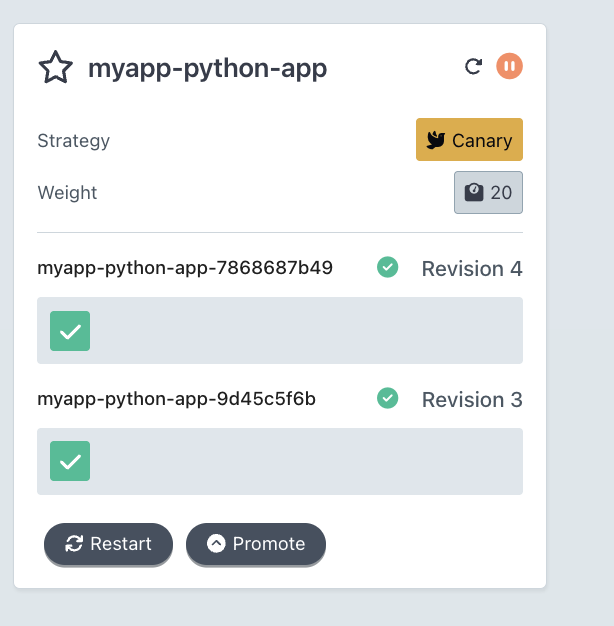
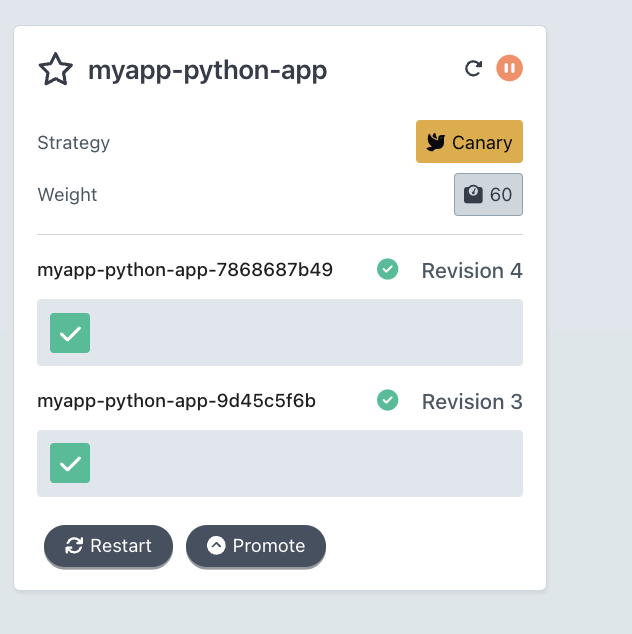
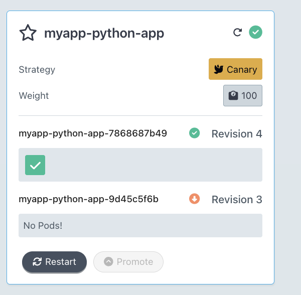
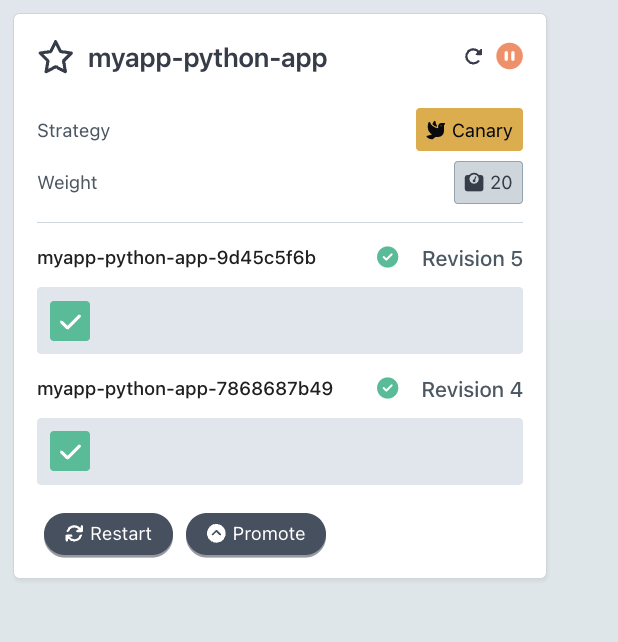
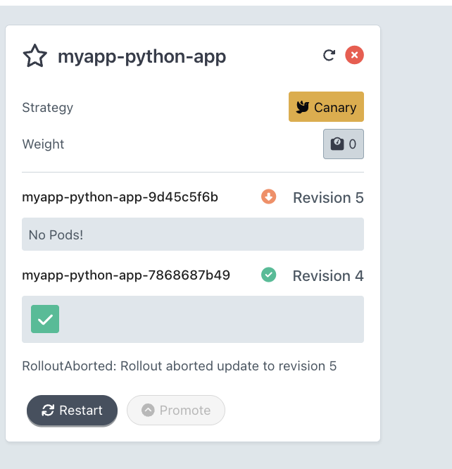
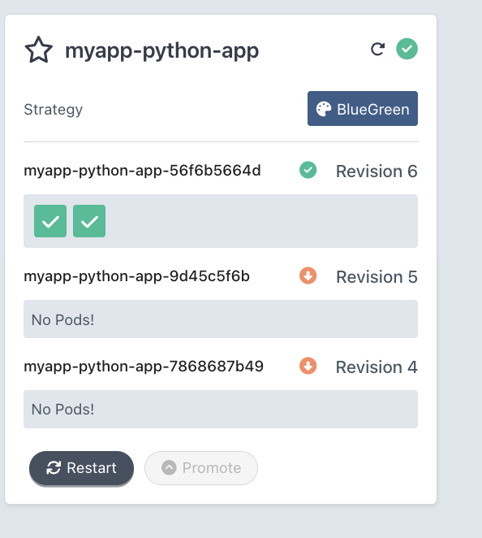
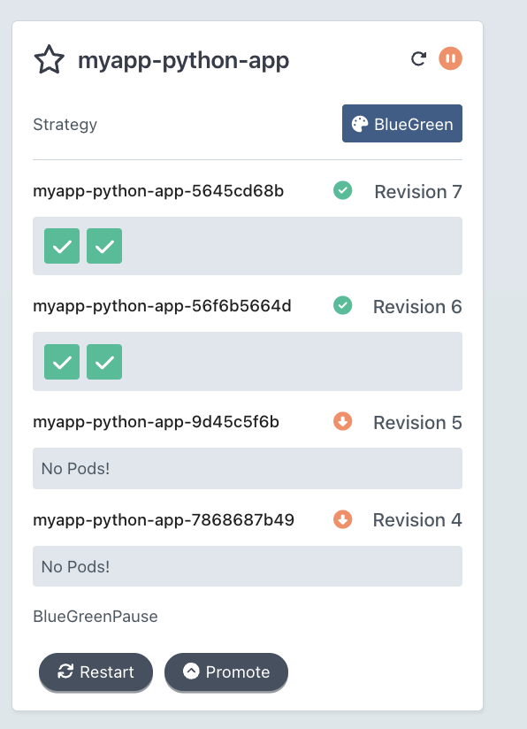
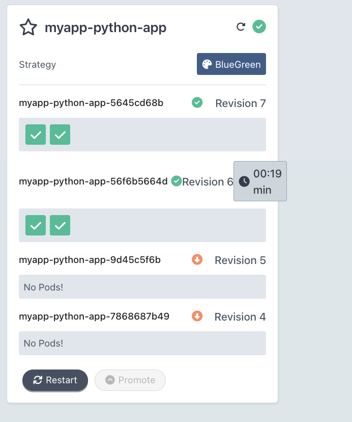
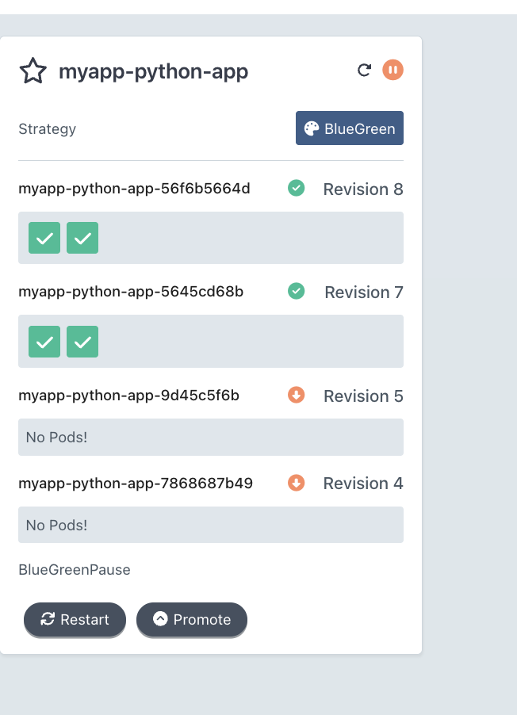

# Progressive Delivery with Argo Rollouts

## Argo Rollouts Setup

### Installation verification

**Controller Installation:**

```bash
kubectl create namespace argo-rollouts
kubectl apply -n argo-rollouts -f https://github.com/argoproj/argo-rollouts/releases/latest/download/install.yaml
```

Verify the controller is running:

```bash
get pods -n argo-rollouts
NAME                            READY   STATUS    RESTARTS   AGE
argo-rollouts-5f64f8d68-v7qss   1/1     Running   0          44s
```

**kubectl Plugin Installation:**

```bash
brew install argoproj/tap/kubectl-argo-rollouts
```

Verify installation:
```bash
argo rollouts version
kubectl-argo-rollouts: v1.8.3+49fa151
  BuildDate: 2025-06-04T22:19:21Z
  GitCommit: 49fa1516cf71672b69e265267da4e1d16e1fe114
  GitTreeState: clean
  GoVersion: go1.23.9
  Compiler: gc
  Platform: darwin/amd64
```

### Dashboard access

**Install Dashboard:**

```bash
kubectl apply -n argo-rollouts -f https://github.com/argoproj/argo-rollouts/releases/latest/download/dashboard-install.yaml
```

**Access Dashboard:**

```bash
kubectl port-forward svc/argo-rollouts-dashboard -n argo-rollouts 3100:3100
```

Open [http://localhost:3100](http://localhost:3100) in your browser and select the namespace where your application is deployed.

---

## Canary Deployment

### Strategy configuration explained

The canary strategy is configured in [`python-app/templates/rollout.yaml`](python-app/templates/rollout.yaml) with the following progressive traffic shifting steps:

1. **20%** traffic to canary → **pause** (manual promotion required)
2. **40%** traffic → pause **30 seconds**
3. **60%** traffic → pause **30 seconds**
4. **80%** traffic → pause **30 seconds**
5. **100%** traffic (complete)

**Configuration:**

```yaml
strategy:
  canary:
    steps:
      - setWeight: 20
      - pause: {}  # Manual promotion required
      - setWeight: 40
      - pause: { duration: 30s }
      - setWeight: 60
      - pause: { duration: 30s }
      - setWeight: 80
      - pause: { duration: 30s }
      - setWeight: 100
```

This approach allows:
- Controlled exposure of new versions to a subset of users
- Manual verification at critical thresholds
- Automatic progression through safe increments
- Quick rollback if issues are detected

### Step-by-step rollout progression

**1. Deploy Initial Version:**

```bash
helm dependency update k8s/python-app
helm upgrade --install myapp k8s/python-app -f k8s/python-app/values.yaml -n default
```

**2. Trigger New Rollout:**

```bash
helm upgrade myapp k8s/python-app -f k8s/python-app/values.yaml -n default --set image.tag=1.1
```

**3. Watch Rollout Status:**

```bash
kubectl argo rollouts get rollout myapp-python-app -n default -w
```

**Dashboard Screenshots:**

*Dashboard: Canary rollout paused at step 1 (20% weight). Revision 4 is the canary, Revision 3 is stable. Manual promotion required.*



*Dashboard: Canary rollout at step 3 (60% weight). After manual promotion, rollout automatically advanced through 40% and is now paused at 60%.*



*Dashboard: Canary rollout successfully completed. Revision 4 is now stable at 100% weight. Revision 3 (previous stable) has been scaled down — No Pods.*



*Dashboard: New canary rollout initiated. Revision 5 is the new canary at 20% weight, Revision 4 is the current stable. Paused at step 1 — manual promotion required.*



*Dashboard: Rollout aborted. Canary Revision 5 has been scaled down (No Pods). Traffic shifted back to 0% canary — Revision 4 is stable and serving 100% of traffic. Status: RolloutAborted.*



*Dashboard: Strategy switched to BlueGreen. Revision 6 is the active version with 2 running pods. Previous canary revisions (5 and 4) are fully scaled down.*



*Dashboard: BlueGreenPause state. Revision 7 is the new preview version (2 pods running), Revision 6 is the current active version (2 pods running). Manual promotion required to switch active traffic.*



*Dashboard: Blue-Green promotion completed. Revision 7 is the new active version (2 pods). Revision 6 (previous active) is still running with a scale-down timer of 00:19 min before being terminated.*



*Dashboard: BlueGreenPause state. Revision 8 is the new preview version (2 pods running), Revision 7 is the current active version (2 pods running). Both environments live simultaneously — manual promotion required to switch production traffic.*



### Promotion and abort demonstration

**Manual Promotion:**

When the rollout pauses at 20%, promote to the next step:

```bash
kubectl argo rollouts promote myapp-python-app -n default
```

The rollout will automatically progress through the remaining steps (40%, 60%, 80%, 100%) with 30-second pauses.

**Abort Rollback:**

To abort a rollout in progress and revert to the stable version:

```bash
kubectl argo rollouts abort myapp-python-app -n default
```

**What happens during abort:**
- Traffic immediately shifts back to the stable revision
- Canary pods are scaled down
- Stable pods receive 100% of traffic
- No manual intervention required after abort command

**Retry Aborted Rollout:**

```bash
kubectl argo rollouts retry rollout myapp-python-app -n default
```

---

## Blue-Green Deployment

### Strategy configuration explained

The blue-green strategy is configured using [`k8s/python-app/values-bluegreen.yaml`](k8s/python-app/values-bluegreen.yaml):

```yaml
rollout:
  strategy: blueGreen
  blueGreen:
    activeService: "{{ include \"python-app.fullname\" . }}-svc"
    previewService: "{{ include \"python-app.fullname\" . }}-svc-preview"
    autoPromotionEnabled: false  # Manual promotion required
```

**Key Configuration Points:**
- **Active Service**: Serves production traffic (stable version)
- **Preview Service**: Serves new version for testing before promotion
- **Auto Promotion**: Disabled by default for manual control
- **Persistence**: Disabled in blue-green mode (ReadWriteOnce volumes cannot be mounted on two pods simultaneously)

### Preview vs active service

**Deploy with Blue-Green Strategy:**

```bash
helm upgrade --install myapp k8s/python-app \
  -f k8s/python-app/values.yaml \
  -f k8s/python-app/values-bluegreen.yaml \
  -n default
```

**Access Services:**

```bash
# Active (production) - stable version
kubectl port-forward svc/myapp-python-app-svc 8080:80 -n default

# Preview - new version for testing
kubectl port-forward svc/myapp-python-app-svc-preview 8081:80 -n default
```

**Service Differences:**

| Service | Purpose | Traffic | When to Use |
|---------|---------|---------|-------------|
| **Active** (`-svc`) | Production traffic | Stable version after promotion | Regular production access |
| **Preview** (`-svc-preview`) | Testing new version | New version before promotion | QA, validation, sign-off |

### Promotion process

**1. Deploy New Version:**

```bash
helm upgrade myapp k8s/python-app \
  -f k8s/python-app/values.yaml \
  -f k8s/python-app/values-bluegreen.yaml \
  -n default \
  --set image.tag=1.2
```

**2. Test Preview Service:**

Access the preview service and validate the new version:
```bash
kubectl port-forward svc/myapp-python-app-svc-preview 8081:80 -n default
# Test at http://localhost:8081
```

**3. Promote to Active:**

After successful testing:
```bash
kubectl argo rollouts promote myapp-python-app -n default
```

**4. Verify Instant Switch:**

The active service immediately switches to the new version:
```bash
kubectl port-forward svc/myapp-python-app-svc 8080:80 -n default
# Verify new version at http://localhost:8080
```

**Instant Rollback:**

```bash
kubectl argo rollouts undo myapp-python-app -n default
```

Traffic switches back to the previous stable version in one step (all-or-nothing).

---

## Strategy Comparison

### When to use canary vs blue-green

**Use Canary When:**
- You want gradual exposure to production traffic
- You have metrics-based monitoring (error rates, latency)
- You need to measure impact at specific percentages (10%, 20%, etc.)
- You're doing frequent releases with small changes
- You want to minimize blast radius of potential issues
- You have SLO-driven release policies

**Use Blue-Green When:**
- You need a byte-identical preview URL for QA/sign-off
- You want instant rollback capability
- You're doing release trains with strict pre-prod validation
- You need to minimize partial-state exposure
- You have sufficient resources for 2× capacity during deployment
- You're doing major version upgrades or breaking changes

### Pros and cons of each

**Canary Strategy:**

| Pros | Cons |
|------|------|
| Gradual risk exposure | More complex to monitor |
| Measurable impact at each step | Longer deployment time |
| Shared resources (efficient) | Requires metrics for automation |
| Fine-grained control | Partial state during transition |
| Good for frequent releases | May need service mesh for HTTP-level splitting |

**Blue-Green Strategy:**

| Pros | Cons |
|------|------|
| Instant rollback | Requires 2× resources |
| Clean preview environment | Longer deployment window |
| All-or-nothing switch | No gradual exposure |
| Simple to understand | Storage limitations (ReadWriteOnce) |
| Great for major releases | Higher infrastructure cost |

### Your recommendation for different scenarios

**For this course application:**
- **Primary recommendation**: Use **canary** for production deployments with the default steps
- **Demonstration**: Use **blue-green** when showcasing instant switch and preview URLs
- **Storage consideration**: Disable persistence in blue-green mode or use RWX storage

**Scenario-based recommendations:**

1. **Microservices with frequent updates** → Canary
   - Small, incremental changes
   - Metrics-based automation
   - Gradual traffic shifting

2. **Major version upgrades** → Blue-Green
   - Breaking changes
   - Extensive QA required
   - Need instant rollback

3. **Critical production systems** → Canary with Analysis
   - Automated rollback on metrics
   - Multiple pause gates
   - Gradual exposure

4. **Demo/Showcase environments** → Blue-Green
   - Clean preview URLs
   - Instant switch for demos
   - Easy rollback

5. **Resource-constrained environments** → Canary
   - Shared resources
   - No 2× capacity requirement
   - Efficient resource usage

---

## CLI Commands Reference

### Useful commands you used

**Status and Monitoring:**

```bash
# Get rollout status
kubectl argo rollouts get rollout <name> -n <namespace>

# Watch rollout in real-time
kubectl argo rollouts get rollout <name> -n <namespace> -w

# List all rollouts
kubectl argo rollouts list -n <namespace>

# Get rollout history
kubectl argo rollouts history <name> -n <namespace>
```

**Promotion and Rollback:**

```bash
# Promote to next step (canary) or complete promotion (blue-green)
kubectl argo rollouts promote <name> -n <namespace>

# Skip remaining pauses (use carefully)
kubectl argo rollouts promote <name> -n <namespace> --full

# Abort canary rollout
kubectl argo rollouts abort <name> -n <namespace>

# Rollback to previous stable version
kubectl argo rollouts undo <name> -n <namespace>

# Retry aborted rollout
kubectl argo rollouts retry rollout <name> -n <namespace>
```

**Version and Plugin Info:**

```bash
# Check plugin and server versions
kubectl argo rollouts version
```

**Deployment Commands:**

```bash
# Install/upgrade with canary strategy
helm upgrade --install myapp k8s/python-app -f k8s/python-app/values.yaml -n default

# Install/upgrade with blue-green strategy
helm upgrade --install myapp k8s/python-app \
  -f k8s/python-app/values.yaml \
  -f k8s/python-app/values-bluegreen.yaml \
  -n default

# Trigger new rollout
helm upgrade myapp k8s/python-app -f k8s/python-app/values.yaml -n default --set image.tag=1.1
```

**Service Access:**

```bash
# Port-forward to active service
kubectl port-forward svc/<fullname>-svc 8080:80 -n <namespace>

# Port-forward to preview service (blue-green)
kubectl port-forward svc/<fullname>-svc-preview 8081:80 -n <namespace>

# Port-forward to dashboard
kubectl port-forward svc/argo-rollouts-dashboard -n argo-rollouts 3100:3100
```

### Monitoring and troubleshooting

**Check Rollout Status:**

```bash
# Detailed rollout information
kubectl describe rollout <name> -n <namespace>

# Check rollout events
kubectl get events -n <namespace> --field-selector involvedObject.name=<name>
```

**Controller Logs:**

```bash
# Check argo-rollouts controller logs
kubectl logs -n argo-rollouts deploy/argo-rollouts -f

# Check specific rollout logs
kubectl logs -n argo-rollouts deploy/argo-rollouts | grep <name>
```

---

## Bonus: Automated Analysis

### AnalysisTemplate configuration

The automated analysis feature is enabled via [`python-app/values-rollout-analysis.yaml`](python-app/values-rollout-analysis.yaml) which sets `rollout.analysis.enabled: true`.

**AnalysisTemplate** ([`python-app/templates/analysis-template.yaml`](python-app/templates/analysis-template.yaml)):

```yaml
apiVersion: argoproj.github.io/v1alpha1
kind: AnalysisTemplate
metadata:
  name: {{ include "python-app.fullname" . }}-health
spec:
  metrics:
    - name: webcheck
      provider:
        web:
          url: http://{{ include "python-app.fullname" . }}.{{ .Release.Namespace }}.svc/health
          jsonPath: "{$.status}"
      successCondition: result == "healthy"
      interval: 10s
      count: 3
      failureLimit: 1
```

### How metrics determine success/failure

**Analysis Process:**
1. After 20% canary weight, the analysis step runs automatically
2. The web provider performs HTTP GET requests to `/health` endpoint
3. Each request checks if JSON response contains `status: "healthy"`
4. Runs 3 checks with 10-second intervals
5. Fails if any check doesn't meet the success condition

**Success Criteria:**
- All 3 checks must return `status: "healthy"`
- If any check fails, the analysis fails
- Failed analysis triggers automatic rollback

**Test Intentional Failure:**

Modify the success condition in the template:
```yaml
successCondition: result == "wrong"  # This will always fail
```

Apply the change and observe:
```bash
helm upgrade myapp k8s/python-app \
  -f k8s/python-app/values.yaml \
  -f k8s/python-app/values-rollout-analysis.yaml \
  -n default
```

Watch the failed AnalysisRun and automatic rollback in the dashboard.

### Demonstration of auto-rollback

**Steps to observe auto-rollback:**

1. Deploy with analysis enabled
2. Trigger a new rollout with a breaking change
3. Watch the analysis step fail
4. Observe automatic rollback to stable version

**Monitor AnalysisRun:**

```bash
kubectl get analysisrun -n <namespace> -w
```

**View AnalysisRun details:**

```bash
kubectl describe analysisrun <analysisrun-name> -n <namespace>
```

**Benefits of Automated Analysis:**
- No manual intervention required for rollback
- Metrics-based decision making
- Consistent evaluation criteria
- Faster failure detection
- Reduced risk of bad deployments

---