# Lab 7 — Observability & Logging with Loki Stack

## 1. Architecture

### System Overview

```
┌─────────────────┐     ┌─────────────────┐
│   Python App    │     │     Go App      │
│   (port 8000)   │     │   (port 8001)   │
│  JSON Logging   │     │  JSON Logging   │
└────────┬────────┘     └────────┬────────┘
         │                       │
         │    Docker Logs        │
         └───────────┬───────────┘
                     │
              ┌──────▼──────┐
              │  Promtail   │
              │ (collector) │
              │  port 9080  │
              └──────┬──────┘
                     │
              ┌──────▼──────┐
              │    Loki     │
              │  (storage)  │
              │  port 3100  │
              └──────┬──────┘
                     │
              ┌──────▼──────┐
              │   Grafana   │
              │    (UI)     │
              │  port 3000  │
              └─────────────┘
```

### Component Roles

- **Applications**: Generate JSON-formatted logs to stdout
- **Docker**: Captures container logs and stores them in `/var/lib/docker/containers`
- **Promtail**: Discovers containers, parses JSON logs, extracts fields as labels, sends to Loki
- **Loki**: Stores logs with TSDB backend, provides query API
- **Grafana**: Visualizes logs, provides LogQL query interface

---

## 2. Setup Guide

### Prerequisites

- Docker and Docker Compose v2 installed

### Step-by-Step Deployment

#### Step 1: Create Project Structure

```bash
mkdir -p monitoring/{loki,promtail,docs}
cd monitoring
```

#### Step 2: Create Configuration Files

Create `loki/config.yml`, `promtail/config.yml`, and `docker-compose.yml` (see Configuration section below).

#### Step 3: Create Environment File

```bash
# Create .env file for secrets
cat > .env << EOF
GRAFANA_ADMIN_PASSWORD=admin123
EOF

# Add to .gitignore
echo ".env" >> ../.gitignore
```

#### Step 4: Deploy the Stack

```bash
docker compose up -d
```

#### Step 5: Verify Services

```bash
# Check all services are running
docker compose ps

# Test Loki
curl http://localhost:3100/ready

# Test Promtail
curl http://localhost:9080/targets

# Access Grafana
open http://localhost:3000
# Login: admin / admin123
```

#### Step 6: Configure Grafana Data Source

1. Open Grafana at http://localhost:3000
2. Login with `admin` / `admin123`
3. Navigate to **Connections** → **Data sources** → **Add data source**
4. Select **Loki**
5. Configure:
   - URL: `http://loki:3100`
   - Click **Save & Test** (should show "Data source connected")

#### Step 7: Explore Logs

1. Navigate to **Explore** in Grafana
2. Select **Loki** data source
3. Try query: `{app="devops-python"}`
4. You should see logs from the Python application

---

## 3. Configuration

### Loki Configuration

**Key settings in `loki/config.yml`:**

```yaml
auth_enabled: false  # Disable multi-tenancy for single-instance

server:
  http_listen_port: 3100

common:
  path_prefix: /loki
  storage:
    filesystem:
      chunks_directory: /loki/chunks
      rules_directory: /loki/rules
  replication_factor: 1
  ring:
    kvstore:
      store: inmemory

schema_config:
  configs:
    - from: 2024-01-01
      store: tsdb           # Time Series Database (10x faster)
      object_store: filesystem
      schema: v13           # Latest schema for Loki 3.0+
      index:
        prefix: index_
        period: 24h

storage_config:
  tsdb_shipper:
    active_index_directory: /loki/tsdb-index
    cache_location: /loki/tsdb-cache

limits_config:
  retention_period: 168h  # 7 days

compactor:
  working_directory: /loki/compactor
  compaction_interval: 10m
  retention_enabled: true
  retention_delete_delay: 2h
  delete_request_store: filesystem
```

**Why these settings?**

- **TSDB (Time Series Database)**: Up to 10x faster queries compared to previous BoltDB
- **Schema v13**: Optimized for Loki 3.0+, better compression and performance
- **7-day retention**: Balances storage costs with debugging needs
- **Compactor**: Automatically cleans up old logs based on retention policy

### Promtail Configuration

**Key settings in `promtail/config.yml`:**

```yaml
server:
  http_listen_port: 9080

clients:
  - url: http://loki:3100/loki/api/v1/push

scrape_configs:
  - job_name: docker
    docker_sd_configs:
      - host: unix:///var/run/docker.sock
        refresh_interval: 5s
        filters:
          - name: label
            values: ["logging=promtail"]  # Only containers with this label
    
    relabel_configs:
      # Extract container name
      - source_labels: ['__meta_docker_container_name']
        regex: '/(.*)'
        target_label: 'container'
      # Extract app label
      - source_labels: ['__meta_docker_container_label_app']
        target_label: 'app'
    
    # Parse JSON logs at collection time
    pipeline_stages:
      - json:
          expressions:
            level: level
            message: message
            method: method
            path: path
            status_code: status_code
      
      # Add extracted fields as labels
      - labels:
          level:
          method:
          status_code:
```

**Why pipeline stages?**

- **JSON parsing at collection time**: Extracts fields as labels for efficient querying
- **No runtime parsing overhead**: Labels are indexed during ingestion
- **Faster queries**: Can filter by `{level="ERROR"}` instead of `| json | level="ERROR"`
---

## 4. Application Logging

### JSON Structured Logging Implementation

**Python application (`app.py`):**

```python
from pythonjsonlogger import jsonlogger
from datetime import datetime, timezone
import logging

class CustomJsonFormatter(jsonlogger.JsonFormatter):
    def add_fields(self, log_record, record, message_dict):
        super().add_fields(log_record, record, message_dict)
        log_record['timestamp'] = datetime.now(timezone.utc).isoformat()
        log_record['level'] = record.levelname
        log_record['logger'] = record.name
        log_record['service'] = 'devops-python'

# Configure logging
handler = logging.StreamHandler()
handler.setFormatter(CustomJsonFormatter('%(timestamp)s %(level)s %(name)s %(message)s'))
logger = logging.getLogger('app')
logger.addHandler(handler)
logger.setLevel(logging.INFO)
```

**Middleware for HTTP logging:**

```python
@app.middleware("http")
async def log_requests(request: Request, call_next):
    logger.info("Request received", extra={
        "method": request.method,
        "path": str(request.url.path),
        "client_ip": request.client.host,
    })
    
    response = await call_next(request)
    
    logger.info("Request completed", extra={
        "method": request.method,
        "path": str(request.url.path),
        "status_code": response.status_code,
        "client_ip": request.client.host,
    })
    
    return response
```

**Example log output:**

```json
{
  "timestamp": "2026-03-09T23:13:22.285158+00:00",
  "level": "ERROR",
  "name": "app",
  "message": "HTTP exception occurred",
  "status_code": 404,
  "path": "/test-error-5",
  "detail": "Not Found",
  "logger": "app",
  "service": "devops-python"
}
```

**Why JSON logging?**

- **Structured data**: Easy to parse and query
- **Consistent format**: All logs have the same structure
- **Rich context**: Include method, path, status code, client IP
- **Efficient querying**: Fields can be extracted as labels in Promtail

---

## 5. Dashboard

### Panel 1: Logs Table

**Type**: Logs visualization

**Query**: 
```logql
{app=~"devops-.*"}
```

**Purpose**: Shows recent logs from all applications in real-time

**Explanation**: 
- `{app=~"devops-.*"}` - Stream selector using regex to match all apps starting with "devops-"
- Displays raw log lines with timestamps
- Useful for general monitoring and debugging

### Panel 2: Request Rate

**Type**: Time series graph

**Query**:
```logql
sum by (app) (rate({app=~"devops-.*"}[1m]))
```

**Purpose**: Visualizes logs per second by application

**Explanation**:
- `rate({app=~"devops-.*"}[1m])` - Calculate log rate over 1-minute window
- `sum by (app)` - Aggregate by application name
- Shows traffic patterns and helps identify spikes

### Panel 3: Error Logs

**Type**: Logs visualization

**Query**:
```logql
{app=~"devops-.*", level="ERROR"}
```

**Purpose**: Shows only ERROR level logs for quick troubleshooting

**Explanation**:
- `level="ERROR"` - Label selector (extracted by Promtail pipeline)
- Filters logs at query time using indexed labels
- Much faster than text search `|= "ERROR"`

### Panel 4: Log Level Distribution

**Type**: Stat or Pie chart

**Query**:
```logql
sum by (level) (count_over_time({app=~"devops-.*"}[5m]))
```

**Purpose**: Count logs by level (INFO, ERROR, etc.) over 5 minutes

**Explanation**:
- `count_over_time({app=~"devops-.*"}[5m])` - Count logs in 5-minute window
- `sum by (level)` - Group by log level
- Helps identify error rates and log volume by severity
---

## 6. Production Config

### Security Measures

**Grafana Authentication:**
```yaml
environment:
  - GF_AUTH_ANONYMOUS_ENABLED=false  # Disable anonymous access
  - GF_SECURITY_ADMIN_PASSWORD=${GRAFANA_ADMIN_PASSWORD}  # From .env file
```

- Anonymous access disabled - requires login
- Admin password stored in `.env` file (not committed to git)
- Default credentials: `admin` / `admin123`

**Docker Socket Security:**
```yaml
volumes:
  - /var/run/docker.sock:/var/run/docker.sock:ro  # Read-only
```

- Promtail has read-only access to Docker socket
- Minimizes security risk while allowing container discovery

### Resource Limits

**All services have resource constraints:**

```yaml
deploy:
  resources:
    limits:
      cpus: '1.0'
      memory: 1G
    reservations:
      cpus: '0.5'
      memory: 512M
```

**Service-specific limits:**
- **Loki**: 1 CPU, 1GB RAM (handles log storage and queries)
- **Promtail**: 0.5 CPU, 512MB RAM (lightweight log collector)
- **Grafana**: 1 CPU, 1GB RAM (web UI and dashboards)
- **Applications**: 0.5 CPU, 512MB RAM each

### Health Checks

**Loki:**
```yaml
healthcheck:
  test: ["CMD-SHELL", "wget --no-verbose --tries=1 --spider http://localhost:3100/ready || exit 1"]
  interval: 10s
  timeout: 5s
  retries: 5
  start_period: 10s
```

**Grafana:**
```yaml
healthcheck:
  test: ["CMD-SHELL", "wget --no-verbose --tries=1 --spider http://localhost:3000/api/health || exit 1"]
  interval: 10s
  timeout: 5s
  retries: 5
  start_period: 10s
```

### Retention Policy

- **Retention period**: 7 days (168 hours)
- **Compaction interval**: 10 minutes
- **Delete delay**: 2 hours after retention expires
- Balances storage costs with debugging needs

---

## 7. Testing

### Verify Stack Deployment

```bash
# Check all services are running and healthy
cd monitoring
docker compose ps

# Expected output: All services "Up" and "healthy"
CONTAINER ID   IMAGE                    COMMAND                  CREATED             STATUS                    PORTS                                                   NAMES
ffe5cbb34d59   monitoring-app-python    "python app.py"          31 minutes ago      Up 31 minutes             0.0.0.0:8000->8000/tcp, [::]:8000->8000/tcp             app-python
f1a9c713e76b   grafana/promtail:3.0.0   "/usr/bin/promtail -…"   55 minutes ago      Up 27 minutes             0.0.0.0:9080->9080/tcp, [::]:9080->9080/tcp             promtail
7c5c120589fd   grafana/grafana:12.3.1   "/run.sh"                56 minutes ago      Up 19 minutes (healthy)   0.0.0.0:3000->3000/tcp, [::]:3000->3000/tcp             grafana
c75882b0895b   monitoring-app-go        "./myapp"                About an hour ago   Up About an hour          8080/tcp, 0.0.0.0:8001->8000/tcp, [::]:8001->8000/tcp   app-go
562163ce9dc1   grafana/loki:3.0.0       "/usr/bin/loki -conf…"   8 hours ago         Up 8 hours (healthy)      0.0.0.0:3100->3100/tcp, [::]:3100->3100/tcp             loki
```

### Test Loki API

```bash
# Check Loki is ready
curl http://localhost:3100/ready
# Expected: "ready"
ready

# Query logs via API
curl -G -s "http://localhost:3100/loki/api/v1/query_range" \
  --data-urlencode 'query={app="devops-python"}' \
  --data-urlencode 'limit=5' | jq '.'

{
  "status": "success",
  "data": {
    "resultType": "streams",
    "result": [
      {
        "stream": {
          "app": "devops-python",
          "container": "app-python",
          "container_id": "ffe5cbb34d59e89d7fdb0dca0be0189893e8de610881c95c2be84d1b1c195f28",
          "job": "docker",
          "level": "INFO",
          "method": "GET",
          "service": "devops-python",
          "service_name": "devops-python"
        },
        "values": [
          [
            "1773098135528872000",
            "{\"timestamp\": \"2026-03-09T23:15:35.528872+00:00\", \"level\": \"INFO\", \"name\": \"app\", \"message\": \"Incoming request\", \"method\": \"GET\", \"path\": \"/error-test-10\", \"client_ip\": \"172.18.0.1\", \"user_agent\": \"curl/8.7.1\", \"logger\": \"app\", \"service\": \"devops-python\"}"
          ]
        ]
      },
      {
        "stream": {
          "app": "devops-python",
          "container": "app-python",
          "container_id": "ffe5cbb34d59e89d7fdb0dca0be0189893e8de610881c95c2be84d1b1c195f28",
          "job": "docker",
          "level": "INFO",
          "method": "GET",
          "service": "devops-python",
          "service_name": "devops-python",
          "status_code": "404"
        },
        "values": [
          [
            "1773098135529437000",
            "{\"timestamp\": \"2026-03-09T23:15:35.529437+00:00\", \"level\": \"INFO\", \"name\": \"app\", \"message\": \"Request completed\", \"method\": \"GET\", \"path\": \"/error-test-10\", \"status_code\": 404, \"client_ip\": \"172.18.0.1\", \"logger\": \"app\", \"service\": \"devops-python\"}"
          ],
          [
            "1773098135529384000",
            "{\"timestamp\": \"2026-03-09T23:15:35.529384+00:00\", \"level\": \"INFO\", \"name\": \"app\", \"message\": \"Request completed\", \"method\": \"GET\", \"path\": \"/error-test-10\", \"status_code\": 404, \"client_ip\": \"172.18.0.1\", \"logger\": \"app\", \"service\": \"devops-python\"}"
          ]
        ]
      },
      {
        "stream": {
          "app": "devops-python",
          "container": "app-python",
          "container_id": "ffe5cbb34d59e89d7fdb0dca0be0189893e8de610881c95c2be84d1b1c195f28",
          "job": "docker",
          "level": "ERROR",
          "service": "devops-python",
          "service_name": "devops-python",
          "status_code": "404"
        },
        "values": [
          [
            "1773098135529173000",
            "{\"timestamp\": \"2026-03-09T23:15:35.529173+00:00\", \"level\": \"ERROR\", \"name\": \"app\", \"message\": \"HTTP exception occurred\", \"status_code\": 404, \"path\": \"/error-test-10\", \"detail\": \"Not Found\", \"logger\": \"app\", \"service\": \"devops-python\"}"
          ],
          [
            "1773098135529113000",
            "{\"timestamp\": \"2026-03-09T23:15:35.529113+00:00\", \"level\": \"ERROR\", \"name\": \"app\", \"message\": \"HTTP exception occurred\", \"status_code\": 404, \"path\": \"/error-test-10\", \"detail\": \"Not Found\", \"logger\": \"app\", \"service\": \"devops-python\"}"
          ]
        ]
      }
    ],
    "stats": {
      "summary": {
        "bytesProcessedPerSecond": 13904295,
        "linesProcessedPerSecond": 55894,
        "totalBytesProcessed": 78857,
        "totalLinesProcessed": 317,
        "execTime": 0.005671,
        "queueTime": 0.000163,
        "subqueries": 0,
        "totalEntriesReturned": 5,
        "splits": 1,
        "shards": 0,
        "totalPostFilterLines": 317,
        "totalStructuredMetadataBytesProcessed": 4650
      },
      "querier": {
        "store": {
          "totalChunksRef": 0,
          "totalChunksDownloaded": 0,
          "chunksDownloadTime": 0,
          "queryReferencedStructuredMetadata": false,
          "chunk": {
            "headChunkBytes": 0,
            "headChunkLines": 0,
            "decompressedBytes": 0,
            "decompressedLines": 0,
            "compressedBytes": 0,
            "totalDuplicates": 0,
            "postFilterLines": 0,
            "headChunkStructuredMetadataBytes": 0,
            "decompressedStructuredMetadataBytes": 0
          },
          "chunkRefsFetchTime": 0,
          "congestionControlLatency": 0,
          "pipelineWrapperFilteredLines": 0
        }
      },
      "ingester": {
        "totalReached": 1,
        "totalChunksMatched": 6,
        "totalBatches": 1,
        "totalLinesSent": 5,
        "store": {
          "totalChunksRef": 2,
          "totalChunksDownloaded": 2,
          "chunksDownloadTime": 166990,
          "queryReferencedStructuredMetadata": false,
          "chunk": {
            "headChunkBytes": 37974,
            "headChunkLines": 162,
            "decompressedBytes": 40883,
            "decompressedLines": 155,
            "compressedBytes": 4573,
            "totalDuplicates": 0,
            "postFilterLines": 317,
            "headChunkStructuredMetadataBytes": 0,
            "decompressedStructuredMetadataBytes": 4650
          },
          "chunkRefsFetchTime": 149741,
          "congestionControlLatency": 0,
          "pipelineWrapperFilteredLines": 0
        }
      },
      "cache": {
        "chunk": {
          "entriesFound": 0,
          "entriesRequested": 0,
          "entriesStored": 0,
          "bytesReceived": 0,
          "bytesSent": 0,
          "requests": 0,
          "downloadTime": 0,
          "queryLengthServed": 0
        },
        "index": {
          "entriesFound": 0,
          "entriesRequested": 0,
          "entriesStored": 0,
          "bytesReceived": 0,
          "bytesSent": 0,
          "requests": 0,
          "downloadTime": 0,
          "queryLengthServed": 0
        },
        "result": {
          "entriesFound": 0,
          "entriesRequested": 0,
          "entriesStored": 0,
          "bytesReceived": 0,
          "bytesSent": 0,
          "requests": 0,
          "downloadTime": 0,
          "queryLengthServed": 0
        },
        "statsResult": {
          "entriesFound": 0,
          "entriesRequested": 0,
          "entriesStored": 0,
          "bytesReceived": 0,
          "bytesSent": 0,
          "requests": 0,
          "downloadTime": 0,
          "queryLengthServed": 0
        },
        "volumeResult": {
          "entriesFound": 0,
          "entriesRequested": 0,
          "entriesStored": 0,
          "bytesReceived": 0,
          "bytesSent": 0,
          "requests": 0,
          "downloadTime": 0,
          "queryLengthServed": 0
        },
        "seriesResult": {
          "entriesFound": 0,
          "entriesRequested": 0,
          "entriesStored": 0,
          "bytesReceived": 0,
          "bytesSent": 0,
          "requests": 0,
          "downloadTime": 0,
          "queryLengthServed": 0
        },
        "labelResult": {
          "entriesFound": 0,
          "entriesRequested": 0,
          "entriesStored": 0,
          "bytesReceived": 0,
          "bytesSent": 0,
          "requests": 0,
          "downloadTime": 0,
          "queryLengthServed": 0
        },
        "instantMetricResult": {
          "entriesFound": 0,
          "entriesRequested": 0,
          "entriesStored": 0,
          "bytesReceived": 0,
          "bytesSent": 0,
          "requests": 0,
          "downloadTime": 0,
          "queryLengthServed": 0
        }
      },
      "index": {
        "totalChunks": 0,
        "postFilterChunks": 0
      }
    }
  }
}
```

### Test Promtail

```bash
# Check Promtail targets
curl http://localhost:9080/targets

# Should show discovered containers with label "logging=promtail"
<!DOCTYPE html>
<html lang="en">
    <head>
        <meta http-equiv="Content-Type" content="text/html; charset=utf-8">
        <meta name="robots" content="noindex,nofollow">
        <title>Targets</title>
        <link rel="shortcut icon" href="/static/img/favicon.ico?v=%28version%3d3.0.0%2c%20branch%3dHEAD%2c%20revision%3db4f7181c7a%29">
        <script src="/static/vendor/js/jquery-3.5.1.min.js?v=%28version%3d3.0.0%2c%20branch%3dHEAD%2c%20revision%3db4f7181c7a%29"></script>
        <script src="/static/vendor/js/popper.min.js?v=%28version%3d3.0.0%2c%20branch%3dHEAD%2c%20revision%3db4f7181c7a%29"></script>
        <script src="/static/vendor/bootstrap-4.1.3/js/bootstrap.min.js?v=%28version%3d3.0.0%2c%20branch%3dHEAD%2c%20revision%3db4f7181c7a%29"></script>

        <link type="text/css" rel="stylesheet" href="/static/vendor/bootstrap-4.1.3/css/bootstrap.min.css?v=%28version%3d3.0.0%2c%20branch%3dHEAD%2c%20revision%3db4f7181c7a%29">
        <link type="text/css" rel="stylesheet" href="/static/css/promtail.css?v=%28version%3d3.0.0%2c%20branch%3dHEAD%2c%20revision%3db4f7181c7a%29">
        <link type="text/css" rel="stylesheet" href="/static/vendor/bootstrap4-glyphicons/css/bootstrap-glyphicons.min.css?v=%28version%3d3.0.0%2c%20branch%3dHEAD%2c%20revision%3db4f7181c7a%29">

        <script>
            var PATH_PREFIX = "";
            var BUILD_VERSION = "(version=3.0.0, branch=HEAD, revision=b4f7181c7a)";
            $(function () {
                $('[data-toggle="tooltip"]').tooltip()
            })
        </script>

        
<link type="text/css" rel="stylesheet" href="/static/css/targets.css?v=%28version%3d3.0.0%2c%20branch%3dHEAD%2c%20revision%3db4f7181c7a%29">
<script src="/static/js/targets.js?v=%28version%3d3.0.0%2c%20branch%3dHEAD%2c%20revision%3db4f7181c7a%29"></script>

    </head>

    <body>
        <nav class="navbar fixed-top navbar-expand-sm navbar-dark bg-dark">
            <div class="container-fluid">

                <button type="button" class="navbar-toggler" data-toggle="collapse" data-target="#nav-content" aria-expanded="false" aria-controls="nav-content" aria-label="Toggle navigation">
                    <span class="navbar-toggler-icon"></span>
                    
                </button>

                <a class="navbar-brand" href="#">Promtail</a>


                <div id="nav-content" class="navbar-collapse collapse">
                    <ul class="navbar-nav">
                        <li class="nav-item"><a class="nav-link" href="/service-discovery">Service Discovery</a></li>
                        <li class="nav-item"><a class="nav-link" href="/targets">Targets</a></li>
                        <li class="nav-item"><a class="nav-link" href="/config">Config</a></li>
                        <li class= "nav-item" >
                            <a class ="nav-link" href="https://github.com/grafana/loki" target="_blank">Help</a>
                        </li>
                    </ul>
                </div>
            </div>
        </nav>

        
  <div class="container-fluid">
    <h1>Targets</h1>
    <div id="showTargets" class="btn-group btn-group-toggle" data-toggle="buttons">
      <label class="btn btn-primary">
        <input type="radio" name="targets" id="all-targets" autocomplete="off" checked> All
      </label>
      <label class="btn btn-primary">
        <input type="radio" name="targets" id="unready-targets" autocomplete="off"> Unready
      </label>
      </br>
  </div>

    
    
    

    <div class="table-container">
      <h2 class="job_header">
        <a id="job-docker/unix:///var/run/docker.sock:80" href="#job-docker%2funix%3a%2f%2f%2fvar%2frun%2fdocker.sock%3a80">docker/unix:///var/run/docker.sock:80 (2/2 ready)</a>
        <button type="button" class="targets expanded-table btn btn-primary">show less</button>
      </h2>
      <table class="table table-sm table-bordered table-striped table-hover">
        <thead class="job_details">
          <tr>
            <th>Type</th>
            <th>Ready</th>
            <th>Labels</th>
            <th>Details</th>
          </tr>
        </thead>
        <tbody>
        
          <tr>
            <td class="type">
              <span >Docker</a><br>
            </td>
            <td class="state">
              <span class="alert alert-success state_indicator text-uppercase">
                true
              </span>
            </td>
            <td class="labels">
              <span class="cursor-pointer" data-toggle="tooltip" title="" data-html=true data-original-title="<b>Before relabeling:</b><br>__address__=&quot;172.18.0.6:8000&quot;<br>__meta_docker_container_id=&quot;ffe5cbb34d59e89d7fdb0dca0be0189893e8de610881c95c2be84d1b1c195f28&quot;<br>__meta_docker_container_label_app=&quot;devops-python&quot;<br>__meta_docker_container_label_com_docker_compose_config_hash=&quot;d7517c5a68fb6bf1bf05c028fbfee6a8753bea644b611c0ab61dbb51e8109abf&quot;<br>__meta_docker_container_label_com_docker_compose_container_number=&quot;1&quot;<br>__meta_docker_container_label_com_docker_compose_depends_on=&quot;&quot;<br>__meta_docker_container_label_com_docker_compose_image=&quot;sha256:b96ea47427f533a9a5d1f84ed7b35673b94fc546497982b8a92a7256ef397521&quot;<br>__meta_docker_container_label_com_docker_compose_image_builder=&quot;classic&quot;<br>__meta_docker_container_label_com_docker_compose_oneoff=&quot;False&quot;<br>__meta_docker_container_label_com_docker_compose_project=&quot;monitoring&quot;<br>__meta_docker_container_label_com_docker_compose_project_config_files=&quot;/Users/newspec/Desktop/DevOps/DevOps-Core-Course/monitoring/docker-compose.yml&quot;<br>__meta_docker_container_label_com_docker_compose_project_working_dir=&quot;/Users/newspec/Desktop/DevOps/DevOps-Core-Course/monitoring&quot;<br>__meta_docker_container_label_com_docker_compose_replace=&quot;app-python&quot;<br>__meta_docker_container_label_com_docker_compose_service=&quot;app-python&quot;<br>__meta_docker_container_label_com_docker_compose_version=&quot;5.1.0&quot;<br>__meta_docker_container_label_logging=&quot;promtail&quot;<br>__meta_docker_container_name=&quot;/app-python&quot;<br>__meta_docker_container_network_mode=&quot;monitoring_logging&quot;<br>__meta_docker_network_id=&quot;dbbae221773ea21a02a0ec784e0d0e4cc26fb8aaaeb96c20f922fd85ec49629c&quot;<br>__meta_docker_network_ingress=&quot;false&quot;<br>__meta_docker_network_internal=&quot;false&quot;<br>__meta_docker_network_ip=&quot;172.18.0.6&quot;<br>__meta_docker_network_label_com_docker_compose_config_hash=&quot;ddec219b739fc99508f3c08de6c29964e557ed6549f4f58bb6df60e82e20dbb5&quot;<br>__meta_docker_network_label_com_docker_compose_network=&quot;logging&quot;<br>__meta_docker_network_label_com_docker_compose_project=&quot;monitoring&quot;<br>__meta_docker_network_label_com_docker_compose_version=&quot;5.1.0&quot;<br>__meta_docker_network_name=&quot;monitoring_logging&quot;<br>__meta_docker_network_scope=&quot;local&quot;<br>__meta_docker_port_private=&quot;8000&quot;<br>__meta_docker_port_public=&quot;8000&quot;<br>__meta_docker_port_public_ip=&quot;0.0.0.0&quot;">
                
                  <span class="badge badge-primary">__address__="172.18.0.6:8000"</span>
                
                  <span class="badge badge-primary">__meta_docker_container_id="ffe5cbb34d59e89d7fdb0dca0be0189893e8de610881c95c2be84d1b1c195f28"</span>
                
                  <span class="badge badge-primary">__meta_docker_container_label_app="devops-python"</span>
                
                  <span class="badge badge-primary">__meta_docker_container_label_com_docker_compose_config_hash="d7517c5a68fb6bf1bf05c028fbfee6a8753bea644b611c0ab61dbb51e8109abf"</span>
                
                  <span class="badge badge-primary">__meta_docker_container_label_com_docker_compose_container_number="1"</span>
                
                  <span class="badge badge-primary">__meta_docker_container_label_com_docker_compose_depends_on=""</span>
                
                  <span class="badge badge-primary">__meta_docker_container_label_com_docker_compose_image="sha256:b96ea47427f533a9a5d1f84ed7b35673b94fc546497982b8a92a7256ef397521"</span>
                
                  <span class="badge badge-primary">__meta_docker_container_label_com_docker_compose_image_builder="classic"</span>
                
                  <span class="badge badge-primary">__meta_docker_container_label_com_docker_compose_oneoff="False"</span>
                
                  <span class="badge badge-primary">__meta_docker_container_label_com_docker_compose_project="monitoring"</span>
                
                  <span class="badge badge-primary">__meta_docker_container_label_com_docker_compose_project_config_files="/Users/newspec/Desktop/DevOps/DevOps-Core-Course/monitoring/docker-compose.yml"</span>
                
                  <span class="badge badge-primary">__meta_docker_container_label_com_docker_compose_project_working_dir="/Users/newspec/Desktop/DevOps/DevOps-Core-Course/monitoring"</span>
                
                  <span class="badge badge-primary">__meta_docker_container_label_com_docker_compose_replace="app-python"</span>
                
                  <span class="badge badge-primary">__meta_docker_container_label_com_docker_compose_service="app-python"</span>
                
                  <span class="badge badge-primary">__meta_docker_container_label_com_docker_compose_version="5.1.0"</span>
                
                  <span class="badge badge-primary">__meta_docker_container_label_logging="promtail"</span>
                
                  <span class="badge badge-primary">__meta_docker_container_name="/app-python"</span>
                
                  <span class="badge badge-primary">__meta_docker_container_network_mode="monitoring_logging"</span>
                
                  <span class="badge badge-primary">__meta_docker_network_id="dbbae221773ea21a02a0ec784e0d0e4cc26fb8aaaeb96c20f922fd85ec49629c"</span>
                
                  <span class="badge badge-primary">__meta_docker_network_ingress="false"</span>
                
                  <span class="badge badge-primary">__meta_docker_network_internal="false"</span>
                
                  <span class="badge badge-primary">__meta_docker_network_ip="172.18.0.6"</span>
                
                  <span class="badge badge-primary">__meta_docker_network_label_com_docker_compose_config_hash="ddec219b739fc99508f3c08de6c29964e557ed6549f4f58bb6df60e82e20dbb5"</span>
                
                  <span class="badge badge-primary">__meta_docker_network_label_com_docker_compose_network="logging"</span>
                
                  <span class="badge badge-primary">__meta_docker_network_label_com_docker_compose_project="monitoring"</span>
                
                  <span class="badge badge-primary">__meta_docker_network_label_com_docker_compose_version="5.1.0"</span>
                
                  <span class="badge badge-primary">__meta_docker_network_name="monitoring_logging"</span>
                
                  <span class="badge badge-primary">__meta_docker_network_scope="local"</span>
                
                  <span class="badge badge-primary">__meta_docker_port_private="8000"</span>
                
                  <span class="badge badge-primary">__meta_docker_port_public="8000"</span>
                
                  <span class="badge badge-primary">__meta_docker_port_public_ip="0.0.0.0"</span>
                
              </span>
            </td>
            <td class="details">
              
            </td>
          </tr>
        
          <tr>
            <td class="type">
              <span >Docker</a><br>
            </td>
            <td class="state">
              <span class="alert alert-success state_indicator text-uppercase">
                true
              </span>
            </td>
            <td class="labels">
              <span class="cursor-pointer" data-toggle="tooltip" title="" data-html=true data-original-title="<b>Before relabeling:</b><br>__address__=&quot;172.18.0.5:8080&quot;<br>__meta_docker_container_id=&quot;c75882b0895b26287815c4e9e8916e0b17e476db2871b6f3c4411e2b15937ef7&quot;<br>__meta_docker_container_label_app=&quot;devops-go&quot;<br>__meta_docker_container_label_com_docker_compose_config_hash=&quot;ed019c72ac77a3d405b4a4f5b01db8d1b8a965f8f2866ac5c73d16993f7a9918&quot;<br>__meta_docker_container_label_com_docker_compose_container_number=&quot;1&quot;<br>__meta_docker_container_label_com_docker_compose_depends_on=&quot;&quot;<br>__meta_docker_container_label_com_docker_compose_image=&quot;sha256:fa3df4a039dcccba11cdd2b72d01db76094b517186e171e2c8dfea2a1bd469c4&quot;<br>__meta_docker_container_label_com_docker_compose_image_builder=&quot;classic&quot;<br>__meta_docker_container_label_com_docker_compose_oneoff=&quot;False&quot;<br>__meta_docker_container_label_com_docker_compose_project=&quot;monitoring&quot;<br>__meta_docker_container_label_com_docker_compose_project_config_files=&quot;/Users/newspec/Desktop/DevOps/DevOps-Core-Course/monitoring/docker-compose.yml&quot;<br>__meta_docker_container_label_com_docker_compose_project_working_dir=&quot;/Users/newspec/Desktop/DevOps/DevOps-Core-Course/monitoring&quot;<br>__meta_docker_container_label_com_docker_compose_service=&quot;app-go&quot;<br>__meta_docker_container_label_com_docker_compose_version=&quot;5.1.0&quot;<br>__meta_docker_container_label_logging=&quot;promtail&quot;<br>__meta_docker_container_name=&quot;/app-go&quot;<br>__meta_docker_container_network_mode=&quot;monitoring_logging&quot;<br>__meta_docker_network_id=&quot;dbbae221773ea21a02a0ec784e0d0e4cc26fb8aaaeb96c20f922fd85ec49629c&quot;<br>__meta_docker_network_ingress=&quot;false&quot;<br>__meta_docker_network_internal=&quot;false&quot;<br>__meta_docker_network_ip=&quot;172.18.0.5&quot;<br>__meta_docker_network_label_com_docker_compose_config_hash=&quot;ddec219b739fc99508f3c08de6c29964e557ed6549f4f58bb6df60e82e20dbb5&quot;<br>__meta_docker_network_label_com_docker_compose_network=&quot;logging&quot;<br>__meta_docker_network_label_com_docker_compose_project=&quot;monitoring&quot;<br>__meta_docker_network_label_com_docker_compose_version=&quot;5.1.0&quot;<br>__meta_docker_network_name=&quot;monitoring_logging&quot;<br>__meta_docker_network_scope=&quot;local&quot;<br>__meta_docker_port_private=&quot;8080&quot;">
                
                  <span class="badge badge-primary">__address__="172.18.0.5:8080"</span>
                
                  <span class="badge badge-primary">__meta_docker_container_id="c75882b0895b26287815c4e9e8916e0b17e476db2871b6f3c4411e2b15937ef7"</span>
                
                  <span class="badge badge-primary">__meta_docker_container_label_app="devops-go"</span>
                
                  <span class="badge badge-primary">__meta_docker_container_label_com_docker_compose_config_hash="ed019c72ac77a3d405b4a4f5b01db8d1b8a965f8f2866ac5c73d16993f7a9918"</span>
                
                  <span class="badge badge-primary">__meta_docker_container_label_com_docker_compose_container_number="1"</span>
                
                  <span class="badge badge-primary">__meta_docker_container_label_com_docker_compose_depends_on=""</span>
                
                  <span class="badge badge-primary">__meta_docker_container_label_com_docker_compose_image="sha256:fa3df4a039dcccba11cdd2b72d01db76094b517186e171e2c8dfea2a1bd469c4"</span>
                
                  <span class="badge badge-primary">__meta_docker_container_label_com_docker_compose_image_builder="classic"</span>
                
                  <span class="badge badge-primary">__meta_docker_container_label_com_docker_compose_oneoff="False"</span>
                
                  <span class="badge badge-primary">__meta_docker_container_label_com_docker_compose_project="monitoring"</span>
                
                  <span class="badge badge-primary">__meta_docker_container_label_com_docker_compose_project_config_files="/Users/newspec/Desktop/DevOps/DevOps-Core-Course/monitoring/docker-compose.yml"</span>
                
                  <span class="badge badge-primary">__meta_docker_container_label_com_docker_compose_project_working_dir="/Users/newspec/Desktop/DevOps/DevOps-Core-Course/monitoring"</span>
                
                  <span class="badge badge-primary">__meta_docker_container_label_com_docker_compose_service="app-go"</span>
                
                  <span class="badge badge-primary">__meta_docker_container_label_com_docker_compose_version="5.1.0"</span>
                
                  <span class="badge badge-primary">__meta_docker_container_label_logging="promtail"</span>
                
                  <span class="badge badge-primary">__meta_docker_container_name="/app-go"</span>
                
                  <span class="badge badge-primary">__meta_docker_container_network_mode="monitoring_logging"</span>
                
                  <span class="badge badge-primary">__meta_docker_network_id="dbbae221773ea21a02a0ec784e0d0e4cc26fb8aaaeb96c20f922fd85ec49629c"</span>
                
                  <span class="badge badge-primary">__meta_docker_network_ingress="false"</span>
                
                  <span class="badge badge-primary">__meta_docker_network_internal="false"</span>
                
                  <span class="badge badge-primary">__meta_docker_network_ip="172.18.0.5"</span>
                
                  <span class="badge badge-primary">__meta_docker_network_label_com_docker_compose_config_hash="ddec219b739fc99508f3c08de6c29964e557ed6549f4f58bb6df60e82e20dbb5"</span>
                
                  <span class="badge badge-primary">__meta_docker_network_label_com_docker_compose_network="logging"</span>
                
                  <span class="badge badge-primary">__meta_docker_network_label_com_docker_compose_project="monitoring"</span>
                
                  <span class="badge badge-primary">__meta_docker_network_label_com_docker_compose_version="5.1.0"</span>
                
                  <span class="badge badge-primary">__meta_docker_network_name="monitoring_logging"</span>
                
                  <span class="badge badge-primary">__meta_docker_network_scope="local"</span>
                
                  <span class="badge badge-primary">__meta_docker_port_private="8080"</span>
                
              </span>
            </td>
            <td class="details">
              
            </td>
          </tr>
        
        </tbody>
      </table>
    </div>
    
  </div>

    </body>
</html>
```

### Generate Test Traffic

```bash
# Generate successful requests
for i in {1..20}; do 
  curl http://localhost:8000/
  curl http://localhost:8000/health
done

# Generate error requests
for i in {1..10}; do 
  curl http://localhost:8000/nonexistent-$i
done
```

### Verify Logs in Grafana

1. Open Grafana: http://localhost:3000
2. Login: `*****`
3. Navigate to **Explore**
4. Select **Loki** data source
5. Try these queries:

```logql
# All logs
{app="devops-python"}

# Only errors
{app="devops-python", level="ERROR"}

# Only INFO logs
{app="devops-python", level="INFO"}

# Count by level
sum by (level) (count_over_time({app="devops-python"}[5m]))
```

### Test LogQL Queries

**Basic filtering:**
```bash
# All logs from Python app
{app="devops-python"}

# Logs from both apps
{app=~"devops-.*"}

# Only ERROR level
{app="devops-python", level="ERROR"}

# Specific HTTP method
{app="devops-python", method="GET"}
```

**Metrics from logs:**
```bash
# Request rate
rate({app="devops-python"}[1m])

# Count by level
sum by (level) (count_over_time({app="devops-python"}[5m]))

# Error rate
sum(rate({app="devops-python", level="ERROR"}[5m]))
```

---

## 8. Challenges

### Challenge 1: Loki Configuration Errors

**Problem**: Initial Loki startup failed with deprecated configuration fields.

**Error message**:
```
error parsing config: yaml: unmarshal errors:
  line X: field max_look_back_period not found
```

**Solution**:
- Removed deprecated `max_look_back_period` from `chunk_store_config`
- Added `delete_request_store: filesystem` to compactor configuration
- Updated to TSDB-specific configuration for Loki 3.0

### Challenge 2: Promtail Not Collecting Logs

**Problem**: Promtail wasn't discovering containers or collecting logs.

**Root cause**: Missing Docker socket and container log directory mounts.

**Solution**:
```yaml
volumes:
  - /var/run/docker.sock:/var/run/docker.sock:ro
  - /var/lib/docker/containers:/var/lib/docker/containers:ro
```

**Additional fix**: Added label-based filtering to only collect from containers with `logging=promtail` label.

### Challenge 3: Mixed Log Formats

**Problem**: Application logs contained both JSON and plain text (from uvicorn), preventing consistent parsing.

**Example**:
```
INFO:     127.0.0.1:52134 - "GET / HTTP/1.1" 200 OK
{"timestamp": "2026-03-09T22:30:25.607856+00:00", "level": "INFO", ...}
```

**Solution**:
- Disabled uvicorn access logs: `uvicorn.run(app, access_log=False, log_config=None)`
- Ensured all application logs use JSON formatter
- Result: Pure JSON output for consistent parsing

### Challenge 4: JSON Parsing in LogQL

**Problem**: Query `{app="devops-python"} | json | level="ERROR"` returned "No data" despite ERROR logs existing.

**Root cause**: Docker logs were already JSON-encoded, causing Loki to store them as escaped strings:
```json
"{\"timestamp\": \"...\", \"level\": \"ERROR\", ...}"
```

The `| json` parser couldn't extract fields from escaped JSON.

**Solution**: Added **pipeline stages** to Promtail configuration to parse JSON at collection time:

```yaml
pipeline_stages:
  - json:
      expressions:
        level: level
        method: method
        status_code: status_code
  - labels:
      level:
      method:
      status_code:
```

**Result**: Fields are now extracted as labels during ingestion, enabling direct filtering:
- `{level="ERROR"}` instead of `| json | level="ERROR"`
- Faster queries (no runtime parsing)
- Fields indexed at ingestion time
---

## Evidence of Completion

### Task 1: Deploy Loki Stack

**Screenshot showing logs from at least 3 containers in Grafana Explore:**
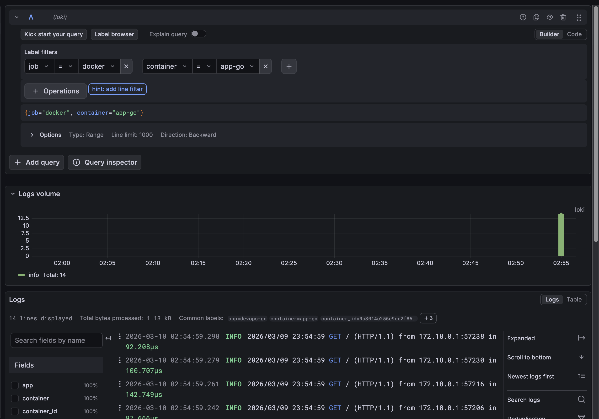
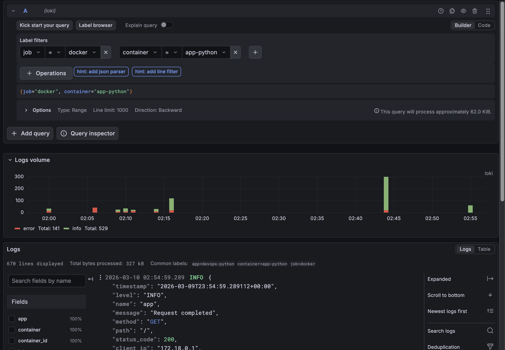
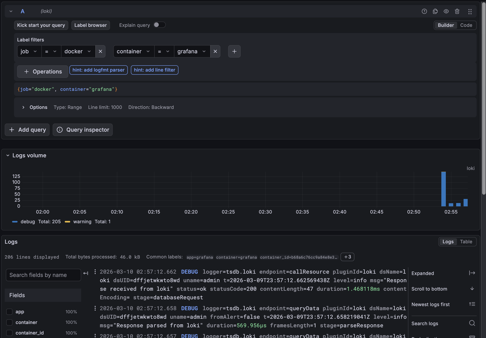
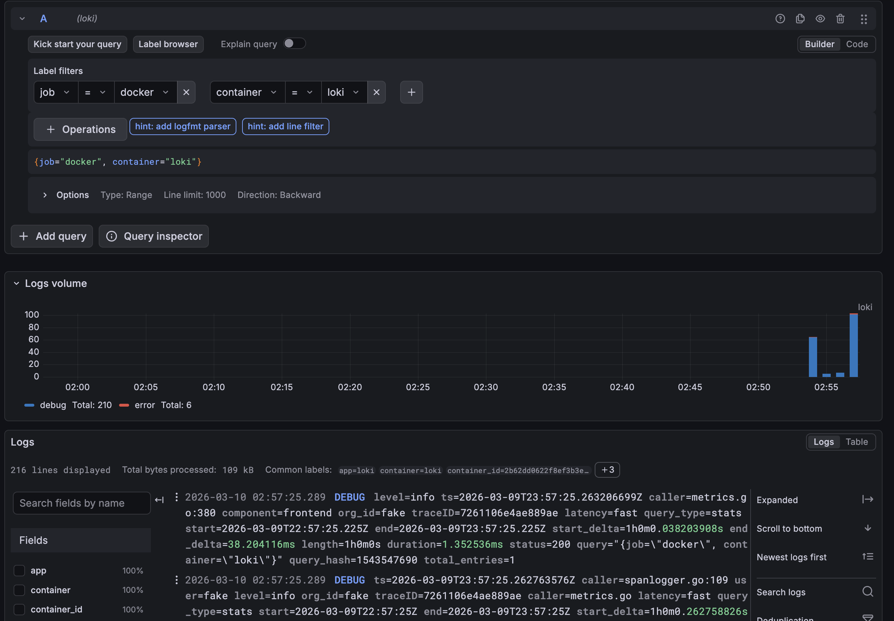
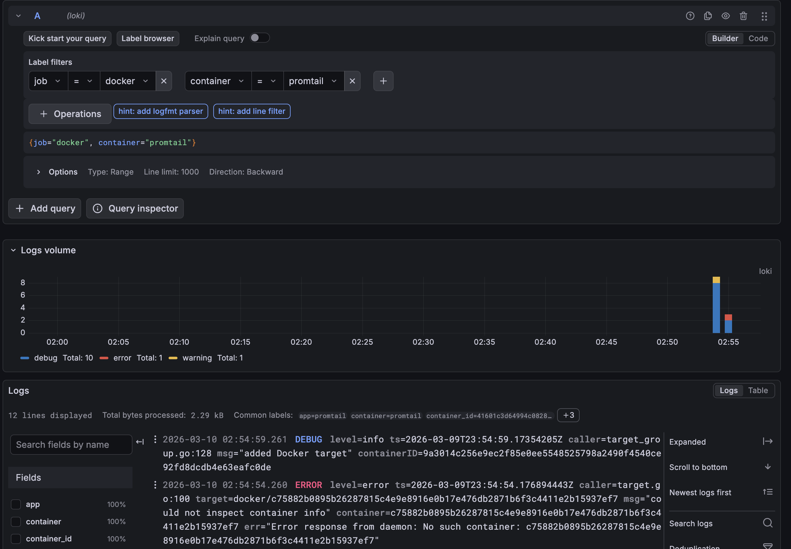

### Task 2: Integrate Your Applications

**Screenshot of JSON log output from your app:**
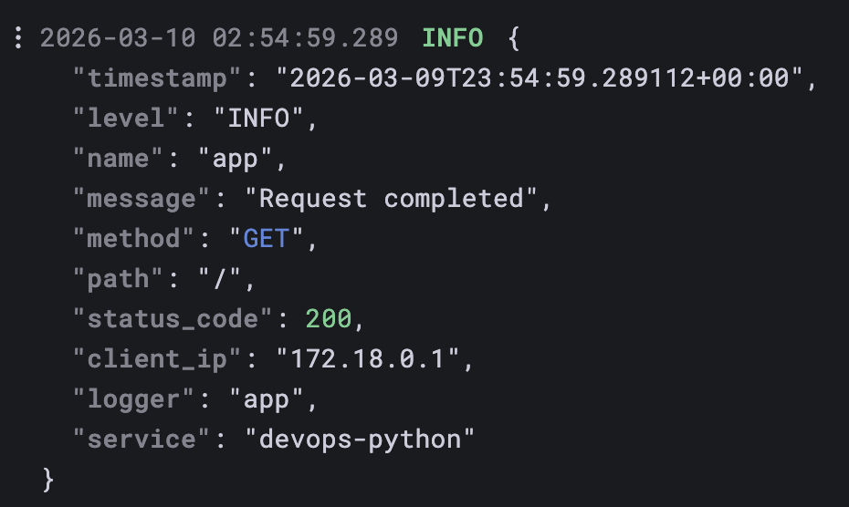
**Screenshot of Grafana showing logs from both applications:**
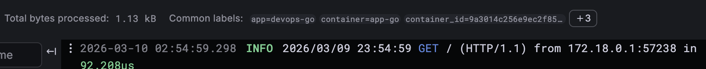
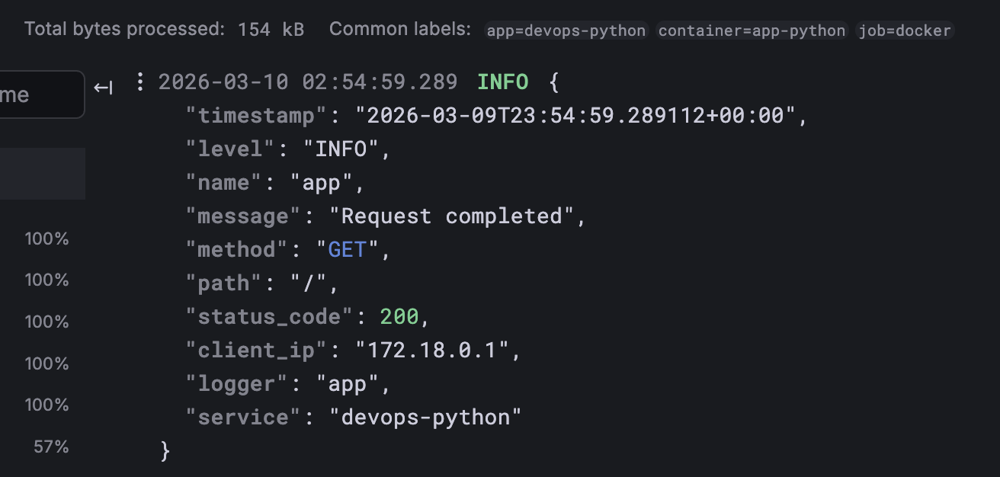
**At least 3 different LogQL queries that work:**
- `{app="devops-python"}`
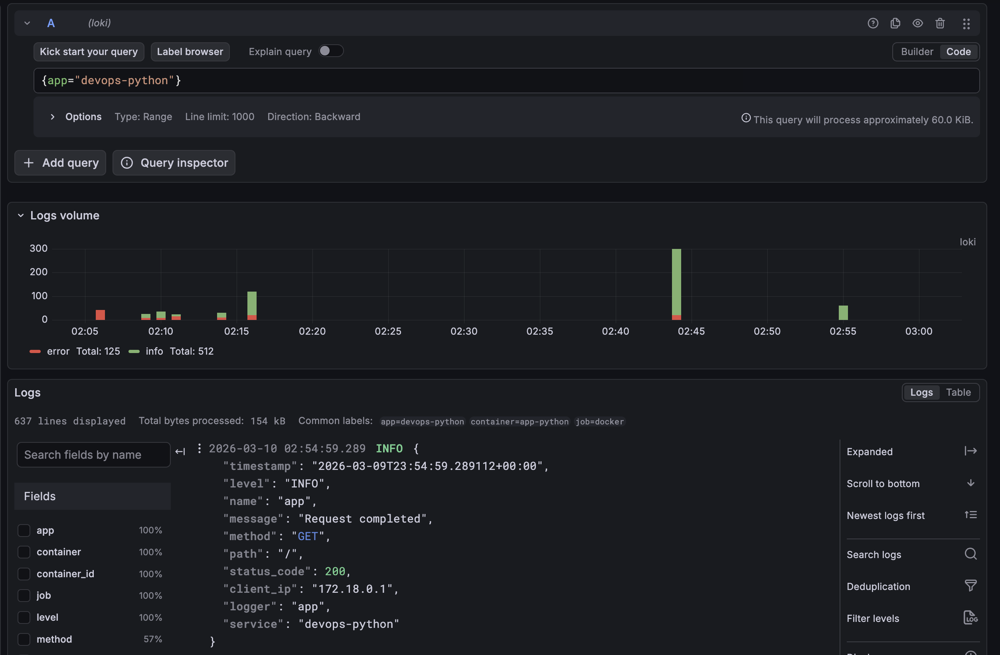
- `{app="devops-python"} |= "ERROR"`

- `{app="devops-python"} | json | method="GET"`
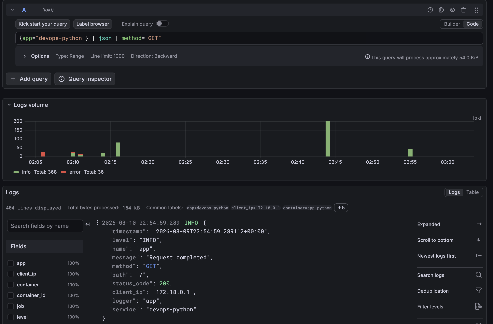
### Task 3: Build Log Dashboard

**Screenshot of your dashboard showing all 4 panels with real data.:**
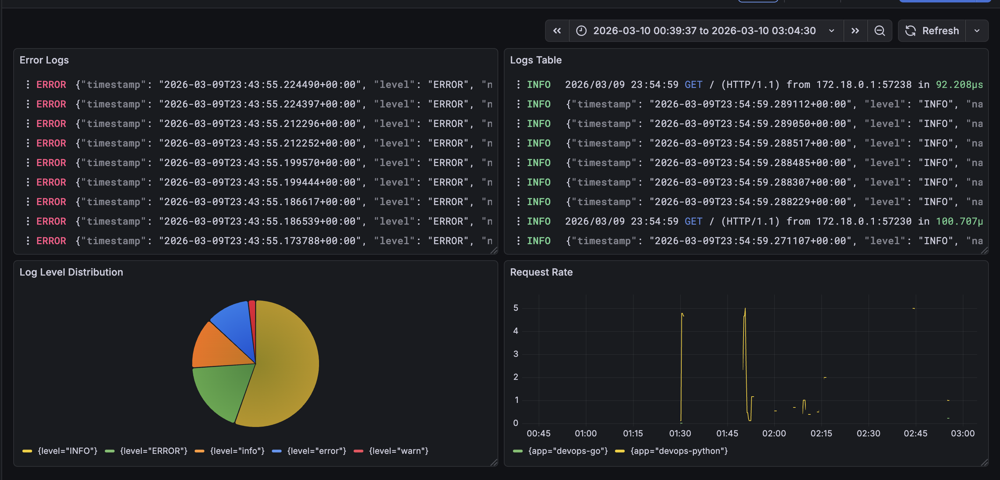

### Task 4: Production Readiness

**docker-compose ps showing all services healthy***
```
docker ps
CONTAINER ID   IMAGE                    COMMAND                  CREATED          STATUS                    PORTS                                         NAMES
9a3014c256e9   monitoring-app-go        "./myapp"                11 minutes ago   Up 11 minutes             0.0.0.0:8001->8080/tcp, [::]:8001->8080/tcp   app-go
41601c3d6499   grafana/promtail:3.0.0   "/usr/bin/promtail -…"   12 minutes ago   Up 12 minutes             0.0.0.0:9080->9080/tcp, [::]:9080->9080/tcp   promtail
b68a6c76cc9a   grafana/grafana:12.3.1   "/run.sh"                12 minutes ago   Up 12 minutes (healthy)   0.0.0.0:3000->3000/tcp, [::]:3000->3000/tcp   grafana
2b62dd0622f8   grafana/loki:3.0.0       "/usr/bin/loki -conf…"   12 minutes ago   Up 12 minutes (healthy)   0.0.0.0:3100->3100/tcp, [::]:3100->3100/tcp   loki
ffe5cbb34d59   monitoring-app-python    "python app.py"          57 minutes ago   Up 57 minutes             0.0.0.0:8000->8000/tcp, [::]:8000->8000/tcp   app-python
```
**Screenshot of Grafana login page (no anonymous access):**
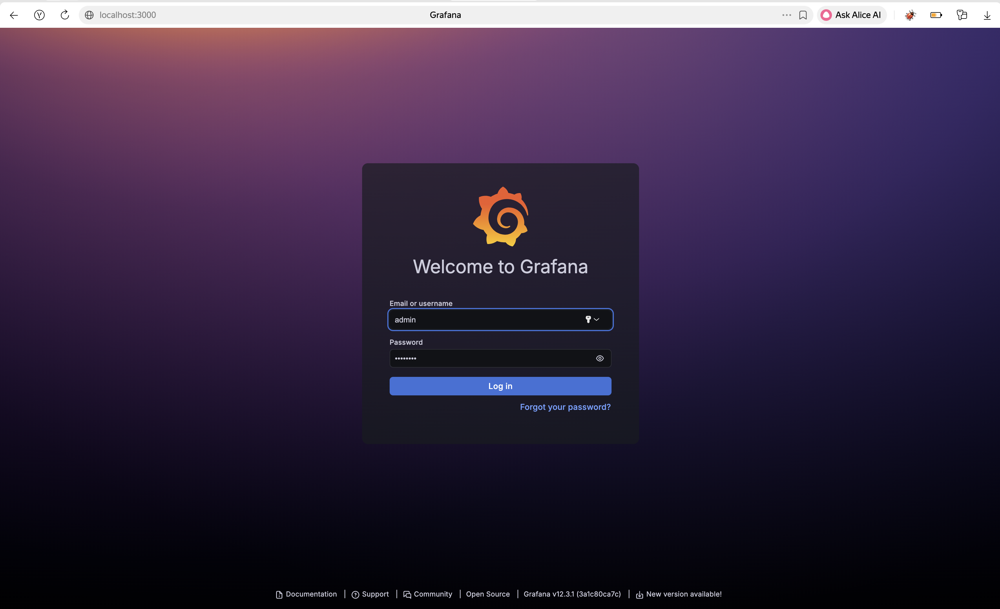

### Bonus — Ansible Automation
**Ansible playbook execution output:**
```bash
Using /Users/newspec/Desktop/DevOps/DevOps-Core-Course/ansible/ansible.cfg as config file

PLAY [Deploy Monitoring Stack] **********************************************************************************************************************************

TASK [Gathering Facts] ******************************************************************************************************************************************
ok: [localhost]

TASK [monitoring : Include setup tasks] *************************************************************************************************************************
included: /Users/newspec/Desktop/DevOps/DevOps-Core-Course/ansible/roles/monitoring/tasks/setup.yml for localhost

TASK [monitoring : Create monitoring directory structure] *******************************************************************************************************
ok: [localhost] => (item=/Users/newspec/Desktop/DevOps/DevOps-Core-Course/ansible/../monitoring) => {"ansible_loop_var": "item", "changed": false, "gid": 20, "group": "staff", "item": "/Users/newspec/Desktop/DevOps/DevOps-Core-Course/ansible/../monitoring", "mode": "0755", "owner": "newspec", "path": "/Users/newspec/Desktop/DevOps/DevOps-Core-Course/ansible/../monitoring", "size": 224, "state": "directory", "uid": 501}
ok: [localhost] => (item=/Users/newspec/Desktop/DevOps/DevOps-Core-Course/ansible/../monitoring/loki) => {"ansible_loop_var": "item", "changed": false, "gid": 20, "group": "staff", "item": "/Users/newspec/Desktop/DevOps/DevOps-Core-Course/ansible/../monitoring/loki", "mode": "0755", "owner": "newspec", "path": "/Users/newspec/Desktop/DevOps/DevOps-Core-Course/ansible/../monitoring/loki", "size": 96, "state": "directory", "uid": 501}
ok: [localhost] => (item=/Users/newspec/Desktop/DevOps/DevOps-Core-Course/ansible/../monitoring/promtail) => {"ansible_loop_var": "item", "changed": false, "gid": 20, "group": "staff", "item": "/Users/newspec/Desktop/DevOps/DevOps-Core-Course/ansible/../monitoring/promtail", "mode": "0755", "owner": "newspec", "path": "/Users/newspec/Desktop/DevOps/DevOps-Core-Course/ansible/../monitoring/promtail", "size": 96, "state": "directory", "uid": 501}
ok: [localhost] => (item=/Users/newspec/Desktop/DevOps/DevOps-Core-Course/ansible/../monitoring/docs) => {"ansible_loop_var": "item", "changed": false, "gid": 20, "group": "staff", "item": "/Users/newspec/Desktop/DevOps/DevOps-Core-Course/ansible/../monitoring/docs", "mode": "0755", "owner": "newspec", "path": "/Users/newspec/Desktop/DevOps/DevOps-Core-Course/ansible/../monitoring/docs", "size": 544, "state": "directory", "uid": 501}

TASK [monitoring : Template Loki configuration] *****************************************************************************************************************
ok: [localhost] => {"changed": false, "checksum": "d42de2d0cd64379828e0bf9003a88aeceff2f0b1", "dest": "/Users/newspec/Desktop/DevOps/DevOps-Core-Course/ansible/../monitoring/loki/config.yml", "gid": 20, "group": "staff", "mode": "0644", "owner": "newspec", "path": "/Users/newspec/Desktop/DevOps/DevOps-Core-Course/ansible/../monitoring/loki/config.yml", "size": 1457, "state": "file", "uid": 501}

TASK [monitoring : Template Promtail configuration] *************************************************************************************************************
ok: [localhost] => {"changed": false, "checksum": "af82481cc89df3f966895d245c9433a2e0c2e411", "dest": "/Users/newspec/Desktop/DevOps/DevOps-Core-Course/ansible/../monitoring/promtail/config.yml", "gid": 20, "group": "staff", "mode": "0644", "owner": "newspec", "path": "/Users/newspec/Desktop/DevOps/DevOps-Core-Course/ansible/../monitoring/promtail/config.yml", "size": 1731, "state": "file", "uid": 501}

TASK [monitoring : Template Docker Compose file] ****************************************************************************************************************
changed: [localhost] => {"changed": true, "checksum": "511a7e9611d7defd5ab4b7d1a5549b1c4d6956de", "dest": "/Users/newspec/Desktop/DevOps/DevOps-Core-Course/ansible/../monitoring/docker-compose.yml", "gid": 20, "group": "staff", "md5sum": "bb3a3b54449ce0caed008059ffc5f4ed", "mode": "0644", "owner": "newspec", "size": 2185, "src": "/Users/newspec/.ansible/tmp/ansible-tmp-1773101608.078568-37435-183065845996472/.source.yml", "state": "file", "uid": 501}

TASK [monitoring : Create .env file for secrets] ****************************************************************************************************************
changed: [localhost] => {"censored": "the output has been hidden due to the fact that 'no_log: true' was specified for this result", "changed": true}

TASK [monitoring : Include deployment tasks] ********************************************************************************************************************
included: /Users/newspec/Desktop/DevOps/DevOps-Core-Course/ansible/roles/monitoring/tasks/deploy.yml for localhost

TASK [monitoring : Deploy monitoring stack with Docker Compose] *************************************************************************************************
[ERROR]: Task failed: Module failed: failed to connect to the docker API at unix:///var/run/docker.sock; check if the path is correct and if the daemon is running: dial unix /var/run/docker.sock: connect: no such file or directory
Origin: /Users/newspec/Desktop/DevOps/DevOps-Core-Course/ansible/roles/monitoring/tasks/deploy.yml:4:3

2 # Deployment tasks for monitoring stack
3
4 - name: Deploy monitoring stack with Docker Compose
    ^ column 3

fatal: [localhost]: FAILED! => {"changed": false, "cmd": "/opt/homebrew/bin/docker --host unix:///var/run/docker.sock version --format '{{ json . }}'", "msg": "failed to connect to the docker API at unix:///var/run/docker.sock; check if the path is correct and if the daemon is running: dial unix /var/run/docker.sock: connect: no such file or directory", "rc": 1, "stderr": "failed to connect to the docker API at unix:///var/run/docker.sock; check if the path is correct and if the daemon is running: dial unix /var/run/docker.sock: connect: no such file or directory\n", "stderr_lines": ["failed to connect to the docker API at unix:///var/run/docker.sock; check if the path is correct and if the daemon is running: dial unix /var/run/docker.sock: connect: no such file or directory"], "stdout": "{\"Client\":{\"Platform\":{\"Name\":\"Docker Engine - Community\"},\"Version\":\"29.3.0\",\"ApiVersion\":\"1.54\",\"DefaultAPIVersion\":\"1.54\",\"GitCommit\":\"5927d80c76\",\"GoVersion\":\"go1.26.1\",\"Os\":\"darwin\",\"Arch\":\"arm64\",\"BuildTime\":\"Thu Mar  5 14:22:32 2026\",\"Context\":\"default\"},\"Server\":null}\n", "stdout_lines": ["{\"Client\":{\"Platform\":{\"Name\":\"Docker Engine - Community\"},\"Version\":\"29.3.0\",\"ApiVersion\":\"1.54\",\"DefaultAPIVersion\":\"1.54\",\"GitCommit\":\"5927d80c76\",\"GoVersion\":\"go1.26.1\",\"Os\":\"darwin\",\"Arch\":\"arm64\",\"BuildTime\":\"Thu Mar  5 14:22:32 2026\",\"Context\":\"default\"},\"Server\":null}"]}

PLAY RECAP ******************************************************************************************************************************************************
localhost                  : ok=8    changed=2    unreachable=0    failed=1    skipped=0    rescued=0    ignored=0   

newspec@172 ansible % 
```
**Idempotency test (run twice, second shows no changes):**
```bash
LAY [Deploy Monitoring Stack] *************************************************

TASK [Gathering Facts] *********************************************************
ok: [localhost]

TASK [monitoring : Include setup tasks] ****************************************
included: /Users/newspec/Desktop/DevOps/DevOps-Core-Course/ansible/roles/monitoring/tasks/setup.yml for localhost

TASK [monitoring : Create monitoring directory structure] **********************
ok: [localhost] => (item=/Users/newspec/Desktop/DevOps/DevOps-Core-Course/ansible/../monitoring)
ok: [localhost] => (item=/Users/newspec/Desktop/DevOps/DevOps-Core-Course/ansible/../monitoring/loki)
ok: [localhost] => (item=/Users/newspec/Desktop/DevOps/DevOps-Core-Course/ansible/../monitoring/promtail)
ok: [localhost] => (item=/Users/newspec/Desktop/DevOps/DevOps-Core-Course/ansible/../monitoring/docs)

TASK [monitoring : Template Loki configuration] ********************************
ok: [localhost]

TASK [monitoring : Template Promtail configuration] ****************************
ok: [localhost]

TASK [monitoring : Template Docker Compose file] *******************************
ok: [localhost]

TASK [monitoring : Create .env file for secrets] *******************************
ok: [localhost]

TASK [Display access information] **********************************************
ok: [localhost] => {
    "msg": "========================================\nMonitoring Stack Deployed Successfully!\n========================================\n\nGrafana UI: http://localhost:3000\nUsername: admin\nPassword: admin123\n\nLoki API: http://localhost:3100\n\nNext Steps:\n1. Open Grafana in your browser\n2. Add Loki data source (http://loki:3100)\n3. Explore logs in the Explore tab\n4. Create dashboards for your applications\n\n========================================"
}

PLAY RECAP *********************************************************************
localhost                  : ok=8    changed=0    unreachable=0    failed=0    skipped=0    rescued=0    ignored=0   


=== Idempotency Check ===
localhost                  : ok=8    changed=0    unreachable=0    failed=0    skipped=0    rescued=0    ignored=0   
```