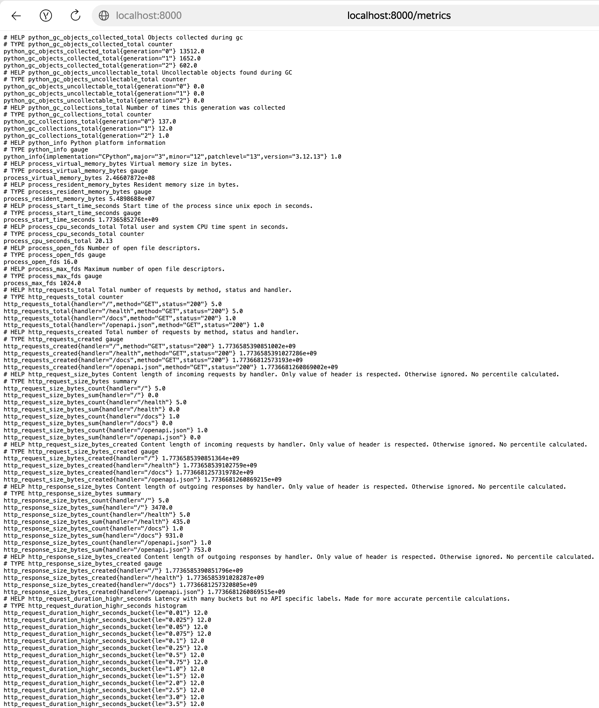
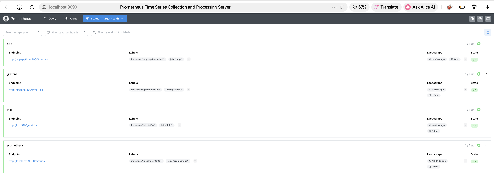
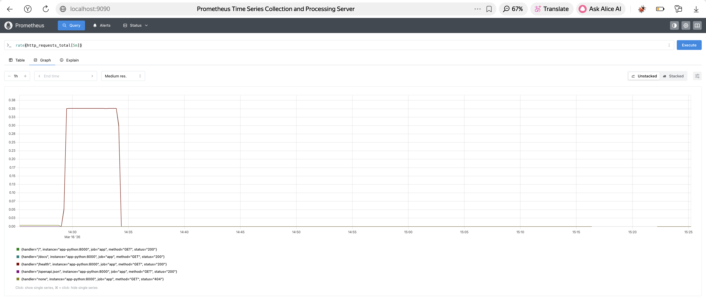
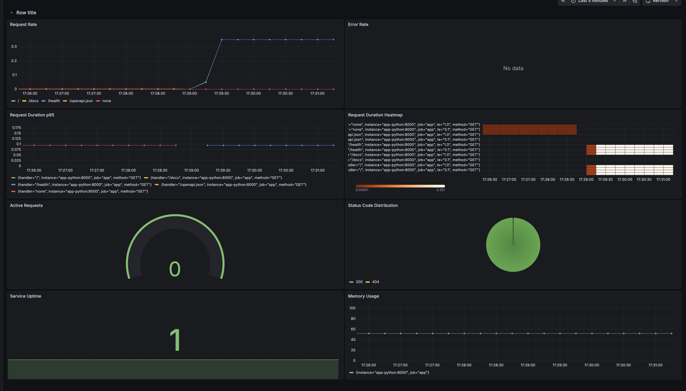
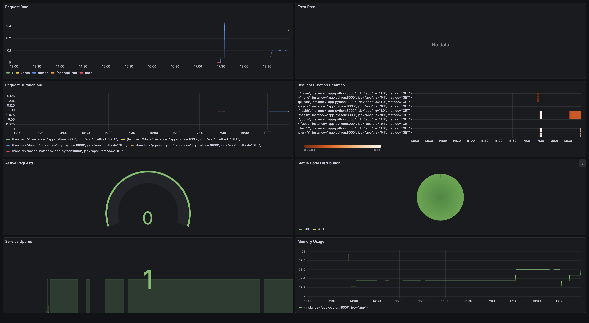
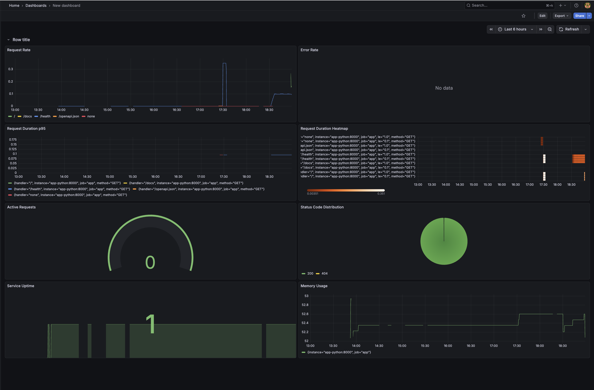
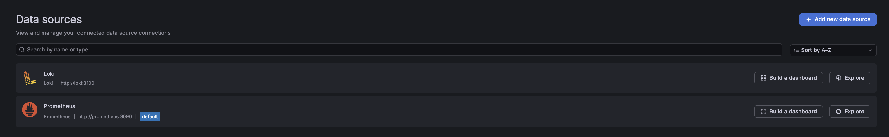
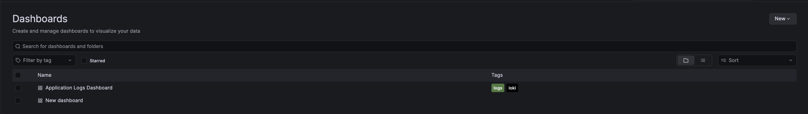

# Lab 8 — Metrics & Monitoring with Prometheus

## 1. Architecture

### Metrics Flow Diagram

```
┌─────────────────┐
│  Python App     │
│  (port 8000)    │
│  /metrics       │
└────────┬────────┘
         │
         │ HTTP scrape every 15s
         │
    ┌────▼──────┐
    │Prometheus │
    │(port 9090)│
    │  TSDB     │
    └────┬──────┘
         │
         │ PromQL queries
         │
    ┌────▼──────┐
    │ Grafana   │
    │(port 3000)│
    │Dashboard  │
    └───────────┘
```

### Component Roles

- **Python Application**: Exposes `/metrics` endpoint with Prometheus-formatted metrics using `prometheus-fastapi-instrumentator`
- **Prometheus**: Scrapes metrics from targets every 15 seconds, stores in TSDB, provides PromQL query interface
- **Grafana**: Visualizes metrics through dashboards, queries Prometheus via PromQL
- **Loki**: Continues to collect logs (from Lab 7), now also scraped by Prometheus for its own metrics

---

## 2. Application Instrumentation

### What Metrics Were Added

**Library Used**: `prometheus-fastapi-instrumentator==7.0.0`

This library automatically instruments FastAPI applications with production-ready metrics, avoiding common pitfalls like duplicate metric registration.

### Metrics Exposed

1. **`http_requests_total`** (Counter)
   - Labels: `method`, `handler`, `status`
   - Tracks total HTTP requests by endpoint and status code
   - **Why**: Essential for monitoring request rate (R in RED method)

2. **`http_request_duration_seconds`** (Histogram)
   - Labels: `method`, `handler`
   - Measures request latency distribution with buckets
   - **Why**: Critical for monitoring response time (D in RED method) and calculating percentiles

3. **`http_requests_in_progress`** (Gauge)
   - Labels: `method`, `handler`
   - Shows concurrent requests being processed
   - **Why**: Helps identify slow requests and resource saturation

4. **Python Runtime Metrics** (automatic)
   - `process_cpu_seconds_total` - CPU usage
   - `process_resident_memory_bytes` - Memory consumption
   - `python_gc_objects_collected_total` - Garbage collection stats
   - **Why**: Essential for resource monitoring and detecting memory leaks

### Why This Approach?

- **No duplicate registration issues**: Handles FastAPI's reload mode properly
- **Production-ready**: Follows Prometheus best practices automatically
- **Low cardinality**: Automatically groups similar endpoints to prevent label explosion
- **Comprehensive**: Includes both HTTP metrics (RED method) and runtime metrics (USE method)
- **Zero configuration**: Works out of the box with sensible defaults

---

## 3. Prometheus Configuration

### Scrape Targets

| Job | Target | Metrics Path | Purpose |
|-----|--------|--------------|---------|
| prometheus | localhost:9090 | /metrics | Self-monitoring |
| app | app-python:8000 | /metrics | Application metrics |
| loki | loki:3100 | /metrics | Log aggregator metrics |
| grafana | grafana:3000 | /metrics | Dashboard metrics |

### Intervals

**`scrape_interval: 15s`** - How often Prometheus scrapes metrics from targets
- Default: 1m (1 minute)
- Our setting: 15s for more frequent updates
- Trade-off: More frequent = better resolution but higher load on targets
- Best for: Real-time monitoring and quick incident detection

**`evaluation_interval: 15s`** - How often Prometheus evaluates alerting rules
- Default: 1m (1 minute)
- Our setting: 15s to match scrape interval
- Best practice: Keep same as scrape_interval for consistent alerting

### Retention

**Time-based retention**: `--storage.tsdb.retention.time=15d`
- Data older than 15 days is automatically deleted
- Balances debugging needs with storage costs
- Covers typical incident investigation timeframes

**Size-based retention**: `--storage.tsdb.retention.size=10GB`
- When TSDB exceeds 10GB, oldest data is deleted first
- Prevents unlimited disk usage
- Acts as safety limit

**Retention behavior**: Whichever limit (time or size) is reached first triggers data deletion

**Why these values?**
- 15s intervals: Good balance between resolution and load
- 15 days retention: Sufficient for debugging recent issues
- 10GB size limit: Reasonable for development/small production environments

---

## 4. Dashboard Walkthrough

### Overview

The application dashboard provides comprehensive monitoring following the RED method (Rate, Errors, Duration) plus resource utilization. Each panel serves a specific purpose in understanding application health and performance.

### Dashboard Layout

```
┌─────────────────────────────────────────────────────────┐
│                  Application Metrics                     │
├──────────────────────┬──────────────────────────────────┤
│  Request Rate        │  Error Rate                      │
│  (Graph)             │  (Graph with thresholds)         │
├──────────────────────┼──────────────────────────────────┤
│  Request Duration p95│  Request Duration Heatmap        │
│  (Graph)             │  (Heatmap)                       │
├──────────────────────┼──────────────────────────────────┤
│  Active Requests     │  Status Code Distribution        │
│  (Gauge)             │  (Pie Chart)                     │
├──────────────────────┼──────────────────────────────────┤
│  Service Uptime      │  Memory Usage                    │
│  (Stat)              │  (Graph)                         │
└──────────────────────┴──────────────────────────────────┘
```

### Panel 1: Request Rate
**Purpose**: Monitor traffic patterns and identify usage spikes

**Query**: `sum(rate(http_requests_total[5m])) by (handler)`

**Interpretation**:
- Steady line = healthy, consistent traffic
- Gradual increase = growing user base
- Sharp spike = investigate cause (marketing campaign, attack, etc.)
- Drop to zero = service down

### Panel 2: Error Rate
**Purpose**: Detect and alert on application errors (E in RED method)

**Query**: `sum(rate(http_requests_total{status=~"5.."}[5m]))`

**Thresholds**:
- Green: 0 errors/sec (healthy)
- Yellow: 1-5 errors/sec (warning)
- Red: >5 errors/sec (critical)

### Panel 3: Request Duration p95
**Purpose**: Monitor application performance and user experience (D in RED method)

**Query**: `histogram_quantile(0.95, rate(http_request_duration_seconds_bucket[5m]))`

**Interpretation**:
- p95 < 100ms: Excellent
- p95 100-500ms: Good
- p95 500ms-1s: Acceptable
- p95 > 1s: Poor, investigate

### Panel 4: Request Duration Heatmap
**Purpose**: Visualize latency distribution over time

**Query**: `rate(http_request_duration_seconds_bucket[5m])`

**Interpretation**:
- Tight vertical band: Consistent performance ✓
- Wide horizontal spread: Inconsistent performance ✗
- Multiple bands: Bimodal distribution (cache hit/miss)

### Panel 5: Active Requests
**Purpose**: Monitor concurrent request handling

**Query**: `sum(http_requests_in_progress)`

**Interpretation**:
- 0: Idle (normal during low traffic)
- 1-10: Healthy concurrency
- 10-50: High load, monitor closely
- >50: Potential issue (slow requests, resource exhaustion)

### Panel 6: Status Code Distribution
**Purpose**: Understand request outcome distribution

**Query**: `sum by (status) (rate(http_requests_total[5m]))`

**Healthy distribution**:
- 2xx: 95-99% (success)
- 4xx: 1-5% (client errors, expected)
- 5xx: <1% (server errors, ideally 0%)

### Panel 7: Service Uptime
**Purpose**: Quick health check indicator

**Query**: `up{job="app"}`

**Values**:
- 1 = Service UP (green)
- 0 = Service DOWN (red)

### Panel 8: Memory Usage
**Purpose**: Monitor resource consumption and detect memory leaks

**Query**: `process_resident_memory_bytes{job="app"} / 1024 / 1024`

**Interpretation**:
- Flat line: Healthy, no leaks ✓
- Gradual upward trend: Memory leak ✗
- Sawtooth pattern: GC working properly ✓
- Approaching limit: Risk of OOM

---

## 5. PromQL Examples

### RED Method Queries

**1. Request Rate** (requests per second):
```promql
rate(http_requests_total[5m])
```
Calculates per-second rate over 5-minute window. Use for monitoring traffic patterns.

**2. Request Rate by Endpoint**:
```promql
sum by (handler) (rate(http_requests_total[5m]))
```
Groups request rate by endpoint. Identifies which endpoints receive most traffic.

**3. Error Rate** (5xx errors per second):
```promql
sum(rate(http_requests_total{status=~"5.."}[5m]))
```
Filters for 5xx status codes. Critical for error monitoring (E in RED).

**4. Error Percentage**:
```promql
(
  sum(rate(http_requests_total{status=~"5.."}[5m]))
  /
  sum(rate(http_requests_total[5m]))
) * 100
```
Calculates error rate as percentage of total requests. Better for alerting than absolute numbers.

**5. Request Duration p95** (95th percentile latency):
```promql
histogram_quantile(0.95, rate(http_request_duration_seconds_bucket[5m]))
```
Shows latency experienced by 95% of requests. Better than average for understanding user experience.

**6. Request Duration p99**:
```promql
histogram_quantile(0.99, rate(http_request_duration_seconds_bucket[5m]))
```
Shows worst-case latency for 99% of requests. Useful for SLA monitoring.

### Resource Monitoring Queries

**7. CPU Usage**:
```promql
rate(process_cpu_seconds_total{job="app"}[5m]) * 100
```
Shows CPU usage as percentage. Helps identify CPU-bound operations.

**8. Memory Usage (MB)**:
```promql
process_resident_memory_bytes{job="app"} / 1024 / 1024
```
Converts bytes to megabytes. Essential for detecting memory leaks.

**9. Active Requests**:
```promql
http_requests_in_progress
```
Current number of concurrent requests. Helps identify slow requests.

### Service Health Queries

**10. Uptime Check**:
```promql
up{job="app"}
```
Returns 1 if service is up, 0 if down. Simplest health check.

**11. All Services Up**:
```promql
count(up == 1)
```
Counts how many services are healthy. Quick overview of system health.

**12. Services Down**:
```promql
up == 0
```
Lists all down services. Critical for incident response.

---

## 6. Production Setup

### Health Checks

All services have health checks configured for automatic restart on failure.

**Prometheus**:
```yaml
healthcheck:
  test: ["CMD-SHELL", "wget --no-verbose --tries=1 --spider http://localhost:9090/-/healthy || exit 1"]
  interval: 10s
  timeout: 5s
  retries: 5
  start_period: 10s
```

**Python App**:
```yaml
healthcheck:
  test: ["CMD-SHELL", "curl -f http://localhost:8000/health || exit 1"]
  interval: 10s
  timeout: 5s
  retries: 5
  start_period: 10s
```

### Resource Limits

| Service | CPU Limit | Memory Limit | CPU Reserve | Memory Reserve |
|---------|-----------|--------------|-------------|----------------|
| Prometheus | 1.0 | 1G | 0.5 | 512M |
| Loki | 1.0 | 1G | 0.5 | 512M |
| Grafana | 1.0 | 1G | 0.5 | 512M |
| App | 0.5 | 256M | 0.25 | 128M |

**Why resource limits matter**:
- Prevents single service from consuming all resources
- Enables predictable performance
- Required for production Kubernetes deployments

### Retention Policies

**Prometheus Retention**:
```yaml
command:
  - '--storage.tsdb.retention.time=15d'
  - '--storage.tsdb.retention.size=10GB'
```

**Configuration rationale**:
- 15 days: Covers typical incident investigation periods
- 10GB: Prevents unlimited disk usage
- Whichever limit is reached first triggers deletion

**Loki Retention** (from Lab 7):
- 7 days (168h) for logs
- Shorter than metrics because logs are more verbose

---

## 7. Testing Results
### Task 1 — Application Metrics.
#### Screenshot of /metrics endpoint output

#### Code showing metric definitions

**File**: `app_python/app.py`

```python
from prometheus_fastapi_instrumentator import Instrumentator

# Initialize Prometheus instrumentation
instrumentator = Instrumentator(
    should_group_status_codes=False,        # Keep individual status codes
    should_ignore_untemplated=False,        # Track all endpoints
    should_respect_env_var=False,           # Always enable metrics
    should_instrument_requests_inprogress=True,  # Track concurrent requests
    excluded_handlers=["/metrics"],         # Don't track metrics endpoint itself
    env_var_name="ENABLE_METRICS",
    inprogress_name="http_requests_in_progress",  # Gauge metric name
    inprogress_labels=True,                 # Add labels to in-progress metric
)

# Instrument the app and expose /metrics endpoint
instrumentator.instrument(app).expose(app, endpoint="/metrics")
```
#### Documentation explaining your metric choices

**Metric Selection Rationale**

Our application uses `prometheus-fastapi-instrumentator` which automatically provides metrics following industry best practices. Here's why each metric was chosen:

**1. `http_requests_total` (Counter)**
- **Purpose**: Track request rate (R in RED method)
- **Why chosen**: Essential for understanding traffic patterns, capacity planning, and calculating error rates
- **Labels**: `method`, `handler`, `status` - enable filtering by endpoint and status code
- **Use case**: Alert on traffic spikes, monitor API usage, calculate SLIs

**2. `http_request_duration_seconds` (Histogram)**
- **Purpose**: Track response time (D in RED method)
- **Why chosen**: Enables percentile calculations (p50, p95, p99) which are better than averages for understanding user experience
- **Buckets**: Default buckets cover range from 5ms to 10s+
- **Use case**: Performance monitoring, SLA compliance, detecting latency regressions

**3. `http_requests_in_progress` (Gauge)**
- **Purpose**: Track concurrent requests
- **Why chosen**: Helps identify slow requests causing backlog and resource saturation
- **Use case**: Capacity planning, detecting stuck requests, identifying bottlenecks

**4. Python Runtime Metrics (automatic)**
- **`process_cpu_seconds_total`**: Track CPU usage for performance optimization
- **`process_resident_memory_bytes`**: Detect memory leaks and guide resource allocation
- **`python_gc_objects_collected_total`**: Monitor garbage collection activity
- **Why chosen**: Essential for resource monitoring (USE method) and preventing OOM errors

**Why prometheus-fastapi-instrumentator?**
- Zero configuration - works out of the box
- Production-ready defaults - follows Prometheus best practices
- No duplicate registration - handles FastAPI lifecycle properly
- Low cardinality - automatically groups endpoints to prevent label explosion
- Comprehensive - includes both HTTP (RED) and runtime (USE) metrics

**Label Design**
- **Included**: `method`, `handler`, `status` - low cardinality, high value
- **Excluded**: user IDs, request IDs, IP addresses - would create millions of time series
- **Best practice**: Keep total unique label combinations under 10,000

### Task 2 — Prometheus Setup
#### Screenshot of /targets page showing all targets UP

#### Screenshot of a successful PromQL query

#### prometheus.yml configuration file
```
global:
  scrape_interval: 15s
  evaluation_interval: 15s

# Storage retention is configured via command-line flags in docker-compose.yml:
# --storage.tsdb.retention.time=15d
# --storage.tsdb.retention.size=10GB

scrape_configs:
  # Prometheus self-monitoring
  - job_name: 'prometheus'
    static_configs:
      - targets: ['localhost:9090']

  # Python application metrics
  - job_name: 'app'
    static_configs:
      - targets: ['app-python:8000']
    metrics_path: '/metrics'

  # Loki metrics
  - job_name: 'loki'
    static_configs:
      - targets: ['loki:3100']
    metrics_path: '/metrics'

  # Grafana metrics
  - job_name: 'grafana'
    static_configs:
      - targets: ['grafana:3000']
    metrics_path: '/metrics'
```
### Task 3 — Grafana Dashboards
#### Screenshot of your custom application dashboard with live data

#### Screenshot showing all 6+ panels working

#### Exported dashboard JSON file
```
{
  "annotations": {
    "list": [
      {
        "builtIn": 1,
        "datasource": {
          "type": "grafana",
          "uid": "-- Grafana --"
        },
        "enable": true,
        "hide": true,
        "iconColor": "rgba(0, 211, 255, 1)",
        "name": "Annotations & Alerts",
        "type": "dashboard"
      }
    ]
  },
  "editable": true,
  "fiscalYearStartMonth": 0,
  "graphTooltip": 0,
  "id": 5,
  "links": [],
  "panels": [
    {
      "collapsed": false,
      "gridPos": {
        "h": 1,
        "w": 24,
        "x": 0,
        "y": 0
      },
      "id": 10,
      "panels": [],
      "title": "Row title",
      "type": "row"
    },
    {
      "datasource": {
        "type": "prometheus",
        "uid": "ffg72d0i65ptsb"
      },
      "fieldConfig": {
        "defaults": {
          "color": {
            "mode": "palette-classic"
          },
          "custom": {
            "axisBorderShow": false,
            "axisCenteredZero": false,
            "axisColorMode": "text",
            "axisLabel": "",
            "axisPlacement": "auto",
            "barAlignment": 0,
            "barWidthFactor": 0.6,
            "drawStyle": "line",
            "fillOpacity": 0,
            "gradientMode": "none",
            "hideFrom": {
              "legend": false,
              "tooltip": false,
              "viz": false
            },
            "insertNulls": false,
            "lineInterpolation": "linear",
            "lineWidth": 1,
            "pointSize": 5,
            "scaleDistribution": {
              "type": "linear"
            },
            "showPoints": "auto",
            "showValues": false,
            "spanNulls": false,
            "stacking": {
              "group": "A",
              "mode": "none"
            },
            "thresholdsStyle": {
              "mode": "off"
            }
          },
          "mappings": [],
          "thresholds": {
            "mode": "absolute",
            "steps": [
              {
                "color": "green",
                "value": 0
              },
              {
                "color": "red",
                "value": 80
              }
            ]
          }
        },
        "overrides": []
      },
      "gridPos": {
        "h": 8,
        "w": 12,
        "x": 0,
        "y": 1
      },
      "id": 1,
      "options": {
        "legend": {
          "calcs": [],
          "displayMode": "list",
          "placement": "bottom",
          "showLegend": true
        },
        "tooltip": {
          "hideZeros": false,
          "mode": "single",
          "sort": "none"
        }
      },
      "pluginVersion": "12.3.1",
      "targets": [
        {
          "datasource": {
            "type": "prometheus",
            "uid": "ffg72d0i65ptsb"
          },
          "editorMode": "code",
          "expr": "sum(rate(http_requests_total[5m])) by (handler)",
          "legendFormat": "__auto",
          "range": true,
          "refId": "A"
        }
      ],
      "title": "Request Rate",
      "type": "timeseries"
    },
    {
      "datasource": {
        "type": "prometheus",
        "uid": "ffg72d0i65ptsb"
      },
      "fieldConfig": {
        "defaults": {
          "color": {
            "mode": "palette-classic"
          },
          "custom": {
            "axisBorderShow": false,
            "axisCenteredZero": false,
            "axisColorMode": "text",
            "axisLabel": "",
            "axisPlacement": "auto",
            "barAlignment": 0,
            "barWidthFactor": 0.6,
            "drawStyle": "line",
            "fillOpacity": 0,
            "gradientMode": "none",
            "hideFrom": {
              "legend": false,
              "tooltip": false,
              "viz": false
            },
            "insertNulls": false,
            "lineInterpolation": "linear",
            "lineWidth": 1,
            "pointSize": 5,
            "scaleDistribution": {
              "type": "linear"
            },
            "showPoints": "auto",
            "showValues": false,
            "spanNulls": false,
            "stacking": {
              "group": "A",
              "mode": "none"
            },
            "thresholdsStyle": {
              "mode": "off"
            }
          },
          "mappings": [],
          "thresholds": {
            "mode": "absolute",
            "steps": [
              {
                "color": "green",
                "value": 0
              },
              {
                "color": "red",
                "value": 80
              }
            ]
          }
        },
        "overrides": []
      },
      "gridPos": {
        "h": 8,
        "w": 12,
        "x": 12,
        "y": 1
      },
      "id": 2,
      "options": {
        "legend": {
          "calcs": [],
          "displayMode": "list",
          "placement": "bottom",
          "showLegend": true
        },
        "tooltip": {
          "hideZeros": false,
          "mode": "single",
          "sort": "none"
        }
      },
      "pluginVersion": "12.3.1",
      "targets": [
        {
          "datasource": {
            "type": "prometheus",
            "uid": "ffg72d0i65ptsb"
          },
          "editorMode": "code",
          "expr": "sum(rate(http_requests_total{status=~\"5..\"}[5m]))",
          "hide": false,
          "instant": false,
          "legendFormat": "__auto",
          "range": true,
          "refId": "A"
        }
      ],
      "title": "Error Rate",
      "type": "timeseries"
    },
    {
      "datasource": {
        "type": "prometheus",
        "uid": "ffg72d0i65ptsb"
      },
      "fieldConfig": {
        "defaults": {
          "color": {
            "mode": "palette-classic"
          },
          "custom": {
            "axisBorderShow": false,
            "axisCenteredZero": false,
            "axisColorMode": "text",
            "axisLabel": "",
            "axisPlacement": "auto",
            "barAlignment": 0,
            "barWidthFactor": 0.6,
            "drawStyle": "line",
            "fillOpacity": 0,
            "gradientMode": "none",
            "hideFrom": {
              "legend": false,
              "tooltip": false,
              "viz": false
            },
            "insertNulls": false,
            "lineInterpolation": "linear",
            "lineWidth": 1,
            "pointSize": 5,
            "scaleDistribution": {
              "type": "linear"
            },
            "showPoints": "auto",
            "showValues": false,
            "spanNulls": false,
            "stacking": {
              "group": "A",
              "mode": "none"
            },
            "thresholdsStyle": {
              "mode": "off"
            }
          },
          "mappings": [],
          "thresholds": {
            "mode": "absolute",
            "steps": [
              {
                "color": "green",
                "value": 0
              },
              {
                "color": "red",
                "value": 80
              }
            ]
          }
        },
        "overrides": []
      },
      "gridPos": {
        "h": 8,
        "w": 12,
        "x": 0,
        "y": 9
      },
      "id": 3,
      "options": {
        "legend": {
          "calcs": [],
          "displayMode": "list",
          "placement": "bottom",
          "showLegend": true
        },
        "tooltip": {
          "hideZeros": false,
          "mode": "single",
          "sort": "none"
        }
      },
      "pluginVersion": "12.3.1",
      "targets": [
        {
          "datasource": {
            "type": "prometheus",
            "uid": "ffg72d0i65ptsb"
          },
          "editorMode": "code",
          "expr": "histogram_quantile(0.95, rate(http_request_duration_seconds_bucket[5m]))",
          "legendFormat": "__auto",
          "range": true,
          "refId": "A"
        }
      ],
      "title": "Request Duration p95",
      "type": "timeseries"
    },
    {
      "datasource": {
        "type": "prometheus",
        "uid": "ffg72d0i65ptsb"
      },
      "fieldConfig": {
        "defaults": {
          "custom": {
            "hideFrom": {
              "legend": false,
              "tooltip": false,
              "viz": false
            },
            "scaleDistribution": {
              "type": "linear"
            }
          }
        },
        "overrides": []
      },
      "gridPos": {
        "h": 8,
        "w": 12,
        "x": 12,
        "y": 9
      },
      "id": 4,
      "options": {
        "calculate": false,
        "cellGap": 1,
        "color": {
          "exponent": 0.5,
          "fill": "dark-orange",
          "mode": "scheme",
          "reverse": false,
          "scale": "exponential",
          "scheme": "Oranges",
          "steps": 64
        },
        "exemplars": {
          "color": "rgba(255,0,255,0.7)"
        },
        "filterValues": {
          "le": 1e-9
        },
        "legend": {
          "show": true
        },
        "rowsFrame": {
          "layout": "auto"
        },
        "tooltip": {
          "mode": "single",
          "showColorScale": false,
          "yHistogram": false
        },
        "yAxis": {
          "axisPlacement": "left",
          "reverse": false
        }
      },
      "pluginVersion": "12.3.1",
      "targets": [
        {
          "datasource": {
            "type": "prometheus",
            "uid": "ffg72d0i65ptsb"
          },
          "editorMode": "code",
          "expr": "rate(http_request_duration_seconds_bucket[5m])",
          "legendFormat": "__auto",
          "range": true,
          "refId": "A"
        }
      ],
      "title": "Request Duration Heatmap",
      "type": "heatmap"
    },
    {
      "datasource": {
        "type": "prometheus",
        "uid": "ffg72d0i65ptsb"
      },
      "fieldConfig": {
        "defaults": {
          "color": {
            "mode": "thresholds"
          },
          "mappings": [],
          "thresholds": {
            "mode": "absolute",
            "steps": [
              {
                "color": "green",
                "value": 0
              },
              {
                "color": "red",
                "value": 80
              }
            ]
          }
        },
        "overrides": []
      },
      "gridPos": {
        "h": 8,
        "w": 12,
        "x": 0,
        "y": 17
      },
      "id": 5,
      "options": {
        "minVizHeight": 75,
        "minVizWidth": 75,
        "orientation": "auto",
        "reduceOptions": {
          "calcs": [
            "lastNotNull"
          ],
          "fields": "",
          "values": false
        },
        "showThresholdLabels": false,
        "showThresholdMarkers": true,
        "sizing": "auto"
      },
      "pluginVersion": "12.3.1",
      "targets": [
        {
          "datasource": {
            "type": "prometheus",
            "uid": "ffg72d0i65ptsb"
          },
          "editorMode": "code",
          "expr": "sum(http_requests_in_progress)",
          "legendFormat": "__auto",
          "range": true,
          "refId": "A"
        }
      ],
      "title": "Active Requests",
      "type": "gauge"
    },
    {
      "datasource": {
        "type": "prometheus",
        "uid": "ffg72d0i65ptsb"
      },
      "fieldConfig": {
        "defaults": {
          "color": {
            "mode": "palette-classic"
          },
          "custom": {
            "hideFrom": {
              "legend": false,
              "tooltip": false,
              "viz": false
            }
          },
          "mappings": []
        },
        "overrides": []
      },
      "gridPos": {
        "h": 8,
        "w": 12,
        "x": 12,
        "y": 17
      },
      "id": 6,
      "options": {
        "legend": {
          "displayMode": "list",
          "placement": "bottom",
          "showLegend": true
        },
        "pieType": "pie",
        "reduceOptions": {
          "calcs": [
            "lastNotNull"
          ],
          "fields": "",
          "values": false
        },
        "sort": "desc",
        "tooltip": {
          "hideZeros": false,
          "mode": "single",
          "sort": "none"
        }
      },
      "pluginVersion": "12.3.1",
      "targets": [
        {
          "datasource": {
            "type": "prometheus",
            "uid": "ffg72d0i65ptsb"
          },
          "editorMode": "code",
          "expr": "sum by (status) (rate(http_requests_total[5m]))",
          "legendFormat": "__auto",
          "range": true,
          "refId": "A"
        }
      ],
      "title": "Status Code Distribution",
      "type": "piechart"
    },
    {
      "datasource": {
        "type": "prometheus",
        "uid": "ffg72d0i65ptsb"
      },
      "fieldConfig": {
        "defaults": {
          "color": {
            "mode": "thresholds"
          },
          "mappings": [],
          "thresholds": {
            "mode": "absolute",
            "steps": [
              {
                "color": "green",
                "value": 0
              },
              {
                "color": "red",
                "value": 80
              }
            ]
          }
        },
        "overrides": []
      },
      "gridPos": {
        "h": 8,
        "w": 12,
        "x": 0,
        "y": 25
      },
      "id": 7,
      "options": {
        "colorMode": "value",
        "graphMode": "area",
        "justifyMode": "auto",
        "orientation": "auto",
        "percentChangeColorMode": "standard",
        "reduceOptions": {
          "calcs": [
            "lastNotNull"
          ],
          "fields": "",
          "values": false
        },
        "showPercentChange": false,
        "textMode": "auto",
        "wideLayout": true
      },
      "pluginVersion": "12.3.1",
      "targets": [
        {
          "datasource": {
            "type": "prometheus",
            "uid": "ffg72d0i65ptsb"
          },
          "editorMode": "code",
          "expr": "up{job=\"app\"}",
          "legendFormat": "__auto",
          "range": true,
          "refId": "A"
        }
      ],
      "title": "Service Uptime",
      "type": "stat"
    },
    {
      "datasource": {
        "type": "prometheus",
        "uid": "ffg72d0i65ptsb"
      },
      "fieldConfig": {
        "defaults": {
          "color": {
            "mode": "palette-classic"
          },
          "custom": {
            "axisBorderShow": false,
            "axisCenteredZero": false,
            "axisColorMode": "text",
            "axisLabel": "",
            "axisPlacement": "auto",
            "barAlignment": 0,
            "barWidthFactor": 0.6,
            "drawStyle": "line",
            "fillOpacity": 0,
            "gradientMode": "none",
            "hideFrom": {
              "legend": false,
              "tooltip": false,
              "viz": false
            },
            "insertNulls": false,
            "lineInterpolation": "linear",
            "lineWidth": 1,
            "pointSize": 5,
            "scaleDistribution": {
              "type": "linear"
            },
            "showPoints": "auto",
            "showValues": false,
            "spanNulls": false,
            "stacking": {
              "group": "A",
              "mode": "none"
            },
            "thresholdsStyle": {
              "mode": "off"
            }
          },
          "mappings": [],
          "thresholds": {
            "mode": "absolute",
            "steps": [
              {
                "color": "green",
                "value": 0
              },
              {
                "color": "red",
                "value": 80
              }
            ]
          }
        },
        "overrides": []
      },
      "gridPos": {
        "h": 8,
        "w": 12,
        "x": 12,
        "y": 25
      },
      "id": 8,
      "options": {
        "legend": {
          "calcs": [],
          "displayMode": "list",
          "placement": "bottom",
          "showLegend": true
        },
        "tooltip": {
          "hideZeros": false,
          "mode": "single",
          "sort": "none"
        }
      },
      "pluginVersion": "12.3.1",
      "targets": [
        {
          "datasource": {
            "type": "prometheus",
            "uid": "ffg72d0i65ptsb"
          },
          "editorMode": "code",
          "expr": "process_resident_memory_bytes{job=\"app\"} / 1024 / 1024",
          "legendFormat": "__auto",
          "range": true,
          "refId": "A"
        }
      ],
      "title": "Memory Usage",
      "type": "timeseries"
    }
  ],
  "preload": false,
  "schemaVersion": 42,
  "tags": [],
  "templating": {
    "list": []
  },
  "time": {
    "from": "now-5m",
    "to": "now"
  },
  "timepicker": {},
  "timezone": "browser",
  "title": "New dashboard",
  "uid": "adbdf7f",
  "version": 3
}
```

### Task 4 — Production Configuration
#### docker compose ps showing all services healthy
```
docker compose ps                                                
WARN[0000] /Users/newspec/Desktop/DevOps/DevOps-Core-Course/monitoring/docker-compose.yml: the attribute `version` is obsolete, it will be ignored, please remove it to avoid potential confusion 
NAME         IMAGE                    COMMAND                  SERVICE      CREATED          STATUS                    PORTS
app-python   monitoring-app-python    "python app.py"          app-python   24 minutes ago   Up 24 minutes (healthy)   0.0.0.0:8000->8000/tcp, [::]:8000->8000/tcp
grafana      grafana/grafana:12.3.1   "/run.sh"                grafana      5 hours ago      Up 5 hours (healthy)      0.0.0.0:3000->3000/tcp, [::]:3000->3000/tcp
loki         grafana/loki:3.0.0       "/usr/bin/loki -conf…"   loki         5 hours ago      Up 5 hours (healthy)      0.0.0.0:3100->3100/tcp, [::]:3100->3100/tcp
prometheus   prom/prometheus:v3.9.0   "/bin/prometheus --c…"   prometheus   5 hours ago      Up 5 hours (healthy)      0.0.0.0:9090->9090/tcp, [::]:9090->9090/tcp
promtail     grafana/promtail:3.0.0   "/usr/bin/promtail -…"   promtail     5 hours ago      Up 5 hours                0.0.0.0:9080->9080/tcp, [::]:9080->9080/tcp
```
#### Documentation of retention policies
**Prometheus Retention**:
```yaml
command:
  - '--storage.tsdb.retention.time=15d'
  - '--storage.tsdb.retention.size=10GB'
```

**Configuration rationale**:
- 15 days: Covers typical incident investigation periods
- 10GB: Prevents unlimited disk usage
- Whichever limit is reached first triggers deletion

**Loki Retention** (from Lab 7):
- 7 days (168h) for logs
- Shorter than metrics because logs are more verbose
#### Proof of data persistence after restart
##### Before restart

##### After restart

---

## 8. Challenges & Solutions

### Challenge 1: Duplicate Metric Registration

**Problem**: Using `prometheus_client` directly with FastAPI caused `ValueError: Duplicated timeseries` due to module reloading in development mode.

**Error**:
```
ValueError: Duplicated timeseries in CollectorRegistry: 
{'http_requests_total', 'http_request_duration_seconds'}
```

**Solution**: Switched to `prometheus-fastapi-instrumentator` which:
- Handles FastAPI's lifecycle properly
- Avoids duplicate registration automatically
- Provides production-ready defaults
- Includes comprehensive metrics out of the box

**Code change**:
```python
# Before (problematic)
from prometheus_client import Counter, Histogram
http_requests_total = Counter(...)  # Fails on reload

# After (working)
from prometheus_fastapi_instrumentator import Instrumentator
instrumentator = Instrumentator()
instrumentator.instrument(app).expose(app)
```

### Challenge 2: Prometheus Configuration Syntax

**Problem**: Initial config included `storage.tsdb.retention_time` in YAML file, which is invalid for Prometheus 3.x.

**Error**:
```
field retention_time not found in type config.plain
```

**Root cause**: Prometheus 3.x changed retention configuration from YAML to command-line flags only.

**Solution**: Moved retention settings to command-line flags in docker-compose.yml:
```yaml
command:
  - '--config.file=/etc/prometheus/prometheus.yml'
  - '--storage.tsdb.retention.time=15d'
  - '--storage.tsdb.retention.size=10GB'
```

---
## Comparison: Metrics vs Logs (Lab 7) - When to Use Each

### Overview

Both metrics (Prometheus) and logs (Loki) are essential for observability, but they serve different purposes and excel in different scenarios. Understanding when to use each is crucial for effective monitoring.

### Key Differences

| Aspect | Metrics (Prometheus) | Logs (Loki) |
|--------|---------------------|-------------|
| **Data Type** | Numerical time-series | Text-based events |
| **Storage** | Aggregated, compact | Raw, verbose |
| **Query Speed** | Very fast (pre-aggregated) | Slower (full-text search) |
| **Retention** | Longer (15 days in our setup) | Shorter (7 days in our setup) |
| **Use Case** | Trends, alerting, dashboards | Debugging, root cause analysis |
| **Cardinality** | Low (limited labels) | High (unlimited fields) |

### When to Use Metrics (Prometheus)

**✅ Use metrics for:**

1. **Monitoring Trends Over Time**
   - Request rate increasing over days/weeks
   - Memory usage growing gradually
   - CPU utilization patterns
   - **Why**: Metrics are optimized for time-series analysis

2. **Real-Time Alerting**
   - Error rate > 5%
   - Response time p95 > 1s
   - Service down (up == 0)
   - **Why**: Fast queries enable sub-second alert evaluation

3. **Dashboards and Visualization**
   - RED method dashboards (Rate, Errors, Duration)
   - Resource utilization graphs
   - Business KPIs (requests/day, active users)
   - **Why**: Pre-aggregated data renders instantly

4. **Capacity Planning**
   - "Will we run out of disk in 30 days?"
   - "Do we need to scale up?"
   - **Why**: Historical trends predict future needs

5. **SLI/SLO Monitoring**
   - 99.9% uptime
   - p95 latency < 100ms
   - Error rate < 0.1%
   - **Why**: Metrics provide precise percentages

**Example Scenario**: You want to know if your API is getting slower over time.
```promql
# Prometheus query - instant answer
histogram_quantile(0.95, rate(http_request_duration_seconds_bucket[5m]))
```

### When to Use Logs (Loki)

**✅ Use logs for:**

1. **Debugging Specific Issues**
   - "Why did request ID abc123 fail?"
   - "What was the exact error message?"
   - "What parameters were passed?"
   - **Why**: Logs contain full context and details

2. **Root Cause Analysis**
   - Tracing a request through multiple services
   - Understanding the sequence of events
   - Finding the exact line of code that failed
   - **Why**: Logs show the complete story

3. **Audit Trails**
   - Who accessed what resource?
   - What changes were made?
   - When did user X log in?
   - **Why**: Logs capture every event

4. **Unstructured Data**
   - Stack traces
   - Error messages
   - User input
   - **Why**: Logs handle arbitrary text

5. **Low-Frequency Events**
   - Application startup
   - Configuration changes
   - Rare errors
   - **Why**: No need to aggregate rare events

**Example Scenario**: Your API returned a 500 error. What went wrong?
```logql
# Loki query - find the error details
{app="devops-python"} |= "ERROR" | json | status_code="500"
```

### Complementary Use Cases

**Best practice: Use both together!**

#### Scenario 1: High Error Rate Alert

1. **Metrics detect the problem**:
   ```promql
   # Alert fires: error rate > 5%
   sum(rate(http_requests_total{status=~"5.."}[5m])) > 5
   ```

2. **Logs investigate the cause**:
   ```logql
   # Find actual error messages
   {app="devops-python"} |= "ERROR" | json
   ```

#### Scenario 2: Performance Degradation

1. **Metrics show the symptom**:
   ```promql
   # p95 latency increased from 50ms to 500ms
   histogram_quantile(0.95, rate(http_request_duration_seconds_bucket[5m]))
   ```

2. **Logs reveal the cause**:
   ```logql
   # Find slow queries
   {app="devops-python"} | json | duration > 0.5
   ```

#### Scenario 3: Service Down

1. **Metrics alert immediately**:
   ```promql
   # Alert: service is down
   up{job="app"} == 0
   ```

2. **Logs show why it crashed**:
   ```logql
   # Last messages before crash
   {app="devops-python"} | json | level="ERROR"
   ```

### Storage and Cost Considerations

**Metrics (Prometheus)**:
- **Storage**: ~1-2 bytes per data point
- **Our setup**: 15 days retention, 10GB limit
- **Cost**: Low (highly compressed)
- **Best for**: Long-term trends

**Logs (Loki)**:
- **Storage**: ~100-1000 bytes per log line
- **Our setup**: 7 days retention
- **Cost**: Higher (more verbose)
- **Best for**: Recent debugging

### Query Performance

**Metrics queries**: Milliseconds
```promql
# Instant result
rate(http_requests_total[5m])
```

**Log queries**: Seconds to minutes
```logql
# Scans all logs in time range
{app="devops-python"} |= "ERROR"
```

### Decision Tree

```
Need to answer a question?
│
├─ Is it about TRENDS or AGGREGATES?
│  └─ Use Metrics (Prometheus)
│     Examples: "How many requests?", "What's the average latency?"
│
├─ Is it about SPECIFIC EVENTS or DETAILS?
│  └─ Use Logs (Loki)
│     Examples: "Why did this fail?", "What was the error message?"
│
└─ Need BOTH?
   └─ Start with Metrics (fast), drill down with Logs (detailed)
      Example: Alert on high error rate → investigate with logs
```

### Summary

**Use Metrics when you need**:
- Fast queries
- Dashboards
- Alerts
- Trends
- Aggregations

**Use Logs when you need**:
- Debugging
- Root cause analysis
- Full context
- Specific events
- Audit trails

**Use Both for**:
- Complete observability
- Alert → Investigate workflow
- Production systems

**Golden Rule**: Metrics tell you **WHAT** is wrong, Logs tell you **WHY** it's wrong.


## Bonus — Ansible Automation
### Ansible playbook execution showing idempotency
#### First run:
```
ansible-playbook playbooks/deploy-monitoring.yml

PLAY [Deploy Monitoring Stack] *********************************************************************************************************************************

TASK [Gathering Facts] *****************************************************************************************************************************************
ok: [localhost]

TASK [monitoring : Include setup tasks] ************************************************************************************************************************
included: /Users/newspec/Desktop/DevOps/DevOps-Core-Course/ansible/roles/monitoring/tasks/setup.yml for localhost

TASK [monitoring : Create monitoring directory structure] ******************************************************************************************************
[WARNING]: Deprecation warnings can be disabled by setting `deprecation_warnings=False` in ansible.cfg.
[DEPRECATION WARNING]: INJECT_FACTS_AS_VARS default to `True` is deprecated, top-level facts will not be auto injected after the change. This feature will be removed from ansible-core version 2.24.
Origin: /Users/newspec/Desktop/DevOps/DevOps-Core-Course/ansible/roles/monitoring/defaults/main.yml:4:17

2 # Monitoring role default variables
3 # Directory paths
4 monitoring_dir: "{{ ansible_env.HOME }}/monitoring"
                  ^ column 17

Use `ansible_facts["fact_name"]` (no `ansible_` prefix) instead.

changed: [localhost] => (item=/Users/newspec/monitoring)
changed: [localhost] => (item=/Users/newspec/monitoring/loki)
changed: [localhost] => (item=/Users/newspec/monitoring/promtail)
changed: [localhost] => (item=/Users/newspec/monitoring/prometheus)
changed: [localhost] => (item=/Users/newspec/monitoring/docs)

TASK [monitoring : Template Loki configuration] ****************************************************************************************************************
changed: [localhost]

TASK [monitoring : Template Promtail configuration] ************************************************************************************************************
changed: [localhost]

TASK [monitoring : Template Prometheus configuration] **********************************************************************************************************
changed: [localhost]

TASK [monitoring : Template Docker Compose file] ***************************************************************************************************************
changed: [localhost]

TASK [monitoring : Create .env file for secrets] ***************************************************************************************************************
changed: [localhost]

TASK [monitoring : Include Grafana provisioning tasks] *********************************************************************************************************
included: /Users/newspec/Desktop/DevOps/DevOps-Core-Course/ansible/roles/monitoring/tasks/grafana.yml for localhost

TASK [monitoring : Create Grafana provisioning directories] ****************************************************************************************************
changed: [localhost] => (item=/Users/newspec/monitoring/grafana/provisioning)
changed: [localhost] => (item=/Users/newspec/monitoring/grafana/provisioning/dashboards)
changed: [localhost] => (item=/Users/newspec/monitoring/grafana/provisioning/datasources)

TASK [monitoring : Provision Grafana dashboards] ***************************************************************************************************************
changed: [localhost] => (item=grafana-app-dashboard.json)
changed: [localhost] => (item=grafana-logs-dashboard.json)

TASK [monitoring : Create dashboard provisioning config] *******************************************************************************************************
changed: [localhost]

TASK [monitoring : Create datasources provisioning config] *****************************************************************************************************
changed: [localhost]

TASK [monitoring : Include deployment tasks] *******************************************************************************************************************
included: /Users/newspec/Desktop/DevOps/DevOps-Core-Course/ansible/roles/monitoring/tasks/deploy.yml for localhost

TASK [monitoring : Deploy monitoring stack with Docker Compose] ************************************************************************************************
ok: [localhost]

TASK [monitoring : Wait for Loki to be ready] ******************************************************************************************************************
FAILED - RETRYING: [localhost]: Wait for Loki to be ready (30 retries left).
FAILED - RETRYING: [localhost]: Wait for Loki to be ready (29 retries left).
FAILED - RETRYING: [localhost]: Wait for Loki to be ready (28 retries left).
FAILED - RETRYING: [localhost]: Wait for Loki to be ready (27 retries left).
FAILED - RETRYING: [localhost]: Wait for Loki to be ready (26 retries left).
FAILED - RETRYING: [localhost]: Wait for Loki to be ready (25 retries left).
FAILED - RETRYING: [localhost]: Wait for Loki to be ready (24 retries left).
ok: [localhost]

TASK [monitoring : Wait for Grafana to be ready] ***************************************************************************************************************
ok: [localhost]

TASK [monitoring : Display deployment status] ******************************************************************************************************************
ok: [localhost] => {
    "msg": "Monitoring stack deployed successfully!\n- Loki: http://localhost:3100\n- Grafana: http://localhost:3000\n- Grafana credentials: admin / admin123"
}

RUNNING HANDLER [monitoring : Restart monitoring stack] ********************************************************************************************************
changed: [localhost]

TASK [Display access information] ******************************************************************************************************************************
ok: [localhost] => {
    "msg": "========================================\nMonitoring Stack Deployed Successfully!\n========================================\n\nGrafana UI: http://localhost:3000\nUsername: admin\nPassword: admin123\n\nPrometheus UI: http://localhost:9090\nTargets: http://localhost:9090/targets\n\nLoki API: http://localhost:3100\n\nNext Steps:\n1. Open Grafana in your browser\n2. Add data sources:\n   - Loki: http://loki:3100\n   - Prometheus: http://prometheus:9090\n3. Explore logs and metrics\n4. Create dashboards for your applications\n\n========================================"
}

PLAY RECAP *****************************************************************************************************************************************************
localhost                  : ok=20   changed=11   unreachable=0    failed=0    skipped=0    rescued=0    ignored=0   
```
#### Second run
```
ansible-playbook playbooks/deploy-monitoring.yml

PLAY [Deploy Monitoring Stack] *********************************************************************************************************************************

TASK [Gathering Facts] *****************************************************************************************************************************************
ok: [localhost]

TASK [monitoring : Include setup tasks] ************************************************************************************************************************
included: /Users/newspec/Desktop/DevOps/DevOps-Core-Course/ansible/roles/monitoring/tasks/setup.yml for localhost

TASK [monitoring : Create monitoring directory structure] ******************************************************************************************************
[WARNING]: Deprecation warnings can be disabled by setting `deprecation_warnings=False` in ansible.cfg.
[DEPRECATION WARNING]: INJECT_FACTS_AS_VARS default to `True` is deprecated, top-level facts will not be auto injected after the change. This feature will be removed from ansible-core version 2.24.
Origin: /Users/newspec/Desktop/DevOps/DevOps-Core-Course/ansible/roles/monitoring/defaults/main.yml:4:17

2 # Monitoring role default variables
3 # Directory paths
4 monitoring_dir: "{{ ansible_env.HOME }}/monitoring"
                  ^ column 17

Use `ansible_facts["fact_name"]` (no `ansible_` prefix) instead.

ok: [localhost] => (item=/Users/newspec/monitoring)
ok: [localhost] => (item=/Users/newspec/monitoring/loki)
ok: [localhost] => (item=/Users/newspec/monitoring/promtail)
ok: [localhost] => (item=/Users/newspec/monitoring/prometheus)
ok: [localhost] => (item=/Users/newspec/monitoring/docs)

TASK [monitoring : Template Loki configuration] ****************************************************************************************************************
ok: [localhost]

TASK [monitoring : Template Promtail configuration] ************************************************************************************************************
ok: [localhost]

TASK [monitoring : Template Prometheus configuration] **********************************************************************************************************
ok: [localhost]

TASK [monitoring : Template Docker Compose file] ***************************************************************************************************************
ok: [localhost]

TASK [monitoring : Create .env file for secrets] ***************************************************************************************************************
ok: [localhost]

TASK [monitoring : Include Grafana provisioning tasks] *********************************************************************************************************
included: /Users/newspec/Desktop/DevOps/DevOps-Core-Course/ansible/roles/monitoring/tasks/grafana.yml for localhost

TASK [monitoring : Create Grafana provisioning directories] ****************************************************************************************************
ok: [localhost] => (item=/Users/newspec/monitoring/grafana/provisioning)
ok: [localhost] => (item=/Users/newspec/monitoring/grafana/provisioning/dashboards)
ok: [localhost] => (item=/Users/newspec/monitoring/grafana/provisioning/datasources)

TASK [monitoring : Provision Grafana dashboards] ***************************************************************************************************************
ok: [localhost] => (item=grafana-app-dashboard.json)
ok: [localhost] => (item=grafana-logs-dashboard.json)

TASK [monitoring : Create dashboard provisioning config] *******************************************************************************************************
ok: [localhost]

TASK [monitoring : Create datasources provisioning config] *****************************************************************************************************
ok: [localhost]

TASK [monitoring : Include deployment tasks] *******************************************************************************************************************
included: /Users/newspec/Desktop/DevOps/DevOps-Core-Course/ansible/roles/monitoring/tasks/deploy.yml for localhost

TASK [monitoring : Deploy monitoring stack with Docker Compose] ************************************************************************************************
ok: [localhost]

TASK [monitoring : Wait for Loki to be ready] ******************************************************************************************************************
ok: [localhost]

TASK [monitoring : Wait for Grafana to be ready] ***************************************************************************************************************
ok: [localhost]

TASK [monitoring : Display deployment status] ******************************************************************************************************************
ok: [localhost] => {
    "msg": "Monitoring stack deployed successfully!\n- Loki: http://localhost:3100\n- Grafana: http://localhost:3000\n- Grafana credentials: admin / admin123"
}

TASK [Display access information] ******************************************************************************************************************************
ok: [localhost] => {
    "msg": "========================================\nMonitoring Stack Deployed Successfully!\n========================================\n\nGrafana UI: http://localhost:3000\nUsername: admin\nPassword: admin123\n\nPrometheus UI: http://localhost:9090\nTargets: http://localhost:9090/targets\n\nLoki API: http://localhost:3100\n\nNext Steps:\n1. Open Grafana in your browser\n2. Add data sources:\n   - Loki: http://loki:3100\n   - Prometheus: http://prometheus:9090\n3. Explore logs and metrics\n4. Create dashboards for your applications\n\n========================================"
}

PLAY RECAP *****************************************************************************************************************************************************
localhost                  : ok=19   changed=0    unreachable=0    failed=0    skipped=0    rescued=0    ignored=0   
```
### Templated configuration files
#### prometheus.yml.j2
```
global:
  scrape_interval: {{ prometheus_scrape_interval }}
  evaluation_interval: {{ prometheus_evaluation_interval }}

# Storage retention is configured via command-line flags:
# --storage.tsdb.retention.time={{ prometheus_retention_time }}
# --storage.tsdb.retention.size={{ prometheus_retention_size }}

scrape_configs:

  - job_name: '{{ target.job }}'
    static_configs:
      - targets: {{ target.targets }}

    metrics_path: '{{ target.path }}'


```
#### docker-compose.yml.j2
```
version: '{{ docker_compose_version }}'

services:
  loki:
    image: grafana/loki:{{ loki_version }}
    container_name: loki
    ports:
      - "{{ loki_port }}:{{ loki_port }}"
    volumes:
      - ./loki/config.yml:/etc/loki/config.yml
      - loki-data:/loki
    command: -config.file=/etc/loki/config.yml
    networks:
      - logging
    labels:
      logging: "promtail"
      app: "loki"
    healthcheck:
      test: ["CMD-SHELL", "wget --no-verbose --tries=1 --spider http://localhost:{{ loki_port }}/ready || exit 1"]
      interval: 10s
      timeout: 5s
      retries: 5
      start_period: 10s
    deploy:
      resources:
        limits:
          cpus: '{{ loki_cpu_limit }}'
          memory: {{ loki_memory_limit }}
        reservations:
          cpus: '{{ loki_cpu_reservation }}'
          memory: {{ loki_memory_reservation }}

  promtail:
    image: grafana/promtail:{{ promtail_version }}
    container_name: promtail
    ports:
      - "{{ promtail_port }}:{{ promtail_port }}"
    volumes:
      - ./promtail/config.yml:/etc/promtail/config.yml
      - /var/lib/docker/containers:/var/lib/docker/containers:ro
      - /var/run/docker.sock:/var/run/docker.sock:ro
    command: -config.file=/etc/promtail/config.yml
    networks:
      - logging
    labels:
      logging: "promtail"
      app: "promtail"
    depends_on:
      - loki
    deploy:
      resources:
        limits:
          cpus: '{{ promtail_cpu_limit }}'
          memory: {{ promtail_memory_limit }}
        reservations:
          cpus: '{{ promtail_cpu_reservation }}'
          memory: {{ promtail_memory_reservation }}

  grafana:
    image: grafana/grafana:{{ grafana_version }}
    container_name: grafana
    ports:
      - "{{ grafana_port }}:{{ grafana_port }}"
    volumes:
      - grafana-data:/var/lib/grafana
      - ./grafana/provisioning/dashboards:/etc/grafana/provisioning/dashboards
      - ./grafana/provisioning/datasources:/etc/grafana/provisioning/datasources
      - ./grafana/provisioning/dashboards:/var/lib/grafana/dashboards
    environment:
      - GF_AUTH_ANONYMOUS_ENABLED={{ grafana_anonymous_enabled | lower }}
      - GF_SECURITY_ADMIN_PASSWORD=${GRAFANA_ADMIN_PASSWORD}
      - GF_SECURITY_ALLOW_EMBEDDING=true
    networks:
      - logging
    labels:
      logging: "promtail"
      app: "grafana"
    depends_on:
      - loki
    healthcheck:
      test: ["CMD-SHELL", "wget --no-verbose --tries=1 --spider http://localhost:{{ grafana_port }}/api/health || exit 1"]
      interval: 10s
      timeout: 5s
      retries: 5
      start_period: 10s
    deploy:
      resources:
        limits:
          cpus: '{{ grafana_cpu_limit }}'
          memory: {{ grafana_memory_limit }}
        reservations:
          cpus: '{{ grafana_cpu_reservation }}'
          memory: {{ grafana_memory_reservation }}

  prometheus:
    image: prom/prometheus:v{{ prometheus_version }}
    container_name: prometheus
    ports:
      - "{{ prometheus_port }}:{{ prometheus_port }}"
    volumes:
      - ./prometheus/prometheus.yml:/etc/prometheus/prometheus.yml
      - prometheus-data:/prometheus
    command:
      - '--config.file=/etc/prometheus/prometheus.yml'
      - '--storage.tsdb.path=/prometheus'
      - '--storage.tsdb.retention.time={{ prometheus_retention_time }}'
      - '--storage.tsdb.retention.size={{ prometheus_retention_size }}'
      - '--web.console.libraries=/usr/share/prometheus/console_libraries'
      - '--web.console.templates=/usr/share/prometheus/consoles'
    networks:
      - logging
    labels:
      logging: "promtail"
      app: "prometheus"
    depends_on:
      - loki
    healthcheck:
      test: ["CMD-SHELL", "wget --no-verbose --tries=1 --spider http://localhost:{{ prometheus_port }}/-/healthy || exit 1"]
      interval: 10s
      timeout: 5s
      retries: 5
      start_period: 10s
    deploy:
      resources:
        limits:
          cpus: '{{ prometheus_cpu_limit }}'
          memory: {{ prometheus_memory_limit }}
        reservations:
          cpus: '{{ prometheus_cpu_reservation }}'
          memory: {{ prometheus_memory_reservation }}

  app-python:
    build:
      context: ../app_python
      dockerfile: Dockerfile
    container_name: app-python
    ports:
      - "8000:8000"
    networks:
      - logging
    labels:
      logging: "promtail"
      app: "devops-python"
    healthcheck:
      test: ["CMD", "python", "-c", "import urllib.request; urllib.request.urlopen('http://localhost:8000/health').read()"]
      interval: 10s
      timeout: 5s
      retries: 5
      start_period: 10s
    deploy:
      resources:
        limits:
          cpus: '0.5'
          memory: 256M
        reservations:
          cpus: '0.25'
          memory: 128M

networks:
  logging:
    driver: bridge

volumes:
  loki-data:
  grafana-data:
  prometheus-data:
```
#### loki-config.yml.j2 
```
auth_enabled: false

server:
  http_listen_port: {{ loki_port }}
  grpc_listen_port: 9096

common:
  instance_addr: 127.0.0.1
  path_prefix: /loki
  storage:
    filesystem:
      chunks_directory: /loki/chunks
      rules_directory: /loki/rules
  replication_factor: 1
  ring:
    kvstore:
      store: inmemory

query_range:
  results_cache:
    cache:
      embedded_cache:
        enabled: true
        max_size_mb: 100

schema_config:
  configs:
    - from: 2024-01-01
      store: tsdb
      object_store: filesystem
      schema: {{ loki_schema_version }}
      index:
        prefix: index_
        period: 24h

storage_config:
  tsdb_shipper:
    active_index_directory: /loki/tsdb-index
    cache_location: /loki/tsdb-cache
    cache_ttl: 24h
  filesystem:
    directory: /loki/chunks

limits_config:
  retention_period: {{ log_retention_period }}
  reject_old_samples: true
  reject_old_samples_max_age: {{ log_retention_period }}
  ingestion_rate_mb: 10
  ingestion_burst_size_mb: 20
  max_query_series: 500
  max_query_parallelism: 32

compactor:
  working_directory: /loki/compactor
  compaction_interval: 10m
  retention_enabled: true
  retention_delete_delay: 2h
  retention_delete_worker_count: 150
  delete_request_store: filesystem

table_manager:
  retention_deletes_enabled: true
  retention_period: {{ log_retention_period }}

ruler:
  storage:
    type: local
    local:
      directory: /loki/rules
  rule_path: /loki/rules-temp
  alertmanager_url: http://localhost:9093
  ring:
    kvstore:
      store: inmemory
  enable_api: true
  ```
  #### promtail-config.yml.j2
  ```
  server:
  http_listen_port: {{ promtail_port }}
  grpc_listen_port: 0

positions:
  filename: /tmp/positions.yaml

clients:
  - url: http://loki:{{ loki_port }}/loki/api/v1/push

scrape_configs:
  - job_name: docker
    docker_sd_configs:
      - host: unix:///var/run/docker.sock
        refresh_interval: 5s
        filters:
          - name: label
            values: ["logging=promtail"]
    relabel_configs:
      # Extract container name
      - source_labels: ['__meta_docker_container_name']
        regex: '/(.*)'
        target_label: 'container'
      # Extract container ID
      - source_labels: ['__meta_docker_container_id']
        target_label: 'container_id'
      # Extract image name
      - source_labels: ['__meta_docker_container_label_com_docker_compose_service']
        target_label: 'service'
      # Extract app label if present
      - source_labels: ['__meta_docker_container_label_app']
        target_label: 'app'
      # Add job label
      - source_labels: ['__meta_docker_container_label_logging']
        target_label: 'job'
        replacement: 'docker'
    
    # Pipeline stages to parse JSON logs
    pipeline_stages:
      # Parse JSON from log line
      - json:
          expressions:
            level: level
            message: message
            timestamp: timestamp
            logger: logger
            service: service
            method: method
            path: path
            status_code: status_code
            client_ip: client_ip
      
      # Add extracted fields as labels
      - labels:
          level:
          service:
          method:
          status_code:
      
      # Use timestamp from log if available
      - timestamp:
          source: timestamp
          format: RFC3339Nano
```
#### env.j2
```
GRAFANA_ADMIN_PASSWORD={{ grafana_admin_password }}
```
### Screenshot of Grafana with both data sources working

### Both dashboards (logs + metrics) automatically provisioned


### Documentation of Role Structure and Variables

#### Ansible Role Structure

The `monitoring` role follows Ansible best practices with a clear, modular structure:

```
ansible/roles/monitoring/
├── defaults/
│   └── main.yml              # Default variables (can be overridden)
├── files/
│   ├── grafana-app-dashboard.json      # Metrics dashboard
│   └── grafana-logs-dashboard.json     # Logs dashboard
├── handlers/
│   └── main.yml              # Event handlers (restart services)
├── meta/
│   └── main.yml              # Role metadata and dependencies
├── tasks/
│   ├── main.yml              # Main task orchestrator
│   ├── setup.yml             # Configuration setup tasks
│   ├── deploy.yml            # Deployment tasks
│   └── grafana.yml           # Grafana provisioning tasks
└── templates/
    ├── docker-compose.yml.j2 # Docker Compose template
    ├── prometheus.yml.j2     # Prometheus config template
    ├── loki-config.yml.j2    # Loki config template
    ├── promtail-config.yml.j2 # Promtail config template
    └── env.j2                # Environment variables template
```

#### Role Variables

All variables are defined in [`defaults/main.yml`](../../ansible/roles/monitoring/defaults/main.yml) and can be overridden in playbooks or inventory.

**Directory Configuration**:
```yaml
monitoring_dir: "{{ ansible_env.HOME }}/monitoring"
# Base directory for all monitoring components
# Default: ~/monitoring (user's home directory)
# Why: Avoids sudo requirements on macOS
```

**Service Versions**:
```yaml
loki_version: "3.0.0"
promtail_version: "3.0.0"
grafana_version: "12.3.1"
prometheus_version: "3.9.0"
# Pinned versions ensure reproducible deployments
```

**Network Ports**:
```yaml
loki_port: 3100
grafana_port: 3000
promtail_port: 9080
prometheus_port: 9090
# Configurable ports for flexibility
```

**Retention Policies**:
```yaml
log_retention_period: "168h"  # 7 days for logs
prometheus_retention_time: "15d"  # 15 days for metrics
prometheus_retention_size: "10GB"  # Size-based limit
# Balances debugging needs with storage costs
```

**Prometheus Configuration**:
```yaml
prometheus_scrape_interval: "15s"
prometheus_evaluation_interval: "15s"
# How often Prometheus collects metrics
# 15s provides good resolution without excessive load

prometheus_targets:
  - job: "prometheus"
    targets: ["localhost:9090"]
  - job: "loki"
    targets: ["loki:3100"]
    path: "/metrics"
  - job: "grafana"
    targets: ["grafana:3000"]
    path: "/metrics"
  - job: "app"
    targets: ["app-python:8000"]
    path: "/metrics"
# Dynamic scrape target configuration
# Easy to add new services without editing templates
```

**Resource Limits**:
```yaml
# Loki
loki_cpu_limit: "1.0"
loki_memory_limit: "1G"
loki_cpu_reservation: "0.5"
loki_memory_reservation: "512M"

# Prometheus
prometheus_cpu_limit: "1.0"
prometheus_memory_limit: "1G"
prometheus_cpu_reservation: "0.5"
prometheus_memory_reservation: "512M"

# Grafana
grafana_cpu_limit: "1.0"
grafana_memory_limit: "1G"
grafana_cpu_reservation: "0.5"
grafana_memory_reservation: "512M"

# Promtail
promtail_cpu_limit: "0.5"
promtail_memory_limit: "512M"
promtail_cpu_reservation: "0.25"
promtail_memory_reservation: "256M"
# Prevents resource exhaustion
# Reservations ensure minimum resources
# Limits prevent single service from consuming all resources
```

**Grafana Settings**:
```yaml
grafana_admin_password: "admin123"
grafana_anonymous_enabled: false
# Security configuration
# Change password in production!
```

#### Task Organization

**1. Main Task Flow** ([`tasks/main.yml`](../../ansible/roles/monitoring/tasks/main.yml)):
```yaml
- Include setup tasks      # Create directories, template configs
- Include deployment tasks # Deploy Docker Compose stack
```

**2. Setup Tasks** ([`tasks/setup.yml`](../../ansible/roles/monitoring/tasks/setup.yml)):
- Create directory structure
- Template Loki configuration
- Template Promtail configuration
- Template Prometheus configuration
- Template Docker Compose file
- Create .env file for secrets
- Include Grafana provisioning tasks

**3. Grafana Provisioning** ([`tasks/grafana.yml`](../../ansible/roles/monitoring/tasks/grafana.yml)):
- Create Grafana provisioning directories
- Copy dashboard JSON files
- Create dashboard provisioning config
- Create datasources provisioning config

**4. Deployment Tasks** ([`tasks/deploy.yml`](../../ansible/roles/monitoring/tasks/deploy.yml)):
- Deploy monitoring stack with Docker Compose
- Wait for Loki to be ready
- Wait for Grafana to be ready
- Display deployment status

#### Template System

**Jinja2 Templates** enable dynamic configuration:

**Example: Prometheus Config** ([`templates/prometheus.yml.j2`](../../ansible/roles/monitoring/templates/prometheus.yml.j2)):
```yaml
global:
  scrape_interval: {{ prometheus_scrape_interval }}
  evaluation_interval: {{ prometheus_evaluation_interval }}

scrape_configs:

  - job_name: '{{ target.job }}'
    static_configs:
      - targets: {{ target.targets }}
    
    metrics_path: '{{ target.path }}'
    

```

**Benefits**:
- Variables replaced at deployment time
- Easy to customize per environment
- No manual config editing needed
- Version controlled configuration

#### Handler System

**Restart Handler** ([`handlers/main.yml`](../../ansible/roles/monitoring/handlers/main.yml)):
```yaml
- name: Restart monitoring stack
  ansible.builtin.command:
    cmd: docker compose restart
    chdir: "{{ monitoring_dir }}"
  changed_when: true
```

**Triggered by**:
- Configuration file changes
- Template updates
- Dashboard modifications

**Why handlers?**:
- Restart only when needed
- Executed once at end of playbook
- Prevents multiple restarts

#### Usage Examples

**Basic Deployment**:
```bash
ansible-playbook playbooks/deploy-monitoring.yml
```

**Custom Configuration**:
```bash
ansible-playbook playbooks/deploy-monitoring.yml \
  -e "prometheus_retention_time=30d" \
  -e "prometheus_scrape_interval=30s"
```

**Different Directory**:
```bash
ansible-playbook playbooks/deploy-monitoring.yml \
  -e "monitoring_dir=/opt/monitoring"
```

**Override Multiple Variables**:
```yaml
# playbooks/deploy-monitoring.yml
- hosts: localhost
  roles:
    - role: monitoring
      vars:
        prometheus_retention_time: "30d"
        prometheus_scrape_interval: "30s"
        grafana_admin_password: "secure_password"
```

#### Idempotency

The role is fully idempotent:
- Running multiple times produces same result
- Only changes what needs changing
- Safe to run repeatedly
- No duplicate resources created

**Idempotency mechanisms**:
- `file` module creates directories only if missing
- `template` module updates only if content changed
- `changed_when` conditions prevent false positives
- Handlers run only when triggered

#### Dependencies

**Role Dependencies** ([`meta/main.yml`](../../ansible/roles/monitoring/meta/main.yml)):
```yaml
dependencies:
  - role: docker
```

**Why?**:
- Ensures Docker is installed before deploying
- Automatic dependency resolution
- Clear dependency chain

#### Best Practices Implemented

1. **Separation of Concerns**:
   - Tasks split into logical files
   - Templates separate from tasks
   - Variables centralized in defaults

2. **Parameterization**:
   - All values configurable via variables
   - No hardcoded values in templates
   - Easy to customize per environment

3. **Documentation**:
   - Comments in all files
   - Clear variable descriptions
   - Usage examples provided

4. **Security**:
   - Secrets in .env file (not committed)
   - `no_log: true` for sensitive tasks
   - Configurable passwords

5. **Maintainability**:
   - Modular structure
   - Clear naming conventions
   - Version pinning for reproducibility

This role structure enables easy maintenance, testing, and extension while following Ansible best practices.
